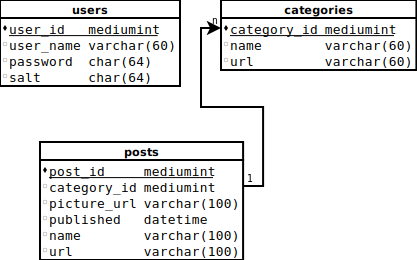

# NodeJSBlog
This is a project I did to recreate my word press blog using plane node js. If I were to 
do this again, I would use PHP. NodeJS is great, however, it was a pain to deal 
with all the asynchronous calls when trying to create a web page in a linear fashion.

If you want to run this project, it requires Mysql, npm, and node to be installed. For 
deployment I used a [Nginx](https://www.digitalocean.com/community/tutorials/how-to-set-up-a-node-js-application-for-production-on-ubuntu-16-04) 
proxy to expose the node application running on port 8000 to port 80. This proxy is necessary
because you can't run a node application as port 80 unless you are root, which would be a 
security vulnerability. 


## Legal

**Unless otherwise stated**, everything in this repository can be 
assumed to fall under these two licenses depending on what type of file it is.

#### Code, scripts

All code, scripts, or other technical / programmatic items in this repo are 
assumed fall under the [Mozilla Public License 2.0](https://www.mozilla.org/en-US/MPL/) 
unless otherwise stated.

#### Guides, articles, posts, misc. content


All guides, scripts, posts, or otherwise non-programmatic content in this 
repo is assumed to fall under 
the [Creative Commons Attribution-ShareAlike 4.0 International](https://creativecommons.org/licenses/by-sa/4.0/) 
unless otherwise stated.


## MYSQL Schema



```mysql
create database jrtechs_blog;

use jrtechs_blog;

create table users(
user_id mediumint unsigned not null AUTO_INCREMENT,
user_name varchar(60) not null,
password char(64) not null,
salt char(64) not null,
primary key(user_id)
);

create table categories(
category_id mediumint unsigned not null AUTO_INCREMENT,
name varchar(60) not null,
url varchar(60) not null,
primary key(category_id)
);

create table posts(
post_id mediumint unsigned not null AUTO_INCREMENT,
category_id mediumint unsigned not null,
picture_url varchar(100) not null,
published datetime not null,
name varchar(100) not null,
url varchar(100) not null,
primary key(post_id)
);


create table downloads(
download_id mediumint unsigned not null AUTO_INCREMENT,
file varchar(40) not null,
name varchar(40) not null,
download_count mediumint not null,
primary key(download_id)
);

create table popular_posts(
popular_post_id mediumint unsigned not null AUTO_INCREMENT,
post_id mediumint unsigned not null,
primary key(popular_post_id)
);

grant all on jrtechs_blog.* to blog_user@localhost identified by "password";
```


## Node Dependencies
```bash
npm install express
npm install express-session
npm install mysql
npm install sanitizer
npm install promise
npm install highlight
npm install crypto
npm install remarkable
npm install markdown
npm install highlight.js
npm install compression
npm install memory-cache --save
```


## Color scheme

The color scheme has been changing a lot recently. 

[Adobe Color Wheel](https://color.adobe.com/create/color-wheel/?copy=true&base=2&rule=Custom&selected=4&name=Copy%20of%20Site&mode=cmyk&rgbvalues=0.17254901960784313,0.24313725490196078,0.3137254901960784,0.28627450980392155,0.5607843137254902,0.7450980392156863,0.5329137283008958,0.7301501780381741,1,0.8235294117647058,0.7529411764705882,1,0.042420144797897574,0,0.17000000000000004&swatchOrder=0,1,2,3,4)

current:
top 2C3E50
secondary 498FBE
highlight:00F0E1, 88BAFF


## Image Optimization
Stuff for automated image compression
```
apt-get install jpegoptim
apt-get install optipng

./optimizeImages.sh
```

## NGINX Configuration
```
#jrtechs.net.conf
server {
    listen 80;
    server_name www.jrtechs.net jrtechs.net;

    # redirect http requests to https
    return 301 https://jrtechs.net$request_uri;
}

server {
    listen 443 ssl http2;

    server_name jrtechs.net;

    ssl_certificate /etc/letsencrypt/live/jrtechs.net/cert.pem;
    ssl_certificate_key /etc/letsencrypt/live/jrtechs.net/privkey.pem;

    location / {
        proxy_pass http://localhost:8000;
        proxy_http_version 1.1;
        proxy_set_header Upgrade $http_upgrade;
        proxy_set_header Connection 'upgrade';
        proxy_set_header Host $host;
        proxy_cache_bypass $http_upgrade;
    }
}


#admin.jrtechs.net.con
server {
    listen 80;
    server_name www.admin.jrtechs.net admin.jrtechs.net;

    # redirect http requests to https
    return 301 https://admin.jrtechs.net$request_uri;
}

server {
    listen 443 ssl http2;

    server_name admin.jrtechs.net;

    ssl_certificate /etc/letsencrypt/live/admin.jrtechs.net/cert.pem;
    ssl_certificate_key /etc/letsencrypt/live/admin.jrtechs.net/privkey.pem;

    location / {
        proxy_pass http://localhost:8001;
        proxy_http_version 1.1;
        proxy_set_header Upgrade $http_upgrade;
        proxy_set_header Connection 'upgrade';
        proxy_set_header Host $host;
        proxy_cache_bypass $http_upgrade;
    }
}
```