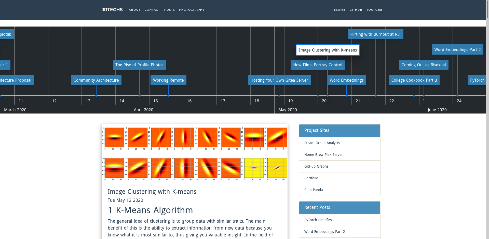
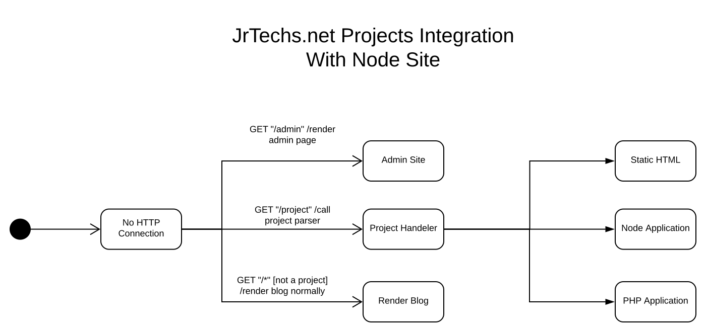

# NodeJSBlog

This is a personal blog where I write about everything from projects to tutorials on sophisticated machine learning algorithms. 
If you want to stay up to date with new posts, subscribe to my [RSS feed](https://jrtechs.net/rss).

This project is a custom express application that uses pandoc to render latex/markdown files as HTML pages. 
This site has its very own admin portal to manage posts and downloads.



## Dependencies

- mysql
- node + npm
- pandoc
- nxinx (for https)

## Running

Installing the node-dependencies is as easy as running the npn install command:

```
npm install
```

All configurations are currentl found in the config.json file.
In this file you specify things like port, sql connection, etc.

There is a provided bash script that will run the application

```
chmod +x run.sh
./run.sh
```


For deployment I used a [Nginx](https://www.digitalocean.com/community/tutorials/how-to-set-up-a-node-js-application-for-production-on-ubuntu-16-04) 
proxy to expose the node application running on port 8000 to port 80. This proxy is necessary
because you can't run a node application as port 80 unless you are root, which would be a 
security vulnerability. 


### Running with Docker

To simplify development and deployment you can run the entire node blog and mysql server from docker using docker-compose.


```bash
docker-compose up
```

or

```bash
docker-compose up db
docker-compose up blog
```

To Access mysql server of docker daemon for maintenence. Note: you need to configure username and password in docker-compose.yml and config.json.

```bash
mysql --port=3306 --host=127.0.0.1 -u root --password=password
```


## Legal

**Unless otherwise stated**, everything in this repository can be 
assumed to fall under these two licenses depending on what type of file it is.

#### Code, scripts

All code, scripts, or other technical / programmatic items in this repo are 
assumed fall under the [Mozilla Public License 2.0](https://www.mozilla.org/en-US/MPL/) 
unless otherwise stated.

#### Guides, articles, posts, misc. content


All guides, scripts, posts, or otherwise non-programmatic content in this 
repo is assumed to fall under 
the [Creative Commons Attribution-ShareAlike 4.0 International](https://creativecommons.org/licenses/by-sa/4.0/) 
unless otherwise stated.


## Node Dependencies

```bash
- express
- express-session
- mysql
- sanitizer
- promise
- highlight
- crypto
- remarkable
- markdown
- highlight.js
- compression
- memory-cache --save
- request
- nodemailer
- nodemailer-smtp-transport
- whiskers
- node-pandoc
```


## Color scheme

The color scheme has been changing a lot recently. 

[Adobe Color Wheel](https://color.adobe.com/create/color-wheel/?copy=true&base=2&rule=Custom&selected=4&name=Copy%20of%20Site&mode=cmyk&rgbvalues=0.17254901960784313,0.24313725490196078,0.3137254901960784,0.28627450980392155,0.5607843137254902,0.7450980392156863,0.5329137283008958,0.7301501780381741,1,0.8235294117647058,0.7529411764705882,1,0.042420144797897574,0,0.17000000000000004&swatchOrder=0,1,2,3,4)

current:
top 2C3E50
secondary 498FBE
highlight:00F0E1, 88BAFF


## Image Optimization
Stuff for automated image compression
```
apt-get install jpegoptim
apt-get install optipng

./optimizeImages.sh
```

## NGINX Configuration
```
#jrtechs.net.conf
server 
{
    listen 80;
    server_name www.jrtechs.net jrtechs.net;

    # redirect http requests to https
    return 301 https://jrtechs.net$request_uri;
}

server 
{
    listen 443 ssl http2;

    server_name jrtechs.net;

    ssl_certificate /etc/letsencrypt/live/jrtechs.net/cert.pem;
    ssl_certificate_key /etc/letsencrypt/live/jrtechs.net/privkey.pem;

    location / {
        proxy_pass http://localhost:8000;
        proxy_http_version 1.1;
        proxy_set_header Upgrade $http_upgrade;
        proxy_set_header Connection 'upgrade';
        proxy_set_header Host $host;
        proxy_cache_bypass $http_upgrade;
    }
}
```


## Projects Sites

As I develop more projects I would like an easy way to add and host them on my website without having to create another sub-domain and generate more ssl certs. 
I simply want the project site to be accessible under https://jrtechs.net/project_name.

### State Diagram of Plan




# DB Backup and Restore

This will dump everything in the database to a plain text file. A base SQL schema can be found in docs//sqlConfig.md

```
sudo mysqldump -u [user] -p [database_name] > [filename].sql
```

This will take a database dump and load it into a active mysql instance.
Note: the database (can be empty) must already exist.

```
sudo mysql -u [user] -p [database_name] < [filename].sql
```