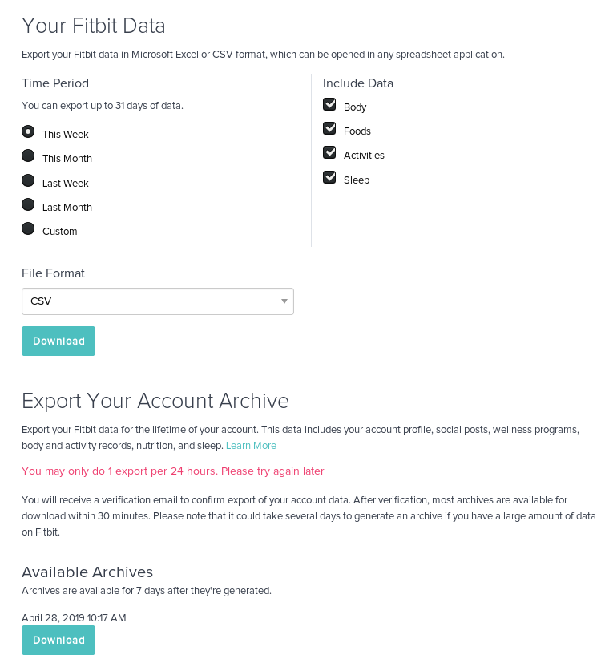
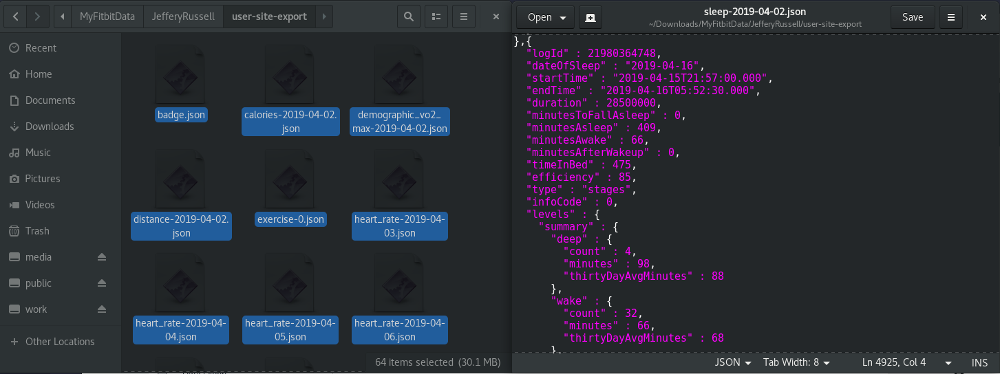
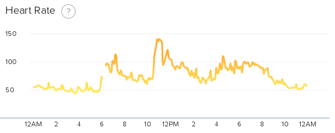
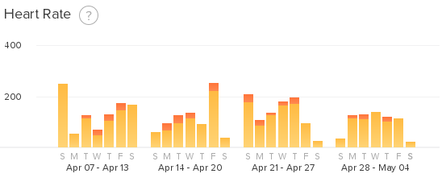
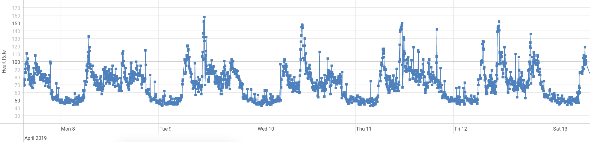
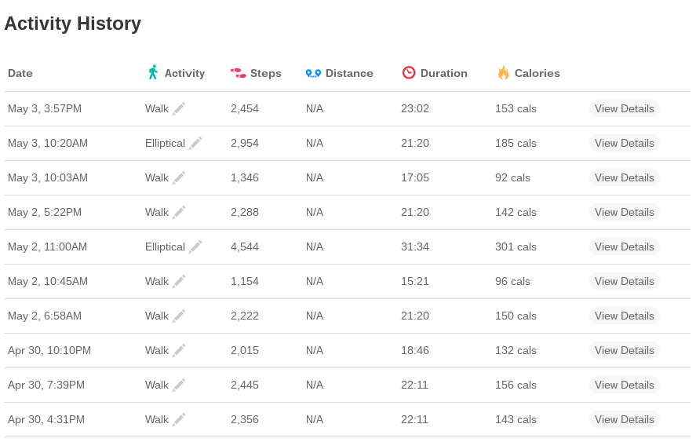
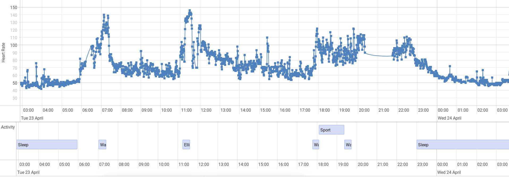
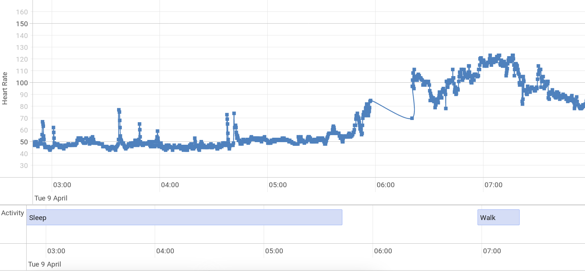

Health trackers are the current craze. After I bought a Fitbit,  I
wanted to determine what exactly could I do with my Fitbit data. Can we
learn something from this data that we did not know before?
Most people don't need a watch to tell them that they walked a lot
today or that they got a ton of sleep. We typically have a pretty good
gauge of our basic physical health. I am interested in figuring out
how we can use data science to look at our health data over a longer
period of time and learn something useful.   

Lets first look at a few things that people typically use Fitbit data for
before we jump into the weeds.    

- Setting Goals
- Motivation
- Tracking Progress

Ever since I bought a Fitbit, I found that I went to the gym a lot
more frequently. Having something which keeps track of your progress
is a great motivator. Not only is your daily steps recorded for your
own viewing, you can share that data with your friends as a
competition. Although I only have one friend on Fitbit, I found that was
a good motivator to hit ten thousand steps per day.   

Goals which are not concrete never get accomplished. Simply
saying that "I will get in shape" is a terrible goal. In order for you
to actually accomplish your goals, they need to be quantifiable, reasonable, and
measurable. Rather than saying "I will improve my health this year",
you can say "I will loose ten pounds this year by increasing my daily
step count to twelve thousand and going to the gym twice a week". One
goal is wishy washy where the other is concrete and measurable. Having
concrete data from Fitbit allows you to quantify your goals and set
milestones for you to accomplish. Along the way to achieving your
goal, you can easily track your progress.    

Simply knowing your Fitbit data can help you make some better educated
decisions about your fitness. By comparing your data against what is
healthy you can tweak your lifestyle. For example: if you notice that
you are only getting 6 hours of sleep per night, you can look up the
recommended amount of sleep and tweak your sleep routine until you hit
that target.    

Alright, lets do some data science!  


# Getting The Data

There are two options that we can use to fetch data from Fitbit. 


## Using Fitbit's API

Fitbit has an [OAuth 2.0 web
API](https://dev.fitbit.com/build/reference/web-api/) that you can
use. You first have to register your application on Fitbit's website
to receive a client ID and a client secret. 

I decided to fetch the Fitbit data using an Express app with node.
Fetching the data this way will make it really easy to use on a
live website. Node has tons of NPM modules which makes connecting to
Fitbit's API really easy. I'm using Passport which is a pretty common
authentication middleware for Express.  


```javascript
/** express app */
const express = require("express");

/** Manages oauth 2.0 w/ fitbit */
const passport = require('passport');

/** Used to make API calls */
const unirest = require('unirest');

/** express app */
const app = express();

app.use(passport.initialize());
app.use(passport.session({
    resave: false,
    saveUninitialized: true
}));


var FitbitStrategy = require( 'passport-fitbit-oauth2' ).FitbitOAuth2Strategy;


var accessTokenTemp = null;
passport.use(new FitbitStrategy({
        clientID:     config.clientID,
        clientSecret: config.clientSecret,
        callbackURL: config.callbackURL
    },
    function(accessToken, refreshToken, profile, done)
    {
        console.log(accessToken);
        accessTokenTemp = accessToken;
        done(null, {
            accessToken: accessToken,
            refreshToken: refreshToken,
            profile: profile
        });
    }
));

passport.serializeUser(function(user, done) {
    done(null, user);
});

passport.deserializeUser(function(obj, done) {
    done(null, obj);
});

passport.authenticate('fitbit', { scope: 
    ['activity','heartrate','location','profile'] 
});
```

Since our authentication middlware is all set up, we just need to add
the express routes which are required when authenticating.  

```javascript
app.get('/auth/fitbit',
    passport.authenticate('fitbit', { scope: 
    ['activity','heartrate','location','profile'] }
));

app.get( '/auth/fitbit/callback', passport.authenticate( 'fitbit', {
    successRedirect: '/',
    failureRedirect: '/error'
}));


app.get('/error', (request, result) =>
{
    result.write("Error authenticating with Fitbit API");
    result.end();
});
```

Now that we are authenticated with Fitbit, we can finally make
queries. I created a helper function called queryAPI which attempts
to authenticate if it is not already authenticated and then fetches
the API result from a provided URL.  

```javascript
const queryAPI = function(result, path)
{
    return new Promise((resolve, reject)=>
    {
        if(accessTokenTemp == null)
        {
            result.redirect('/auth/fitbit');
            resolve(false);
        }

        unirest.get(path)
            .headers({'Accept': 'application/json', 'Content-Type': 'application/json', Authorization: "Bearer " +  accessTokenTemp})
            .end(function (response)
            {
                if(response.hasOwnProperty("success") && response.success == false)
                {
                    result.redirect('/auth/fitbit');
                    resolve(false);
                }
                resolve(response.body);
            });
    });
};

app.get('/steps', (request, result)=>
{
    queryAPI(result, 'https://api.fitbit.com/1/user/-/activities/tracker/steps/date/today/1m.json').then((data)=>
    {
        if(data != false)
        {
            result.writeHead(200, {'Content-Type': 'text/html'});
            result.write(JSON.stringify(data));
            result.end();
        }
        else
        {
            console.log("Validating with API");
        }
    });
});
```

## Exporting Data from Website

On [Fitbit's website](https://www.fitbit.com/settings/data/export)
there is a nice page where you can export your data. 



The on demand export is pretty useless because it can only go back a
month. On top of that, you don't get to download any heart rate data.
The only data that you do get is aggregated by day. This might be fine
for some use cases; however, this will not suffice for any interesting
analysis. 

I decided to try the account archive option out of curiosity. 



The Fitbit data archive was very organized and kept meticulous records
of everything. All of the data was in JSON format and was organized
in separate files labeled by date. Fitbit keeps around 1MB
of data on you per day; most of this data is from the heart rate
sensors. Although 1MB of data may sound like a ton of data, it is probably a
lot less if you store it in a format other than JSON. Since Fitbit
hires a lot of people for hadoop and SQL development, they are most
likely using [Apache Hive](https://hive.apache.org/) to store user
information on the backend. Distributing the data to users as JSON is
really convenient since it makes learning the data schema very easy.

# Visualizing The Data

Since the Data Archive is far easier, I'm going to start visualizing the 
data retrieved from the JSON archive. In the future I may 
use the Fitbit API if I decide to make this a live website or something. 
Using R to visualize this would be easy, however; I want to use some
pretty javascript graphs so I can host this as a demo on my website.

## Heart Rate

My biggest quirk with the Fitbit website is that it only displays your continuous
heart rate in one day intervals. If you zoom out to the week or month view, it aggregates it
as the number of minutes you are in each heart rate zone.
This is fine for the fitbit app where you have limited screen space and no good ways of zooming in 
and out of the graphs. 





I really want to be able to view my heart rate over the course of a 
few days. To view my continuous heart rate I'm going to 
use [VisJS](http://visjs.org/docs/graph2d/) because
it works really well with time series data.

This is some Javascript code which imports user selected JSON files
to the web page and parses it as Javascript objects.

```html
<div class="col-4 shadow-lg p-3 bg-white rounded">
    <label>Heart Rate JSON Files</label>
    <input type="file" id="files" name="files[]" multiple />
    <output id="list"></output>
</div>
...
<script>
    function handleFileSelect(evt)
    {
        fetchFilesAsJSONArray(evt).then((data)=>
        {
            generateHeartRateGraph(data);
        })
    }
    document.getElementById('files').addEventListener('change', handleFileSelect, false);

    function fetchFilesAsJSONArray(evt)
    {
        return new Promise((res, rej)=>
        {
            var files = evt.target.files; // FileList object

            var promises = [];

            for (var i = 0, f; f = files[i]; i++)
            {
                promises.push(new Promise((resolve, reject)=>
                {
                    var reader = new FileReader();

                    reader.onload = function(e)
                    {
                        resolve(JSON.parse(reader.result));
                    };

                    reader.onerror= function(e)
                    {
                        reject(e);
                    };
                    reader.readAsBinaryString(files[i]);
                }));
            }
            Promise.all(promises).then((data)=>
            {
                res(data);
            }).catch((error)=>
            {
                console.log(error);
                console.log("Unable to Load Data");
                rej(error);
            })
        });
    }
</script>
```

The actual Javascript objects look like this:

```json
[{
  "dateTime" : "04/22/19 04:00:05",
  "value" : {
    "bpm" : 69,
    "confidence" : 2
  }
},{
  "dateTime" : "04/22/19 04:00:10",
  "value" : {
    "bpm" : 70,
    "confidence" : 2
  }
}
...
]
```

I found it interesting that each point had a confidence score associated with it. I wonder
how Fitbit is using that confidence information. Since it does not directly appear anywhere in the app,
they may be using it to exclude inaccurate points from the heart rate graphs to make it smoother.
A really annoying thing about this data is that the time stamps don't contain any information on the 
timezone. When graphing this data, I will shift the times by 4 hours so that it aligns
with eastern standard time.
 

After we read the data from the user selected heart rate files, we can treat this object as an array
of arrays. Each array represents a file or an entire days worth of heart rate data. Each day is an
array of time stamped points with heart rate information. Using the code from the 
[VisJS example](http://visjs.org/docs/graph2d/), it is relatively straightforward to plot this data.

```javascript
function generateHeartRateGraph(jsonFiles)
{
    var items = [];
    for(var i = 0; i < jsonFiles.length; i++)
    {
        console.log(jsonFiles[i].length);
        for(var j = 0; j < jsonFiles[i].length; j++)
        {
            var localTime = new Date(jsonFiles[i][j].dateTime);
            items.push({y:jsonFiles[i][j].value.bpm, x:localTime.setHours(localTime.getHours() - 4)});
        }
    }
    var dataset = new vis.DataSet(items);
    var options = {
        dataAxis: {
            showMinorLabels: true,
            left: {
                title: {
                    text: "Heart Rate"
                }
            }
        }
    };
    var container = document.getElementById("heartRateGraph");
    var graph2d = new vis.Graph2d(container, dataset, options);
    graph2d.on('rangechanged', graphMoved);
    graphsOnPage.push(graph2d);
}
```

It works! As an example, this is what my heart rate looks like over a week.




## Time Line

Fitbit does a pretty good job of detecting and recording health related activities. 
The two major things that Fitbit detects is sleep and workout activities.
Although the app does a good job at informing you about these activities, the app is lacking
a comprehensive timeline. Rather than provide a timeline for these activities, 
the app only displays a simple list.



The JSON files for sleep store a ton of data! For the sake of the time line I am only interested
in the start and finish times. Unlike the heart rate data, this actually stores the time zone.

```json
[{
  "logId" : 22128553286,
  "dateOfSleep" : "2019-04-28",
  "startTime" : "2019-04-27T23:09:00.000",
  "endTime" : "2019-04-28T07:33:30.000",
  "duration" : 30240000,
  "minutesToFallAsleep" : 0,
  "minutesAsleep" : 438,
  "minutesAwake" : 66,
  "minutesAfterWakeup" : 1,
  "timeInBed" : 504,
  "efficiency" : 86,
  "type" : "stages",
  "infoCode" : 0,
  "levels" : {
    "summary" : {
      "deep" : {
        "count" : 4,
        "minutes" : 103,
        "thirtyDayAvgMinutes" : 89
      },
      "wake" : {
        "count" : 33,
        "minutes" : 66,
        "thirtyDayAvgMinutes" : 65
      },
      "light" : {
        "count" : 24,
        "minutes" : 214,
        "thirtyDayAvgMinutes" : 221
      },
      "rem" : {
        "count" : 16,
        "minutes" : 121,
        "thirtyDayAvgMinutes" : 93
      }
    },
    "data" : [{
      "dateTime" : "2019-04-27T23:09:00.000",
      "level" : "wake",
      "seconds" : 30
    },{
      "dateTime" : "2019-04-27T23:09:30.000",
      "level" : "light",
      "seconds" : 900
    },
```

The JSON file for each activity stores a lot of information on heart rate.
Similar to the heart rate file, this date format does not take into account time zones. Grr!
Rather than storing a finish date like the sleep JSON file, this keeps track of the total duration
of the event in milliseconds. 

```json
[{
  "logId" : 21092332392,
  "activityName" : "Run",
  "activityTypeId" : 90009,
  "activityLevel" : [{
    "minutes" : 0,
    "name" : "sedentary"
  },{
    "minutes" : 0,
    "name" : "lightly"
  },{
    "minutes" : 1,
    "name" : "fairly"
  },{
    "minutes" : 30,
    "name" : "very"
  }],
  "averageHeartRate" : 149,
  "calories" : 306,
  "duration" : 1843000,
  "activeDuration" : 1843000,
  "steps" : 4510,
  "logType" : "auto_detected",
  "manualValuesSpecified" : {
    "calories" : false,
    "distance" : false,
    "steps" : false
  },
  "heartRateZones" : [{
    "name" : "Out of Range",
    "min" : 30,
    "max" : 100,
    "minutes" : 0
  },{
    "name" : "Fat Burn",
    "min" : 100,
    "max" : 140,
    "minutes" : 6
  },{
    "name" : "Cardio",
    "min" : 140,
    "max" : 170,
    "minutes" : 24
  },{
    "name" : "Peak",
    "min" : 170,
    "max" : 220,
    "minutes" : 1
  }],
  "lastModified" : "04/06/19 17:51:30",
  "startTime" : "04/06/19 17:11:48",
  "originalStartTime" : "04/06/19 17:11:48",
  "originalDuration" : 1843000,
  "hasGps" : false,
  "shouldFetchDetails" : false
}
```

After we import both the sleep files and activity files from the user we can use the VisJS library
to construct a timeline.


```javascript
function generateTimeline(jsonFiles)
{
    var items = [];

    for(var i = 0; i < jsonFiles.length; i++)
    {
        for(var j = 0; j < jsonFiles[i].length; j++)
        {
            if(jsonFiles[i][j].hasOwnProperty("dateOfSleep"))
            {
                var startT = new Date(jsonFiles[i][j].startTime);
                var finishT = new Date(jsonFiles[i][j].endTime);
                items.push({content: "Sleep",
                    start:startT, end:finishT, group:0});
            }
            else
            {
                var localTime = new Date(jsonFiles[i][j].startTime);
                var timeAdjusted = localTime.setHours(localTime.getHours() - 4);
                var timeFinish = localTime.setMilliseconds(
                    localTime.getMilliseconds() + jsonFiles[i][j].activeDuration);
                items.push({content: jsonFiles[i][j].activityName,
                    start:timeAdjusted, end:timeFinish, group:0});
            }
       }
    }
    console.log("Finished Loading Heart Rate Data Into Graph");

    var dataset = new vis.DataSet(items);
    var options =
    {
        margin:
            {
                item:20,
                axis:40
            },
        showCurrentTime: false
    };

    var grpups = new vis.DataSet([
        {id: 0, content:"Activity", value:0}
    ]);

    var container = document.getElementById("heartRateGraph");
    var graph2d = new vis.Timeline(container, dataset, options);
    graph2d.setGroups(grpups);
    graph2d.on('rangechanged', graphMoved);
    graphsOnPage.push(graph2d);
}
```

To make both the heart rate graph and the activity timeline focused on the same region at the
same time, I used the 'rangechanged' event to move the other graphs's window of view. 

```javascript
function graphMoved(moveEvent)
{
    graphsOnPage.forEach((g)=>
    {
        g.setWindow(moveEvent.start, moveEvent.end);
    })
}
```

I am pretty pleased with how these two graphs turned out. When you zoom too far out of the graph, the 
events get really small, but, it does a pretty good job at visualizing a few days worth of data at a time. 





# Pulling Outside Data


# Analysis
