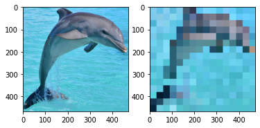
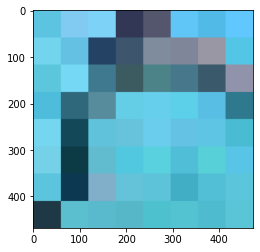
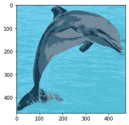
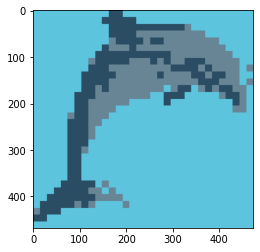
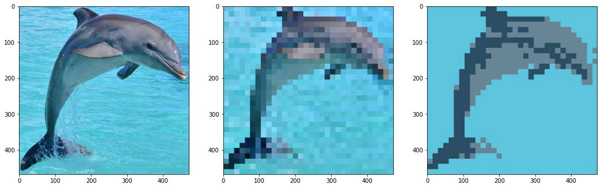

Let's jump right into the fun and start making pixel art with Open CV.
Before you read this article, consider checkout out these articles:

- [Shallow Dive into Open CV](https://jrtechs.net/open-source/shallow-dive-into-open-cv)
- [Image Clustering with K-means](https://jrtechs.net/data-science/image-clustering-with-k-means)


Like most CV projects, we need to start by importing some libraries and loading an image. 

```python
# Open cv library
import cv2

# matplotlib for displaying the images 
from matplotlib import pyplot as plt

img = cv2.imread('dolphin.jpg')
```

I like to define scripts to print images nicely in a Jupyter notebook.

```python
def printI(img):
    rgb = cv2.cvtColor(img, cv2.COLOR_BGR2RGB)
    plt.imshow(rgb)
    
def printI2(i1, i2):
    fig = plt.figure()
    ax1 = fig.add_subplot(1,2,1)
    ax1.imshow(cv2.cvtColor(i1, cv2.COLOR_BGR2RGB))
    ax2 = fig.add_subplot(1,2,2)
    ax2.imshow(cv2.cvtColor(i2, cv2.COLOR_BGR2RGB))
    
printI(img)
```


To pixelate an image, we can use the open cv resize function.
To make the image viewable, after we shrink the picture, we resize it again to be the size of the original image. 

```python
def pixelate(img, w, h):
    height, width = img.shape[:2]

    # Resize input to "pixelated" size
    temp = cv2.resize(img, (w, h), interpolation=cv2.INTER_LINEAR)

    # Initialize output image
    return cv2.resize(temp, (width, height), interpolation=cv2.INTER_NEAREST)

img16 = pixelate(img, 16, 16)

printI2(img, img16)
```




We can try a few different shrinkage sizes.
32x32 seems to work the best. 

```python
img32 = pixelate(img, 32, 32)
img64 = pixelate(img, 64, 64)

printI2(img32, img64)
```


```python
img8 = pixelate(img, 8, 8)
printI(img8)
```





Despite the images being pixelated, they have imperfections that normal pixel art wouldn't have.
To remove the noise and make it look smoother, we will do k-means clustering on the pixelated images.
K-means will reduce the number of colors in the image and eliminate any noise.
Most of the clustering code is from my blog post: [Image Clustering with K-means](https://jrtechs.net/data-science/image-clustering-with-k-means)

```python
import skimage
from sklearn.cluster import KMeans
from numpy import linalg as LA
import numpy as np

def colorClustering(idx, img, k):
    clusterValues = []
    for _ in range(0, k):
        clusterValues.append([])
    
    for r in range(0, idx.shape[0]):
        for c in range(0, idx.shape[1]):
            clusterValues[idx[r][c]].append(img[r][c])

    imgC = np.copy(img)

    clusterAverages = []
    for i in range(0, k):
        clusterAverages.append(np.average(clusterValues[i], axis=0))
    
    for r in range(0, idx.shape[0]):
        for c in range(0, idx.shape[1]):
            imgC[r][c] = clusterAverages[idx[r][c]]
            
    return imgC
```


```python
def segmentImgClrRGB(img, k):
    
    imgC = np.copy(img)
    
    h = img.shape[0]
    w = img.shape[1]
    
    imgC.shape = (img.shape[0] * img.shape[1], 3)
    
    #5. Run k-means on the vectorized responses X to get a vector of labels (the clusters); 
    #  
    kmeans = KMeans(n_clusters=k, random_state=0).fit(imgC).labels_
    
    #6. Reshape the label results of k-means so that it has the same size as the input image
    #   Return the label image which we call idx
    kmeans.shape = (h, w)

    return kmeans
```


```python
def kMeansImage(image, k):
    idx = segmentImgClrRGB(image, k)
    return colorClustering(idx, image, k)

printI(kMeansImage(img, 5))
```





Running the k-means algorithm on the 32x32 bit image produces a cool look.

```python
printI(kMeansImage(img32, 3))
```



We can compare the original, pixelated, and clustered images side by side.


```python
def printI3(i1, i2, i3):
    fig = plt.figure(figsize=(18,6))
    ax1 = fig.add_subplot(1,3,1)
    ax1.imshow(cv2.cvtColor(i1, cv2.COLOR_BGR2RGB))
    ax2 = fig.add_subplot(1,3,2)
    ax2.imshow(cv2.cvtColor(i2, cv2.COLOR_BGR2RGB))
    ax3 = fig.add_subplot(1,3,3)
    ax3.imshow(cv2.cvtColor(i3, cv2.COLOR_BGR2RGB))
    plt.savefig('trifecta.png')
printI3(img, img32, kMeansImage(img32, 3))
```


