Quick review sheet for Dr. Homan's RIT CSCI-331 final.

# Learning from examples (Ch 18)

- Supervised learning: where you already know the answers
- Re-enforcement learning: Learning with rewards
- Unsupervised: clustering


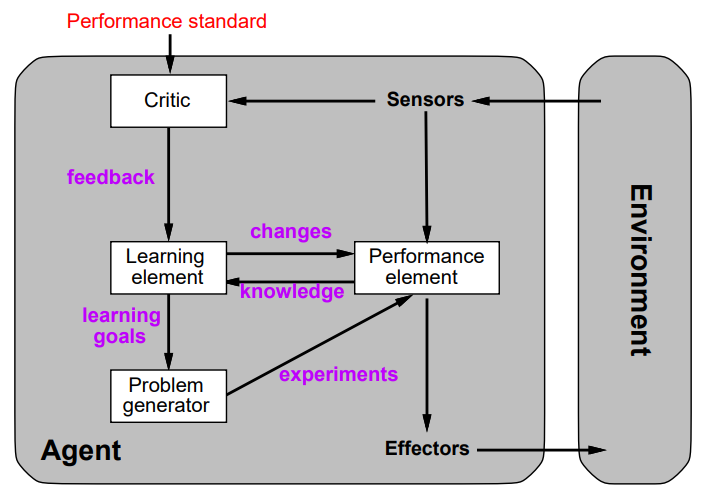

## Inductive learning problems

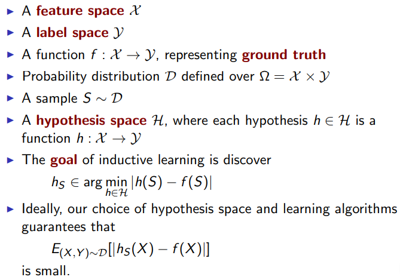

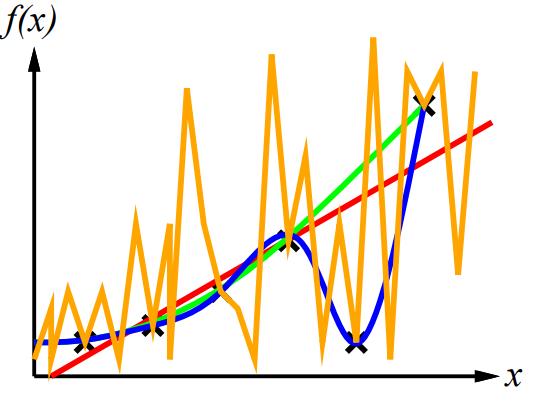

Ockham's razor: Maximize a combination of consistency and simplicity.
Often times overly complex models that perfectly fit the training data does not generalize well for new data.


## Decision trees

Often the most natural way of representing a boolean problem, but, don't often generalize well.


## Entropy

Decision trees use entropy to pick which input to branch on first.
A 50/50 split in data is usually less useful than a 80/20 split in data because the 50/50 split still has more "information" in it.
We pick the input that minimizes entropy.

$$
entropy = \sum^n_{i = 1} -P_i log_2 P_i
$$

## Neural networks

Based on human brains.


McCullon-Pitts

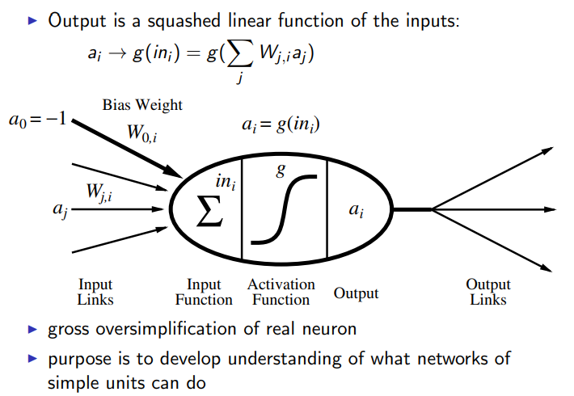

Examples of logic functions:

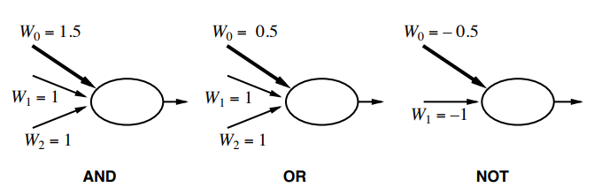

### Single Layer Perceptrons

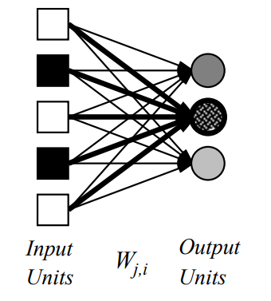

### Multi-layer Perceptrons

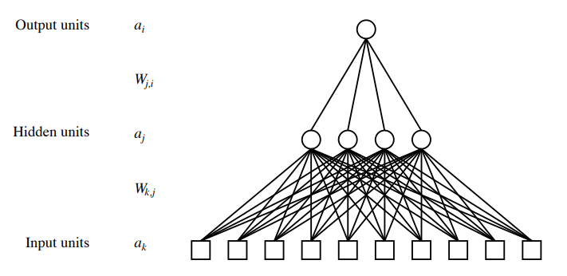


## Backpropagation

Way of incrementally adjusting the weights so that the model better fits the training data.


## SVMs: Support Vector Machine

- very high dimensions
- as long as data is sparse, the curse of dimensionality is not an issue
- By default it assumes you can linearly separate the data if you can use a large amount of dimensions. Sometimes you use something called the kernel trick to distort the space to make the data linearly separable.

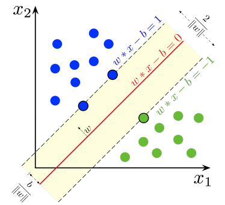

## CNNs: Convolutional neural Networks

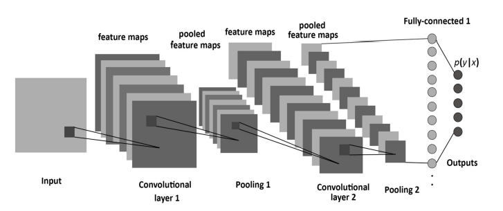

## LSTMs: Long short term memory

- Heavily used in natural language processing(NLP).

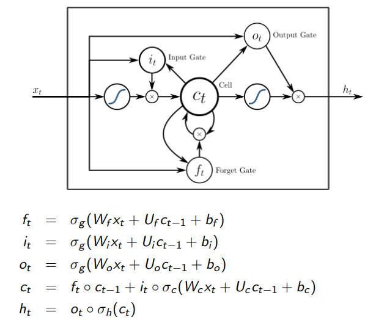

# Probabilistic Learning (Ch. 20)

## Maximum A Posteriori approximation (MAP)

You assume the model which is most likely and use that to make your prediction.
This is approximately equivalent to the Bayseian formula.

Using the weighted average of the predictions of all the potential models, you make your prediction.


``` python
"""
Equation 20.1
    P(h_i|d) = gamma * p(d|h_i)p(h_i)
gamma is 1/P(d) where P(d) is calculated by summing P(h_i|d)
p(d|h_i) is simply the frequency of that bag in the wild times 
the sum of the observations times their respective distribution
in the bag.
"""
```

## Maximum Likelihood approximation (MLE)

This process has 3 steps: 1: write down expression for the likelihood of the data as a function of the parameters. 2: Write down the derivatives of the log likelihood with respect to each parameter. 3: Find the parameter values such that the derivatives are zero.


## EM

Used in k-means clustering.

# Reinforcement learning (Ch. 21)

MDP (Markov decision process): Goal is to find an optimal policy. 
Often have to explore the space to learn the reward.


## Bellman equation

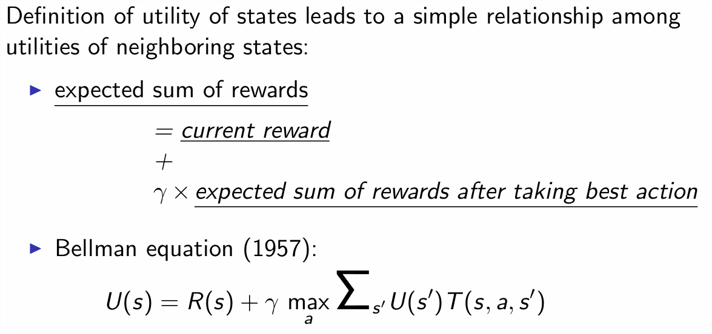

# Logic (Ch 7)

- knowledge base  = set of sentences in a formal language
- inference engine: domain-independent algorithms

- declarative approach to logic: tell the agent what it needs to know

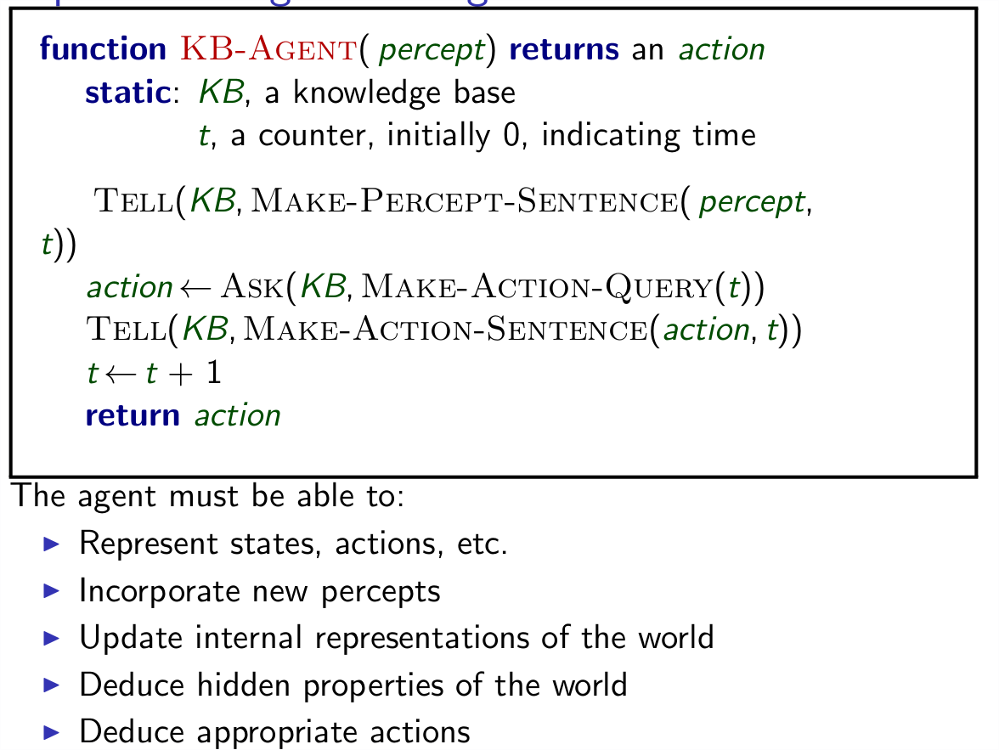

- Logics are formal languages for representing information to make conclusions
- syntax defines the sentences in the language
- semantics define the meaning

- A model are formally structured worlds with respect to which truth can be evaluated.

## Propositional Logic

- Assumes world contains facts: models evaluate truth values for propositional symbols. 

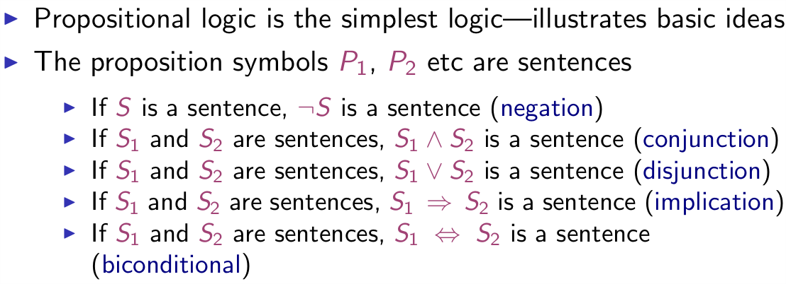

## Entailment

- Entailment means that one thing follows from another. 
- KB |= alpha. Knowledge base KB entails sentence "alpha" iff "alpha" is true in all words where KB is true. Ex: x + y = 4 entails 4 = x + y
- AKA: entailment is a relationship between syntax that is based on meaning

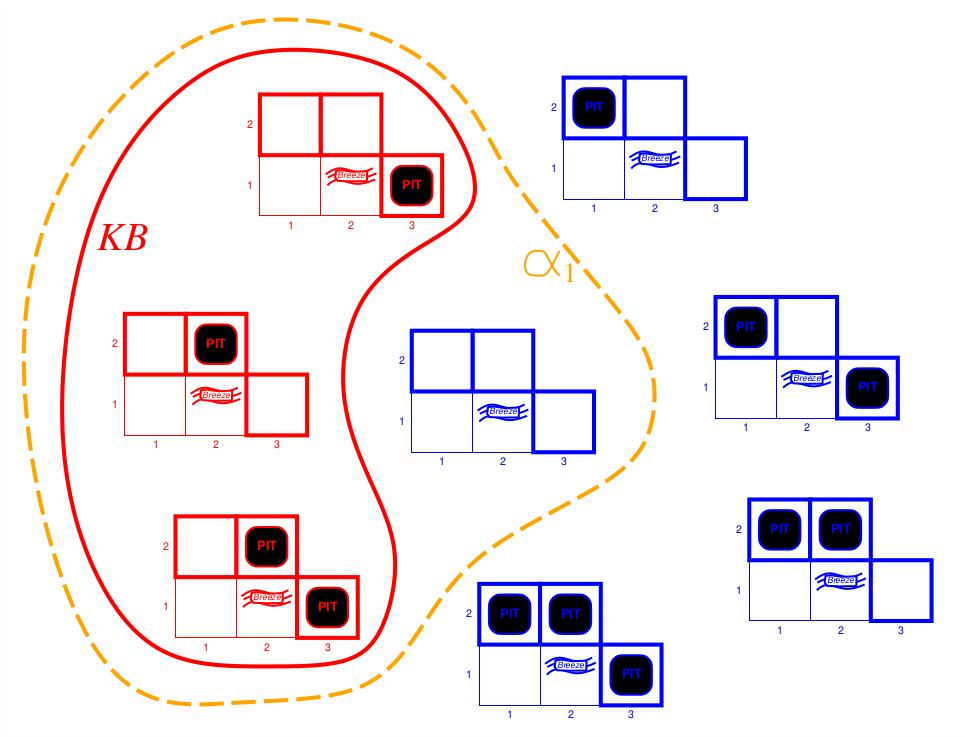

## Inference

- Inference: Deriving sentences from other sentences
- Soundess: derivations produce only entailed sentences
-Completeness: derivations can produce all entailed sentences


## Forward chaining

Forward chaining will find everything that is true in the logic. As a basic idea, this algorithm checks all rules that are satisfied in the knowledge base and add its conclusion to the knowledge base until the query is found. 

## Resolution

Resolution is sound and complete for propositional logic.


## First-order logic (Ch #8)

First-order logic (FOL) like natural languages assumes the world contains objects, relations, functions. Has increased expressiveness power over propositional logic. 
