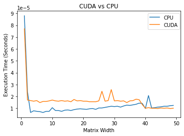
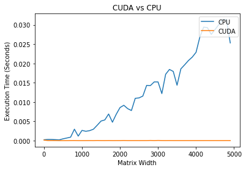
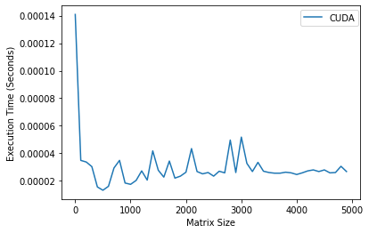
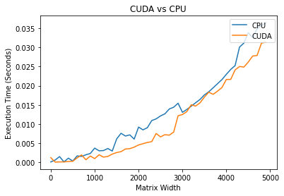
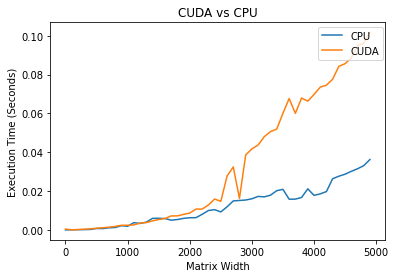
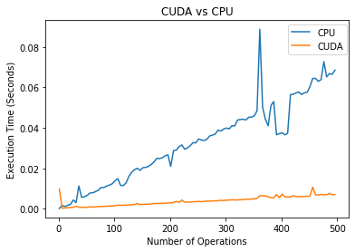

High-performance parallel computing is all the buzz right now, and new technologies such as CUDA make it more accessible to do GPU computing. However, it is vital to know in what scenarios GPU/CPU processing is faster. This post explores several variables that affect CUDA vs. CPU performance.
The full [Jupyter notebook](https://github.com/jrtechs/RandomScripts/blob/master/notebooks/cuda-vs-cpu.ipynb) for this blog post is posted on my GitHub.

For reference, I am using an Nvidia GTX 1060 running CUDA version 10.2 on Linux. 

```python
!nvidia-smi
```

```
    Wed Jul  1 11:16:12 2020       
    +-----------------------------------------------------------------------------+
    | NVIDIA-SMI 440.82       Driver Version: 440.82       CUDA Version: 10.2     |
    |-------------------------------+----------------------+----------------------+
    | GPU  Name        Persistence-M| Bus-Id        Disp.A | Volatile Uncorr. ECC |
    | Fan  Temp  Perf  Pwr:Usage/Cap|         Memory-Usage | GPU-Util  Compute M. |
    |===============================+======================+======================|
    |   0  GeForce GTX 1060..  Off  | 00000000:01:00.0  On |                  N/A |
    |  0%   49C    P2    26W / 120W |   2808MiB /  3016MiB |      2%      Default |
    +-------------------------------+----------------------+----------------------+
                                                                                   
    +-----------------------------------------------------------------------------+
    | Processes:                                                       GPU Memory |
    |  GPU       PID   Type   Process name                             Usage      |
    |=============================================================================|
    |    0      1972      G   /usr/libexec/Xorg                             59MiB |
    |    0      2361      G   /usr/libexec/Xorg                            280MiB |
    |    0      2485      G   /usr/bin/gnome-shell                         231MiB |
    |    0      5777      G   /usr/lib64/firefox/firefox                     2MiB |
    |    0     33033      G   /usr/lib64/firefox/firefox                     4MiB |
    |    0     37575      G   /usr/lib64/firefox/firefox                   167MiB |
    |    0     37626      G   /usr/lib64/firefox/firefox                     2MiB |
    |    0     90844      C   /home/jeff/Documents/python/ml/bin/python   1881MiB |
    +-----------------------------------------------------------------------------+
```

For our first experiment, we take the sinusoidal mathematical function on every element in a matrix.
The independent variable, in this case, is how large our matrix is. Note: the size is defined by the matrix's width, which means that the number of elements will grow exponentially compared to the width.

```python
import torch
import time # times in seconds
def time_torch(size):
    x = torch.rand(size, size, device=torch.device("cuda"))
    start = time.time()
    x.sin_()
    end = time.time()
    return(end - start)

def time_cpu(size):
    x = torch.rand(size, size, device=torch.device("cpu"))
    start = time.time()
    x.sin_()
    end = time.time()
    return(end - start)
```

To make this easier to graph, we will create a wrapper function that will generate two lists: one for the CPU times and the other for the CUDA times. 

```python
def get_cuda_cpu_times(sizes):
    cpuTimes = []
    cudaTimes = []

    for s in sizes:
        cpuTimes += [time_cpu(s)]
        cudaTimes += [time_torch(s)]
    return cpuTimes, cudaTimes
```

Some vanilla Matplotlib code can get used to plot the CUDA vs. CPU performances. Note: a lower execution time is better. 

```python
import matplotlib.pyplot as plt

def plot_cuda_vs_cpu(cpuTimes, cudaTimes, sizes, xLab="Matrix Width"):
    plt.title("CUDA vs CPU")
    cpu_plot = plt.plot(sizes, cpuTimes, label="CPU")
    cuda_plot = plt.plot(sizes, cudaTimes, label="CUDA")
    plt.legend(bbox_to_anchor=(0.8, 0.98), loc='upper left', borderaxespad=0.)
    plt.xlabel(xLab)
    plt.ylabel('Execution Time (Seconds)')
    plt.show()

sizes = range(1, 50, 1)
cpu_t, cuda_t = get_cuda_cpu_times(sizes)
plot_cuda_vs_cpu(cpu_t, cuda_t, sizes)
```





```python
sizes = range(1, 5000, 100)
cpu_t, cuda_t = get_cuda_cpu_times(sizes)
plot_cuda_vs_cpu(cpu_t, cuda_t, sizes)
```




It is interesting to note that it is faster to perform the CPU task for small matrixes. Where for larger arrays, the CUDA outperforms the CPU by large margins.

On a large scale, it looks like the CUDA times are not increasing, but if we only plot the CUDA times, we can see that it also increases linearly. 

```python
cuda_plot = plt.plot(sizes, cuda_t, label="CUDA")
plt.legend(bbox_to_anchor=(0.8, 0.98), loc='upper left', borderaxespad=0.)
plt.xlabel('Matrix Size')
plt.ylabel('Execution Time (Seconds)')
plt.show()
```





It is useful to know that the GPU outperforms the CPU on larger matrixes, but that doesn't tell the whole story. There are reasons why we don't run everything on the GPU.
It takes time to copy data between the GPU's memory and main memory (RAM).


This code is similar to what we did previously, but this time, we initialize the matrix on the main memory and then transfer it to the GPU to perform the computation. 

```python
import time # times in seconds
def time_torch_copy(size):
    x = torch.rand(size, size, device=torch.device("cpu"))
    start = time.time()
    x = x.cuda()
    x.sin_()
    end = time.time()
    return(end - start)

def get_cuda_cpu_times_with_copy(sizes):
    cpuTimes = []
    cudaTimes = []
    for s in sizes:
        cpuTimes += [time_cpu(s)]
        cudaTimes += [time_torch_copy(s)]
    return cpuTimes, cudaTimes

sizes = range(1, 5000, 100)
cpu_t, cuda_t = get_cuda_cpu_times_with_copy(sizes)
plot_cuda_vs_cpu(cpu_t, cuda_t, sizes)
```




After copying the matrix to the GPU, we see that the CUDA and CPU performances are nearly identical in time complexities.
However, in real-world applications, we don't just leave the GPU data: we also need to copy it back to the main memory.

This test initializes the matrix on the main memory, copies it to the GPU to operate, and then copies the array back to the main memory.

```python
import time # times in seconds
def time_torch_copy_and_back(size):
    x = torch.rand(size, size, device=torch.device("cpu"))
    start = time.time()
    x = x.cuda()
    x.sin_()
    x = x.cpu()
    end = time.time()
    return(end - start)

def get_cuda_cpu_times_with_copy(sizes):
    cpuTimes = []
    cudaTimes = []
    for s in sizes:
        cpuTimes += [time_cpu(s)]
        cudaTimes += [time_torch_copy_and_back(s)]
    return cpuTimes, cudaTimes

sizes = range(1, 5000, 100)
cpu_t, cuda_t = get_cuda_cpu_times_with_copy(sizes)
plot_cuda_vs_cpu(cpu_t, cuda_t, sizes)
```




In this trial, it is interesting that CUDA is slower than just running on the CPU by a significant margin.

In the previous trial, we copied the matrix to the GPU to do a single operation, but in this trial, we vary the number of procedures performed on the same matrix. 

```python
def time_torch_operation_repetition(size, iterations):
    x = torch.rand(size, size, device=torch.device("cpu"))
    start = time.time()
    x = x.cuda()
    for _ in range(0, iterations):  
        x.sin()
    end = time.time()
    return(end - start)

def time_cpu_operation_repetition(size, iterations):
    x = torch.rand(size, size, device=torch.device("cpu"))
    start = time.time()
    for _ in range(0, iterations):  
        x.sin()
    end = time.time()
    return(end - start)

def get_cuda_cpu_times_with_iterations(iterations):
    cpuTimes = []
    cudaTimes = []
    for i in iterations:
        cpuTimes += [time_cpu_operation_repetition(300, i)]
        cudaTimes += [time_torch_operation_repetition(300, i)]
    return cpuTimes, cudaTimes

iterations = range(1, 500, 5)
cpu_t, cuda_t = get_cuda_cpu_times_with_iterations(iterations)
plot_cuda_vs_cpu(cpu_t, cuda_t, iterations, xLab="Number of Operations")
```





As we see in this trial, as we perform more consecutive operations on the matrix without changing devices, we see significant performance benefits for using CUDA.

As we see, whether GPU vs. CPU computing is going to be faster isn't always a clear cut answer.
The CPU is very good at performing tasks fast, but it is not excellent at performing data-parallel computations, which is where GPU computing excels.
IO is another driving factor in whether doing GPU vs. CPU computing will be faster.
If the program has a lot of IO bottlenecks, then CPU computing may be faster.
When designing an application that leverages GPU processing, it is essential to limit the number of times needed to transfer data to the main memory.

