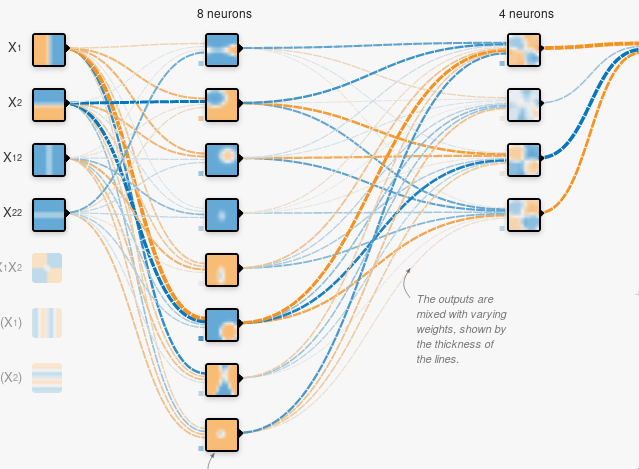

# Importing and Cleaning Data

# Data Visualization

# Analysis

# Report

## Abstract

The way in which a team trains is critical in ensuring that everyone performs at their peak performance
during a game. In order to effectively train a team to optimize their gameday performance, it would make
intuitive sense to monitor their training data with respect to their perceived fatigue. Through analyzing
time series data provided by our partnering women’s rugby team, it was observed that this team altered
their training schedule close to games. Although there is some relationship between the two in the long
run, our attempts at modeling fatigue and work load in the short run suggests little to no correlation using
linear regressions. This suggests that modeling fatigue is a more complex problem including a slew of factors
both psychological and physical which spans over a period of time; coaches should pay attention not only to
training but also sleep and mental wellness for happy and competitive teams. To most effectively forecast an
individual’s performance during a game, we propose a system which takes into account physiological factors
such as desire and physical factors such as sleep, soreness and amount of training.

## Methodology

We employed a wide range of techniques for establishing our models and hypotheses, including smoothing
of time series Information, testing of hypotheses based on a prior understanding of the domain, plotting
and visually analyzing pairs of variables, and artificial intelligence algorithms that found various linear and
nonlinear patterns in the dataset. Coefficients of determination were calculated to determine fitness of linear
models, and F1 scores were analyzed to validate complex nonlinear classification models.

## Modeling Fatigue

Fatigue can be effectively and linearly modeled using daily records and time series moving
averages of acute chronic ratios, daily workload, sleep quality, and sleep hours.
This means that instead of only lowering training before competitions, coaches
should put focus on preparing the athletes physically and mentally through a
combination of measures with a focus on sleep.

| Iterations/100      | Mean Squared Error |
| ----------- | ----------- |
| 1      | 90.4998       |
| 11   | 1.0265        |
| 21   | 0.9604        |
| 31   | 0.8671        |
| 41   | 0.7838        |
|100 | 0.0925 |
Sample Size: 304864
Final R2: 0.532

## Predicting Performance

Trivially, performance of an individual cannot be modeled using simple linear regressions 
only involving one factors. We therefore developed and optimized a deep neural
 network to capture the patterns involving fatigue, sleep, and self-rated performance. 

The structure of the network is a 3-layer (input, output, and a hidden layer) 
sigmoid classifier that was trained on batches of 32 samples from players with 
respect to features: normalized perceived fatigue, sliding average of
perceived fatigue, sliding average over sleep hours, and the perceived sleep quality of
the players. It is optimized through the Adam optimizer with a learning rate of 
.005 and cross entropy to calculate the loss between the logits and labels. 
   
The logits of the work are a confidence output on which class the network
feels the sample most likely belongs to, the real value of which is the 
classification of perceived performance by the player. Through this method,
we can show a correlation between fatigue, sleep, and self-rated performance,
as well as a means to predict this self-rate performance based off of fatigue
and self-perceived sleep quality.

Results with LR=.01, Batch=32:

- Accuracy before training: 20.44388%
- Loss after step 49: .531657
- Accuracy after training: 74.846625%
- F1 Score: .94

## Future Work

With more data to to test with we can further improve and validate out models. With historical data from
other teams we can take our analysis one step further. Based on the training, performance, and fatigue
information from other teams we can use that to create a model to make a recommendation for our team’s
training. This model would be able to make recommendations for our training intensity leading up to a
game. Since this will be heavily dealing with multivariate time series data leading up to a game, using a Long
Short-term Network (LSTM) would bring promising results.