I worked on this project during Dr. Homans's RIT CSCI-331 class.

# Introduction

This project explores the beautiful and frustrating ways in which we
can use AI to develop systems to solve problems. Asteroids is a
perfect example of a fun learning AI problem because Asteroids is
difficult for humans to play and has open-source frameworks that can
emulate the environment. Using the Open AI gym framework we developed
different AI agents to play Asteroids using various heuristics and ML
techniques.  We then created a testbed to run experiments that
determine statistically whether our custom agents out-performs the
random agent.


# Methods and Results

Three agents were developed to play Asteroids. This report is broken
into segments where each agent is explained and its performance is
analyzed. 

# Random Agent

The random agent simple takes a random action defined by the action
space. The resulting agent will randomly spin around and shoot
asteroids. Although this random agent is easy to implement, it is
ineffective because moving spastically will cause you to crash into
asteroids.  Using this as the baseline for our performance, we can use
this random agent to access whether our agents are better than random
key smashing -- which is my strategy for playing Smash. 


```python
"""
ACTION_MEANING = {
    0: "NOOP",
    1: "FIRE",
    2: "UP",
    3: "RIGHT",
    4: "LEFT",
    5: "DOWN",
    6: "UPRIGHT",
    7: "UPLEFT",
    8: "DOWNRIGHT",
    9: "DOWNLEFT",
    10: "UPFIRE",
    11: "RIGHTFIRE",
    12: "LEFTFIRE",
    13: "DOWNFIRE",
    14: "UPRIGHTFIRE",
    15: "UPLEFTFIRE",
    16: "DOWNRIGHTFIRE",
    17: "DOWNLEFTFIRE",
}
"""
def act(self, observation, reward, done):
    return self.action_space.sample()
```

## Test on the Environment Seed

It is always important to know how randomness affects the results of
your experiment. In this agent, there are two sources of
randomness, the first being the seed given for the Gym environment and
the other is in the random function used to select a random action. By
default, the seed of the Gym library is set to zero. This is useful
for testing because if your agent is deterministic, you will always
get the same results. We can seed the environment with the current
time to add more randomness. However, this begs the question: to what
extent does the added randomness change the scores of the game. 
Certain seeds in the Gym environment may make the game much
easier/harder to play thus altering the distribution of the score. 


A test was derived to compare the scores of the environment in both a
fixed seed and a time set seed. 300 trials of the random agent were ran
in both types of seeded environments. 

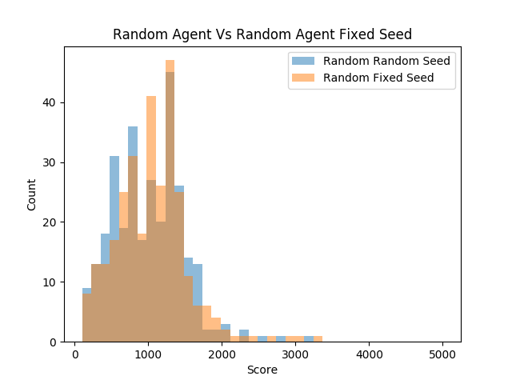


```
Random Agent Time Seed: 
    mean:1005.6333333333333 
    max:3220.0 
    min:110.0 
    sd:478.32548077178114 
    median:980.0 n:300

Random Agent Fixed Seed: 
    mean:1049.3666666666666 
    max:3320.0 
    min:110.0 
    sd:485.90321281323327 
    median:1080.0 
    n:300
```

What is astonishing is that both distributions are nearly identical in
every way. Although the means are slightly different, there appears to
be no apparent difference between the distributions of scores. One
might expect that having more randomness would at least change the
variance of the scores, but none of that has happened.

```
Random agent vs Random fixed seed
F_onewayResult(
    statistic=1.2300971733588375, 
    pvalue=0.2678339696597312
)
```

With such a high p-value we can not reject the null hypothesis that
these distributions are statistically different. This is a powerful
conclusion to come to because it allows us to run future experiments
understanding that a specific seed on average will not have a
statistically significant impact on the performance of a random agent.
However, this finding does not help us understand the impact that the
seed has on a fully deterministic agent. It is still possible that a
fully deterministic system will have varying scores on different
environment seeds. 


# Reflex Agent

Our reflex agent observes the environment and decides what to do based
on a simple rule set. The reflex agent is broken into three sections:
feature extraction, reflex rules, and performance. 

## Feature Extraction

The largest part of this agent was devoted to parsing the environment
into a more usable form. The feature extraction for this project was
rather difficult since the environment was given as a pixel array and
the screen flashed the asteroids and then the player. Trying to
achieve the best performance with the minimal amount of algorithmic
engineering, this reflex agent parsed 3 things from the environment:
position, direction, closest asteroid. 


### 1: Player Position

Finding the position of the player was relatively easy since you only
had to scan the environment to find pixels of certain RGB values. To
account for the flashing environment, you would just store the
position in the fields of the class so that it is persistent between
action loops. The position of the player would only be updated if a
new player is observed. 

```python
AGENT_RGB = [240, 128, 128] 
```

### 2: Player Direction

Detecting the position of the player could be made difficult if you
were only going off the RGB values of the player. Although when the
player is upright, it is straight forward, when the player is sideways
things get super difficult. 


```python
action_sequence = [3,3,3,3,3,0, 0,0]

class Agent(object):
    def __init__(self, action_space):
        self.action_space = action_space

    # Defines how the agent should act
    def act(self, observation, reward, done):
        if len(action_sequence) > 0:
            action = action_sequence[0]
            action_sequence.remove(action)
            return action
        return 0
```

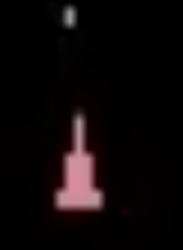


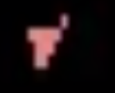


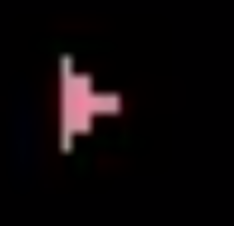


We created a basic script to observe what the player does when given a
specific sequence of actions. I was pleased to notice that exactly 5
turns to the left/right correlated to a perfect 90 degrees. By keeping
track of our current rotation according to the actions that we have
taken, we can precisely keep track of our current rotational direction
without parsing the horrendous pixel array when the player is
sideways. 


### 3: Position of Closest Asteroid

Asteroids were detected as being any pixel that was not empty (0,0,0)
and not the player (240, 128, 128). Using a simple single pass through
the environment matrix, we were able to detect the closest asteroid to
the latest known position of the player.

## Agent Reflex

Based on my actual strategy for asteroids, this agent stays in the
middle of the screen and shoots at the closest asteroid to it. 

```python
def act(self, observation, reward, done):
    observation = np.array(observation)
    self.updateState(observation)
    dirOfAstroid = math.atan2(self.closestRow-self.row, self.closestCol- self.col)

    dirOfAstroid = self.deWarpAngle(dirOfAstroid)

    self.shotLast = not self.shotLast
    if self.shotLast:
        return 1 # fire
    if self.currentDirection - dirOfAstroid < 0:
        self.updateDirection(math.pi/10)
        if self.shotLast:
            return 12 # left fire
        return 4 # left
    else:
        self.updateDirection(-1*math.pi/10)
        return 3 # right
```

Despite being a simple agent, this performs well since it can shoot at asteroids before it hits them. 

## Results of Reflex Agent

In this trial, 200 tests of both the random agent and the reflex agent
were observed while setting the seed of the environment to the current
time. The seed was randomly set in this scenario since the reflex
agent is fully deterministic and would perform identically in each trial
otherwise. 

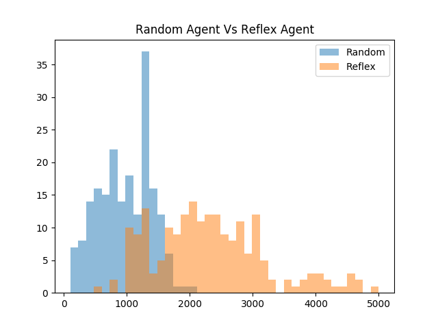


The histogram depicts that the reflex agent on average performs
significantly better than the random agent. What is fascinating to
note is that even though the agent's actions are deterministic, the
seed of the environment created a large amount of variance in the
scores observed. It is arguably misleading to only provide a single
score for an agent as its performance because the environment seed has
a large impact on the non-random agent's scores.

```
Reflex Agent: 
    mean:2385.25
    max:8110.0 
    min:530.0 
    sd:1066.217115553863 
    median:2250.0 
    n:200

Random Agent:
    mean:976.15 
    max:2030.0
    min:110.0 
    sd:425.2712987023695 
    median:980.0 
    n:200
```

One thing that is interesting about comparing the two distributions is
that the reflex agent has a much larger standard deviation in its
scores than the random agent. It is also interesting to note that the
reflex agent's worst performance was significantly better than the
random agent's worst performance. Also, the best performance of the
reflex agent shatters the best performance of the random agent. 

```
Random agent vs reflex
F_onewayResult(
    statistic=299.86689786081956, 
    pvalue=1.777062051091977e-50
)
```

Since we took such a sample size of two hundred, and the populations
were significantly different, we got a p score of nearly zero
(1.77e-50). With a p-value like this, we can say with nearly 100%
confidence (with rounding) that these two populations are different
and that the reflex agent out-performs the random agent. 


# Genetic Algorithm

Genetic algorithms employ the same tactics used in natural selection
to find an optimal solution to an optimization problem. Genetic
algorithms are often used in high dimensional problems where the
optimal solutions are not apparent. Genetic algorithms are commonly
used to tune the hyper-parameters of a program. However, this
algorithm can be used in any scenario where you have a function that
defines how well a solution is. 

In the scenario of asteroids, we can employ genetic algorithms to find
the optimal sequence of moves to make to achieve the highest score
possible. The chromosomes are well defined as the sequence of actions
to loop through and the fitness function is simply the score that the
agent achieves. 

## Algorithm Implementation

The actual implementation of the genetic algorithm was pretty straight
forward, the agent simply looped through a sequence of events where
each event represents a gene on the chromosome. 


```python
class Agent(object):
    """Very Basic GA Agent"""
    def __init__(self, action_space, chromosome):
        self.action_space = action_space
        self.chromosome = chromosome
        self.index = 0

    # You should modify this function
    def act(self, observation, reward, done):
        if self.index >= len(self.chromosome)-1:
            self.index = 0
        else:
            self.index = self.index + 1
        return self.chromosome[self.index]
```


Rather than using a library, a simple home-brewed genetic algorithm
was created from scratch. The basic algorithm essentially is in a loop
that runs functions necessary to iterate through each generation.
Each generation can be broken apart into a few steps: 

- selection: removes the worst-performing chromosomes
- mating: uses crossover to create new chromosomes
- mutation: adds randomness to the chromosome
- fitness: evaluates the performance of each chromosome

In roughly 100 lines of python, a basic genetic algorithm was crafted.

```python
AVAILABLE_COMMANDS = [0,1,2,3,4]


def generateRandomChromosome(chromosomeLength):
    chrom = []
    for i in range(0, chromosomeLength):
        chrom.append(choice(AVAILABLE_COMMANDS))
    return chrom


"""
creates a random population
"""
def createPopulation(populationSize, chromosomeLength):
    pop = []
    for i in range(0, populationSize):
        pop.append((0,generateRandomChromosome(chromosomeLength)))
    return pop


"""
computes fitness of population and sorts the array based
on fitness
"""
def computeFitness(population):
    for i in range(0, len(population)):
        population[i] = (calculatePerformance(population[i][1]), population[i][1])
    population.sort(key=lambda tup: tup[0], reverse=True) # sorts population in place


"""
kills the weakest portion of the population
"""
def selection(population, keep):
    origSize = len(population)
    for i in range(keep, origSize):
        population.remove(population[keep])


"""
Uses crossover to mate two chromosomes together.
"""
def mateBois(chrom1, chrom2):
    pivotPoint = randrange(len(chrom1))
    bb = []
    for i in range(0, pivotPoint):
        bb.append(chrom1[i])
    for i in range(pivotPoint, len(chrom2)):
        bb.append(chrom1[i])
    return (0, bb)
    


"""
brings population back up to desired size of population
using crossover mating
"""
def mating(population, populationSize):
    newBlood = populationSize - len(population)

    newbies = []
    for i in range(0, newBlood):
        newbies.append(mateBois(choice(population)[1], 
                                choice(population)[1]))
    population.extend(newbies)


"""
Randomly mutates x chromosomes -- excluding best chromosome
"""
def mutation(population, mutationRate):
    changes = random() * mutationRate * len(population) * len(population[0][1])
    for i in range(0, int(changes)):
        ind = randrange(len(population) -1) + 1
        chrom = randrange(len(population[0][1]))
        population[ind][1][chrom] =  choice(AVAILABLE_COMMANDS)


"""
Computes average score of population
"""
def computeAverageScore(population):
    total = 0.0
    for c in population:
        total = total + c[0]
    return total/len(population)


def runGeneration(population, populationSize, keep, mutationRate):
    selection(population, keep)
    mating(population, populationSize)
    mutation(population, mutationRate)
    computeFitness(population)


"""
Runs the genetic algorithm
"""
def runGeneticAlgorithm(populationSize, maxGenerations, 
                        chromosomeLength, keep, mutationRate):
    population = createPopulation(populationSize, chromosomeLength)

    best = []
    average = []
    generations = range(1, maxGenerations + 1)

    for i in range(1, maxGenerations + 1):
        print("Generation: " + str(i))
        runGeneration(population, populationSize, keep, mutationRate)

        a = computeAverageScore(population)
        average.append(a)
        best.append(population[0][0])

        print("Best Score: " + str(population[0][0]))
        print("Average Score: " + str(a))
        print("Best chromosome: " + str(population[0][1]))
        print()

    pyplot.plot(generations, best, color='g', label='Best')
    pyplot.plot(generations, average, color='orange', label='Average')

    pyplot.xlabel("Generations")
    pyplot.ylabel("Score")
    pyplot.title("Training GA Algorithm")
    pyplot.legend()
    pyplot.show()
```


## Results

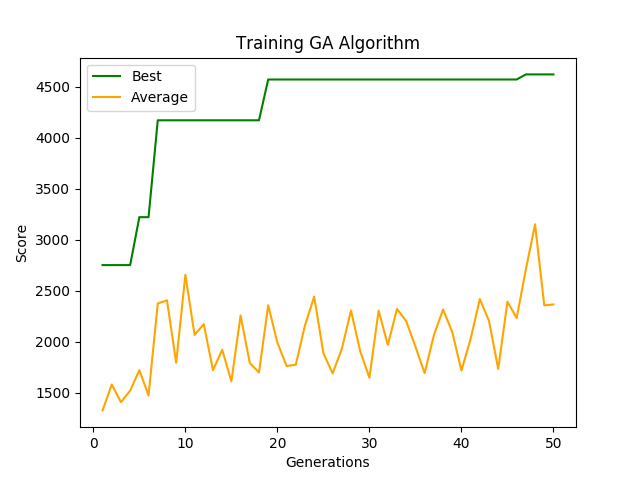


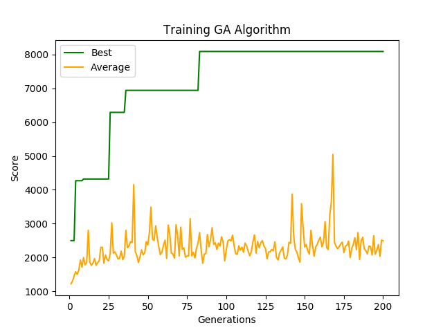


```
Generation: 200
Best Score: 8090.0
Average Score: 2492.6666666666665
Best chromosome: [1, 4, 1, 4, 4, 1, 0, 4, 2, 4, 1, 3, 2, 0, 2, 0, 0, 1, 3, 0, 1, 0, 4, 0, 1, 4, 1, 2, 0, 1, 3, 1, 3, 1, 3, 1, 0, 4, 4, 1, 3, 4, 1, 1, 2, 0, 4, 3, 3, 0]
```

It is impressive that a simple genetic algorithm can learn how
to perform well when the seed is fixed. When compared to the
random agent which had a max score of 3320 with a fixed seed, the
optimized genetic algorithm shattered the random agents' best
performance by a factor of 2.5. 

Since we trained an optimized set of actions to take to achieve a high
score on a specific seed, what would happen if we randomized the seed?
A test was conducted to compare the trained GA agent with 200
generations against the random agent. For both agents, the seed was
randomized by setting it to the current time.

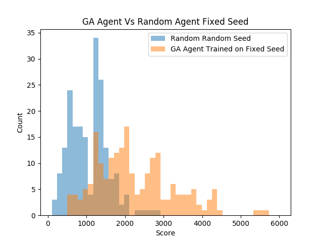


```
GA Performance Trained on Fixed Seed:
    mean:2257.9 
    max:5600.0
    min:530.0 
    sd:1018.4363455808125 
    median:2020.0 
    n:200
```


```
Random Random Seed:
    mean:1079.45 
    max:2800.0 
    min:110.0 
    sd:498.9340612746338 
    median:1080.0 
    n:200
```

```
F_onewayResult(
    statistic=214.87432376234608, 
    pvalue=3.289638100969386e-39
)
```

As expected, the GA agent did not perform as well on random seeds as
it did on the fixed seed that it was trained on. However, the GA was
able to find an action sequence that statistically beat the random
agent as observed in the score distributions above and the extremely
small p-value. Although luck was a part of getting the agent to get a
score of 8k on the seed of zero, the skill that it learned was
somewhat applicable to other seeds. After replaying the video of the
agent play, it just slowly drifts around the screen and shoots at
asteroids in front of it. This has a major advantage over the random
agent since the random agent tends to move very fast and rotate
spastically. 

## Future Work

This algorithm was more or less a last-minute hack to see if I can
make a cool video of a high scoring asteroids agent. Future agents
using genetic algorithms would incorporate reflex to dynamically
respond to the environment. Based on which direction asteroids are in
proximity to the player, the agent could select a different chromosome
of actions to execute. This would potentially yield scores above ten thousand if trained and implemented correctly. Future training
should also incorporate randomness to the seed so that the skills
learned are the most transferable to other random environments. 

# Deep Q-Learning Agent

## Introduction:


The inspiration behind attempting a reinforcement learning agent for
this problem scope is the original DQN paper that came out from
Deepmind, “Playing Atari with Deep Reinforcement Learning.” This paper
showed the potential of utilizing this Deep Q-learning methodology on
a variety of simulated Atari games using one standardized architecture
across all. Reinforcement learning has always been of interest and to
have the opportunity to spend time learning about it while applying
for a class setting was exciting, even if it is out of the scope of
the class presently. It has been an exciting challenge to read through
and implement a research paper to get similar results. 

Deep Q-Learning is an extension of the standard Q-Learning algorithm
in which a neural network is used to approximate the optimal
action-value function, Q\*(s,a). The action-value function is the
function that outputs the expected maximum reward given a state and a
policy mapping to actions or distributions of actions. Logically, this
works as the Q function follows the Bellman equation identity, which
states that if the optimal action for the next step state is known,
then the optimal output given an action a’ follows by maximizing the
expected reward of the equation, r+Q*(s',a'). Thus, the reinforcement
learning part comes in the form of a neural network approximating the
optimal action-value function by using the Bellman equation identity
as an iterative update at every time step. 


## Agent architecture: 

The basis of the network architecture is a basic convolutional network
with 2 conv layers, a fully connected layer, and then an output layer
of 14 classes with each representing an individual action. The first
layer consists of 16 8x8 filters and takes a stride 4 while the second
has 32 4x4 filters and only takes a stride of 2. Following this layer,
the filters are compressed into a 1-D representation vector of size
12,672 that’s passed through a fully connected layer of 256 nodes. 

All layers sans the output layer are activated using the ReLU function.
The optimization algorithm of choice was the Adam optimizer, using a
learning rate equal to .0001 and default betas of [.9, .99]. The
discount factor, or gamma, related to future expected rewards was set
at .99 and the probability of taking a random action per action step
was linearly annealed from 1.0 down to a fixed .1 after one million
seen frames. 

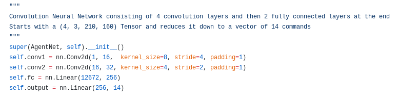


## Experience Replay:

One of the main points within the original paper that significantly
helped the training of this network is the introduction of a Replay
Buffer that is used during the training. To break all the
temporal correlation between sequential frames and biasing the
training of a network-based off certain chains of situations, a
historical buffer of transitions is used to sample mini-batches to
train on per time step. Every time an action is made, a tuple
consisting of the current state, the action is taken, the reward gained, and
the subsequent state (s, a, r, s’) is stored into the buffer. And at
every training step, a mini-batch is sampled from the buffer and used
to train the network. This allows the network to be trained in
non-correlated transitions and hopefully train in a more generalized
way to the environment rather than biased to a string of similar
actions. 

## Preprocessing:

One of the first issues that had to be tackled was the issue of the
high dimensionality of the input image and how that information was
duplicated stored in the Replay Buffer. Each observation given from
the environment is a matrix of (210, 160, 3) pixels representing the
RGB pixels within the frame. For time and being
computationally efficient, it was needed to preprocess and reduce the
dimensionality of the observations as a single frame stack (of which
there are two per transition) consists of (4, 3, 210, 160) or 403,000
input features that would have to be dealt with. 

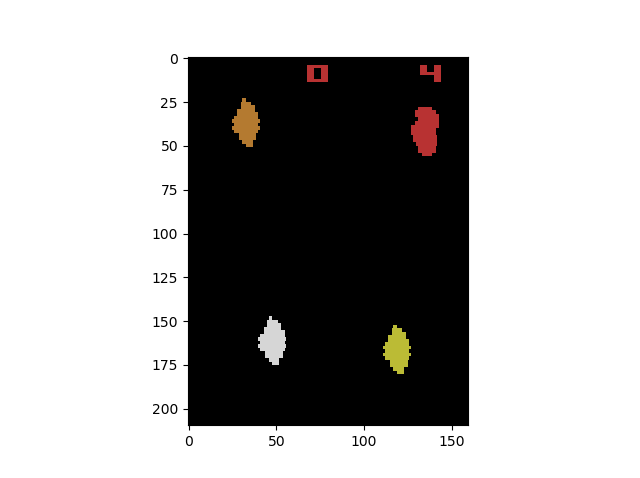

Firstly, images are converted into a grayscale image and the
reward/number lives section at the top of the screen is cut out since
it is irrelevant to the network’s vision. Furthermore, the now (4,
192, 160) matrix was downsampled by taking every other pixel to (4,
96, 80), resulting in a change from 403,000 input features to only
30,720 - a substantial reduction in the calculations needed while
maintaining strong input information for the network. 

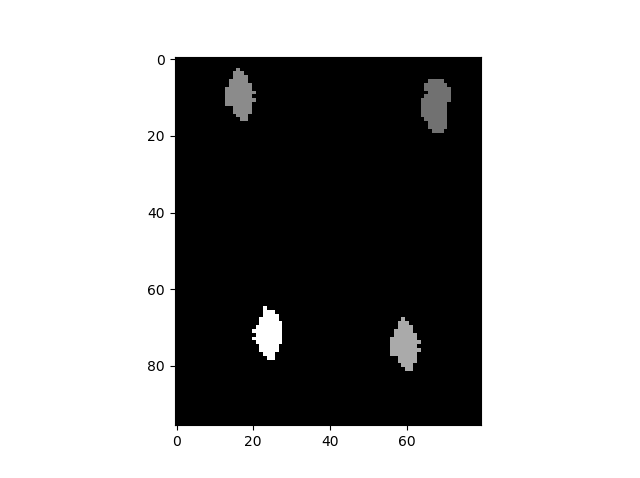


## Training:

Training for the bot was conducted by modifying the main function to
allow games to immediately start after one was finished, to
make continuous training of the agent easier. All the environment
parameters were reset and the temporary attributes of the agent (ie.
current state/next state) were flushed. For the first four frames of a
game, the bot just gathered a stack of frames. And following that, at
every time the next state was compiled and the transition tuple pushed
onto the buffer, as well as a training step for the agent. For the
training step, a random batch was grabbed from the replay buffer and
used to calculate the loss function between actual and expected
Q-values. This was used to calculate the gradients for the
backpropagation of the network. 


## Outcome:

Unfortunately, the result of 48 hours of continuous training, 950
games played, and roughly 1.3 million frames of game footage seen, was
that the agent converged to a suicidal policy that resulted in a
consistent garbage performance. 

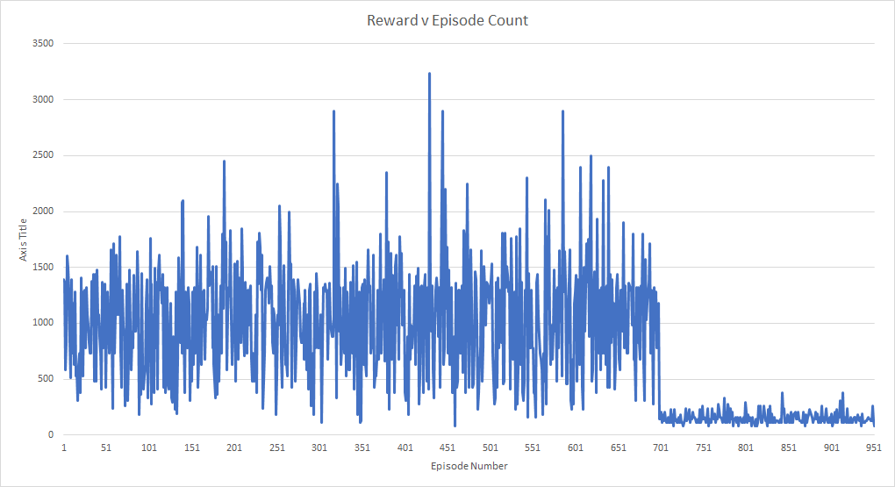


The model transitioned to the fixed 90% model action chance around
episode 700, which is exactly where the agent starts to go awry. The
strange part about this is since the random action chance is linearly
annealed over the first million frames, if the agent had continuously
been following a garbage policy, it would’ve been expected that the
rewards would steadily decrease over time as the network takes more
control.

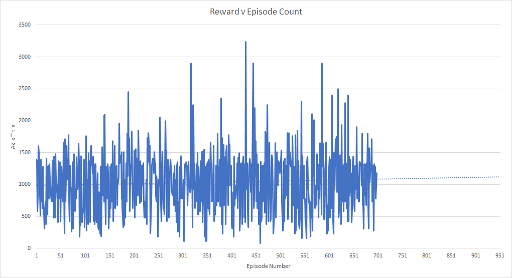


Up until that point, the projection of the reward trendline was a
steady rise per the number of episodes. Expanding this out until
10,000 frames (approximately 10 million frames seen, the same amount
of time the original Deepmind paper trained these bots for), the
projected score is in the realms of 2,400 to 2,500 - which matches up
closely to the well-tuned reflex agent and the GA agent on a random
seed. 

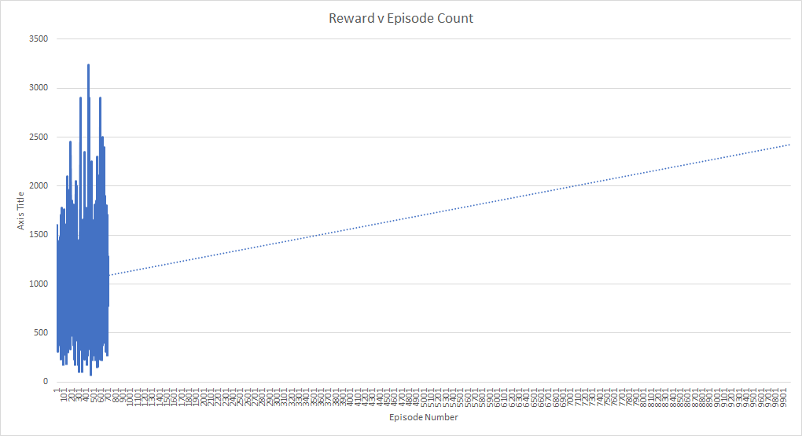


It would’ve been exciting to see how the model compared to
our reflex agent had it been able to train consistently up until the
end. 

## Limitations:

There were a fair number of limitations that were present within the
execution and training of this model that possibly contributed to the
slow and unstable training of the network. Differences in the
algorithm from the original paper is that the optimization function
utilized was the Adam optimizer instead of RMSProp and the replay
buffer only took into consideration the previous 50k frames, not the
past one million. It might be possible that the weaker replay buffer
was to blame as the model was continuously fed a sub-optimal within
its past 50,000 frames that caused it to diverge so heavily near the
end. 

One issue in preprocessing that might've led the bot astray is using
not using the max pixelwise combination between sequential frames in
order to have each frame include both the asteroids and the player.
Since the Atari (and by extension, this environment simulation)
doesn't render the asteroids and the player sprite all in the same
frame, it is possible that the network was unable to extract any
coherent connection between the alternating frames. 

Regarding optimizations built on the DQN algorithm past the original
Deepmind paper, we did not use a policy and a target network in
training. In the original algorithm, the estimation and attempt at
converging to the target policy is unstable due to the target
network’s weights continuously shifting during training. For the
network, it’s hard to converge to something that’s continually
shifting at every time step and leads to very noisy and unstable
training. One optimization that has been proposed for DQN is to have a
policy and target network. At every timestep, the policy network’s
weights are updated with the calculated gradients while the target
network is maintained for a number of steps. This lets the target
policy be still for a few time steps while the network is converging
to it and leads to more stable and guided training. 

Perhaps the largest limitation in training was the computational power
used for training. The network was trained on a single GTX1060ti GPU,
which led to just single episodes taking a few minutes to complete. It
would’ve taken an incredibly long time to hit 10 million seen frames
as even just 1.3 million took approximately 48 hours. It’s probable
that our implementation is inefficient in its calculations, however it
is a well known limitation of RL that it is time and computationally
intensive. 

## Deep Q Conclusions:

This was a fun agent and algorithm to implement, even if at present it
has given little to no results back in terms of performance. The plan
is to continue testing and training the agent, even after the
deadline. Reinforcement learning is a complicated and hard to debug
environment, but similarly an exciting challenge due to its potential
for solving and overcoming problems. 


# Conclusion

This project demonstrated how fun it can be to train AI agents to play
video games. Although none of our agents are earth-shatteringly
amazing, we were able to use statistical measures to determine that
the reflex and GA agents outperformed the random agent. The GA agent
and the convolutional neural network show very promising and future
work can be used to drastically improve their results. 
