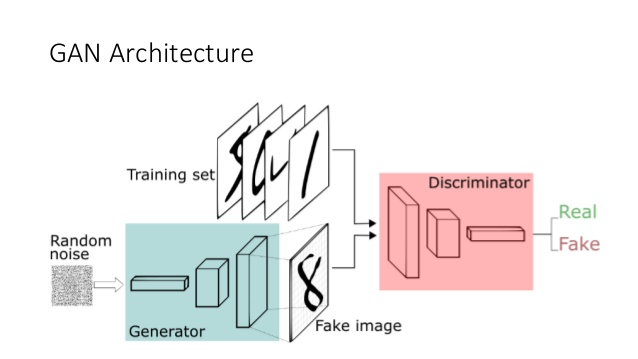

Generative adversarial networks (GAN) are all the buzz in AI right now due to their fantastic ability to create new content.
Last semester, my final Computer Vision (CSCI-431) research project was on comparing the results of three different GAN architectures using the NMIST dataset.
I'm writing this post to go over some of the PyTorch code used because PyTorch makes it easy to write GANs.

<customHTML />

# GAN Background

The goal of a GAN is to generate new realistic content.
There are three major components of training a GAN: the generator, the discriminator, and the loss function.
The generator is a neural network that will take in random noise and generate a new image.
The discriminator is a neural network that decides whether the image it sees is real or fake.
The discriminator is analogous to a detective trying to identify forges.
The loss function decides how incorrect the discriminator and generator is based on the confidence provided for both real images and fake images.
Once a GAN is fully trained, the accuracy of the discriminator should be 50% because the generator generates images so good that the discriminator can no longer detect the forges and is just guessing.



Training a GAN can be tricky for a multitude of reasons.
First, you want to make sure that the Generator and Discriminator learn at the same rate.
If you start with a Discriminator that is too good, it will always be correct, and the generator will not be able to learn from it.
Second, compared to other neural networks, training a GAN requires a lot of data.
In this project, we used the infamous MNIST dataset of handwritten digits containing nearly seventy thousand handwritten numbers.

<youtube src="Sw9r8CL98N0" />

# Vanilla GAN in PyTorch

Our generator is a PyTorch neural network that takes a random vector of size 128x1 and outputs a new vector of size 1024-- which is re-sized to our 32x32 image.

```python
class Generator(nn.Module):
    def __init__(self):
        super(Generator, self).__init__()

        def block(in_feat, out_feat, normalize=True):
            layers = [nn.Linear(in_feat, out_feat)]
            if normalize:
                layers.append(nn.BatchNorm1d(out_feat, 0.8))
            layers.append(nn.LeakyReLU(0.2, inplace=True))
            return layers

        self.model = nn.Sequential(
            *block(latent_dim, 128, normalize=False),
            *block(128, 256),
            *block(256, 512),
            *block(512, 1024),
            nn.Linear(1024, int(np.prod(img_shape))),
            nn.Tanh()
        )

    def forward(self, z):
        img = self.model(z)
        img = img.view(img.size(0), *img_shape)
        return img
generator = Generator()
```

The discriminator is a neural network that takes in an image and determines whether it is a real or fake image-- similar to code for binary classification.

```python
class Discriminator(nn.Module):
    def __init__(self):
        super(Discriminator, self).__init__()

        self.model = nn.Sequential(
            nn.Linear(int(np.prod(img_shape)), 512),
            nn.LeakyReLU(0.2, inplace=True),
            nn.Linear(512, 256),
            nn.LeakyReLU(0.2, inplace=True),
            nn.Linear(256, 1),
            nn.Sigmoid(),
        )

    def forward(self, img):
        img_flat = img.view(img.size(0), -1)
        validity = self.model(img_flat)
        return validity
discriminator = Discriminator()
```

In this example, we are using the PyTorch data loader for the MNIST dataset.
The built-in data loader makes our lives more comfortable because it allows us to specify our batch size, downloads the data for us, and even normalizes it. 

```python
os.makedirs("../data/mnist", exist_ok=True)
dataloader = torch.utils.data.DataLoader(
    datasets.MNIST(
        "../data/mnist",
        train=True,
        download=True,
        transform=transforms.Compose(
            [transforms.Resize(img_size), transforms.ToTensor(), transforms.Normalize([0.5], [0.5])]
        ),
    ),
    batch_size=batch_size,
    shuffle=True,
)
```

In this example, we need two optimizers, one for the discriminator and one for the generator.
We are using the Adam optimizer, which is a first-order gradient-based optimizer that works well within PyTorch.

```python
optimizer_G = torch.optim.Adam(generator.parameters(), lr=lr, betas=(b1, b2))
optimizer_D = torch.optim.Adam(discriminator.parameters(), lr=lr, betas=(b1, b2))
adversarial_loss = torch.nn.BCELoss()
```


The training loop is pretty standard, except that we have two neural networks to optimize each batch cycle.

```python
for epoch in range(n_epochs):

    # chunks by batch
    for i, (imgs, _) in enumerate(dataloader):

        # Adversarial ground truths
        valid = Variable(Tensor(imgs.size(0), 1).fill_(1.0), requires_grad=False)
        fake = Variable(Tensor(imgs.size(0), 1).fill_(0.0), requires_grad=False)

        # Configure input
        real_imgs = Variable(imgs.type(Tensor))
        
        # training for generator
        optimizer_G.zero_grad()

        # Sample noise as generator input
        z = Variable(Tensor(np.random.normal(0, 1, (imgs.shape[0], latent_dim))))

        # Generate a batch of images
        gen_imgs = generator(z)

        # Loss measures generator's ability to fool the discriminator
        g_loss = adversarial_loss(discriminator(gen_imgs), valid)

        g_loss.backward()
        optimizer_G.step()

        # Training for discriminator
        optimizer_D.zero_grad()

        # Measure discriminator's ability to classify real from generated samples
        real_loss = adversarial_loss(discriminator(real_imgs), valid)
        fake_loss = adversarial_loss(discriminator(gen_imgs.detach()), fake)
        d_loss = (real_loss + fake_loss) / 2

        d_loss.backward()
        optimizer_D.step()

        # total batches ran
        batches_done = epoch * len(dataloader) + i

        print(
            "[Epoch %d/%d] [Batch %d/%d] [Batches Done: %d] [D loss: %f] [G loss: %f]"
            % (epoch, n_epochs, i, len(dataloader), batches_done, d_loss.item(), g_loss.item())
        )
```

Plus or minus a few things, that is a GAN in PyTorch. Pretty easy, right?
You can find the full code for both the paper and this blog post on my [github](https://github.com/jrtechs/CSCI-431-final-GANs)

## Tensorboard

Tensorboard is a library used to visualize the training progress and other aspects of machine learning experimentation.
It is a little known fact that you can use Tensorboard even if you are using PyTorch since TensorBoard is primarily associated with the TensorFlow framework. 

Tensorboard gets installed via pip:

```
pip install tensorboard
```

Making minimal modifications to our PyTorch code, we can add the TensorBoard logging. 


```python
# inport
from torch.utils.tensorboard import SummaryWriter

# creates a new tensorboard logger
writer = SummaryWriter()

# add this to run for each batch
writer.add_scalar('D_Loss', d_loss.item(), batches_done)
writer.add_scalar('G_Loss', g_loss.item(), batches_done)

# flushes file
writer.close()
```

After the model finishes training, you can open the TensorBoard logs using the "tensorboard" command in the terminal.

```
tensorboard --logdir=runs
```

Opening "http://0.0.0.0:6006/" in your browser will give you access to the TensorBoard web UI.

```
[TensorBoard screen grab](media/gan/tensorboard.png)
```

# Takeaways

Robust, flexible GANs are relatively easy to create in PyTorch.
For this reason, you find a lot of researchers who use PyTorch in their experimentation.
