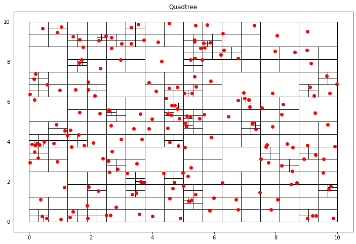
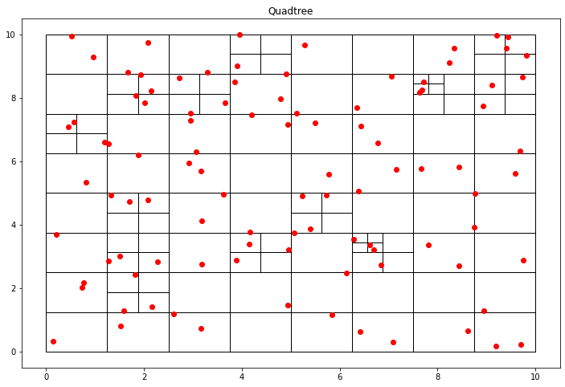

This blog post is the first part of a multi-post series on using quadtrees in Python.
This post goes over quadtrees' basics and how you can implement a basic point quadtree in Python.
Future posts aim to apply quadtrees in image segmentation and analysis.

A quadtree is a data structure where each node has exactly four children. This property makes it particularly suitable for spatial searching.
In a point-quadtree, leaf nodes are a single unit of spatial information. A quadtree is constructed by continuously dividing each node until each leaf node only has a single node inside of it.
However, this partitioning can be modified so that each leaf node only contains at most K elements or that each cell can be at a maximum X large.

Although usually used in two-dimensions, quadtrees can be expanded to an arbitrary amount of dimensions. The lovely property of quadtrees is that it is a "dimensional reduction" algorithm. Rather than operating in O(n^2) for a traditional linear search in two dimensions, a quadtree can accomplish close to O(log n) time for most operations.

# Implementing a Point Quadtree

To implement a quadtree, we only need a few pieces. First, we need some way to represent our spacial information.
In this application, we are only using points; however, we may choose to associate data with each point for an application.

```python
class Point():
    def __init__(self, x, y):
        self.x = x
        self.y = y
```

The second thing that we need is a tree representation.
Like all tree nodes, it has children; however, what is unique about a quadtree is that each node represents a geometric region.
This geometric region has a shape represented by a location and a width and height. Additionally, if this is a leaf node, we need to have our node store the region's points.

```python
 class Node():
    def __init__(self, x0, y0, w, h, points):
        self.x0 = x0
        self.y0 = y0
        self.width = w
        self.height = h
        self.points = points
        self.children = []

    def get_width(self):
        return self.width
    
    def get_height(self):
        return self.height
    
    def get_points(self):
        return self.points
```

To generate the quadtree, we will be taking a top-down approach were we recursively divide the node into four regions until a certain threshold has been satisfied.
In this case, we are stopping division when each node contains less than k nodes.

```python
def recursive_subdivide(node, k):
   if len(node.points)<=k:
       return
   
   w_ = float(node.width/2)
   h_ = float(node.height/2)

   p = contains(node.x0, node.y0, w_, h_, node.points)
   x1 = Node(node.x0, node.y0, w_, h_, p)
   recursive_subdivide(x1, k)

   p = contains(node.x0, node.y0+h_, w_, h_, node.points)
   x2 = Node(node.x0, node.y0+h_, w_, h_, p)
   recursive_subdivide(x2, k)

   p = contains(node.x0+w_, node.y0, w_, h_, node.points)
   x3 = Node(node.x0 + w_, node.y0, w_, h_, p)
   recursive_subdivide(x3, k)

   p = contains(node.x0+w_, node.y0+h_, w_, h_, node.points)
   x4 = Node(node.x0+w_, node.y0+h_, w_, h_, p)
   recursive_subdivide(x4, k)

   node.children = [x1, x2, x3, x4]
   
   
def contains(x, y, w, h, points):
   pts = []
   for point in points:
       if point.x >= x and point.x <= x+w and point.y>=y and point.y<=y+h:
           pts.append(point)
   return pts


def find_children(node):
   if not node.children:
       return [node]
   else:
       children = []
       for child in node.children:
           children += (find_children(child))
   return children
```
The QTree class is used to tie together all the data associated with creating a quadtree.
This class is also used to generate dummy data and graph it using matplotlib.

```python
import random
import matplotlib.pyplot as plt # plotting libraries
import matplotlib.patches as patches

class QTree():
    def __init__(self, k, n):
        self.threshold = k
        self.points = [Point(random.uniform(0, 10), random.uniform(0, 10)) for x in range(n)]
        self.root = Node(0, 0, 10, 10, self.points)

    def add_point(self, x, y):
        self.points.append(Point(x, y))
    
    def get_points(self):
        return self.points
    
    def subdivide(self):
        recursive_subdivide(self.root, self.threshold)
    
    def graph(self):
        fig = plt.figure(figsize=(12, 8))
        plt.title("Quadtree")
        c = find_children(self.root)
        print("Number of segments: %d" %len(c))
        areas = set()
        for el in c:
            areas.add(el.width*el.height)
        print("Minimum segment area: %.3f units" %min(areas))
        for n in c:
            plt.gcf().gca().add_patch(patches.Rectangle((n.x0, n.y0), n.width, n.height, fill=False))
        x = [point.x for point in self.points]
        y = [point.y for point in self.points]
        plt.plot(x, y, 'ro') # plots the points as red dots
        plt.show()
        return
```

Creating a quadtree where each cell can only contain at the most section will produce a lot of cells. 



If we change the hyperparameter to split until there is at most two objects per cell, we get larger cells.



# Future Work

In the near future, I plan on making a post on how you can use quadtrees to do image compression.

