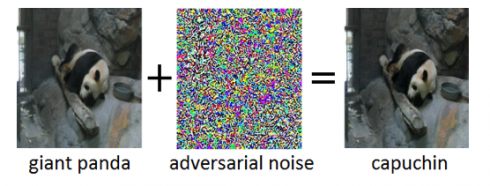
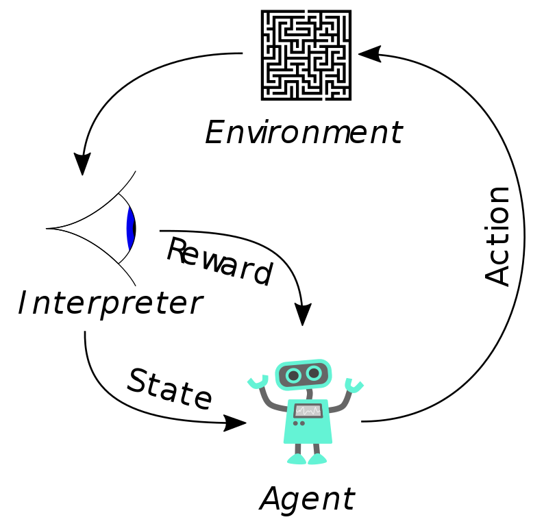

In this blog post I examine the ways in which antivirus programs
currently employ machine learning and then go into the  security
vulnerabilities that it brings. 

# ML in the Antivirus Industry

Malware detection falls into two broad categories: static and dynamic
analysis. Static analysis examines the program without actually
running the code. Static analysis looks at things like the file
fingerprints, hashes, reverse engineering, memory artifacts, packer
detection, and debugging.  Static analysis is largely known for
looking up the hashes of the virus against a known database of
viruses. It is super easy to fool signature based malware detection
using simple obfuscation methods. Dynamic analysis is a technique
where you run the program in a sandbox and monitor all the actions
that the virus takes. If you notice that the program is acting
suspicious, it is likely a virus. Suspicious behavior typically
includes things like registry edits and API calls to bad host names.  

Antivirus detection is very difficult, but, probably not for the
reasons you think. The issue isn't writing programs which can detect
these static or dynamic properties of viruses-- that is the easy part.
It is also relatively easy to determine a general rule set for what
makes a program dangerous. You can also easily blacklist suspicious
domains, block malicious activity, and implement a signature based
maleware detection program.  

The real problem is that there are hundreds of thousands of malware
applications and more are created every day. Not only are there tons
of pesky malware applications, there is an absurd amount of normal
programs which we don't want malware applications to block.   It is
impossible for a small team of malware researchers to create a
definitive set of heuristics which can correctly identify all malware
programs. This is where we turn to the field of Machine Learning.
Humans are very bad with big data, but, computers love big data. Most
antivirus companies use machine learning and it has been a large
success so far because it has allowed us to dramatically improve our
ability to detect zero day viruses. 

## Interesting Examples

### Cylance

[Cylance](https://www.cylance.com) uses supervised learning and static analysis to classify files as being malware. 
This product pulls a list of attributes from the file which they can then compare against other known viruses.

### MalwareBytes Anomalous

[Anomalous](https://blog.malwarebytes.com/detections/machinelearning-anomalous-100/) is a machine learning application which simply flags files which appear different from their training set of known normal files.
This does not attempt to classify what makes a virus a virus, but, what makes a normal program a normal program.
Anything which is not a normal program, it alerts you about since it can be a virus.

### Kaspersky

Kaspersky appears to have  done a ton of research into using machine
learning for malware detection. I would highly recommend that you read
their [white
paper](https://media.kaspersky.com/en/enterprise-security/Kaspersky-Lab-Whitepaper-Machine-Learning.pdf)
on this subject. 

# Why is this a problem?

It turns out that machine learning systems can be easily fooled by
using other machine learning algorithms. A classic example of this is
with image classification. It is easy to use neural networks or
genetic algorithms to generate examples which fool the machine
learning application by learning the weights of the machine  learning
application and then making slight tweaks to your input to give a
false classification. 

Since viruses generation is a non-differentiable problem, people often
use Genetic algorithms for the adversarial network to fool the
antivirus. In other words, you don't want to attempt to calculate the
derivative between two versions of a virus for gradient decent. Since
viruses are high dimensional problems, it turns out that most calc
implementations would actually be inefficient at traversing the search
space to find the global minimum. If you want to learn more about
genetic algorithms, check out my [recent blog
post](https://jrtechs.net/data-science/lets-build-a-genetic-algorithm)
on it. 

# Fooling Antivirus Software

## Genetic Algorithms

There are two major approaches which people have used to generate
antivirus resistant malware with genetic algorithms. The first
approach is to slowly make polymorphic changes to the virus in order
to fool the malware detection. One of the interesting things about
this approach is that you have to have some way of verifying that the
polymorphic behaviors that you apply to the virus don't break its
"virus capabilities". 

An other approach used is to represent a virus as a set of properties.
These properties are everything from the port of attack, the payloads,
obfuscation parameters, etc. The genetic algorithm would simply tweak
the properties of the virus until it found a configuration which
evaded the antivirus program. 

## Reinforcement Learning

A research group at [Endgame](https://www.endgame.com/) recently gave
a [Def Con](https://www.defcon.org/) talk where they presented a
framework which uses reinforcement learning to evade static virus
detection. 

At a high level, the AI plays a "game" against the antivirus where the
agent can make functionality-preserving mutations to the virus. The
reward for the agent is its ability to not get detected by the
anti-virus. Over time the AI will learn which type of actions will
result in getting detected by the antivirus.  This framework can be
found on [Github](https://github.com/endgameinc/gym-malware). 

# Takeaways

Machine learning is great, but, it needs to be properly defended. As
we start to use machine learning more and more, a large portion of the
cyber security field may shift its focus away from securing systems to
securing big data applications. 

# Resources

- [Blog post on Genetic Algorithms](https://jrtechs.net/data-science/lets-build-a-genetic-algorithm)
- [Kaspersky White Paper](https://media.kaspersky.com/en/enterprise-security/Kaspersky-Lab-Whitepaper-Machine-Learning.pdf)
- [Windows Defender Use of ML](https://www.microsoft.com/security/blog/2015/11/16/windows-defender-rise-of-the-machine-learning/)
- [Machine Learning Malware Models via Reinforcement Learning (Paper)](https://arxiv.org/abs/1801.08917)
- [Evolvable Malware (Paper)](http://homepage.divms.uiowa.edu/~mshafiq/files/evolvable-malware.pdf)
