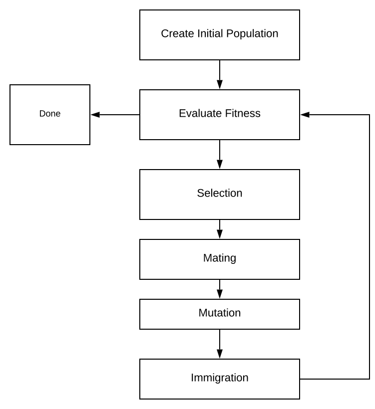

# Live Simulation

<customHTML />

# Background and Theory

Since you stumbled upon this article, you might be wondering what the heck genetic algorithms are.
To put it simply: genetic algorithms employ the same tactics used in natural selection to find an optimal solution to a problem.
Genetic algorithms are often used in high dimensional problems where the optimal solution is not apparent.
A common use case of genetic algorithms are to tune [hyper-parameters](https://en.wikipedia.org/wiki/Hyperparameter) in a program.
However, this algorithm can be used in any scenario where you have a function which defines how well something performed and you would
like to find the absolute minimum.
Many people have used genetic algorithms in video games to auto learn the weaknesses of players.

The beautiful part about Genetic Algorithms are their simplicity; you need absolutely no knowledge of linear algebra or calculus.
To implement one all you need to know is **very basic** algebra and a general grasp of evolution.

# Genetic Algorithm

All genetic algorithms typically follow the pattern of evaluation mating, mutation, and selection.
I will dive into each section of this algorithm using JavaScript code snippets.
The algorithm which I present is very generic and modular so it should be easy to port into other applications and programming languages. 




## Create Initial Population

The very first thing we need to do is specify a data-structure for storing our genetic information.
In biology chromosomes are composed of sequences of genes.
Many people run genetic algorithms on binary arrays since they more closely represent DNA.
However, as computer scientists, it is often easier to model things as continuous numbers.
In this approach, every Gene will be a single floating point number ranging between zero and one.
This keeps things really easy because it is very simple perform any genetic "operation".
Every type of Gene will have a max and min value which represents the absolute extremes of that gene.
This works well for optimization because it allows us to easily limit our search space. 
For example, we can specify that "height" gene can only vary between 0 and 90.
To get the actual value of the gene from its \[0-1] value we simple de-normalize it.

$$
g_{real ralue} = (g_{high}- g_{low})g_{norm} + g_{low}
$$

```javascript
class Gene
{
    /**
     * Constructs a new Gene to store in a chromosome.
     * @param min minimum value that this gene can store
     * @param max value this gene can possibly be
     * @param value normalized value
     */
    constructor(min, max, value)
    {
        this.min = min;
        this.max = max;
        this.value = value;
    }

    /**
     * De-normalizes the value of the gene
     * @returns {*}
     */
    getRealValue()
    {
        return (this.max - this.min) * this.value + this.min;
    }

    getValue()
    {
        return this.value;
    }

    setValue(val)
    {
        this.value = val;
    }

    makeClone()
    {
        return new Gene(this.min, this.max, this.value);
    }

    makeRandomGene()
    {
        return new Gene(this.min, this.max, Math.random());
    }
}
```


Now that we have genes, we can create Chromosomes. 
Chromosomes are simply collections of genes.
Whatever language you make this in, make sure that when you create a new Chromosome it 
is has a [deep copy](https://en.wikipedia.org/wiki/Object_copying) of the genetic information rather than a shallow copy.
A shallow copy is when you simple copy the object pointer where a deep copy is actually creating a full new object.
If you fail to do a deep copy, you will have weird issues where multiple Chromosomes will share the same DNA.

In this class I added helper functions to clone and create a new Chromosome.
You can only create a new chromosome by cloning because I wanted to keep the program generic and make no assumptions about the domain.
Since you only provide the min/max information for the genes once, cloning an existing chromosome is the easy way of ensuring that all chromosomes contain similarly behaved genes.


```javascript
class Chromosome
{
    /**
     * Constructs a chromosome by making a copy of
     * a list of genes.
     * @param geneArray
     */
    constructor(geneArray)
    {
        this.genes = [];
        for(let i = 0; i < geneArray.length; i++)
        {
            this.genes.push(geneArray[i].makeClone());
        }
    }

    getGenes()
    {
        return this.genes;
    }

    /**
     * Mutates a random gene.
     */
    mutate()
    {
        this.genes[Math.round(Math.random() * (this.genes.length-1))].setValue(Math.random());
    }

    /**
     * Creates a totally new chromosome with same
     * genetic structure as this chromosome but different
     * values.
     * @returns {Chromosome}
     */
    createRandomChromosome()
    {
        let geneAr = [];
        for(let i = 0; i < this.genes.length; i++)
        {
            geneAr.push(this.genes[i].makeRandomGene());
        }
        return new Chromosome(geneAr);
    }
}
```

Creating a random population is pretty straight forward if implemented this method of random cloning in the Chromosome and Gene class.

```javascript
/**
 * Creates a totally random population based  on a desired size
 * and a prototypical chromosome.
 *
 * @param geneticChromosome
 * @param populationSize
 * @returns {Array}
 */
const createRandomPopulation = function(geneticChromosome, populationSize)
{
    let population = [];
    for(let i = 0; i < populationSize; i++)
    {
        population.push(geneticChromosome.createRandomChromosome());
    }
    return population;
};
```

This is where nearly all the domain information is introduced. 
To create an entire population, you simply need to define what types of genes are found on each chromosome.
In this example all genes contain values ranging between one and ten. 

```javascript
let gene1 = new Gene(1,10,10);
let gene2 = new Gene(1,10,0.4);
let geneList = [gene1, gene2];

let exampleOrganism = new Chromosome(geneList);

let population = createRandomPopulation(genericChromosome, 100);
```


## Evaluate Fitness

```javascript
let costx = Math.random() * 10;
let costy = Math.random() * 10;

/** Defines the cost as the "distance" to a 2-d point.
 * @param chromosome
 * @returns {number}
 */
const basicCostFunction = function(chromosome)
{
    return Math.abs(chromosome.getGenes()[0].getRealValue() - costx) +
        Math.abs(chromosome.getGenes()[1].getRealValue() - costy);
};
```

## Selection

```javascript
/**
 * Function which computes the fitness of everyone in the
 * population and returns the most fit survivors. Method
 * known as elitism.
 *
 * @param population
 * @param keepNumber
 * @param fitnessFunction
 * @returns {{average: number,
 * survivors: Array, bestFit: Chromosome }}
 */
const naturalSelection = function(population, keepNumber, fitnessFunction)
{
    let fitnessArray = [];
    let total = 0;
    for(let i = 0; i < population.length; i++)
    {
        const fitness = fitnessFunction(population[i]);
        console.log(fitness);
        fitnessArray.push({fit:fitness, chrom: population[i]});
        total+= fitness;
    }

    fitnessArray.sort(predicateBy("fit"));

    let survivors = [];
    let bestFitness = fitnessArray[0].fit;
    let bestChromosome = fitnessArray[0].chrom;
    for(let i = 0; i < keepNumber; i++)
    {
        survivors.push(fitnessArray[i].chrom);
    }
    return {average: total/population.length, survivors: survivors, bestFit: bestFitness, bestChrom: bestChromosome};
};
```


```javascript
/**
 * Helper function to sort an array
 *
 * @param prop name of JSON property to sort by
 * @returns {function(*, *): number}
 */
function predicateBy(prop)
{
    return function(a,b)
    {
        var result;
        if(a[prop] > b[prop])
        {
            result =  1;
        }
        else if(a[prop] < b[prop])
        {
            result = -1;
        }
        return result;
    }
}
```

## Mating

```javascript
/**
 * Randomly  everyone in the population
 *
 * @param population
 * @param desiredPopulationSize
 */
const matePopulation = function(population, desiredPopulationSize)
{
    const originalLength = population.length;
    while(population.length < desiredPopulationSize)
    {
        let index1 = Math.round(Math.random() * (originalLength-1));
        let index2 = Math.round(Math.random() * (originalLength-1));
        if(index1 !== index2)
        {
            const babies = breed(population[index1], population[index2]);
            population.push(babies[0]);
            population.push(babies[1]);
        }
    }
};


/**
 * Mates two chromosomes using the blending method
 * and returns a list of 2 offspring.
 * @param father
 * @param mother
 * @returns {Chromosome[]}
 */
const breed = function(father, mother)
{
    let son = new Chromosome(father.getGenes());
    let daughter = new Chromosome(mother.getGenes());

    for(let i = 0;i < son.getGenes().length; i++)
    {
        let blendCoef = Math.random();
        blendGene(son.getGenes()[i], daughter.getGenes()[i], blendCoef);
    }
    return [son, daughter];
};

/**
 * Blends two genes together based on a random blend
 * coefficient.
 **/
const blendGene = function(gene1, gene2, blendCoef)
{
    let value1 = (blendCoef * gene1.getValue()) +
        (gene2.getValue() * (1- blendCoef));
    let value2 = ((1-blendCoef) * gene1.getValue()) +
        (gene2.getValue() * blendCoef);

    gene1.setValue(value1);
    gene2.setValue(value2);
};
```

## Mutation

```javascript
/**
 * Randomly mutates the population
 **/
const mutatePopulation = function(population, mutatePercentage)
{
    if(population.length >= 2)
    {
        let mutations = mutatePercentage *
                        population.length *
                        population[0].getGenes().length;
        for(let i = 0; i < mutations; i++)
        {
            population[i].mutate();
        }
    }
    else
    {
        console.log("Error, population too small to mutate");
    }
};
```

## Immigration

```javascript
/**
 * Introduces x random chromosomes to the population.
 * @param population
 * @param immigrationSize
 */
const newBlood = function(population, immigrationSize)
{
    for(let i = 0; i < immigrationSize; i++)
    {
        let geneticChromosome = population[0];
        population.push(geneticChromosome.createRandomChromosome());
    }
};
```

## Putting It All Together

```javascript
/**
 * Runs the genetic algorithm by going through the processes of
 * natural selection, mutation, mating, and immigrations. This
 * process will continue until an adequately performing chromosome
 * is found or a generation threshold is passed.
 *
 * @param geneticChromosome Prototypical chromosome: used so algo knows
 *                            what the dna of the population looks like.
 * @param costFunction Function which defines how bad a Chromosome is
 * @param populationSize Desired population size for population
 * @param maxGenerations Cut off level for number of generations to run
 * @param desiredCost Sufficient cost to terminate program at
 * @param mutationRate Number between [0,1] representing proportion of genes
 * to mutate each generation
 * @param keepNumber Number of Organisms which survive each generation
 * @param newBloodNumber Number of random immigrants to introduce into
 * the population each generation.
 * @returns {*}
 */
const runGeneticOptimization = function(geneticChromosome, costFunction,
                                        populationSize, maxGenerations,
                                        desiredCost, mutationRate, keepNumber,
                                        newBloodNumber)
{
    let population = createRandomPopulation(geneticChromosome, populationSize);
    let generation = 0;
    let bestCost = Number.MAX_VALUE;
    let bestChromosome = geneticChromosome;
    do
    {
        matePopulation(population, populationSize);
        newBlood(population, newBloodNumber);
        mutatePopulation(population, mutationRate);
        let generationResult = naturalSelection(population, keepNumber, costFunction);

        if(bestCost > generationResult.bestFit)
        {
            bestChromosome = generationResult.bestChrom;
            bestCost = generationResult.bestFit;
        }
        population = generationResult.survivors;

        generation++;
        console.log("Generation " + generation + " Best Cost: " + bestCost);
    }while(generation < maxGenerations && bestCost > desiredCost);
    return bestChromosome;
};
```

# Conclusion