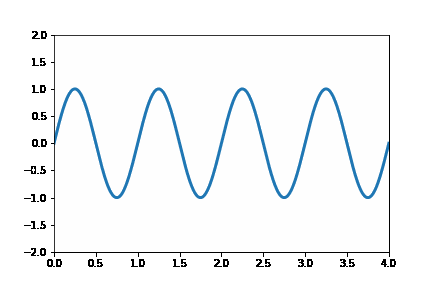
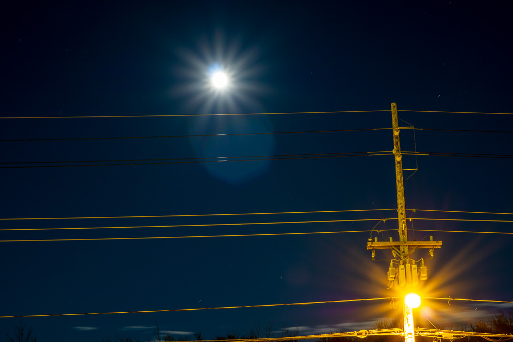
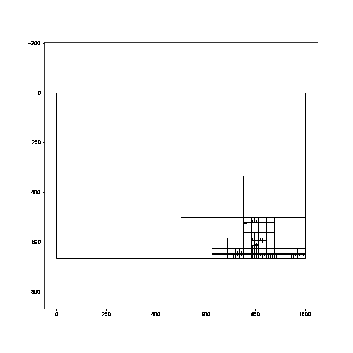
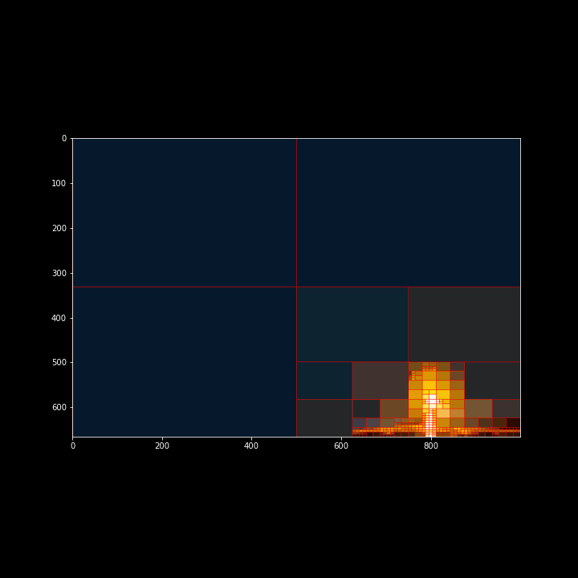
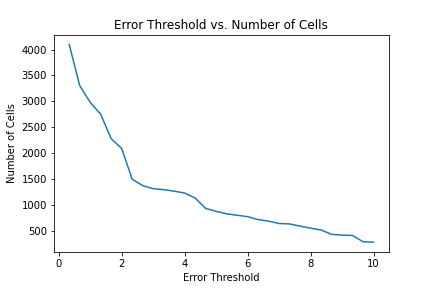

This post will extend my last post on image [quadtrees](https://jrtechs.net/photography/segmenting-images-with-quadtrees) to create an animation that varies the quadtree splitting threshold.
Like all recursively dividing algorithms, as you relax the splitting parameter, more partitions get generated.
Although this principle makes intuitive sense, seeing animation tells a fuller story.

This post will be using the matplotlib's animation functionality and the quadtree code I wrote in my [previous post](https://jrtechs.net/photography/segmenting-images-with-quadtrees). The following code snippet illustrates a simple animation using matplolib:

```python
import numpy as np
from matplotlib import pyplot as plt
from matplotlib.animation import FuncAnimation

fig = plt.figure()
ax = plt.axes(xlim=(0, 4), ylim=(-2, 2))
line, = ax.plot([], [], lw=3)

def init():
    line.set_data([], [])
    return line,
def animate(i):
    x = np.linspace(0, 4, 1000)
    y = np.sin(2 * np.pi * (x - 0.01 * i))
    line.set_data(x, y)
    return line,

anim = FuncAnimation(fig, animate, init_func=init,
                               frames=200, interval=20, blit=True)

anim.save('Wave.gif')
```




In this post, I will be using the quadtree on a picture of a street light at night. 
Note that the details in this image are on the telephone pole and the moon.
This detail is vital because when discretizing it with a quadtree, we expect that those two areas would receive smaller cells than the rest of the image.




After applying some minor altercations to our original animation code, we can use it to animate our quadtree wireframe. This code will create 30 frames in our Gif where each frame is 500ms-- half a second.
Additionally, the loop starts at zero and increments by one each frame. I added some normalization to our loop to ensure that the first frame contains the largest value and the last frame receives the smallest splitting value-- starts the animation with fewer cells and finishes with more cells.

```python
fig = plt.figure(figsize=(10, 10))
plt.title("Quadtree")
MAX_FRAMES=30

def animate(i):
    fig.clear(True)
    qtTemp = QTree((MAX_FRAMES-i)/3, 3, img)  #contrast threshold, min cell size, img
    qtTemp.subdivide() # recursively generates quad tree
    qtTemp.graph_tree(fig=fig, display=False)
    return fig,

anim = FuncAnimation(fig, animate,
                               frames=MAX_FRAMES, interval=500, blit=True)
anim.save('quad_tree_wire_frame.gif')
```



Modifying the code further, we can animate the quadtree while discretizing the image.


```python
fig = plt.figure(figsize=(10, 10))
plt.title("Quadtree")
MAX_FRAMES=30

cell_count=[]
dividing_threshold=[]

def animate(i):
    fig.clear(True)
    qtTemp = QTree((MAX_FRAMES-i)/3, 3, img)  #contrast threshold, min cell size, img
    qtTemp.subdivide() # recursively generates quad tree
    #qtTemp.graph_tree(fig=fig, display=False)
    img_render = qtTemp.render_img()
    rgb = cv2.cvtColor(img_render, cv2.COLOR_BGR2RGB)
    plt.gca().imshow(rgb)
    
    cell_count.append(len(find_children(qtTemp.root)))
    dividing_threshold.append((MAX_FRAMES-i)/3)
    return fig,

anim = FuncAnimation(fig, animate,
                       frames=MAX_FRAMES, interval=500, blit=True)
anim.save('quad_tree_animation_image.gif', writer='imagemagick')
```



Observing the image, we can see that cells don't get added to the quadtree linearly. There are a few frames in the animation where the number of cells added makes a sudden jump.
We can further investigate this by plotting the error threshold against the number of cells produced.

```python
plt.title("Error Threshold vs. Number of Cells")
plt.plot(dividing_threshold, cell_count)
plt.xlabel("Error Threshold")
plt.ylabel("Number of Cells")
plt.savefig("error_graph.png")
```



This graph shows that the most significant changes in the number of cells occur when you initially start increasing the threshold and then again around 4.5.
But, that is only for this image; different images will react differently to varying the error threshold. Moreover, the image's resolution will also affect the number of cells generated at a particular threshold. 