Last week I scrapped a bunch of data from the Steam API using my [Steam Graph Project](https://github.com/jrtechs/SteamFriendsGraph).
This project captures steam users, their friends, and the games that they own.
Using the Janus-Graph traversal object, I use the Gremlin graph query language to pull this data.
Since I am storing the hours played in a game as a property on the relationship between a player and a game node, I had to make a "join" statement to get the hours property with the game information in a single query.

```java
Object o = graph.con.getTraversal()
    .V()
    .hasLabel(Game.KEY_DB)
    .match(
            __.as("c").values(Game.KEY_STEAM_GAME_ID).as("gameID"),
            __.as("c").values(Game.KEY_GAME_NAME).as("gameName"),
            __.as("c").inE(Game.KEY_RELATIONSHIP).values(Game.KEY_PLAY_TIME).as("time")
    ).select("gameID", "time", "gameName").toList();
WrappedFileWriter.writeToFile(new Gson().toJson(o).toLowerCase(), "games.json");
```

Using the game indexing property on the players, I noted that I only ended up wholly indexing the games of 481 players after 8 hours. 

```java
graph.con.getTraversal()
    .V()
    .hasLabel(SteamGraph.KEY_PLAYER)
    .has(SteamGraph.KEY_CRAWLED_GAME_STATUS, 1)
    .count().next()
```

We now transition to Python and Matlptlib to visualize the data exported from our JanusGraph Query as a JSON object.
The dependencies for this [notebook](https://github.com/jrtechs/RandomScripts/tree/master/notebooks) can get installed using pip.


```python
!pip install pandas
!pip install matplotlib
```

```
    Collecting pandas
      Downloading pandas-1.0.5-cp38-cp38-manylinux1_x86_64.whl (10.0 MB)
         |████████████████████████████████| 10.0 MB 4.3 MB/s eta 0:00:01
    [?25hCollecting pytz>=2017.2
      Downloading pytz-2020.1-py2.py3-none-any.whl (510 kB)
         |████████████████████████████████| 510 kB 2.9 MB/s eta 0:00:01
    [?25hRequirement already satisfied: numpy>=1.13.3 in /home/jeff/Documents/python/ml/lib/python3.8/site-packages (from pandas) (1.18.5)
    Requirement already satisfied: python-dateutil>=2.6.1 in /home/jeff/Documents/python/ml/lib/python3.8/site-packages (from pandas) (2.8.1)
    Requirement already satisfied: six>=1.5 in /home/jeff/Documents/python/ml/lib/python3.8/site-packages (from python-dateutil>=2.6.1->pandas) (1.15.0)
    Installing collected packages: pytz, pandas
    Successfully installed pandas-1.0.5 pytz-2020.1
```

The first thing we are doing is importing our JSON data as a pandas data frame.
Pandas is an open-source data analysis and manipulation tool.
I enjoy pandas because it has native integration with matplotlib and supports operations like aggregations and groupings. 


```python
import matplotlib.pyplot as plt
import pandas as pd

games_df = pd.read_json('games.json')
games_df
```


<div>
<style scoped>
    .dataframe tbody tr th:only-of-type {
        vertical-align: middle;
    }

    .dataframe tbody tr th {
        vertical-align: top;
    }

    .dataframe thead th {
        text-align: right;
    }
</style>
<table border="1" class="dataframe">
  <thead>
    <tr style="text-align: right;">
      <th></th>
      <th>gameid</th>
      <th>time</th>
      <th>gamename</th>
    </tr>
  </thead>
  <tbody>
    <tr>
      <th>0</th>
      <td>210770</td>
      <td>243</td>
      <td>sanctum 2</td>
    </tr>
    <tr>
      <th>1</th>
      <td>210770</td>
      <td>31</td>
      <td>sanctum 2</td>
    </tr>
    <tr>
      <th>2</th>
      <td>210770</td>
      <td>276</td>
      <td>sanctum 2</td>
    </tr>
    <tr>
      <th>3</th>
      <td>210770</td>
      <td>147</td>
      <td>sanctum 2</td>
    </tr>
    <tr>
      <th>4</th>
      <td>210770</td>
      <td>52</td>
      <td>sanctum 2</td>
    </tr>
    <tr>
      <th>...</th>
      <td>...</td>
      <td>...</td>
      <td>...</td>
    </tr>
    <tr>
      <th>36212</th>
      <td>9800</td>
      <td>9</td>
      <td>death to spies</td>
    </tr>
    <tr>
      <th>36213</th>
      <td>445220</td>
      <td>0</td>
      <td>avorion</td>
    </tr>
    <tr>
      <th>36214</th>
      <td>445220</td>
      <td>25509</td>
      <td>avorion</td>
    </tr>
    <tr>
      <th>36215</th>
      <td>445220</td>
      <td>763</td>
      <td>avorion</td>
    </tr>
    <tr>
      <th>36216</th>
      <td>445220</td>
      <td>3175</td>
      <td>avorion</td>
    </tr>
  </tbody>
</table>
<p>36217 rows × 3 columns</p>
</div>


Using the built-in matplotlib wrapper function, we can graph a histogram of the number of hours played in a game.


```python
ax = games_df.hist(column='time', bins=20, range=(0, 4000))
ax=ax[0][0]
ax.set_title("Game Play Distribution")
ax.set_xlabel("Minutes Played")
ax.set_ylabel("Frequency")
```

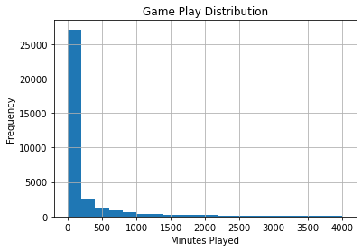


Notice that the vast majority of the games are rarely ever played, however, it is skewed to the right with a lot of outliers.
We can change the scale to make it easier to view using the range parameter.


```python
ax = games_df.hist(column='time', bins=20, range=(0, 100))
ax=ax[0][0]
ax.set_title("Game Play Distribution")
ax.set_xlabel("Minutes Played")
ax.set_ylabel("Frequency")
```


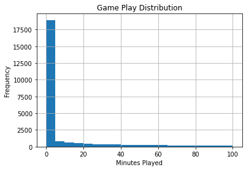


If we remove games that have never been played, the distribution looks more reasonable.


```python
ax = games_df.hist(column='time', bins=20, range=(2, 100))
ax=ax[0][0]
ax.set_title("Game Play Distribution")
ax.set_xlabel("Minutes Played")
ax.set_ylabel("Frequency")
```

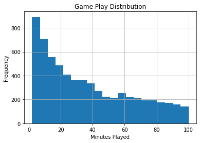


Although histograms are useful, viewing the CDF is often more helpful since it is easier to extract numerical information.


```python
ax = games_df.hist(column='time',density=True, range=(0, 2000),  histtype='step',cumulative=True)
ax=ax[0][0]
ax.set_title("Game Play Distribution")
ax.set_xlabel("Minutes Played")
ax.set_ylabel("Frequency")
```

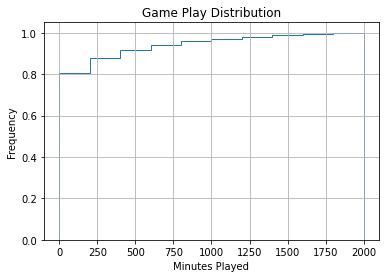


According to this graph, about 80% of people on steam who own a game, play it under 4 hours. Nearly half of all downloaded or purchased steam games go un-played. This data is a neat example of the legendary 80/20 principle -- aka the Pareto principle. The Pareto principle states that roughly 80% of the effects come from 20% of the causes. IE: 20% of software bugs result in 80% of debugging time.

As mentioned earlier, the time in owned game distribution is heavily skewed to the right.


```python
ax = plt.gca()
ax.set_title('Game Play Distribution')
ax.boxplot(games_df['time'], vert=False,manage_ticks=False, notch=True)
plt.xlabel("Game Play in Minutes")
ax.set_yticks([])
plt.show()
```


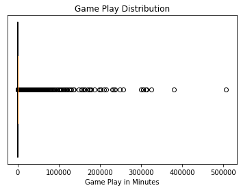


When zooming in on the distribution, we see that nearly half of all the purchased games go un-opened.

```python
ax = plt.gca()
ax.set_title('Game Play Distribution')
ax.boxplot(games_df['time']/60, vert=False,manage_ticks=False, notch=True)
plt.xlabel("Game Play in Hours")
ax.set_yticks([])
ax.set_xlim([0, 10])
plt.show()
```


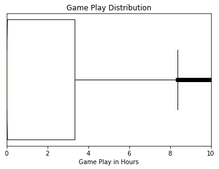


Viewing the aggregate pool of hours in particular game data is insightful; however, comparing different games against each other is more interesting.
In pandas, after we create a grouping on a column, we can aggregate it into metrics such as max, min, mean, etc.
I am also sorting the data I get by count since we are more interested in "popular" games.


```python
stats_df = (games_df.groupby("gamename")
                    .agg({'time': ['count', "min", 'max', 'mean']})
                    .sort_values(by=('time', 'count')))
stats_df
```

<div>
<style scoped>
    .dataframe tbody tr th:only-of-type {
        vertical-align: middle;
    }

    .dataframe tbody tr th {
        vertical-align: top;
    }

    .dataframe thead tr th {
        text-align: left;
    }

    .dataframe thead tr:last-of-type th {
        text-align: right;
    }
</style>
<table border="1" class="dataframe">
  <thead>
    <tr>
      <th></th>
      <th colspan="4" halign="left">time</th>
    </tr>
    <tr>
      <th></th>
      <th>count</th>
      <th>min</th>
      <th>max</th>
      <th>mean</th>
    </tr>
    <tr>
      <th>gamename</th>
      <th></th>
      <th></th>
      <th></th>
      <th></th>
    </tr>
  </thead>
  <tbody>
    <tr>
      <th>龙魂时刻</th>
      <td>1</td>
      <td>14</td>
      <td>14</td>
      <td>14.000000</td>
    </tr>
    <tr>
      <th>gryphon knight epic</th>
      <td>1</td>
      <td>0</td>
      <td>0</td>
      <td>0.000000</td>
    </tr>
    <tr>
      <th>growing pains</th>
      <td>1</td>
      <td>0</td>
      <td>0</td>
      <td>0.000000</td>
    </tr>
    <tr>
      <th>shoppy mart: steam edition</th>
      <td>1</td>
      <td>0</td>
      <td>0</td>
      <td>0.000000</td>
    </tr>
    <tr>
      <th>ground pounders</th>
      <td>1</td>
      <td>0</td>
      <td>0</td>
      <td>0.000000</td>
    </tr>
    <tr>
      <th>...</th>
      <td>...</td>
      <td>...</td>
      <td>...</td>
      <td>...</td>
    </tr>
    <tr>
      <th>payday 2</th>
      <td>102</td>
      <td>0</td>
      <td>84023</td>
      <td>5115.813725</td>
    </tr>
    <tr>
      <th>team fortress 2</th>
      <td>105</td>
      <td>7</td>
      <td>304090</td>
      <td>25291.180952</td>
    </tr>
    <tr>
      <th>unturned</th>
      <td>107</td>
      <td>0</td>
      <td>16974</td>
      <td>1339.757009</td>
    </tr>
    <tr>
      <th>garry's mod</th>
      <td>121</td>
      <td>0</td>
      <td>311103</td>
      <td>20890.314050</td>
    </tr>
    <tr>
      <th>counter-strike: global offensive</th>
      <td>129</td>
      <td>0</td>
      <td>506638</td>
      <td>46356.209302</td>
    </tr>
  </tbody>
</table>
<p>9235 rows × 4 columns</p>
</div>


To prevent one-off esoteric games that I don't have a lot of data for, throwing off metrics, I am disregarding any games that I have less than ten values for. 


```python
stats_df = stats_df[stats_df[('time', 'count')] > 10]
stats_df
```


<div>
<style scoped>
    .dataframe tbody tr th:only-of-type {
        vertical-align: middle;
    }

    .dataframe tbody tr th {
        vertical-align: top;
    }

    .dataframe thead tr th {
        text-align: left;
    }

    .dataframe thead tr:last-of-type th {
        text-align: right;
    }
</style>
<table border="1" class="dataframe">
  <thead>
    <tr>
      <th></th>
      <th colspan="4" halign="left">time</th>
    </tr>
    <tr>
      <th></th>
      <th>count</th>
      <th>min</th>
      <th>max</th>
      <th>mean</th>
    </tr>
    <tr>
      <th>gamename</th>
      <th></th>
      <th></th>
      <th></th>
      <th></th>
    </tr>
  </thead>
  <tbody>
    <tr>
      <th>serious sam hd: the second encounter</th>
      <td>11</td>
      <td>0</td>
      <td>329</td>
      <td>57.909091</td>
    </tr>
    <tr>
      <th>grim fandango remastered</th>
      <td>11</td>
      <td>0</td>
      <td>248</td>
      <td>35.000000</td>
    </tr>
    <tr>
      <th>evga precision x1</th>
      <td>11</td>
      <td>0</td>
      <td>21766</td>
      <td>2498.181818</td>
    </tr>
    <tr>
      <th>f.e.a.r. 2: project origin</th>
      <td>11</td>
      <td>0</td>
      <td>292</td>
      <td>43.272727</td>
    </tr>
    <tr>
      <th>transistor</th>
      <td>11</td>
      <td>0</td>
      <td>972</td>
      <td>298.727273</td>
    </tr>
    <tr>
      <th>...</th>
      <td>...</td>
      <td>...</td>
      <td>...</td>
      <td>...</td>
    </tr>
    <tr>
      <th>payday 2</th>
      <td>102</td>
      <td>0</td>
      <td>84023</td>
      <td>5115.813725</td>
    </tr>
    <tr>
      <th>team fortress 2</th>
      <td>105</td>
      <td>7</td>
      <td>304090</td>
      <td>25291.180952</td>
    </tr>
    <tr>
      <th>unturned</th>
      <td>107</td>
      <td>0</td>
      <td>16974</td>
      <td>1339.757009</td>
    </tr>
    <tr>
      <th>garry's mod</th>
      <td>121</td>
      <td>0</td>
      <td>311103</td>
      <td>20890.314050</td>
    </tr>
    <tr>
      <th>counter-strike: global offensive</th>
      <td>129</td>
      <td>0</td>
      <td>506638</td>
      <td>46356.209302</td>
    </tr>
  </tbody>
</table>
<p>701 rows × 4 columns</p>
</div>


We see that the average, the playtime per player per game, is about 5 hours. However, as noted before, most purchased games go un-played. 


```python
ax = plt.gca()
ax.set_title('Game Play Distribution')
ax.boxplot(stats_df[('time', 'mean')]/60, vert=False,manage_ticks=False, notch=True)
plt.xlabel("Mean Game Play in Hours")
ax.set_xlim([0, 40])
ax.set_yticks([])
plt.show()
```


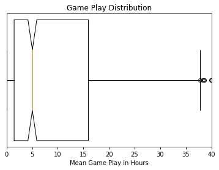


I had a hunch that more popular games got played more; however,  this dataset is still too small the verify this hunch.

```python
stats_df.plot.scatter(x=('time', 'count'), y=('time', 'mean'))
```

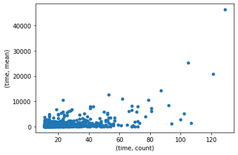

```python
We can create a new filtered data frame that only contains the result of a single game to graph it. 
```


```python
cc_df = games_df[games_df['gamename'] == "counter-strike: global offensive"]
cc_df
```

<div>
<style scoped>
    .dataframe tbody tr th:only-of-type {
        vertical-align: middle;
    }

    .dataframe tbody tr th {
        vertical-align: top;
    }

    .dataframe thead th {
        text-align: right;
    }
</style>
<table border="1" class="dataframe">
  <thead>
    <tr style="text-align: right;">
      <th></th>
      <th>gameid</th>
      <th>time</th>
      <th>gamename</th>
    </tr>
  </thead>
  <tbody>
    <tr>
      <th>13196</th>
      <td>730</td>
      <td>742</td>
      <td>counter-strike: global offensive</td>
    </tr>
    <tr>
      <th>13197</th>
      <td>730</td>
      <td>16019</td>
      <td>counter-strike: global offensive</td>
    </tr>
    <tr>
      <th>13198</th>
      <td>730</td>
      <td>1781</td>
      <td>counter-strike: global offensive</td>
    </tr>
    <tr>
      <th>13199</th>
      <td>730</td>
      <td>0</td>
      <td>counter-strike: global offensive</td>
    </tr>
    <tr>
      <th>13200</th>
      <td>730</td>
      <td>0</td>
      <td>counter-strike: global offensive</td>
    </tr>
    <tr>
      <th>...</th>
      <td>...</td>
      <td>...</td>
      <td>...</td>
    </tr>
    <tr>
      <th>13320</th>
      <td>730</td>
      <td>3867</td>
      <td>counter-strike: global offensive</td>
    </tr>
    <tr>
      <th>13321</th>
      <td>730</td>
      <td>174176</td>
      <td>counter-strike: global offensive</td>
    </tr>
    <tr>
      <th>13322</th>
      <td>730</td>
      <td>186988</td>
      <td>counter-strike: global offensive</td>
    </tr>
    <tr>
      <th>13323</th>
      <td>730</td>
      <td>103341</td>
      <td>counter-strike: global offensive</td>
    </tr>
    <tr>
      <th>13324</th>
      <td>730</td>
      <td>10483</td>
      <td>counter-strike: global offensive</td>
    </tr>
  </tbody>
</table>
<p>129 rows × 3 columns</p>
</div>


It is shocking how many hours certain people play in Counter-Strike. The highest number in the dataset was 8,444 hours or 352 days! 

```python
ax = plt.gca()
ax.set_title('Game Play Distribution for Counter-Strike')
ax.boxplot(cc_df['time']/60, vert=False,manage_ticks=False, notch=True)
plt.xlabel("Game Play in Hours")
ax.set_yticks([])
plt.show()
```

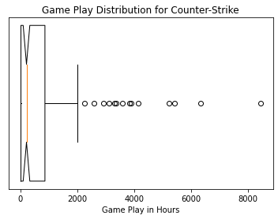


Viewing the distribution for a different game like Unturned, yields a vastly different distribution than Counter-Strike. I believe the key difference is that Counter-Strike gets played competitively, where Unturned is a more leisurely game. Competitive gamers likely skew the distribution of Counter-Strike to be very high. 

```python
u_df = games_df[games_df['gamename'] == "unturned"]
u_df
```

<div>
<style scoped>
    .dataframe tbody tr th:only-of-type {
        vertical-align: middle;
    }

    .dataframe tbody tr th {
        vertical-align: top;
    }

    .dataframe thead th {
        text-align: right;
    }
</style>
<table border="1" class="dataframe">
  <thead>
    <tr style="text-align: right;">
      <th></th>
      <th>gameid</th>
      <th>time</th>
      <th>gamename</th>
    </tr>
  </thead>
  <tbody>
    <tr>
      <th>167</th>
      <td>304930</td>
      <td>140</td>
      <td>unturned</td>
    </tr>
    <tr>
      <th>168</th>
      <td>304930</td>
      <td>723</td>
      <td>unturned</td>
    </tr>
    <tr>
      <th>169</th>
      <td>304930</td>
      <td>1002</td>
      <td>unturned</td>
    </tr>
    <tr>
      <th>170</th>
      <td>304930</td>
      <td>1002</td>
      <td>unturned</td>
    </tr>
    <tr>
      <th>171</th>
      <td>304930</td>
      <td>0</td>
      <td>unturned</td>
    </tr>
    <tr>
      <th>...</th>
      <td>...</td>
      <td>...</td>
      <td>...</td>
    </tr>
    <tr>
      <th>269</th>
      <td>304930</td>
      <td>97</td>
      <td>unturned</td>
    </tr>
    <tr>
      <th>270</th>
      <td>304930</td>
      <td>768</td>
      <td>unturned</td>
    </tr>
    <tr>
      <th>271</th>
      <td>304930</td>
      <td>1570</td>
      <td>unturned</td>
    </tr>
    <tr>
      <th>272</th>
      <td>304930</td>
      <td>23</td>
      <td>unturned</td>
    </tr>
    <tr>
      <th>273</th>
      <td>304930</td>
      <td>115</td>
      <td>unturned</td>
    </tr>
  </tbody>
</table>
<p>107 rows × 3 columns</p>
</div>


```python
ax = plt.gca()
ax.set_title('Game Play Distribution for Unturned')
ax.boxplot(u_df['time']/60, vert=False,manage_ticks=False, notch=True)
plt.xlabel("Game Play in Hours")
ax.set_yticks([])
plt.show()
```

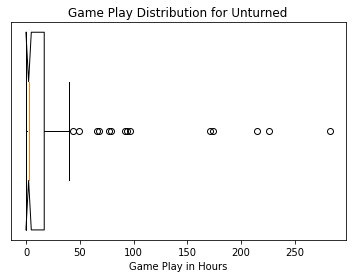


Next, I made a data frame just containing the raw data points of games that had an aggregate count of over 80. For the crawl sample size that I did, having a count of 80 would make the game "popular." Since we only have 485 players indexed, having over 80 entries implies that over 17% of people indexed had the game. It is easy to verify that the games returned were very popular by glancing at the results.


```python
df1 = games_df[games_df['gamename'].map(games_df['gamename'].value_counts()) > 80]
df1['time'] = df1['time']/60
df1
```

<div>
<style scoped>
    .dataframe tbody tr th:only-of-type {
        vertical-align: middle;
    }

    .dataframe tbody tr th {
        vertical-align: top;
    }

    .dataframe thead th {
        text-align: right;
    }
</style>
<table border="1" class="dataframe">
  <thead>
    <tr style="text-align: right;">
      <th></th>
      <th>gameid</th>
      <th>time</th>
      <th>gamename</th>
    </tr>
  </thead>
  <tbody>
    <tr>
      <th>167</th>
      <td>304930</td>
      <td>2.333333</td>
      <td>unturned</td>
    </tr>
    <tr>
      <th>168</th>
      <td>304930</td>
      <td>12.050000</td>
      <td>unturned</td>
    </tr>
    <tr>
      <th>169</th>
      <td>304930</td>
      <td>16.700000</td>
      <td>unturned</td>
    </tr>
    <tr>
      <th>170</th>
      <td>304930</td>
      <td>16.700000</td>
      <td>unturned</td>
    </tr>
    <tr>
      <th>171</th>
      <td>304930</td>
      <td>0.000000</td>
      <td>unturned</td>
    </tr>
    <tr>
      <th>...</th>
      <td>...</td>
      <td>...</td>
      <td>...</td>
    </tr>
    <tr>
      <th>22682</th>
      <td>578080</td>
      <td>51.883333</td>
      <td>playerunknown's battlegrounds</td>
    </tr>
    <tr>
      <th>22683</th>
      <td>578080</td>
      <td>47.616667</td>
      <td>playerunknown's battlegrounds</td>
    </tr>
    <tr>
      <th>22684</th>
      <td>578080</td>
      <td>30.650000</td>
      <td>playerunknown's battlegrounds</td>
    </tr>
    <tr>
      <th>22685</th>
      <td>578080</td>
      <td>170.083333</td>
      <td>playerunknown's battlegrounds</td>
    </tr>
    <tr>
      <th>22686</th>
      <td>578080</td>
      <td>399.950000</td>
      <td>playerunknown's battlegrounds</td>
    </tr>
  </tbody>
</table>
<p>1099 rows × 3 columns</p>
</div>


```python
ax = df1.boxplot(column=["time"], by='gamename', notch=True, vert=False)
fig = ax.get_figure()
fig.suptitle('')
ax.set_title('Play-time Distribution')
plt.xlabel("Hours Played")
ax.set_xlim([0, 2000])
plt.ylabel("Game")
plt.savefig("playTimes.png", dpi=300, bbox_inches = "tight")
```

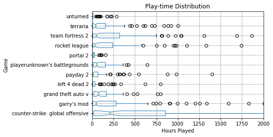

Overall it is fascinating to see how the distributions for different games vary. In the future, I will re-run some of these analytics with even more data and possibly put them on my website as an interactive graph.
