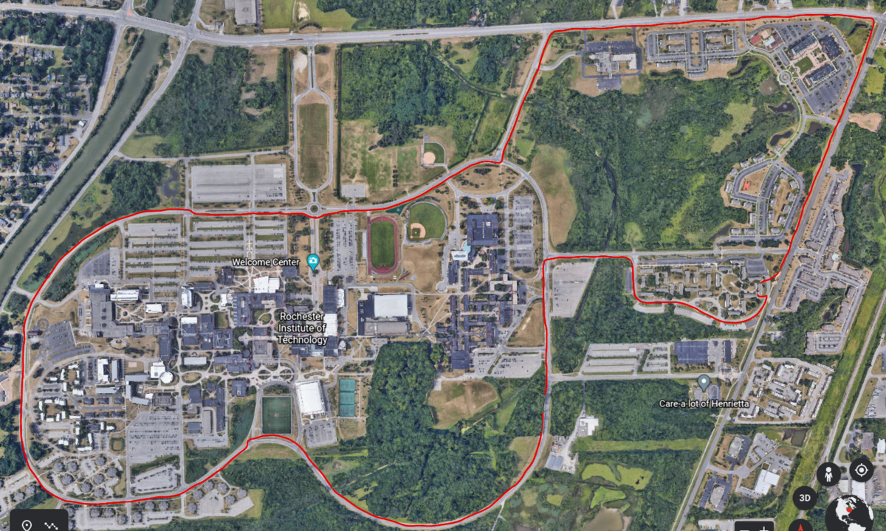
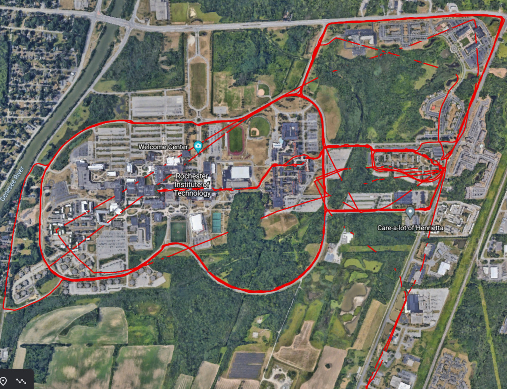

This post looks at how you can aggregate and visualize Fitbit GPS data since there is no built-in functionality to do this on the Fitbit website.
Before you read this post, check out my two other posts on using Fitbit data:

- [A Closer Look at Fitbit Data](https://jrtechs.net/data-science/a-closer-look-at-fitbit-data)
- [Graphing my Life with Matplotlib](https://jrtechs.net/data-science/graphing-my-life-with-matplotlib)


# Getting the Data

There are two options that we can use to fetch data from Fitbit:

- Fitbit's Data Export Tool
- Fitbit's API

## Exporting from the Website

The easiest way to export data from Fitbit is to use the data export tool on the website.


The Fitbit data archive is very organized and has all information relating to your account.
The data is organized in separate JSON files labeled by date. Fitbit keeps around 1MB of data on you per day; most of this data is from the heart rate sensors.
Although 1MB of data may sound like a ton of data, it is probably a lot less if you store it in a more compact format than JSON.

The problem with the data export is that it can take a while to export and that it doesn't include the GPS data in [TCX](https://en.wikipedia.org/wiki/Training_Center_XML) format.
In the exercise.json files, we can view all activities with logged GPS data, but the data archives themselves don't include the TCX data-- only a link to it on the website.

```json
},{
  "logId" : 384529004,
  "activityName" : "Run",
  "activityTypeId" : 90009,
  "activityLevel" : [{
    "minutes" : 0,
    "name" : "sedentary"
  },{
    "minutes" : 0,
    "name" : "lightly"
  },{
    "minutes" : 0,
    "name" : "fairly"
  },{
    "minutes" : 17,
    "name" : "very"
  }],
  "calories" : 184,
  "distance" : 1.872894,
  "distanceUnit" : "Mile",
  "duration" : 1077000,
  "activeDuration" : 1077000,
  "steps" : 2605,
  "source" : {
    "type" : "app",
    "name" : "Fitbit for Android",
    "id" : "228VSR",
    "url" : "https://www.fitbit.com/android",
    "trackerFeatures" : ["GPS","STEPS","CALORIES","PACE","DISTANCE"]
  },
  "logType" : "mobile_run",
  "manualValuesSpecified" : {
    "calories" : false,
    "distance" : false,
    "steps" : false
  },
  "tcxLink" : "https://www.fitbit.com/activities/exercise/384529004?export=tcx",
  "speed" : 6.26036991643454,
  "pace" : 575.0458915453837,
  "lastModified" : "03/22/21 21:22:03",
  "startTime" : "03/22/21 21:04:02",
  "originalStartTime" : "03/22/21 21:04:02",
  "originalDuration" : 1077000,
  "hasGps" : true,
  "shouldFetchDetails" : true,
  "hasActiveZoneMinutes" : false
},{
```

## API

Since the data export doesn't include the TCX data we desire, we need to use the Fitbit API.
First, you need to register a Fitbit [developer account](https://dev.fitbit.com/apps) and then register an app.
For the redirect URL, put "http://localhost:9000/auth/fitbit/callback".
To authenticate with the application, you will need to OAuth 2 client ID and the client secret.

Check out my first post on Fitbit to learn more about how to set up an [applicatoin with Fitbit](https://jrtechs.net/data-science/a-closer-look-at-fitbit-data), and check out the code for this project on my [Github](https://github.com/jrtechs/HomePage).


# Downloading All GPS Logs

Within the Fitbit API, there is no place to download all of your activities -- since that would return a lot of data.
Instead, Fitbit allows you to download a maximum of 100 events from a time, and you can specify a start and end range for your query.


```javascript
function fetchActivities(result, startTime)
{
    return new Promise((resolve, reject)=>
    {
        queryAPI(result, 'https://api.fitbit.com/1/user/-/activities/list.json?beforeDate=' + startTime + '&sort=desc&offset=0&limit=100').then((data)=>
        {
            if(data != false)
            {
                resolve(data.activities);
            }
            reject("Error with API, are you authenticated")
        });
    });
}
```

I wrote a helper function to fetch all the "mobile_runs" events recursively.
In my case, since I have the Fitbit Altra, so the only way for me to get GPS data is to tether my Fitbit to my phone and log the start/end.
With the Fitbits that have built-in GPS, other events have GPS TCX data associated with them.


```javascript
function fetchAllRuns(result, startTime)
{
    var runs = [];
    console.log(startTime);
    return new Promise((resolve, reject)=>
    {
        fetchActivities(result, startTime).then((events)=>
        {
            if(events.length < 10)
            {
                resolve(runs);
            }
            else
            {
                for(var i = 0; i < events.length; i++)
                {
                    if(events[i].logType === "mobile_run")
                    {
                        console.log(events[i]);
                        runs.push(events[i]);
                    }
                }
                var newStart = events[events.length -1].startTime.slice(0, -10);
                fetchAllRuns(result, newStart).then((run_rec)=>
                {
                    resolve(runs.concat(run_rec));
                }).catch((err)=>
                {
                    reject(err);
                });
            }
        }).catch((error)=>
        {
            reject(error);
        });
    });
}
```

After we have a list of our TCX data, we can simply write it to disk for later use.

```javascript
function saveTCX(result, tcxID)
{
    return new Promise((resolve, reject)=>
    {
        fetchTCX(result, tcxID).then((tcx)=>
        {
            utils.saveFile(tcxID + ".tcx", tcx);
            resolve();
        }).catch((err)=>
        {
            reject(err);
        })
    });
}
```

I have this process invoked via an endpoint call to enable me to use Fitbit's OAuth2 authentication.

```javascript
app.get('/save-all-tcx', (request, result)=>
{
    var tcxID = request.params.id;

    var startTime = '2030-06-01T00:00:00';

    fetchAllRuns(result, startTime).then((data)=>
    {
        var promises = [];
        for(var i =0; i < data.length; i++)
        {
            promises.push(saveTCX(result, data[i].logId));
        }
        Promise.all(promises).then(function(content)
        {
            result.write("All events saved");
            result.end();
        }).catch(function(err)
        {
            console.log(err);
            throw err;
        });
    }).catch((error)=>
    {
        console.log(error);
        result.writeHead(500, {'Content-Type': 'text/json'});
        result.end();
    });
});
```


# Visualizing GPS Data as KML

Now that we have all of our TCX data saved, we can parse the data to aggregate it into a single file.
TCX data is simply XML data that is easy to parse with several different packages.
In my case, I am [Beautiful Soup](https://www.crummy.com/software/BeautifulSoup/bs4/doc/) in Python to parse the XML.


```xml
<?xml version="1.0" encoding="UTF-8" standalone="yes"?>
<TrainingCenterDatabase xmlns="http://www.garmin.com/xmlschemas/TrainingCenterDatabase/v2">
    <Activities>
        <Activity Sport="Running">
            <Id>2019-09-03T16:52:50.000-04:00</Id>
            <Lap StartTime="2019-09-03T16:52:50.000-04:00">
                <TotalTimeSeconds>1313.0</TotalTimeSeconds>
                <DistanceMeters>4618.291573209821</DistanceMeters>
                <Calories>265</Calories>
                <Intensity>Active</Intensity>
                <TriggerMethod>Manual</TriggerMethod>
                <Track>
                    <Trackpoint>
                        <Time>2019-09-03T16:52:50.000-04:00</Time>
                        <Position>
                            <LatitudeDegrees>43.0</LatitudeDegrees>
                            <LongitudeDegrees>-77.6</LongitudeDegrees>
                        </Position>
                        <AltitudeMeters>123.4</AltitudeMeters>
                        <DistanceMeters>0.0</DistanceMeters>
                    </Trackpoint>
                    <Trackpoint>
                        <Time>2019-09-03T16:52:51.000-04:00</Time>
                        <Position>
                            <LatitudeDegrees>43.0</LatitudeDegrees>
                            <LongitudeDegrees>-77.6</LongitudeDegrees>
                        </Position>
                        <AltitudeMeters>123.4</AltitudeMeters>
                        <DistanceMeters>0.28944606511402504</DistanceMeters>
                    </Trackpoint>
```

A quick note on the data that I am showing: it is all out of date, and I no longer live in these neighborhoods. 
Additionally, for the TCX example, I truncated the longitude/latitude results, but, from Fitbit, the TSV data has fifteen decimal places.


Using Beautiful Soup, it is straightforward to open a TCX file and get all the longitude/latitude values.


```Python
from bs4 import BeautifulSoup

import glob
import os.path

def parseTCX(filename):
    file = open(filename)
    xml_file = file.read()
    soup = BeautifulSoup(xml_file, 'lxml')
    id = soup.find("id").text # gets the UTC timestamp
    lats = []
    longs = []
    for tag in soup.find_all("trackpoint"):
        lats.append(tag.find("latitudedegrees").text)
        longs.append(tag.find("longitudedegrees").text)
    return id[:-10], lats, longs
```


I am converting all the TCX files into a single [KML](https://en.wikipedia.org/wiki/Keyhole_Markup_Language) file to make it possible for me to visualize with various GEO tools.


```python
def single_run(id, lats, longs):
    locString = ""
    for i in range(0, len(lats)):
        locString += longs[i] + "," + lats[i] + " "
    value = """
    <Placemark>
        <name>{0}</name>
        <description>xx Miles</description>
        <Style>
          <LineStyle>
            <color>ff0000e6</color>
            <width>4</width>
          </LineStyle>
        </Style>
        <LineString>
          <tessellate>1</tessellate>
          <altitudeMode>clampToGround</altitudeMode>
          <coordinates>{1}</coordinates>
        </LineString>
    </Placemark>
    """
    return value.format(id, locString)

def convertToKML():
    base_path = os.path.dirname(os.path.realpath(__file__))
    files = glob.glob(base_path + "/tcx/*.tcx")

    header = """<?xml version="1.0" encoding="utf-8" standalone="yes"?>
<kml xmlns="http://www.opengis.net/kml/2.2">
  <Document>
    <name><![CDATA[38415617200]]></name>
    <visibility>1</visibility>
    <open>1</open>
    <Folder id="Runs">
      <name>Tracks</name>
      <visibility>1</visibility>
      <open>0</open>
    """
    footer = """
        </Folder>
  </Document>
</kml>
    """

    o_file = open("outputKML.kml", "w")

    o_file.write(header)

    for file in files:
        id, lats, longs = parseTCX(file)
        o_file.write(single_run(id, lats, longs))
    print(files)

    o_file.write(footer)
    o_file.close()
```

Now that we have a single KML file with all of our running data coordinates, we can visualize it with google maps -- or any number of other KML tools.
This visualization is nifty since it lets you see every place that you have run.



As accurate as GPS may appear on our phones, we can start to see inaccuracies in our data when looking at the aggregate plot.
For example, occasionally, the GPS will drop and result in a plot that has "random teleportation."



Additionally, GPS on our phones is not pinpoint accurate.
By interpolating the data as we go, each track individually appears smooth. However, the overall route is not all that accurate.
In the following image, we see that although I stay strictly to the sidewalk and make a sharp turn, it puts me all over the road and in the yard.


# Future Work for Project

In the future, I want to transfer more metadata from the TCV files and include it in the KML files like total distance, average speed, mile markers. 
Additionally, visualizing this on a website that auto-pulls new TCX data and updates an embedded map would be interesting.

The end goal is to do clustering on my TCX data to identify unique running routes that I have taken so that I can either plan new running routes or select a course that is the desired length.