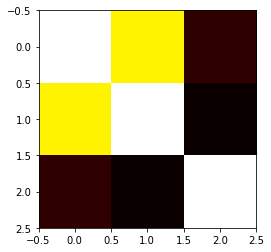
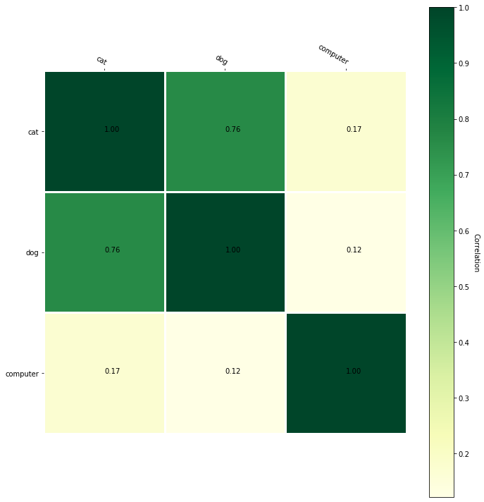
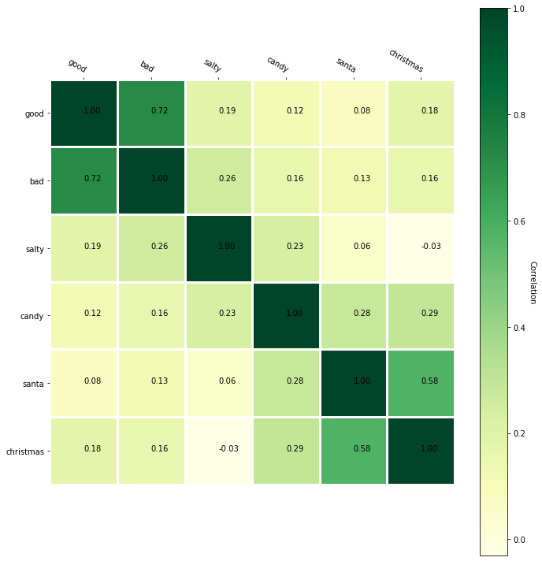
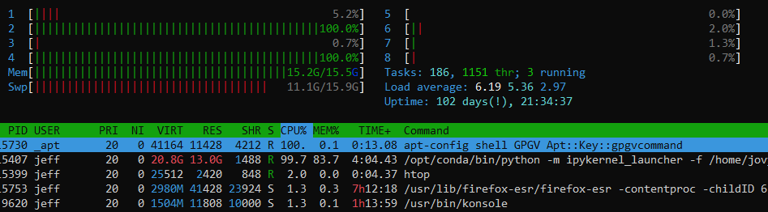

Word embeddings have stolen all my attention the last week.
At a very high level, embeddings allow you to reduce the dimensionality something into a smaller vector that conveys positional meaning in that latent space. When considering something like a word, this is very useful because it enables you to use the vectorized version of the word in a secondary model. Since words that have similar meanings group together, it makes training faster. Computerphile has a fantastic video of this on Youtube. 

<youtube src="gQddtTdmG_8" />

Google has open-sourced its tool for word embeddings called [word2vec](https://code.google.com/archive/p/word2vec/). Google also made their model trained on 100 billion words publicly [available](https://drive.google.com/file/d/0B7XkCwpI5KDYNlNUTTlSS21pQmM/edit?usp=sharing). Note: unzipped the model is about 3 GB. 


Using [Gensim](https://radimrehurek.com/gensim/) (a Python text data science library), we can load google's pre-trained model.

```python
import gensim
model = gensim.models.KeyedVectors.load_word2vec_format('./GoogleNews-vectors-negative300.bin', binary=True) 
```

One of the coolest things that you can do with vectorized words is query for words that are similar to a word that you provided. Gensim provides a straightforward function that gives you the ten most similar words, along with similarity scores.


```python
model.most_similar("hello")
output:
    [('hi', 0.654898464679718),
     ('goodbye', 0.639905571937561),
     ('howdy', 0.6310957074165344),
     ('goodnight', 0.5920578241348267),
     ('greeting', 0.5855878591537476),
     ('Hello', 0.5842196941375732),
     ("g'day", 0.5754077434539795),
     ('See_ya', 0.5688871145248413),
     ('ya_doin', 0.5643119812011719),
     ('greet', 0.5636603832244873)]
```


```python
model.most_similar("cat")
output:
    [('cats', 0.8099379539489746),
     ('dog', 0.7609456777572632),
     ('kitten', 0.7464985251426697),
     ('feline', 0.7326233983039856),
     ('beagle', 0.7150583267211914),
     ('puppy', 0.7075453996658325),
     ('pup', 0.6934291124343872),
     ('pet', 0.6891531348228455),
     ('felines', 0.6755931377410889),
     ('chihuahua', 0.6709762215614319)]
```

Using genism's similar score method, we can write an elementary function that would transform a sentence into a new sentence using similar words.


```python
def transformSentence(sentence):
    outputSentence = ""
    
    for word in sentence.split(" "):
        try:
            outputSentence += model.most_similar(word)[0][0] + " "
        except Exception:
            outputSentence += word + " "
    return outputSentence

print(transformSentence("hello world"))
output:
    hi globe 
```

```python
print(transformSentence("look mom no hands"))
output:
    looks Mom No hand 
```

```python
print(transformSentence("The general idea of clustering is to group data with similar traits"))

    This gen_eral concept of Clustering was to groups Data wtih similiar trait 
```

Under elementary examples like "hello world," it did ok and transformed it into "hi globe." However, with more complex examples, it falls apart because it puts in non-sensical words or doesn't match verbs and nouns. It is common for this algorithm to cluster the plural of the noun very close to the singular of the noun. I.e., "cats" is conceptually similar to "cat."


We can write a quick heuristic to try to filter these things out.

```python
def removeFromString(string, chars):
    for c in chars:
        string = string.replace(c, "")
    return string


def transformSentenceWithHeuristic(sentence):
    outputSentence = ""
    
    for word in sentence.split(" "):
        try:
            changed = False
            for w, _ in model.most_similar(word):
                clean = removeFromString(w, [' ', '_']).lower()
                if clean not in word.lower() and "_" not in w:
                    outputSentence += w + " "
                    changed = True
                    break
            outputSentence = outputSentence if changed else outputSentence + word + " "
        except Exception:
            outputSentence += word + " "
    return outputSentence
print(transformSentenceWithHeuristic("The general idea of clustering is to group data with similar traits."))
Output:
    This manager concept of clusters was to groups datasets wtih similiar traits. 
```

```python
print(transformSentenceWithHeuristic("Sit down and grab a drink because it is time that we talk about the LSD trip that is the 1981 movie Shock Treatment."))

    Relax up and grabbing a drinks but that was day it I talking abut this hallucinogenic trips it was this 1981 film Fever Treatment. 
```

The output is not total garbage, but it isn't great. However, it is not nearly as bad as a GAN after it started training on character data alone. Most people end up using this vectorized version to feed it into a secondary learning algorithm rather than use it directly.


To access the vector associated with each word, you can access it on the main model object like a normal Python map. The result is a length 300 vector with a set of numbers representing the "meaning" of the word.

```python
print(model["cat"].shape)
print(model["cat"])

    (300,)
    [ 0.0123291   0.20410156 -0.28515625  0.21679688  0.11816406  0.08300781
      0.04980469 -0.00952148  0.22070312 -0.12597656  0.08056641 -0.5859375
     -0.00445557 -0.296875   -0.01312256 -0.08349609  0.05053711  0.15136719
     -0.44921875 -0.0135498   0.21484375 -0.14746094  0.22460938 -0.125
     -0.09716797  0.24902344 -0.2890625   0.36523438  0.41210938 -0.0859375
     -0.07861328 -0.19726562 -0.09082031 -0.14160156 -0.10253906  0.13085938
     -0.00346375  0.07226562  0.04418945  0.34570312  0.07470703 -0.11230469
      0.06738281  0.11230469  0.01977539 -0.12353516  0.20996094 -0.07226562
     -0.02783203  0.05541992 -0.33398438  0.08544922  0.34375     0.13964844
      0.04931641 -0.13476562  0.16308594 -0.37304688  0.39648438  0.10693359
      0.22167969  0.21289062 -0.08984375  0.20703125  0.08935547 -0.08251953
      0.05957031  0.10205078 -0.19238281 -0.09082031  0.4921875   0.03955078
     -0.07080078 -0.0019989  -0.23046875  0.25585938  0.08984375 -0.10644531
      0.00105286 -0.05883789  0.05102539 -0.0291748   0.19335938 -0.14160156
     -0.33398438  0.08154297 -0.27539062  0.10058594 -0.10449219 -0.12353516
     -0.140625    0.03491211 -0.11767578 -0.1796875  -0.21484375 -0.23828125
      0.08447266 -0.07519531 -0.25976562 -0.21289062 -0.22363281 -0.09716797
      0.11572266  0.15429688  0.07373047 -0.27539062  0.14257812 -0.0201416
      0.10009766 -0.19042969 -0.09375     0.14160156  0.17089844  0.3125
     -0.16699219 -0.08691406 -0.05004883 -0.24902344 -0.20800781 -0.09423828
     -0.12255859 -0.09472656 -0.390625   -0.06640625 -0.31640625  0.10986328
     -0.00156403  0.04345703  0.15625    -0.18945312 -0.03491211  0.03393555
     -0.14453125  0.01611328 -0.14160156 -0.02392578  0.01501465  0.07568359
      0.10742188  0.12695312  0.10693359 -0.01184082 -0.24023438  0.0291748
      0.16210938  0.19921875 -0.28125     0.16699219 -0.11621094 -0.25585938
      0.38671875 -0.06640625 -0.4609375  -0.06176758 -0.14453125 -0.11621094
      0.05688477  0.03588867 -0.10693359  0.18847656 -0.16699219 -0.01794434
      0.10986328 -0.12353516 -0.16308594 -0.14453125  0.12890625  0.11523438
      0.13671875  0.05688477 -0.08105469 -0.06152344 -0.06689453  0.27929688
     -0.19628906  0.07226562  0.12304688 -0.20996094 -0.22070312  0.21386719
     -0.1484375  -0.05932617  0.05224609  0.06445312 -0.02636719  0.13183594
      0.19433594  0.27148438  0.18652344  0.140625    0.06542969 -0.14453125
      0.05029297  0.08837891  0.12255859  0.26757812  0.0534668  -0.32226562
     -0.20703125  0.18164062  0.04418945 -0.22167969 -0.13769531 -0.04174805
     -0.00286865  0.04077148  0.07275391 -0.08300781  0.08398438 -0.3359375
     -0.40039062  0.01757812 -0.18652344 -0.0480957  -0.19140625  0.10107422
      0.09277344 -0.30664062 -0.19921875 -0.0168457   0.12207031  0.14648438
     -0.12890625 -0.23535156 -0.05371094 -0.06640625  0.06884766 -0.03637695
      0.2109375  -0.06005859  0.19335938  0.05151367 -0.05322266  0.02893066
     -0.27539062  0.08447266  0.328125    0.01818848  0.01495361  0.04711914
      0.37695312 -0.21875    -0.03393555  0.01116943  0.36914062  0.02160645
      0.03466797  0.07275391  0.16015625 -0.16503906 -0.296875    0.15039062
     -0.29101562  0.13964844  0.00448608  0.171875   -0.21972656  0.09326172
     -0.19042969  0.01599121 -0.09228516  0.15722656 -0.14160156 -0.0534668
      0.03613281  0.23632812 -0.15136719 -0.00689697 -0.27148438 -0.07128906
     -0.16503906  0.18457031 -0.08398438  0.18554688  0.11669922  0.02758789
     -0.04760742  0.17871094  0.06542969 -0.03540039  0.22949219  0.02697754
     -0.09765625  0.26953125  0.08349609 -0.13085938 -0.10107422 -0.00738525
      0.07128906  0.14941406 -0.20605469  0.18066406 -0.15820312  0.05932617
      0.28710938 -0.04663086  0.15136719  0.4921875  -0.27539062  0.05615234]
```

## Visualization

One cool thing that the vectorized versions of words enable us to is to visualize similarities between concepts. We can construct a correlation matrix and display it as a heatmap.


```python
import numpy as np

def createCorrelationMatrix(words):
    l = len(words)
    matrix = np.empty((l, l), np.float)
    
    for r in range(0, l):
        for c in range(0, l):
            matrix[r][c] = model.similarity(words[r], words[c])
    return matrix

testMatrix = ["cat", "dog", "computer"]
print(createCorrelationMatrix(testMatrix))


    [[1.         0.76094574 0.17324439]
     [0.76094574 0.99999994 0.12194333]
     [0.17324439 0.12194333 1.        ]]
```


```python
def displayMap(a):
    plt.imshow(a, cmap='hot', interpolation='nearest')
    plt.show()

displayMap(createCorrelationMatrix(testMatrix))
```





Examining this heatmap, we can see that "dog" and "cat" are more similar than "computer"; however, the heatmap isn't the best. We can use matplotlib to jazz up heatmap and make it more exciting. 


```python
from matplotlib import pyplot as plt
import matplotlib.image as mpimg


def displayMap(a):
    plt.imshow(a, cmap='hot', interpolation='nearest')
    plt.show()
    
    
    
def heatmap(data, row_labels, col_labels, ax=None):
    cbar_kw={}
    ax = plt.gca()

    im = ax.imshow(data, cmap="YlGn")

    # Create colorbar
    cbar = ax.figure.colorbar(im, ax=ax, label="Correlation")
    cbar.ax.set_ylabel("Correlation", rotation=-90, va="bottom")

    # We want to show all ticks...
    ax.set_xticks(np.arange(data.shape[1]))
    ax.set_yticks(np.arange(data.shape[0]))
    # ... and label them with the respective list entries.
    ax.set_xticklabels(col_labels)
    ax.set_yticklabels(row_labels)

    # Let the horizontal axes labeling appear on top.
    ax.tick_params(top=True, bottom=False,
                   labeltop=True, labelbottom=False)

    # Rotate the tick labels and set their alignment.
    plt.setp(ax.get_xticklabels(), rotation=-30, ha="right",
             rotation_mode="anchor")

    # Turn spines off and create white grid.
    for edge, spine in ax.spines.items():
        spine.set_visible(False)

    ax.set_xticks(np.arange(data.shape[1]+1)-.5, minor=True)
    ax.set_yticks(np.arange(data.shape[0]+1)-.5, minor=True)
    ax.grid(which="minor", color="w", linestyle='-', linewidth=3)
    ax.tick_params(which="minor", bottom=False, left=False)
    
    return im, cbar


def annotate_heatmap(im, data=None,
                     threshold=None, **textkw):
    valfmt="{x:.2f}"
    textcolors=["black", "white"]
    if not isinstance(data, (list, np.ndarray)):
        data = im.get_array()

    # Normalize the threshold to the images color range.
    if threshold is not None:
        threshold = im.norm(threshold)
    else:
        threshold = im.norm(data.max())/2.

    # Set default alignment to center, but allow it to be
    # overwritten by textkw.
    kw = dict(horizontalalignment="center",
              verticalalignment="center")
    kw.update(textkw)

    # Get the formatter in case a string is supplied
    if isinstance(valfmt, str):
        valfmt = matplotlib.ticker.StrMethodFormatter(valfmt)

    # Loop over the data and create a `Text` for each "pixel".
    # Change the text's color depending on the data.
    texts = []
    for i in range(data.shape[0]):
        for j in range(data.shape[1]):
            kw.update(color=textcolors[int(im.norm(data[i, j]) > threshold)])
            text = im.axes.text(j, i, valfmt(data[i, j], None))
            texts.append(text)

    return texts

def plotWordCorrelations(words):
    fig, ax = plt.subplots(figsize=(10,10))
    
    matrix = createCorrelationMatrix(words)

    im, cbar = heatmap(matrix, words, words, ax=ax)
    
    print(im)
    texts = annotate_heatmap(im, valfmt="{x:.1f} t")

    fig.tight_layout()
    plt.show()
    plt.savefig(str(len(words)) + '.png')
    
    
plotWordCorrelations(["cat", "dog", "computer"])
```





```python
plotWordCorrelations(["good", "bad", "salty", "candy", "santa", "christmas"])
```





The annotated version of the correlation matrix gives us more insight into the similarities of words. Although you might be thinking, "wow Santa and Christmas are related, who would have known!" We already use embedding in more abstract things like people, graphs, books, etc. In these more advanced examples, seeing a correlation of objects would be more insightful. Moreover, these measures of correlation are more useful to machine learning algorithms since they can use it to learn concepts faster.


If we wanted to visualize the entire dataset, that would be infeasible since it is 300 dimensions! On a graph, we usually only plot up to three dimensions. To visualize this model, we need to reduce the dimensionality.
I planned on doing this with t-Distributed Stochastic Neighbor Embedding (t-SNE). T-SNE is a standard method used when trying to visualize high-dimensional data.

```python
from sklearn.decomposition import IncrementalPCA    # inital reduction
from sklearn.manifold import TSNE                   # final reduction
import numpy as np                                  # array handling

def reduce_dimensions(model):
    num_dimensions = 2  # final num dimensions (2D, 3D, etc)

    vectors = [] # positions in vector space
    labels = [] # keep track of words to label our data again later
    for word in model.wv.vocab:
        vectors.append(model.wv[word])
        labels.append(word)

    # convert both lists into numpy vectors for reduction
    vectors = np.asarray(vectors)
    labels = np.asarray(labels)

    # reduce using t-SNE
    vectors = np.asarray(vectors)
    tsne = TSNE(n_components=num_dimensions, random_state=0)
    vectors = tsne.fit_transform(vectors)

    x_vals = [v[0] for v in vectors]
    y_vals = [v[1] for v in vectors]
    return x_vals, y_vals, labels


x_vals, y_vals, labels = reduce_dimensions(model)
```



When I was halfway through training this, my computer ran out of swap space -- space on the HHD the computer uses when out of RAM. In a future blog post, I may create my embedding that is lower in dimensionality and see if I can use this visualization method.