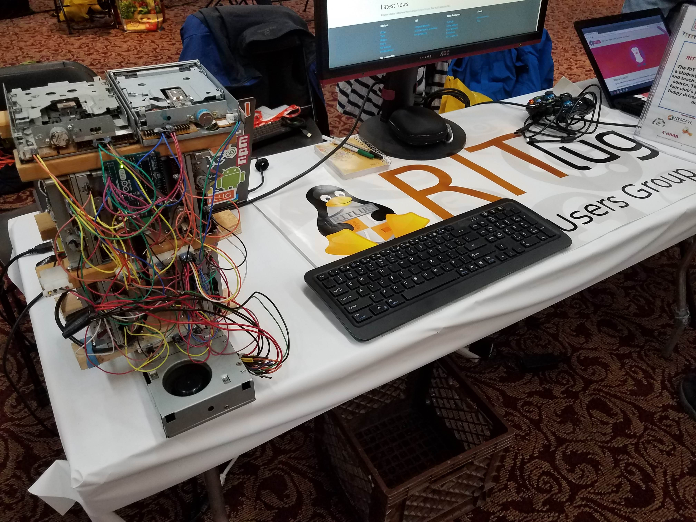
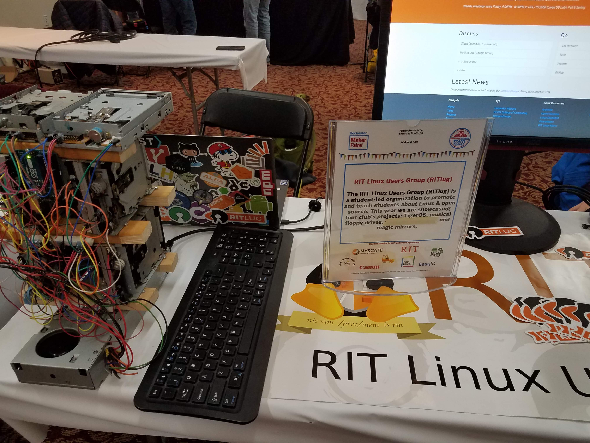
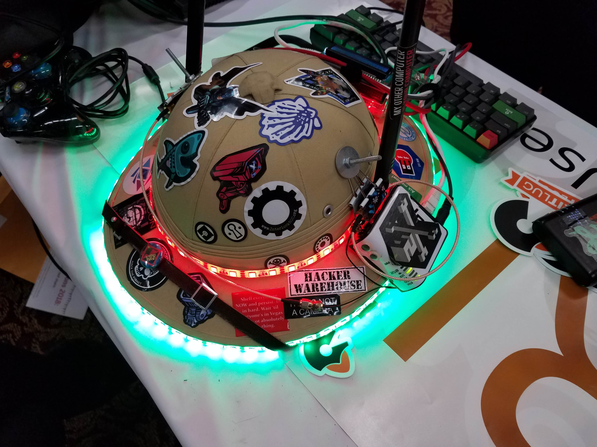
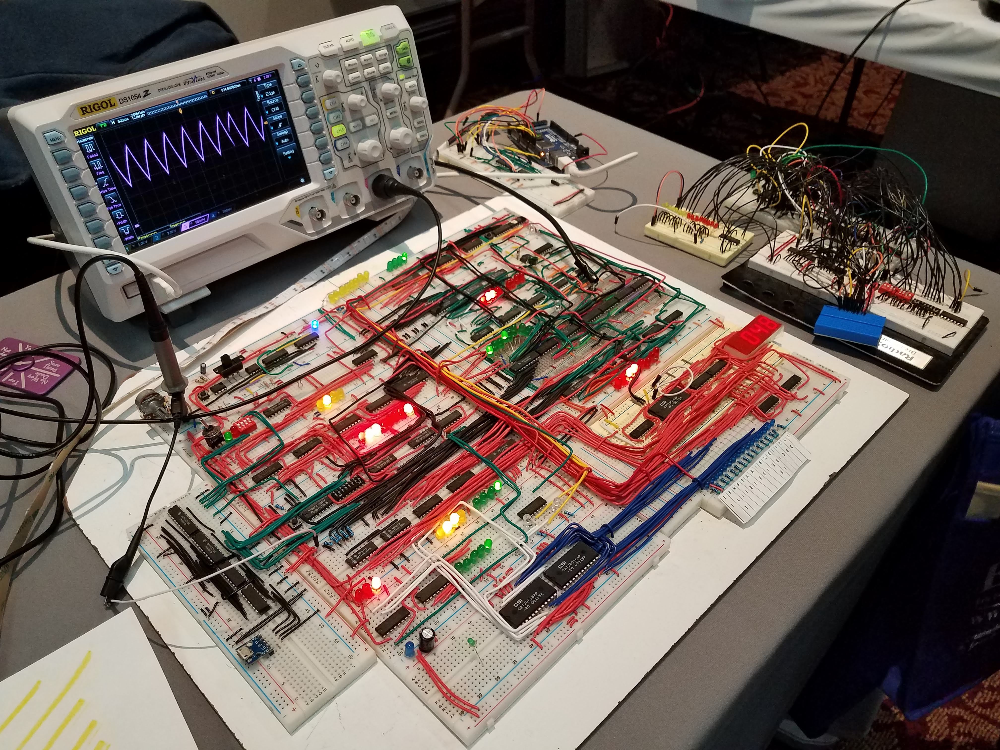

# Introduction
A few weeks ago I presented my [musical floppy drives](https://jrtechs.net/projects/musical-floppy-drive-build-log)
at the [Rochester Maker Faire](https://rochester.makerfaire.com/) with [RITlug](https://ritlug.com/). 
Wow, that sentence had a ton of links-- you should check them out. This post is a 
quick recap of my experience at the Maker Faire and a project update for my musical floppy drive project. For those of you who 
don't know, [Maker Faires](https://makerfaire.com/) are community gatherings where people "celebrate arts, crafts, 
engineering, science projects and the Do-It-Yourself (DIY) mindset".

I would like to give a huge thanks to [Christian](https://ctmartin.me/)
 for providing me with some of these pictures and [RITlug](https://ritlug.com/)
for giving me the opportunity to present at the Maker Faire. 

# Project Background

Musical floppy drives are floppy drives wired to an Arduino to play music. I initially started with two floppy drives;
however, that grew to 8 drives very fast. 

<iframe width="100%" height="315" src="https://www.youtube.com/embed/Y5msiFa54Ug" frameborder="0" allow="accelerometer; autoplay; encrypted-media; gyroscope; picture-in-picture" allowfullscreen></iframe>

I currently have 10 floppy drives stacked together in a tower like structure to make it easier to take to places
like the Maker Faire and [Imagine RIT](https://www.rit.edu/imagine/). 

# Future Project Upgrades

Although the 10 floppy drives are quite loud in a small room, people typically found it difficult to hear at the
Maker Faire. This was largely due to the noisiness of the hundreds of people at the convention center. To fix this
in the future I want to bring a small amplifier for the floppy drives. 

The second improvement which I plan on making is creating some form of web application where people can 
request music for the floppy drives to play. The potential down side of this is that it is often difficult connecting
to the internet at conventions.

I have a ton of old IDE hard drives that I plan on incorporating into my musical orchestra. The tricky part of that
upgrade would be to somehow incorporate those into my current floppy drive structure so that it is easy to take places.
 My current plan is to have the hard drives completely separate from the floppy drives and run it on its own Arduino board. 

# Cool Projects at the Maker Faire

Although there were a ton of really cool projects at the Maker Faire, I did not have the time explore everything 
and take a lot of pictures. However, I want to share some of the really cool projects that I saw at the Maker Faire. 

## HatChan

This is a project that one person is calling "HatChan". This is a hat equipped with a ton of LED lights, and 
a fully functioning wireless access point. When you connect to his access point, the captcha portal takes you
to a 4chan esk site where you can upload pictures -- mostly memes.

## 8-bit Computer

This one person brought a home made 8-bit computer to the Maker Faire. What I find the most impressive
about this project was that the person who made it was only a sophomore in high school. 

## Foss@Magic

*Photo provided by [Christian](https://ctmartin.me/)*

FOSS@Magic is a organization at RIT which aims to promote
free and open source software-- i'm also a part of this group. This year the FOSS group demoed their colorful MAGIC letters. On 
a tablet beneath the letters, there is a web site open where you can select the color of each individual
RGB letter. 

## RITlug

*Photo provided by [Christian](https://ctmartin.me/)*

The RIT Linux Users Group (RITlug) is a student-led organization aimed to promote and teach students about Linux and open source.
This year we presented my Floppy Drive project, a Raspberry Pi [Lakka](https://www.raspberrypi.org/magpi/easy-retro-gaming-lakka/) gaming set up, a
[Magic Mirror](https://github.com/MichMich/MagicMirror), and [Tiger OS](https://ritlug.com/tigeros).
