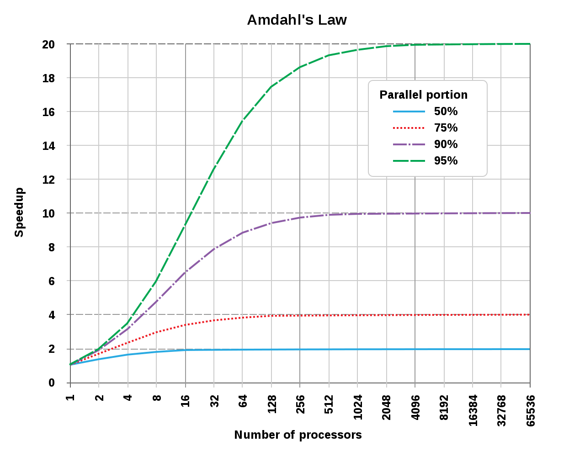

More cores = better performance, simple maths.
Although it makes intuitive sense that more processing power would be advantageous, that is not always the case.
There are multiple implementation paradigms and libraries for making a program run parallel; you have parallel streams, threads, and thread pools.
However, there is no clear cut winner because many factors affect parallel program performance: the number of tasks, IO, amount of work in each task.
This post aims to review the significant paradigms and factors affecting multi-threaded performance by looking at empirical data generated in Java. Additionally, topics like NQ and Amdahl's law are examined within the context of the experiments presented. 


# Single Threaded

To gain ground for comparison, we establish a baseline task to get performed. We want to execute a list of tasks and store the results in a collection. On a single thread, this is merely a traversal with a mapping.

```java
@Override
public List<E> runTasks(Vector<Work<E>> tasks)
{
    return tasks.stream()
        .map(Work::runTask)
        .collect(Collectors.toList());
}
```

I am using the lambda streaming notation due to its conciseness for list processing; if you are not familiar with functional Java, I recommend you check out my latest [blog post](https://jrtechs.net/java/fun-with-functional-java) on it. 


# Threads

To execute multiple tasks, spawning a thread for each job would appear reasonable. 
After all the threads have finished running, we aggregate and return the results. Note: we are heavily using vectors in this code because vectors are thread-safe.

```java
@Override
public List<E> runTasks(Vector<Work<E>> tasks)
{
    List<E> results = new Vector<>();
    List<Thread> threads = tasks.stream()
        .map(task ->
            new Thread(() -> results.add(task.runTask())))
        .collect(Collectors.toList());
    threads.forEach(Thread::start);
    threads.forEach(t-> {
        try {
            t.join();
        } catch (InterruptedException e) {
            e.printStackTrace();
        }
    });
    return results;
}
```

# Thread Pooling

This method extends the thread method but aims to cut down on the number of threads spawned.
Instead, the manager spawns N threads to execute tasks from a queue. Ideally, the number of threads is equal to the number of processors on your computer; this enables you to fully utilize the CPU while avoiding overhead associated with swapping running processes.  

The thread pool code was inspired by my blog post [Multi Threaded File IO](https://jrtechs.net/programming/multi-threaded-file-io).
We are using a thread-safe queue to track which tasks we still need to run.
Each thread spawned will sequentially run tasks from the queue and finish once the task queue is empty.

```java
public List<E> runTasks(Vector<Work<E>> tasks)
{
    List<E> results = new Vector<>();
    Queue<Integer> taskQueue = new LinkedList<>();
    taskQueue.addAll(IntStream.range(0, tasks.size())
            .boxed().collect(Collectors.toList()));
    int desiredThreads = Math.min(threadCount, tasks.size());
    Thread[] runners = new Thread[desiredThreads];
    for(int i = 0; i < desiredThreads; i++)
    {
        runners[i] = new Thread(()->
        {
            Work<E> t;
            while(true)
            {
                Integer nextTask;
                synchronized (taskQueue)
                {
                    nextTask = taskQueue.poll();
                }
                if(nextTask == null)
                    return;
                results.add(tasks.get(nextTask).runTask());
            }
        });
        runners[i].start();
    }
    for(Thread t: runners)
    {
        try
        {
            t.join();
        } catch (InterruptedException e) {
            e.printStackTrace();
        }
    }
    return results;
}
```

Java has some method already written that manages running thread pools.
The version that Java implemented returns Futures, which are nice because you can use them to handle exceptions. 

```java
@Override
public List<E> runTasks(Vector<Work<E>> tasks)
{
    ExecutorService executor = Executors.newCachedThreadPool();
    List<Callable<E>> callables = new ArrayList<Callable<E>>();
    for(Work<E> work: tasks)
    {
        Callable<E> c = new Callable<E>() {
            @Override
            public E call() throws Exception {
                return work.runTask();
            }
        };
        callables.add(c);
    }
    List<E> results = new ArrayList<>();
    try
    {
        List<Future<E>> futures = executor.invokeAll(callables);
        for(Future<E> future: futures)
        {
            try {
                results.add(future.get());
            } catch (ExecutionException e) {
                e.printStackTrace();
            }
        }
    }
    catch (InterruptedException e)
    {
        e.printStackTrace();
    }
    return results;
}
```


# Parallel Streams

First implemented in Java 1.8, Streams is a part of Java's push towards more functional syntax operators.
Parallel streams use an approach similar to a thread pool to execute tasks from a stream in parallel.


```java
@Override
public List<E> runTasks(Vector<Work<E>> tasks)
{
    return tasks.parallelStream()
        .map(Work::runTask)
        .collect(Collectors.toList());
}
```


# Comparison

To neatly test all the different implementations, I wrote a class that times the performance of each method using the same tasks.
Initially, this was simply a static method, but I refactored it to be an entire class because I wanted to work with any generic type that I define for my Work object.

```java
public class GenericTester<E>
{
    public long timeTrialMS(ParallelExecutor<E> executor, Vector<Work<E>> tasks)
    {
        long start = System.nanoTime();
        executor.runTasks(tasks);
        long finish = System.nanoTime();
        return (finish-start)/1000000;
    }

    public Result testAll(Vector<Work<E>> tasks)
    {
        ParallelExecutor<E> streams = new ParallelStreamsExecutor<>();
        ParallelExecutor<E> threads = new RunThreads<>();
        ParallelExecutor<E> manager = new Manager<>(8);
        ParallelExecutor<E> single = new SingleThread<>();
        ParallelExecutor<E> pool = new ThreadPoolExecutor<>();
        Result res = new Result();
        res.streams = timeTrialMS(streams, tasks);
        res.manager = timeTrialMS(manager, tasks);
        res.threads = timeTrialMS(threads, tasks);
        res.pool = timeTrialMS(pool, tasks);
        res.singleThread = timeTrialMS(single, tasks);
        return res;
    }
}
```

Since I'm not a big fan of Java plotting libraries, I graphed the results using Python and Matplotlib.

```python
import matplotlib.pyplot as plt

def plot_result(single, threads, manager, streams, sizes, xLab="Tasks", yLab="Execution Time (MS)", title="Execution Times"):
    plt.title(title)
    if len(sizes) == len(single):
        plt.plot(sizes, single, label="Single Threaded")
    if len(sizes) == len(threads):
        plt.plot(sizes, threads, label="Vanilla Threads")
    plt.plot(sizes, manager, label="Parallel Task Queue")
    plt.plot(sizes, streams, label="Parallel Stream")
    plt.legend(bbox_to_anchor=(0.6, 0.95), loc='upper left', borderaxespad=0.)
    plt.xlabel(xLab)
    plt.ylabel(yLab)
    plt.show()
```

## Overhead With Implementations

This task simply returns the value passed into it-- in the "real world," you would never do this. This test gives us a gauge at how much overhead is associated with running a task in each method.

```java
public class DoNothing<E> extends WorkGenerator<E>
{
    @Override
    Work<E> generateWork(E param) {
        return new Work<E>() {
            @Override
            E runTask() {
                return param;
            }
        };
    }
}
```


Based on the results, we can see that spawning an entire thread for each task is not the most efficient method.
The overhead associated with spawning a thread is much more arduous than the other methods -- including the single-threaded approach.

After removing the threaded approach, the graph looks like this:


## Tasks that Sleep

This test just bites time by putting the thread to sleep.
Similar to the initial task, this also returns the parameter that got passed into it. 

```java
public class SleepWork<E> extends WorkGenerator<E>
{
    @Override
    Work<E> generateWork(E param) {
        return new Work<E>() {
            @Override
            E runTask() {
                try {
                    Thread.sleep(500);
                } catch (InterruptedException e) {
                    e.printStackTrace();
                }
                return param;
            }
        };
    }
}
```


The single-threaded implementation ran the slowest since it only had one thread to put to sleep N times.
However, an interesting side effect of this test is that the inefficient thread's method ran faster than the thread pool methods.
In the threaded method, each thread could theoretically sleep simultaneously; however, there were very few threads to sleep on in the thread pooled approach.
This experiment illustrates how IO-bound tasks may perform better on a thread rather than a thread pool and that we shouldn't abject the 1-1 thread approach for parallel task processing.


## Tasks Doing Arithmetic

To test the performance doing arithmetic (or "real work"), I generated an obnoxiously confusing math statement to execute.
Note: Math.random() takes a severe performance hit when running in a multi-threaded environment.
For multi-threaded code, it is better to use the ThreadLocalRandom class.

```java
public class DoMaths<E> extends WorkGenerator<Double>
{
    @Override
    Work<Double> generateWork(Double param) {
        return new Work<Double>() {
            @Override
            Double runTask()
            {
                return IntStream.range(0, (int)Math.round(param))
                        .boxed()
                        .map(i -> Math.sin(i * ThreadLocalRandom.current().nextDouble()))
                        .mapToDouble(java.lang.Double::doubleValue)
                        .sum();
            }
        };
    }
}
```


The reason why the 1-1 thread method was slower than the single-threaded implementation is arduous to explain.
Even if there was some price X to pay for thread maintenance on each task, if the job takes an ample amount of time, then the overhead price will be worth it-- this has gotten coined in the field as the NQ model.

$$
NQ > 10,000
$$

where:

- N = number of data items
- Q = amount of work per item.

The NQ model is often used to determine whether parallelism will offer a speedup.
N and Q work with each other: for problems with trivially small Q, you would need a much larger N to parallel approaches worth it.
NQ is generally a useful heuristic because for small tasks or tasks that don't divide nicely, doing parallel computing, just adds overhead that you may not make up for by utilizing multiple cores.
In the latter arithmetic example, an N of 1000, was not enough to make parallelization using the threaded method advantageous. 


Even the less optimal approach saw significant performance gains over the single-threaded approach after our N and Q were sufficiently large. 
The results lead us into a discussion about Amdahl's Law:

$$
S_{\text{latency}}(s)={\frac {1}{(1-p)+{\frac {p}{s}}}}
$$

where

- $S_{\text{latency}}$ is the theoretical speedup of the execution of the whole task.
- s is the speedup of the part of the job that benefits from improved system resources;
- p is the proportion of execution time that the segment was benefiting from improved resources initially occupied.

Amdahl's law states that the sequential part of your program bounds the max increase in performance that you can get using parallel computing. IE: even if you made 95% of your application parallelized, the max performance increase you can achieve is 20x. However, if the program were somehow 100% parallel, the speedup would be directly correlated to the number of processors you had.


*Graph Courtesy of [Wikipedia](https://en.wikipedia.org/wiki/Amdahl%27s_law) [CC-BY-SA 3.0](https://creativecommons.org/licenses/by-sa/3.0)*

Looking at our program, we can figure out the max theoretical speed up we could achieve.
First, we need to calculate the performance increase we saw initially. I'm taking the times at N=10,000.

- single: 3598 ms
- thread manager: 533 ms
- threaded: 1358 ms

After doing a simple ratio, we see that the thread pool implementations had a 6.75x performance increase, and the threaded version saw a 2.65x performance increase.

Using the 6.75x as our $S_{\text{latency}}$, and eight as our S (I have eight processors in my CPU), we can calculate P in our equation. P will tell us the portion of the entire program that runs in parallel. 

$$
S_{\text{latency}}(s)={\frac {1}{(1-p)+{\frac {p}{s}}}}\\
6.75=\frac{1}{1-p+\frac{p}{8}}\\
1 = 6.75 - 6.75p + \frac{6.75}{8}p\\
p = 0.98
$$

After some algebra, we get a P-value of 0.98: 98% of the program is ran in parallel, 2% is sequential.

To figure out the max theoretical speedup, if we had a gratuitous amount of threads, we take the limit of Amdahl's law as S (our processor count) approaches infinity.

$$
{\displaystyle {\begin{cases}S_{\text{latency}}(s)\leq {\dfrac {1}{1-p}}\\[8pt]\lim \limits _{s\to \infty }S_{\text{latency}}(s)={\dfrac {1}{1-p}}.\end{cases}}}
$$


Using our value of 0.98 for P, we can see that the max parallel performance increase we can accomplish is 50x. Neet. Why is this important you might ask? Well, Amdahl's law illustrates the law of diminishing returns. The first few cores that we add will be more beneficial than the last few threads. 

The following graph graphs Amdahl's law with our P-value of 0.98:


In the original Amdahls graph, the X-axis was logarithmic.
If we plot the entire graph in base 10, it is apparent how the law of diminishing returns plays a role in parallelization.
If I was obtaining a computer to run this program, I might decide that it is best to stop around 50 cores. Although this would only yield a 25x performance increase, you would need thousands of more threads to get closer to the theoretical 50x performance increase.

# Takeaways

- Thread pools are almost always more efficient than spawning a thread for each task, unless, the tasks are heavily IO bound and have blocked calls.
- Different thread pool implementations such as Java's Parallel Streams and ManagedThreadPool will yield similar big-O complexities.
- Parallelization is only faster if you have a sufficient amount of sufficiently large tasks to complete in parallel-- the law of NQ.
- Amdahl's law can compute your program's theoretical speed with more processors. 