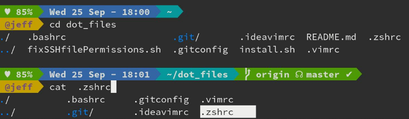
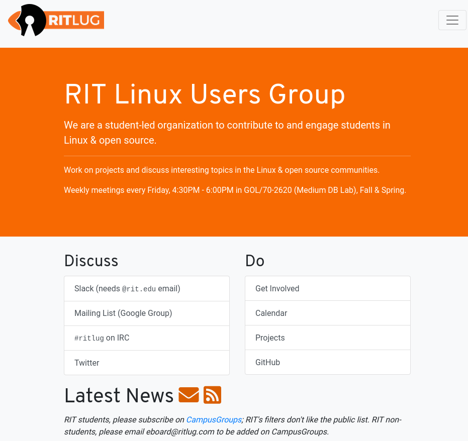
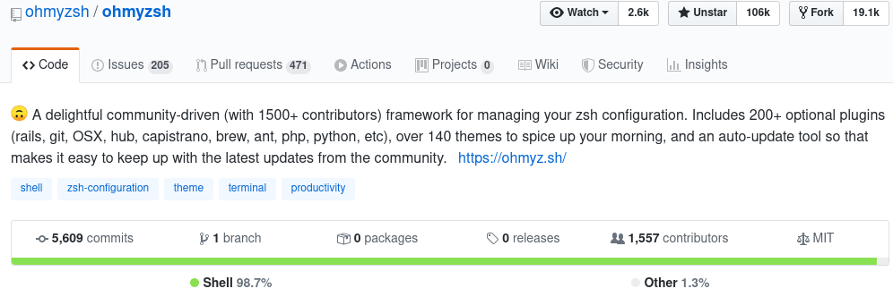
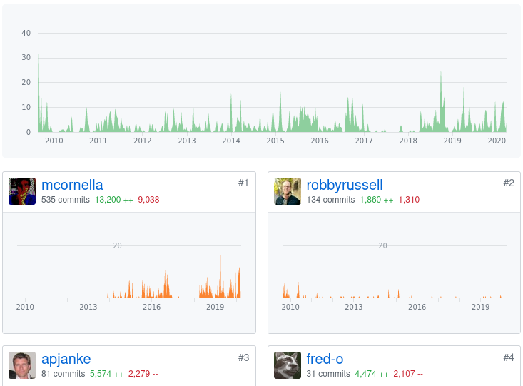
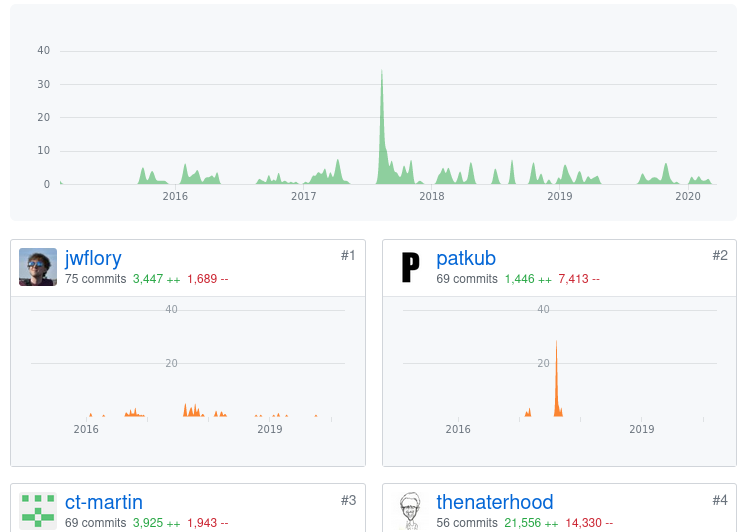

This is my submission for RIT's
[HFOSS](https://github.com/ritjoe/hfoss) Community architecture
project. Due to the COVID situation, several changes have been made
since I drafted the [project
proposal](https://jrtechs.net/open-source/community-architecture-proposal).
First, this is no-longer a group project. Second, this project is now
more focused on comparing the project architectures of two communities
rather than running analytics like git by a bus. 

Exploring what works and what does not work for different projects can
give us valuable insight into trying to create new communities. This
is what is truly beautiful about open-source software in its openness
giving us the ability to learn from it.  

# Project Introduction

This report covers two open-source projects: on-my-zsh and RITlug's
website. 

## Oh-my-zsh

On-my-zsh is an open-source, community-driven framework for managing
ZSH configurations. It includes many functions, helpers, plugins, and
themes. 

Oh-my-zsh was written almost entirely in a shell script which makes
sense because it is a command-line utility. The primary audience of
this project is ZSH enthusiasts. 

### Links

- [github](https://github.com/ohmyzsh/ohmyzsh)
- [website](https://ohmyz.sh/)
- [wiki](https://github.com/ohmyzsh/ohmyzsh/wiki)
- [issue tracker](https://github.com/ohmyzsh/ohmyzsh/issues)

## Ritlug's Website

The RIT Linux Users group (RITlug)  main website is an open-source
project. RITlug is a student-led organization at RIT that aims to
engage students in Linux and open source. The website is written using
Jekyll which is a ruby project for static website generation. The
website itself is hosted on [GitHub Pages](https://pages.github.com/)
Jekyll is nice because it enables you to do templating and write
content for the website in [markdown](https://www.markdownguide.org/).
This is also the project that I chose to do my HFOSS [bug
fix](https://jrtechs.net/open-source/ritlug-bugfix). 

### Links

- [github](https://github.com/RITlug/ritlug.github.io)
- [website](https://ritlug.com/)
- [issue tracker](https://github.com/RITlug/ritlug.github.io/issues)

# Differences

This section explores the differences between the two projects. It is
important to note that there is not a once size fits all for
open-source projects. Just because one project has more/less of
something does not necessarily mean that one is better than the other.
The beauty of open-source is the ability of a project to take many
shapes/sizes/forms. 

## Scope

There is no denying that on-my-zsh is a massive open-source project.
On-my-zsh is highly praised and recommended by people wanting to
"rice" their terminal setup. This project has 19k forks and 1.5k
contributors... that is big. 

Although there are a large number of contributors, most people don't
have a huge role in the project. A lot of the contributors are adding
themes to on-my-zsh and doing minor bug fixes. Dispute not holding big
roles, the large number of contributors suggests that it is relatively
easy to become a part of this community. On-my-zsh has received so
many PR's for new themes that they asked people to [stop
submitting](https://github.com/ohmyzsh/ohmyzsh/wiki/External-themes)
them and to create them as separate git repos with a specific naming
convention so they are easy to search for. 

In contrast on on-my-zsh, the RITlug website project is relatively
small with 16 total contributors. The contributors are largely limited
to members of RITlug's eboard (leadership board) with little activity
from the community at large. Members through this project tend to
cycle through every few years as they roll through RITlug's eboard. 

## Maturity

The on-my-zsh project is a decade old and still kicking strong! This
project is well developed and has very robust documentation in  their
wiki for people looking to contribute to this project and for those
looking to use it. 

RITlug's website project is relatively new at 4 years old, but, like
oh-my-zsh has remained active for its entire duration. 

## Governance

### Leadership

Determining the leadership is often hard for a project in the medium
to small scale. The issue isn't that there is absolutely no
leadership, the issue is that the leadership often isn't documented or
is on such a small scale that it is trivial. Larger projects like
Fedora and Ubuntu have well-defined roles, etc for their project.
Smaller projects often don't have these levels of leadership and
transparency. I fall victim to this for all my projects on GitHub, the
leadership is quite literally "me" and I'm making all the calls and
I'm just managing the dozen or so people that I manage to get to work
on my project. Having this type of leadership is often bad because
once the main contributor leaves, the project may die or fall apart. 

As the current president of RITlug, I have particular insight into how
RITlug operates its open-source project. The leadership of the project
shifts every year after public (to RIT students) elections. There are
typically between 4-6 eboard members per year. It requires two members
of eboard to approve a pull request for the website. There is a
special eboard role for managing projects, however, that role is often
vacant and is just filled in my eboard members that have a familiarity
for that project. If the project is large enough like
[TeleIRC](https://github.com/RITlug/teleirc), we allow that one to
manage itself as a "team" with loose oversight from the eboard. The
RITlug website is solely maintained by the RITlug Eboard for
administrative tasks such as weekly emails and posting talks. Although
we don't ever explicitly document the leadership of the project, it
would be possible to figure out by reading the RITlug
[runbook](http://runbook.ritlug.com/). 

Opposed to RITlug which has a quasi-public leadership board, the upper
leaderships for on-my-zsh can be traced back to the company Planet
Argon. This company is located in Portland and focuses on Ruby on
Rails development as a consultant for commercial companies. Like many
companies, this company has a large  footprint in [open-source
projects](https://www.planetargon.com/open-source). From public
documentation, it is not clear how the on-my-zsh project is run. Based
on other projects, we can assume that the company appoints certain
people to manage the project. 

### License

The code for both projects falls under the MIT license which is a
permissive open source license. The RITlug website is more unique in
that it has a creative commons license for  

# Takeaways

When it comes to projects, no one size fits all. In both projects that
I looked at they had backing from a more established institution such
as a student club or a company. Future research in community
architecture could dive deeper into how most open source communities
layout their upper leadership and who funds the projects. It is
becoming more and more common to find open-source projects with large
commercial backers.
