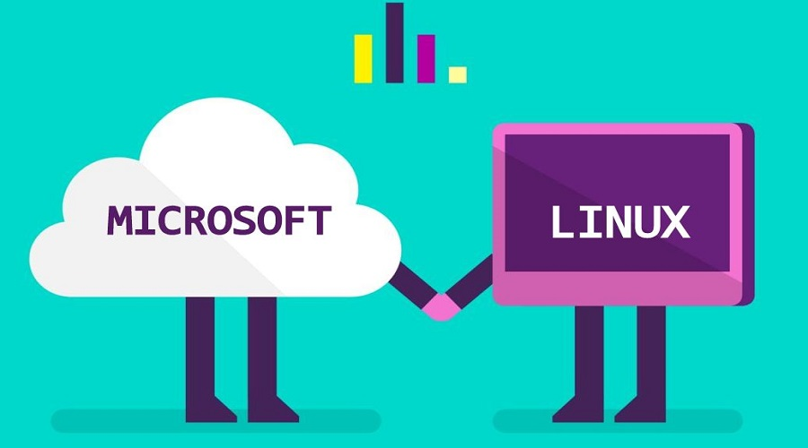
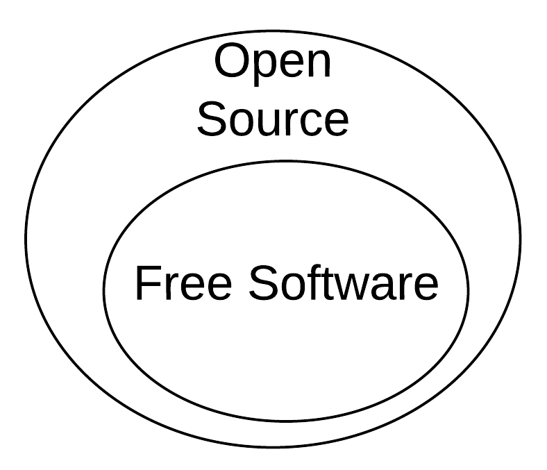
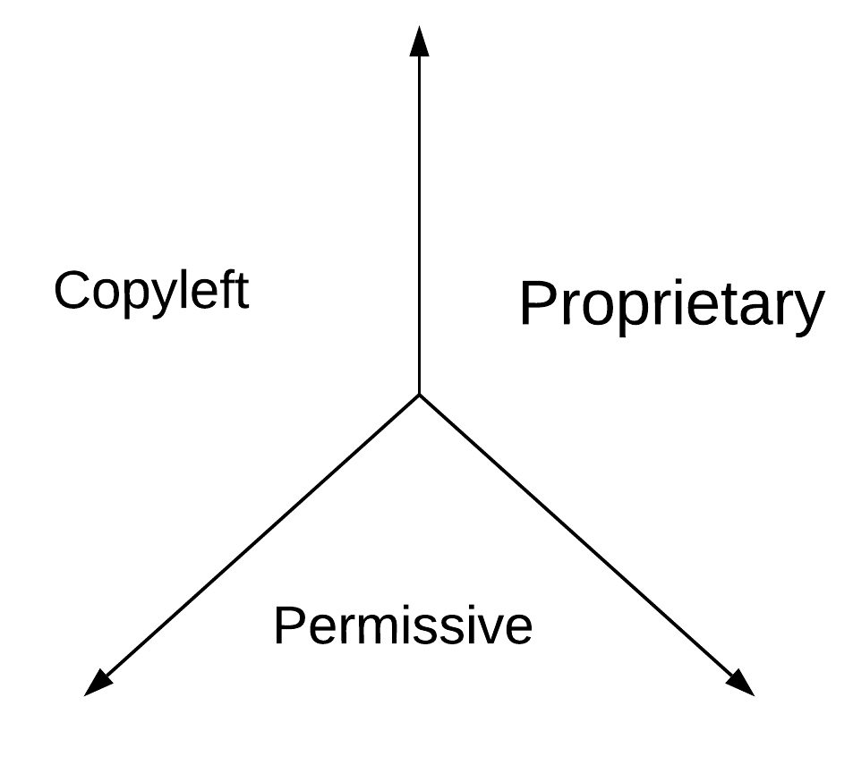

Last week for HFOSS(Humanitarian Free and Open Source Software
IGME-582) at RIT I  was introduced to three articles that picked apart
the differences between Free Software and Open Source Software.  

- [How I coined the term 'open source' by Christine Peterson](https://opensource.com/article/18/2/coining-term-open-source-software)
- [When Free Software Isn't (Practically) Superior by Benjamin Mako Hill](https://www.gnu.org/philosophy/when-free-software-isnt-practically-superior.html)
- [Why Open Source misses the point of Free Software by Richard Stallman](https://www.gnu.org/philosophy/open-source-misses-the-point.html)

Peterson's article discussed how she coined the term Open Source and
how that term became widely used. She explained that "Open Source" was
a new term to replace "Free Software" because it would resonate better
with businesses. At that time(and still to this day) Free software was
confused with software that you can get at no cost; Free Software is
really free as in speech rather than free as in beer. Peterson's
phrase "Open Source" gained a foot hold with larger communities and
businesses because it focused on the practical benefits of doing
software development in a public manner. Open Source software focused
on collaboration and how building software in the public could improve
security -- this really enticed businesses. To this day we see that
businesses like Microsoft latch on to the phrase Open Source.   

*Image: [Microsoft](https://news.microsoft.com/)*

The divergence in phrasing represented an ideological split in the
community. People like Stallman in the Free Software camp felt like
the Open Source movement lacked integrity because they don't focus on
freedom. In his article "Why Open Source misses the point of Free
Software", Stallman almost mocks the fact that some open source Linux
distributions would even offer the option to package
proprietary(non-free) software. This ideological split is often
referred to as "FOSS" vs "FLOSS". FOSS means for "Free and Open Source
Software" where FLOSS means "Free/Libre Open Source software". 

Hill echoes the views of Stallman in his article, however, he points
out that in practice Free Software isn't doing "better" than Open
Source Software or proprietary software. The median number of
contributors to a SourceForge  project is one. The large success of
Open Source Software is large in due to the fact that it is able to
draw in more developers and retain financial support from companies. 
It is also important to point out that most projects on Github
currently have no license making them neither Open Source or Free
software. Hill also re-emphasizes Stallman's point that excellent code
can be written  in proprietary applications. The major difference is
where the focus on freedom is. 

# What's the big difference?

Despite the large overlap between Open Source and Free Software, there
are a few key distinctions. At a high level you can say that Free
Software favors freedom, however, that is putting it in a vague notion
that can be interpreted in many ways. You could also put it in terms
of the [four R's of Free
Software](https://fsfe.org/freesoftware/basics/4freedoms.en.html):  

- Read
- Run
- Repurpose
- Redistribute

If you really want to know if software is Free Software, you can
examine each of the four R's and ask yourself if the software is
compliant with these standards. This is helpful since not all open
source projects are compliant with the four R's of software freedom.
However, I like to analyze the differences between FOSS and FLOSS by
looking at the three major license types.  

Although these are not distinct lines, most people that are hard core
FLOSS people favor copyleft licensing where Open Source projects
typically favor permissive licensing. Permissive licensing would be
favored by companies because it enables them to easily use Open Source
software in proprietary applications and mix it with other
applications. Copyleft licensing like the GPL v3 is favored by Free
Software because it prevents people from mixing their software with
non-free software. An example of this would be Android where non-free
components are mixed with the Linux kernel due to more permissive
nature of the GPL v2. 

# Why does this matter?

At times this divide feels like petty hair splitting. However, the
FOSS vs FLOSS mindset directly influences licensing which has serious
ramifications on how you can use  software. Making your program GPL
compliant can be a serious hassle for companies looking to use Free
Software. 

# What should we do moving forward?

While many within FLOSS community may mock and tease companies trying
to  enter the Open Source world, I believe that we should embrace it.
We still need to remain vigilant in ensuring that the software we uses
protects our privacy, but, having more corporate involvement in the
open source sphere will help us move away from black box software. 

