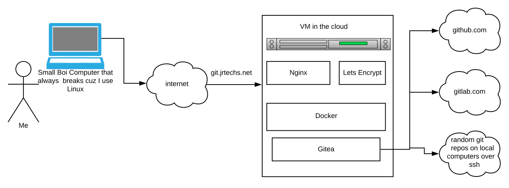
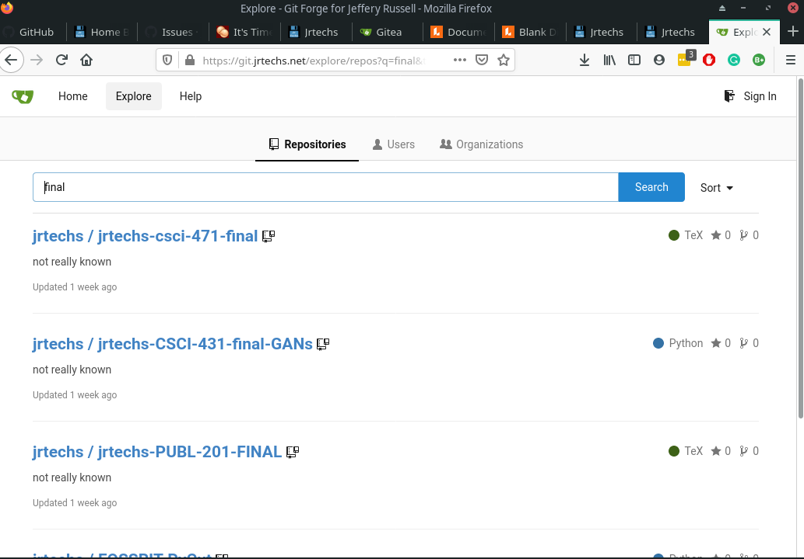
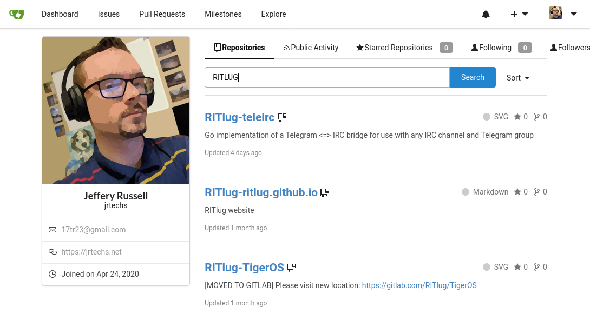
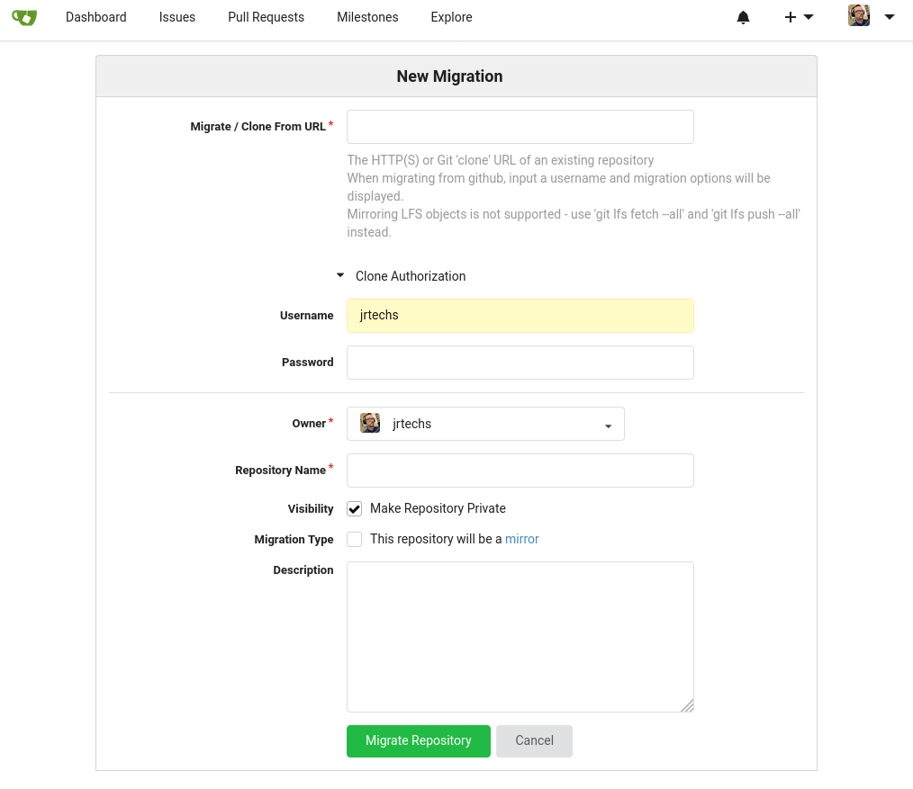

# The Premis

Last week I started hosting my own git-forge to track sync all of my
git projects. Between school, open-source communities, and personal
projects, I have accumulated a dubious amount of git projects.
Although most of my content gets hosted on Github, I also had a fair
quantity of local projects, stuff on scattered GitLab instances, and
other places. I decided to use Gitea to mirror all of my repositories
and keep them in a central location that I can quickly search for
them.  




For simplicity, I decided to host my Gitea instance on a DigitalOcean
droplet using docker and add SSL encryption using a reverse Nginx
proxy using a let's encrypt. 


# Installation

The first step was to set up a VM in the cloud. I used a base Debian
server on Digital Ocean. I tend to use Debian for servers because it
is stable and has an extensive collection of packages. 

## Docker and Docker Compose

I included the commands necessary to install docker bellow. These
instructions may get stale, but the gist is going to remain the same
for the foreseeable future. We are adding the docker's certificates to
our package manager and then installing it. 

```
apt update
apt upgrade
apt install apt-transport-https ca-certificates curl software-properties-common gnupg2
curl -fsSL https://download.docker.com/linux/debian/gpg | sudo apt-key add -
add-apt-repository "deb [arch=amd64] https://download.docker.com/linux/debian $(lsb_release -cs) stable"

apt update
apt install docker-ce
```

Install Docker-Compose 

```
curl -L https://github.com/docker/compose/releases/download/1.25.0-rc2/docker-compose-`uname -s`-`uname -m` -o /usr/local/bin/docker-compose
chmod +x /usr/local/bin/docker-compose
```


## Gitea over Docker Compose


For simplicity, I am running Gitea using docker-compose because it
makes it portable between systems and makes for a straightforward
install. You can find the official Gitea instructions on this
[here](https://docs.gitea.io/en-us/install-with-docker/). 

The just of the running entails creating a file called
docker-compose.yml with the following contents: 

```yml
version: "2"

networks:
  gitea:
    external: false

services:
  server:
    image: gitea/gitea:latest
    environment:
      - USER_UID=1000
      - USER_GID=1000
    restart: always
    networks:
      - gitea
    volumes:
      - ./gitea:/data
      - /etc/timezone:/etc/timezone:ro
      - /etc/localtime:/etc/localtime:ro
    ports:
      - "3000:3000"
      - "222:22"
```

Once we have our docker-compose.yml saved, we can launch it when we
are in the same directory as it using docker-compose. After this
launches we now have our Gitea server running on port 3000 

```
docker-compose build
docker-compose up
```

## Nginx and Let's Encrypt

Although our server is running publicly on port 3000, we don't want to
use it yet because, by default, it is running on HTTP, which is not
encrypted. HTTP makes it possible for people sitting in the middle of
your connection to listen to your traffic and see all the passwords
and data that you send to your Gitea server. We are going to be using
a [Nginx](https://nginx.org/) reverse proxy with [Let's
Encrypt](https://letsencrypt.org/) to add HTTPS encryption.  


Installing Nginx is easy because it is in most Linux package managers.

```
apt-get install nginx
```

Next, we tell Systemd to start Nginx on startup. 

```
systemctl enable nginx
```

Next we modify the Nginx config file to add a reverse proxy. This will
forward all traffic on git.jrtechs.net to the localhosts's port 3000. 

```
vim /etc/nginx/sites-available/default
```

Add this content to the very bottom of the default config file
changing "git.jrtechs.net." 

```
server 
{
    listen 80;

    server_name git.jrtechs.net;

    location / {
        proxy_pass http://localhost:3000;
        proxy_http_version 1.1;
        proxy_set_header Upgrade $http_upgrade;
        proxy_set_header Connection 'upgrade';
        proxy_set_header Host $host;
        proxy_cache_bypass $http_upgrade;
     }
}
```

This command tests the Nginx file you just modified to make sure it is
syntactically correct.  

```
nginx -t
```

Next, we reload Nginx starting the reverse Nginx proxy we just
created.  

```
/etc/init.d/nginx reload
```


Now that Nginx got configured, we can set-up Certbot for encryption. 

```
sudo add-apt-repository ppa:certbot/certbot
sudo apt install python-certbot-nginx
```

This step is beautiful because it has the Let's Encrypt Certbot modify
the Nginx configuration files to make it work over https. When
prompted, select the option that redirects all HTTP traffic to https. 

```
systemctl stop nginx
certbot --authenticator standalone --installer nginx -d git.jrtechs.net
systemctl start nginx
```

Now you should be able to access your Gitea instance using your domain
name. By default, the first user that logs into the Gitea instance
becomes an administrator.  

# Results

Now you have a private git-forge that you can access anywhere in the
world over HTTPS and quickly search and display all your git profiles.



The profile for each user you create on Gitea looks shockingly similar
to Github's. 



One beautiful thing about Gitea is that you can easily import and
mirror git repositories from other sources. 



# Transferring Github Projects to Gitea Instance

Although it is possible to import every single repository you have in
Github manually, this quickly becomes a nuisance if you have 60+
repositories on Github like me.  

I found and modified a python script that imports all your Github
repositories into Gitea. What is particularly dandy about this script
is that it uses the Github API to get both your public and private
repositories. If the repository is private on Github, it gets
transferred over as a private repository into Gitea. This script also
mirrors in every repo from your organizations. I posted this script on
my
[Github](https://github.com/jrtechs/dot_files/tree/master/docker/gitea).

To run this script, you need to generate API tokens for both Github
and Gitea. Instructions for the Gitea API tokens are found
[here](https://docs.gitea.io/en-us/api-usage/), and the Github token
can be found
[here](https://help.github.com/en/github/authenticating-to-github/creating-a-personal-access-token-for-the-command-line).
The generated tokens get placed in ".gitea-api" and ".github-token" 

```python
#!/usr/bin/env python -B

from github import Github       # https://github.com/PyGithub/PyGithub
import requests
import json
import sys
import os

gitea_url = "http://127.0.0.1:3000/api/v1"

# generage gitea token https://docs.gitea.io/en-us/api-usage/
gitea_token = open(os.path.expanduser("~/.gitea-api")).read().strip()

session = requests.Session()        # Gitea
session.headers.update({
    "Content-type"  : "application/json",
    "Authorization" : "token {0}".format(gitea_token),
})

r = session.get("{0}/user".format(gitea_url))
if r.status_code != 200:
    print("Cannot get user details", file=sys.stderr)
    exit(1)

gitea_uid = json.loads(r.text)["id"]

github_username = "jrtechs"
github_token = open(os.path.expanduser("~/.github-token")).read().strip()
gh = Github(github_token)

for repo in gh.get_user().get_repos():
    m = {
        "repo_name"         : repo.full_name.replace("/", "-"),
        "description"       : repo.description or "not really known",
        "clone_addr"        : repo.clone_url,
        "mirror"            : True,
        "private"           : repo.private,
        "uid"               : gitea_uid,
    }

    if repo.private:
        m["auth_username"]  = github_username
        m["auth_password"]  = "{0}".format(github_token)

    jsonstring = json.dumps(m)

    r = session.post("{0}/repos/migrate".format(gitea_url), data=jsonstring)
    if r.status_code != 201:            # if not CREATED
        if r.status_code == 409:        # repository exists
        continue
        print(r.status_code, r.text, jsonstring)
```

Sit back and have some tea because this script can take a hot second
to run. 
