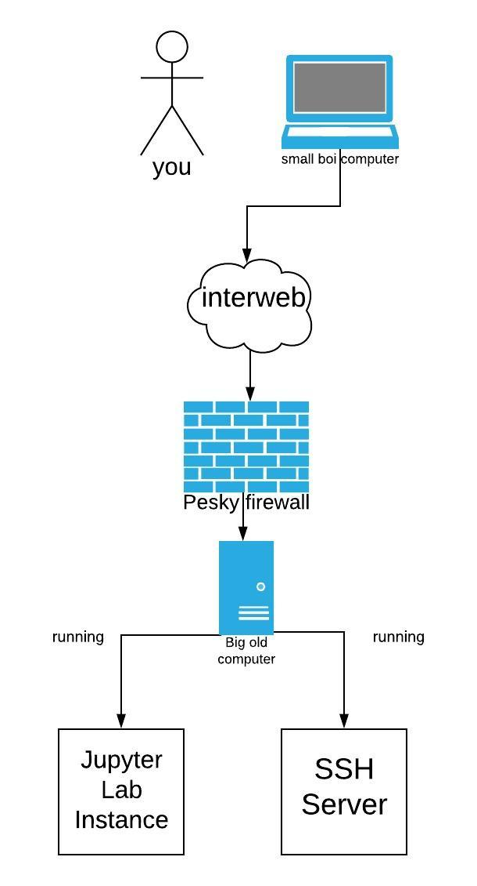
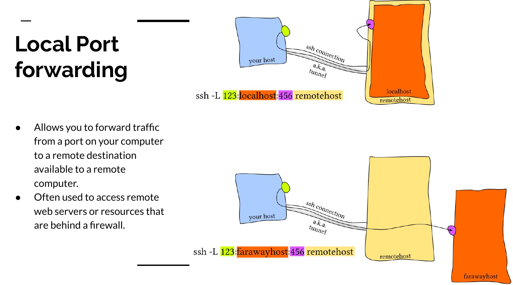

It is not uncommon for me to get exuberantly excited over a open source
project that I stumble upon, however, Jupyter Lab has taken the
cake this month. The Jypyter project is an open-source community
that extended IPython notebook project to the web browser and added
support for multiple languages.

# Why Notebooks?

As a researcher and educator I love notebooks because they enable 
you to easily share your code with others. Notebooks are much more
interactive than simply sharing source code because you can
mix text(markdown), code, and outputs from code execution. For classes and
when working, this makes it very easy to generate quick reports.
You can simply write a document that auto generates the graphs and figures
you want to talk about in your document.

Last week I worked on a computer vision assignment that required me to
use Open CV to manipulate images using filters, convolutions, etc.
The entirety of the assignment required me to produce roughly 30 images.
A majority of the class wrote python scripts and threw each image they 
generated into a massive word document and  typed up their
analysis and submitted their assignment as a PDF along side a bunch of
python scripts. There is nothing wrong with doing that; however, what
happens if at the end of the assignment you realized that you were
generating Gaussian filters incorrectly? If you wrote everything in
a Jupyter notebook you would just have to fix the dubious code and
re-run the notebook and it would produce your report in its entirety.
But, if you had your scripts as separate files you would have to fix your
code and then go through and generate a dozen new images that required
Gaussian filters and place them in your document.


The ability to accurately reproduce your report is pinnacle to making
research more verifiable and reproducible. This is something that the
R and open-science communities heavily focus on. Directly mixing your
code and analysis with your report is very useful. Also, consider if the
data that you are working with changes half way through writing your
research report. With a notebook, you would just have to re-run the 
notebook where if you had the report as a separate word or Latex file,
you now run the risk of misreporting your results.


# Jupyter Notebook


# Jupyter Lab


# Running and Installing


# Running for remote use

Imagine that you are running an old computer and you simply want your
code to run on a remote computer that has a beefie GPU for ML.
With Jupyter Lab or Notebook you can do that, but, it takes a little
trickery. The easiest solution that I found involves using a reverse
SSH proxy.




The first thing that you want to do is set up a password so that you
can connect to the jupyter lab instance using a password rather than using
a authentication key which gets hidden in the terminal.

```bash
jupyter notebook password
```

** note ** the password that you set is configured in the same config used by both jupyter lab and jupyter notebook.

The next thing you should do is run the jupyter lab instance on the port that you want it to listen to.

```bash
jupyter lab --no-browser --port=6000
```

The "--no-browser" will prevent jupyter from opening in your default web browser.


The next step is to do a local SSH port forward on your machine
so you can access the jupyter instance on the remote server.
The benefit of doing this is that you can get behind firewalls and that
all your traffic is encrypted.



The image above comes from my presentation on "[Everything SSH](https://jrtechs.net/open-source/teaching-ssh-through-a-ctf)".
The essence of the command bellow is that you will forward all
connections on your machines to port 6000 to a remote's servers connection to localhost:6000.

```bash
ssh -L 6000:localhost:6000 user@some-remote-host.rit.edu
```

After you run that command you can access the jupyter lab instance
by opening your favorite web client and going to localhost:6000.
Typing that command every time is tedious so I recommend that you
allias it in your shells config file.


```bash
alias jj="ssh -L 6000:localhost:6000 user@some-remote-host.rit.edu"
```

Now all you have to type in your command prompt is jj to connect to 
your remote jupyter server. Neat.

But, what if your roommate trips and your server gets restarted? Well,
you can write a systemd script to automatically start your jupyter
server when the computer boots. This is what my system d script looks like.

```bash
# location /lib/systemd/system
#
# After file creation run: systemctl daemon-reload
# enable service on start up: systemctl enable jupyter-lab
# start the service: systemctl start jupyter-lab


[Unit]
Description=Script to start jupyter lab
Documentation=https://jrtechs.net
After=network.target

[Service]
Type=simple
User=jeff
WorkingDirectory=/home/jeff/Documents/school/csci-431/
ExecStart=/usr/local/bin/jupyter lab --no-browser --port=6969
Restart=on-failure

[Install]
WantedBy=multi-user.target
```


You want to set the working directory to be the location where your jupyter notebooks are stored.
You also want to make sure that you specify the absolute path to the jupyter binary in the execstart parameter. You can find that using the which command:

```bash
which jupyter
```
