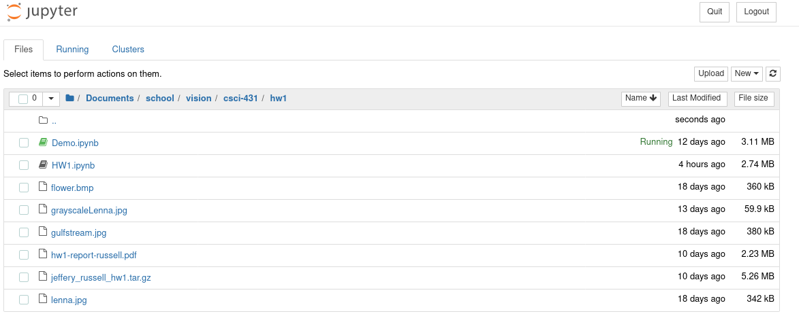
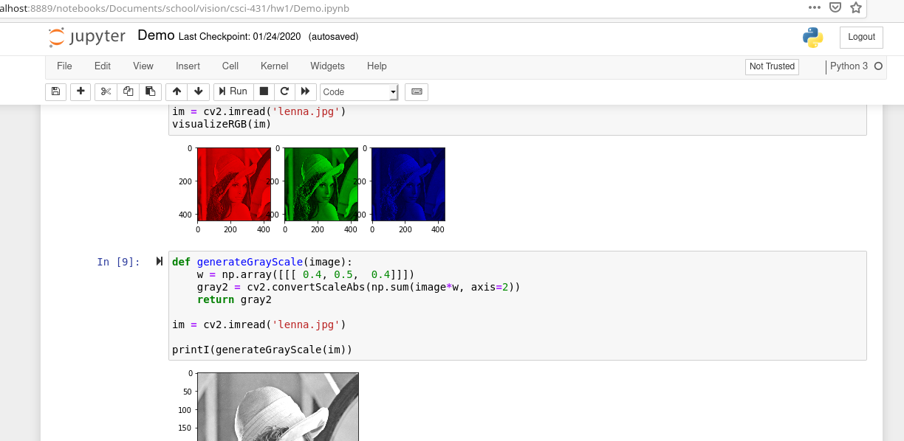
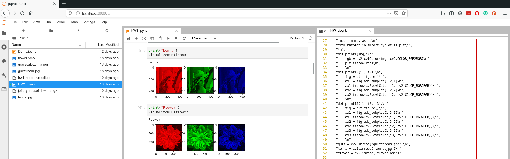
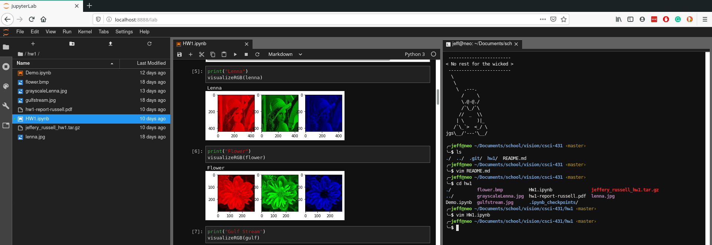

It is not uncommon for me to get exuberantly excited over an
open-source project that I stumble upon-- Jupyter Lab has taken the
cake this month. The Jypyter project extends IPython notebooks to the
web browser and added support for multiple languages. 

# Why Notebooks?

As a researcher, I love notebooks because they enable you to easily
share your code with others. Notebooks are much more interactive than
simply sharing source code because you can mix text(markdown), code,
and outputs in code execution. For classes and when working, this
makes it very easy to generate quick reports. You can simply write a
document that auto generates the graphs and figures you want to talk
about in your document. 

Last week I worked on a computer vision assignment that required me to
use Open CV to manipulate images using filters, convolutions, etc. The
entirety of the assignment required me to produce roughly 30 images. A
majority of the class wrote python scripts and threw each image they
generated into a massive word document. They then added their analysis
and submitted their assignment as a PDF alongside a bunch of python
scripts. There is nothing wrong with doing that; however, what happens
if at the end of the assignment you realized that you were generating
Gaussian filters incorrectly? If you wrote everything in a Jupyter
notebook you would just have to fix the dubious code and re-run the
notebook and it would produce your report in its entirety. But, if you
had your scripts as separate files you would have to fix your code and
then go through and generate a dozen new images to update your report.

The ability to accurately reproduce your report is pinnacle to making
research more verifiable and reproducible. This is something that the
R and open-science communities heavily focus on. Directly mixing your
code and analysis with your report is very useful when trying to
explain things un-ambiguously. Consider if the data that you are
working with changes halfway through writing your research report.
With a notebook, you would just have to re-run the notebook where if
you had the report as a separate word or Latex file, you now run the
risk of misreporting your results. 


# Jupyter Notebook

When you run a Jupyter notebook it starts a new server and launches
you into your native web browser. From your web browser, you can view
files in your current directory and choose one to edit. The one that
you pick will open in a new window. 





In this notebook preview, you can add snippets. Each snippet can be
either code, markdown or raw text. You can run snippets or  rearrange
them however you please. 

The concepts of snippets introduce the final and most compelling
reason to use notebooks. Although you should be able to execute your
notebook by running all snippets sequentially, you don't have to
follow that order. Plus, the results of running snippets are saved in
your "workspace" between runs. This means that you don't have to
always re-compute your costly computations between each programming
session. This enables you to load a large dataset,  run complex
computations, store the results in a variable and then access that
variable the next day. This enables quick R&D because in a traditional
setting you would consider building out infrastructure like databases
to store your temporary computations.  




# Jupyter Lab

Although notebooks have been around for quite some time, I got hooked
on Jupyter because it brings the entire ecosystem together very
nicely. With Jupyter notebook, you could only have one notebook open
in a single web browser tab. If you wanted multiple notebooks, you had
to open multiple windows. Jupyter Lab has a built in window manager
enabling you to view files, notebooks, terminals, and other file
formats all in the same internet browser tab! 

In case you missed it, in Jupyter lab you can launch terminals! This
is important for a development framework to have because it enables
you to run any program that is on your computer. I find this
particularly useful when I am running Jupyter Lab on a remote computer
and I want to use git. 

Jupyter Lab also has a built-in light and dark theme you can use. 





# Running and Installing

Since the instructions will probably change, I'm just going to link to
the the website where you can install Jupyter lab from: 

[https://jupyter.org/install.html](https://jupyter.org/install.html)

The installation is essentially just a pip install command. 

```bash
pip install jupyterlab
```


Running Jupyter lab is also a single command: 

```bash
jupyter lab
```


# Running for remote use

Imagine that you are running an old computer and you simply want your
code to run on a remote computer that has a beefier GPU for ML. With
Jupyter Lab or Notebook you can do that, but, it takes a little
trickery. The easiest solution that I found involves using a reverse
SSH proxy. 


The first thing that you want to do is set up a password so that you
can connect to the Jupyter lab instance using a password rather than
using an authentication key that gets hidden in the terminal. 

```bash
jupyter notebook password
```

** note ** the password that you set is configured in the same config used by both Jupyter lab and Jupyter notebook.

The next thing you should do is run the Jupyter lab instance on the
port that you want it to listen to. 

```bash
jupyter lab --no-browser --port=6000
```

The "--no-browser" will prevent Jupyter from opening in your default
web browser. 

The next step is to do a local SSH port forward on your machine so you
can access the Jupyter instance on the remote server. The benefit of
doing this is that you can get behind firewalls and that all your
traffic is encrypted. 


The image above comes from my presentation on "[Everything
SSH](https://jrtechs.net/open-source/teaching-ssh-through-a-ctf)". The
essence of the command bellow is that you will forward all connections
on your machines to port 6000 to a remote server's connection to
localhost:6000. 

```bash
ssh -L 6000:localhost:6000 user@some-remote-host.rit.edu
```

After you run that command you can access the Jupyter lab instance by
opening your favorite web client and going to localhost:6000. Typing
that command every time is tedious so I recommend that you alias it in
your shells config file. 


```bash
alias jj="ssh -L 6000:localhost:6000 user@some-remote-host.rit.edu"
```

Now all you have to type in your command prompt is "jj" to connect to
your remote Jupyter server. Neat. 

But, what if your roommate trips and your server gets restarted? Well,
you can write a systemd script to automatically start your Jupyter
server when the computer boots. This is what my system d script looks
like. 

```bash
# location /lib/systemd/system
#
# After file creation run: systemctl daemon-reload
# enable service on start up: systemctl enable jupyter-lab
# start the service: systemctl start jupyter-lab

[Unit]
Description=Script to start jupyter lab
Documentation=https://jrtechs.net
After=network.target

[Service]
Type=simple
User=jeff
WorkingDirectory=/home/jeff/Documents/school/csci-431/
ExecStart=/usr/local/bin/jupyter lab --no-browser --port=6969
Restart=on-failure

[Install]
WantedBy=multi-user.target
```

You want to set the working directory to be the location where your
Jupyter notebooks are stored. You also want to make sure that you
specify the absolute path to the Jupyter binary in the execstart
parameter. You can find that using the which command: 

```bash
which jupyter
```

# Conclusion

If you do any data science or educational python I would strongly
recommend that you check out the Jupyter project. If you want multiple
users to connect to the same Jupyter server, they have a project
called [Jupyter Hub](https://github.com/jupyterhub/jupyterhub) that
would manage all that. 
