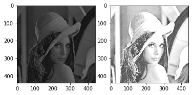

This blog post going over the basic image manipulation things you can
do with Open CV. [Open CV](https://opencv.org/) is an open-source
library of computer vision tools. Open CV is written to be used in
conjunction with deep learning frameworks like
[TensorFlow](https://www.tensorflow.org/). This tutorial is going to
be using Python3, although you can also use Open CV with C++, Java,
and [Matlab](https://www.mathworks.com/products/matlab.html) 

# Reading and Displaying Images

The first thing that you want to do when you start playing around with
open cv is to import the dependencies required. Most basic computer
vision projects with OpenCV will use NumPy and matplotlib. All images
in Open CV are represented as NumPy matrices with shape (x, y, 3),
with the data type uint8. This essentially means that every image is a
2d matrix with three color channels for BGR where each pixel can have
an intensity between 0 and 255. Zero is black where 255 is white in
grayscale. 


```python
# Open cv library
import cv2

# numpy library for matrix manipulation
import numpy as np

# matplotlib for displaying the images 
from matplotlib import pyplot as plt
```

Reading an image is as easy as using the "cv2.imread" function.  If
you simply try to print the image with Python's print function, you
will flood your terminal with a massive matrix. In this post, we are
going to be using the infamous
[Lenna](https://en.wikipedia.org/wiki/Lenna) image which has been used
in the Computer Vision field since 1973. 


```python
lenna = cv2.imread('lenna.jpg')

# Prints a single pixel value
print(lenna[50][50])

# Prints the image dimensions
# (width, height, 3 -- BRG)
print(lenna.shape)
```

    [ 89 104 220]
    (440, 440, 3)


By now you might have noticed that I am saying "BRG" instead of "RGB";
in Open CV colors are in the order of "BRG" instead of "RGB". This
makes it particularly difficult when printing the images using a
different library like matplotlib because they expect images to be in
the form "RGB". Thankfully for us we can use some functions in the
Open CV library to convert the color scheme. 


```python
def printI(img):
    rgb = cv2.cvtColor(img, cv2.COLOR_BGR2RGB)
    plt.imshow(rgb)

printI(lenna)
```


Going a step further with image visualization, we can use matplotlib
to view images side by side to each other. This makes it easier to
make comparisons when running different algorithms on the same image. 


```python
def printI3(i1, i2, i3):
    fig = plt.figure()
    ax1 = fig.add_subplot(1,3,1)
    ax1.imshow(cv2.cvtColor(i1, cv2.COLOR_BGR2RGB))
    ax2 = fig.add_subplot(1,3,2)
    ax2.imshow(cv2.cvtColor(i2, cv2.COLOR_BGR2RGB))
    ax3 = fig.add_subplot(1,3,3)
    ax3.imshow(cv2.cvtColor(i3, cv2.COLOR_BGR2RGB))
    
    
def printI2(i1, i2):
    fig = plt.figure()
    ax1 = fig.add_subplot(1,2,1)
    ax1.imshow(cv2.cvtColor(i1, cv2.COLOR_BGR2RGB))
    ax2 = fig.add_subplot(1,2,2)
    ax2.imshow(cv2.cvtColor(i2, cv2.COLOR_BGR2RGB))
    
```

If we zero out the other colored layers and only left one channel, we
can visualize each channel individually. In the following example
notice that image.copy() generates a deep-copy of the image matrix --
this is a useful NumPy function. 


```python
def generateBlueImage(image):
    b = image.copy()
    # set the green and red channels to 0
    # note images are in BGR
    b[:, :, 1] = 0
    b[:, :, 2] = 0
    return b


def generateGreenImage(image):
    g = image.copy()
    # sets the blue and red channels to 0
    g[:, :, 0] = 0
    g[:, :, 2] = 0
    return g

def generateRedImage(image):
    r = image.copy()
    # sets the blue and green channels to 0
    r[:, :, 0] = 0
    r[:, :, 1] = 0
    return r

def visualizeRGB(image):
    printI3(generateRedImage(image), generateGreenImage(image), generateBlueImage(image))
```


```python
visualizeRGB(lenna)
```


# Grayscale Images

Converting a color image to grayscale reduces the dimensionality
because you are squishing each color layer into one channel. Open CV
has a built-in function to do this. 


```python
glenna = cv2.cvtColor(lenna, cv2.COLOR_BGR2GRAY)
printI(glenna)
```


The builtin function works in most applications, however, you
sometimes want more control in which color layers are weighted more in
generating the grayscale image. To do that you can  


```python
def generateGrayScale(image, rw = 0.25, gw = 0.5, bw = 0.25):
    """
    Image is the open cv image
    w = weight to apply to each color layer
    """
    w = np.array([[[ bw, gw,  rw]]])
    gray2 = cv2.convertScaleAbs(np.sum(image*w, axis=2))
    return gray2
```


```python
printI(generateGrayScale(lenna))
```


Notice that the sum of the weights is equal to 1 if it above 1, it
would brighten the image but if it was below 1, it would darken the
image. 


```python
printI2(generateGrayScale(lenna, 0.1, 0.3, 0.1), generateGrayScale(lenna, 0.5, 0.6, 0.5))
```





We could also use our function to display the grayscale output of each
color layer. 


```python
printI3(generateGrayScale(lenna, 1.0, 0.0, 0.0), generateGrayScale(lenna, 0.0, 1.0, 0.0), generateGrayScale(lenna, 0.0, 0.0, 1.0))
```


Based on this output, the red layer is the brightest which makes sense
because the majority of the image is in a pinkish/red tone.  

# Pixel Operations

Pixel operations are simply things that you do to every pixel in the
image. 

## Negative

To take the negative of an image, you simply invert the image. Ie: if
the pixel was 0, it would now be 255, if the pixel was 0 it would now
be 255. Since all the images are unsigned ints of length 8, right
once, a pixel hits a boundary, it would automatically wrap over which
is convenient for us. With NumPy, if you subtract a number from a
matrix, it would do that for every element in that matrix -- neat.
Therefore if we wanted to invert an image we could just take 255 and
subtract it from the image. 


```python
invert_lenna = 255 - lenna
printI(invert_lenna)
```


## Darken And Lighten

To brighten and darken an image you can add constants to the image
because that would push the image closer twords 0 and 255 which is
black and white. 


```python
bright_bad_lenna = lenna + 25

printI(bright_bad_lenna)
```


Notice that the image got brighter but in some parts the image got
inverted. This is because when we add two images, and we don't want to
wrap, we have to set a clipping threshold to be the 0 and 255. IE:
when we add a constant to the image at pixel 240, we don't want it to
wrap back to 0, we just want it to retain a value of 255. Open CV has
built-in functions for this. 


```python
def brightenImg(img, num):
    a = np.zeros(img.shape, dtype=np.uint8)
    a[:] = num
    return cv2.add(img, a)

def darkenImg(img, num):
    a = np.zeros(img.shape, dtype=np.uint8)
    a[:] = num
    return cv2.subtract(img, a)

brighten_lenna = brightenImg(lenna, 50)
darken_lenna = darkenImg(lenna, 50)

printI2(brighten_lenna, darken_lenna)
```


## Contrast

Adjusting the contrast of an image is a matter of multiplying the
image by a constant. Multiplying by a number greater than 1 would
increase the contrast and multiplying by a number lower than 1 would
decrease the contrast. 


```python
def adjustContrast(img, amount):
    """
    changes the data type to float32 so we can adjust the contrast by
    more than integers, then we need to clip the values and 
    convert data types at the end.
    """
    a = np.zeros(img.shape, dtype=np.float32)
    a[:] = amount
    b = img.astype(float)
    c = np.multiply(a, b)
    np.clip(c, 0, 255, out=c) # clips between 0 and 255
    return c.astype(np.uint8)
```


```python
printI2(adjustContrast(lenna, 0.8) ,adjustContrast(lenna, 1.3))
```


# Noise

I most cases you don't want to add random noise to your image,
however, in some algorithms, it becomes necessary to do for testing.
Noise is anything that makes the image imperfect. In the "real world"
this is usually in the form of dead pixels on your camera lens or
other things distorting your view.  

## Salt and Pepper

Salt and pepper noise is adding random black and white pixels to your
image. 


```python
import random

def uniformNoise(image, num):
    img = image.copy()
    h, w, c = img.shape
    x = np.random.uniform(0,w,num)
    y = np.random.uniform(0,h,num)

    for i in range(0, num):
        r = 0 if random.randrange(0,2) == 0 else 255
        img[int(x[i])][int(y[i])] = np.asarray([r, r, r])
        
    return img
printI2(uniformNoise(lenna, 1000), uniformNoise(lenna, 7000))
```


# Image Denoising

It is possible to remove the salt and pepper noise from an image to
clean it up. Unlike how my professor worded it, this is not
"enhancing" the image, this is merely using filters that remove the
noise from the image by blurring it.  

## Moving Average

The moving average technique sets each pixel equal to the average of
its neighborhood. The bigger your neighborhood the more the image is
blurred. 


```python
bad_lenna = uniformNoise(lenna, 6000)

blur_lenna = cv2.blur(bad_lenna,(3,3))

printI2(bad_lenna, blur_lenna)
```


As you can see, most of the noise was removed from the image but,
imperfections were left. To see the effects of the filter size, you
can play around with it. 


```python
blur_lenna_3 = cv2.blur(bad_lenna,(3,3))
blur_lenna_8 = cv2.blur(bad_lenna,(8,8))
printI2(blur_lenna_3, blur_lenna_8)
```


## Median Filtering

Median filters transform every pixel by taking the median value of its
neighborhood. This is a lot better than average filters for noise
reduction because it has less of a blurring effect and it is extremely
well at removing outliers like salt and pepper noise.  


```python
median_lenna = cv2.medianBlur(bad_lenna,3)

printI2(bad_lenna, median_lenna)
```


# Remarks

Open CV is a vastly powerful framework for image manipulation. This
post only covered some of the more basic applications of Open CV.
Future posts might explore some of the more advanced techniques in
computer vision like filters, Canny edge detection, template matching,
and Harris Corner detection.  
