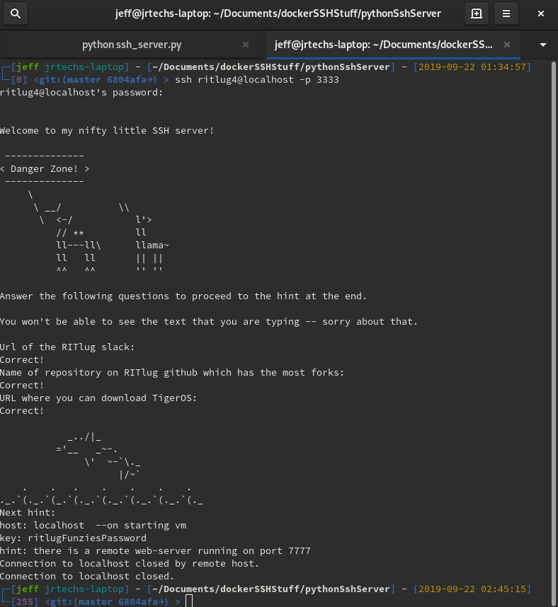
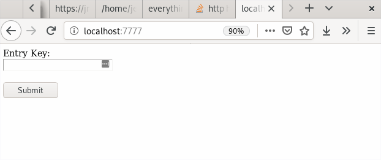
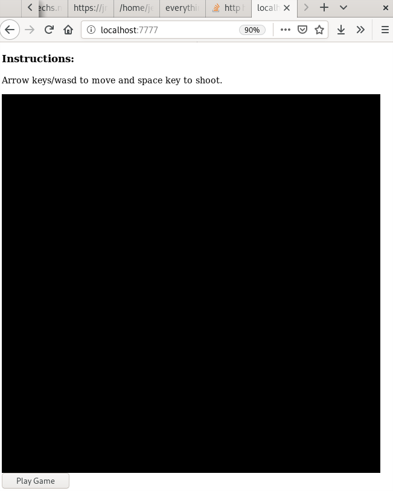
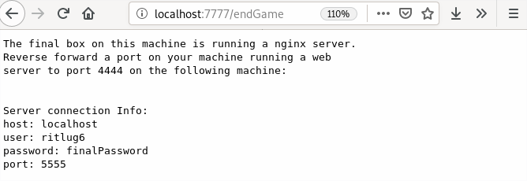
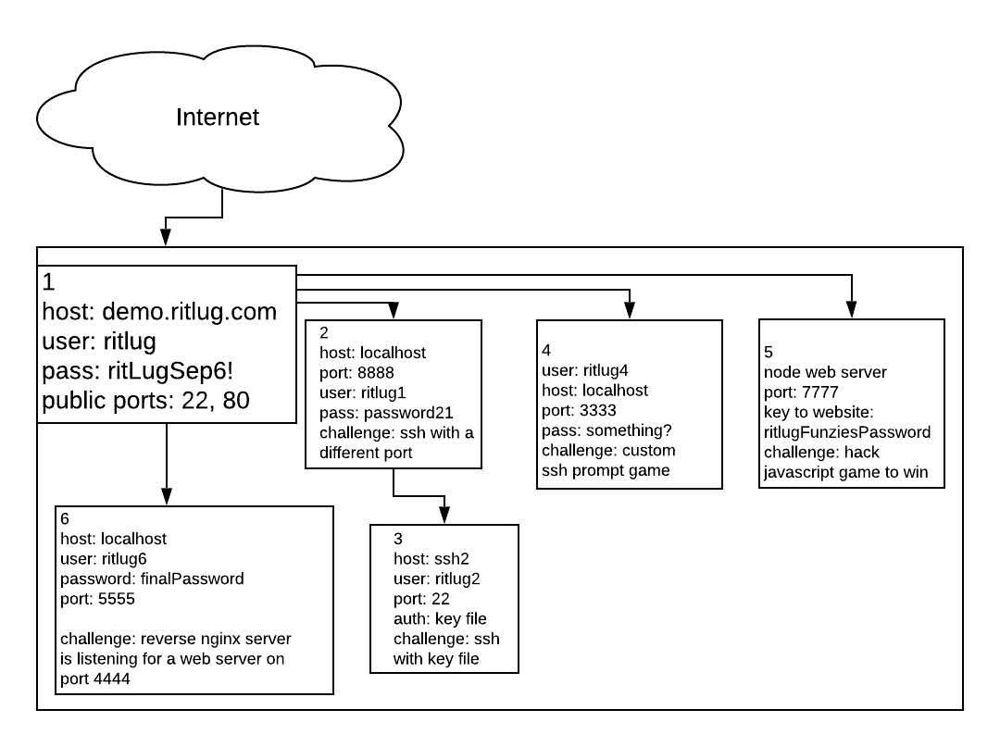

A few weeks ago at [RITlug](https://ritlug.com) I gave a talk teaching people
about how to use SSH. After a quick presentation going over the basics of SSH
there was a CTF-esk challenge. We had a great turnout and engagement during this
meeting so I look forward to making more interactive workshops like this in the future.  

<customHTML />

# SSH Challenge

This section will go over the SSH challenge and how to solve it.
Please note: although passwords, hosts, etc are given, the challenge is no-longer active so none of them will work.


## Basic SSH

This initial challenge was simply connecting to the base VM with a provided username and password.

```
ssh ritlug@demo.ritlug.com
```

In the home directory there is a file called hint.md.
Since no text editors were installed, you had to use the cat command to view the contents of the file.

```
host: localhost
user: ritlug1
port: 8888
password: password21
```


## SSH With Different Port

Based on the previous hint, you have to SSH into another SSH server from the base VM running on a non-default port.

```
# on main connection(demo.ritlug.com)
ssh ritlug1@localhost -p 8888
```

Once again you will find a file called hint.md in the home directory. There is also
a key file called id_rsa in the home directory.

```
Time to jump ships again :)

host: ssh2
port: 22
user: ritlug2
auth: key in home directory
```

## SSH With Key File

While in the first container, SSH into another container with a key file.

```
# on ritlug1@localhost connection
ssh ritlug2@ssh2 -i id_rsa
```

The hint in this vm is as follows:

```
Shall we play a game?

SSH back into the starting vm (demo.ritlug.com)

host: localhost
port: 3333
user: ritlug4
password: something?
```


## SSH into Custom SSH Python Server

SSH into a custom SSH server and play a RITlug trivia game.

```
# on main ssh connection
ssh ritlug4@localhost -p 3333
```



Since the screenshot does not show it, here are the answers to the three RITlug trivia questions:

```
rit-lug.slack.com
teleirc
mirrors.ritlug.com
```

## Access and Play and Hack Game on Internal Web Server

This is the part of the challenge where it starts getting more difficult.
This challenge requires you to port forward localhost:someport to the remote machine's localhost:7777 so you can access a website on your computer.

```
# On your computer
ssh -L 7777:localhost:7777 ritlug@demo.ritlug.com
```

The key was given in the last hint as "ritlugFunziesPassword".



Open web browser and play the game....



The game is way to hard to win; hack it!
There are many ways to hack this basic Javascript game, but, the most basic is to just tell the server that you are scoring a ton of points and then navigate to the /endgame page. 


```javascript
//run this in the console of the game or end game page
for(var i = 0; i < 500; i++)
{
	console.log("Sending stonks.");
	$.ajax({
		type:'POST',
		url: "/stonks",
		crossDomain: true,
		dataType: "json",
		timeout: 3000
	});
}
```

After you acquired a score of over 100 "stonks" you see this at the /endGame page.




## Forward Local Web Server to Remote Host

Deciphering and figuring out how to complete this challenge was by far the hardest challenge.
There was a remote nginx web server running in a docker container which only had its SSH and web ports exposed.

Here is the nginx config for this server:

```nginx
worker_processes 1;

events { worker_connections 1024; }

http {
    server {
        listen 80;
        location / {
            proxy_pass         http://localhost:4444;
            proxy_redirect     off;
            proxy_set_header   Host $host;
            proxy_set_header   X-Real-IP $remote_addr;
            proxy_set_header   X-Forwarded-For $proxy_add_x_forwarded_for;
            proxy_set_header   X-Forwarded-Host $server_name;
        }
    }
}
```

To complete this challenge you had to make a web server running on port 4444 visible to the nginx server.
To do this it took three steps. First, you have to start some web server. Second, you had to local forward the external
VM's ssh port to your computer. Next using that local forwarded port, you have to reverse forward the port of your web server
to the remote computer. 

```
# start your web server listening on port 8989 or something
node server.js

# forward the ssh port of the remote machine to your local computer.
ssh -L 5555:localhost:5555 ritlug@demo.ritlug.com

# forward your web server to the remote machine
ssh ritlug6@localhost -p 5555 -R 4444:localhost:8989
```

Once this is done, your local web-server will be visible on demo.ritlug.com.
Neat.

## High Level Answer Key



# Installing an Instance of this Challenge

This section goes over how to run the docker containers used in this challenge on a stock Debian install.

## Install Docker

```
apt update
apt upgrade
apt install apt-transport-https ca-certificates curl software-properties-common gnupg2
curl -fsSL https://download.docker.com/linux/debian/gpg | sudo apt-key add -
add-apt-repository "deb [arch=amd64] https://download.docker.com/linux/debian $(lsb_release -cs) stable"

apt update
apt install docker-ce
```


## Install Docker-Compose

```
curl -L https://github.com/docker/compose/releases/download/1.25.0-rc2/docker-compose-`uname -s`-`uname -m` -o /usr/local/bin/docker-compose
chmod +x /usr/local/bin/docker-compose
```


## Create Firewall

Create firewall to block everything that is not ports 80 or 22

```
apt-get install ufw
ufw enable
ufw allow 22:80/tcp
ufw deny 1000:9999/tcp
```

### Docker Firewall Trickery

Docker tampers directly with IPTables, so, ufw alone won't block people from accessing the internal services running on ports 7777, etc.

#### When When Running Single Container

Edit /etc/default/docker and uncomment the DOCKER_OPTS line:

```
DOCKER_OPTS="--dns 8.8.8.8 --dns 8.8.4.4 --iptables=false"
```

#### Running Docker Compose

Since we are using systemd with Docker Compose, we have to set the iptables flag by creating the following file with:

/etc/docker/daemon.json

```
{
    "iptables": false
}
```


## Add Base User For Demo

```
useradd -ms /bin/bash ritlug
echo ritlug:ritLugSep6! | chpasswd
```

## Install project files on system

```
git clone https://github.com/jrtechs/ssh-challenge.git

cd ssh-challenge

# Prevents the ritlug user from modifying the hint file
cp hint.md /home/ritlug/hint.md
chmod 0555 /home/ritlug/
```

## Running the Project

```
docker-compose build
docker-compose up
```

# Resources

- [SSH Essentials](https://www.digitalocean.com/community/tutorials/ssh-essentials-working-with-ssh-servers-clients-and-keys)
- [SSH Config Files](https://linuxize.com/post/using-the-ssh-config-file/)
- [Git Repo and Write Up for Challenges](https://github.com/jrtechs/ssh-challenge)
