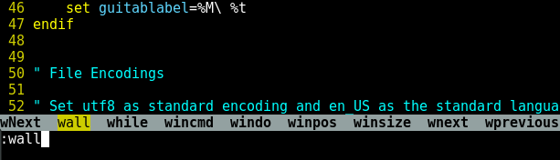

# Vim Configuration

Stock Vim is pretty boring.
The good news is that Vim has a very comprehensive configuration file which
allows you to tweak it to your heart's content.
To make changes to Vim you simply modify the ~/.vimrc file in your home
directory.
By adding simple commands this file you can easily change the way your
text editor looks.
Neat.

I attempted to create the smallest Vim configuration file which makes
Vim usable enough for me to use as my daily text editor. 
I believe that it is important for everyone to know what their
Vim configuration does. 
This knowledge will help ensure that you are only adding the things
you want and that you can later customize it for your workflow.
Although it may be tempting to download somebody else's massive Vim
configuration, I argue that this can lead to problems down the road.

I want to mention that I don't use Vim as my primary
IDE; I only use Vim as a text editor.
I tend to use JetBrains tools on larger projects since they have amazing
auto complete functionality, build tools, and comprehensive error detection.
There are great Vim configurations out there on the internet; however, most
tend to be a bit overkill for what most people want to do. 

Alright, lets dive into my vim configuration!


# Spell Check

```vim
autocmd BufRead,BufNewFile *.md setlocal spell spelllang=en_us
autocmd BufRead,BufNewFile *.txt setlocal spell spelllang=en_us
```

Since I am often an atrocious speller, having basic spell check abilities in 
Vim is a lifesaver.
It does not make sense to have spell check enabled for most files since it
would light up most programming files like a Christmas tree.
I have my Vim configuration set to automatically enable spell check for markdown files
and basic text files. 
If you need spell check in other files, you can enter the command 
":set spell" to enable spell check for that file.
To see the spelling recommendations, type "z=" when you are over a
highlighted word.


# Appearance

Adding colors to Vim is fun.
The "syntax enable" command tells vim to highlight keywords in programming
files and other structured files.

```vim
syntax enable
```

I would encourage everyone to look at the different color schemes available for
Vim. 
I threw the color scheme command in a try-catch block to ensure that it does not crash
Vim if you don't have the color scheme installed.
By default the desert color scheme is installed; however, that is not always the 
case for [community created](http://vimcolors.com/) Vim color schemes. 

```vim
try
    colorscheme desert
catch
endtry

set background=dark
```

# Indentation and Tabs

Having your indentation settings squared away will save you a ton of time
if you are doing any programming in Vim. 

```vim
"copy indentation from current line when making a new line
set autoindent
" Smart indentation when programming: indent after {
set smartindent 

set tabstop=4     " number of spaces per tab
set expandtab     " convert tabs to spaces
set shiftwidth=4  " set a tab press equal to 4 spaces
```

# Useful UI Tweaks

These are three UI tweaks that I find really useful to have, some people may
have different opinions on these.
Seeing line numbers is useful since programming errors typically just 
tells you what line your program went up in flames.
The cursor line is useful since it allows you to easily to find your place
in the file -- this may be a bit too much for some people.

I like to keep every line under 80 characters long for technical files,
having a visual queue for this is helpful.
Some people prefer to just use the auto word wrap and keep their lines as long
as they like.
I like to keep to the 80 character limit and explicitly choose where
I cut each line.
Some of my university classes mandate the 80 character limit and take
points off if you don't follow it. 

```vim
" Set Line Numbers to show "
set number

" Highlights the entire current line with a underscor "
set cursorline

" Displays a red bar at 80 characters "
set colorcolumn=80
```


# Searching and Auto Complete

This these configurations make searching in Vim less painful.

```vim
" search as characters are entered "
set incsearch
" highlight matched characters "
set hlsearch

" Ignore case when searching "
set ignorecase
```

These configurations will make command completion easier by 
showing an auto-complete menu when you press tab. 

```vim
" Shows a auto complete menu when you are typing a command "
set wildmenu
set wildignorecase " ignore case for auto complete
```




# Useful Things to Have

There is nothing too earth shattering in this section, just things that
might save you some time.
Enabling mouse support is a really interesting configuration.
When enabled, this allows you to select text and jump between different
locations with your mouse.

```vim
" Enables mouse support "
set mouse=a

"Disable ding sound on error, flashes cursor instead "
set visualbell

" Display ruler on bottom right -- should be there by default "
set ruler

" Auto updates file if an external source edits the file "
set autoread

" Improves performance by only redrawing screen when needed "
set lazyredraw
```

Setting your file format is always a good idea for compatibility. 

```vim
" Set utf8 as standard encoding and en_US as the standard language "
set encoding=utf8

" Use Unix as the standard file type "
set ffs=unix,dos,mac
```

# Wrapping it up

I hope that this quick blog post inspired you to maintain your own Vim
configuration file.
You can find my current configuration files in my 
[random scripts repository](https://github.com/jrtechs/RandomScripts/tree/master/config).
