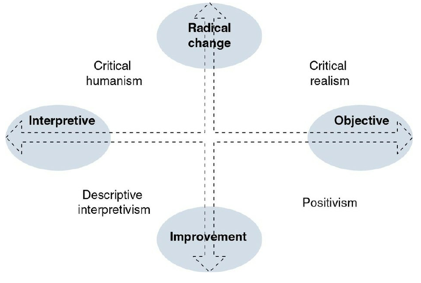
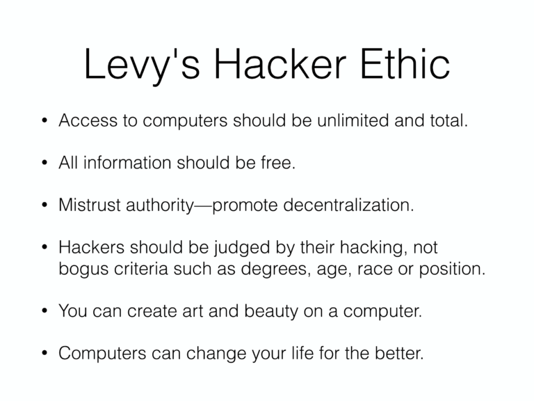
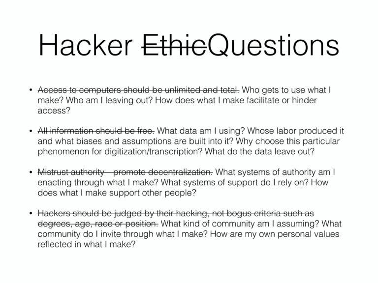

Last week I looked at [*Programming is Forgetting: Toward a New Hacker
Ethic*](http://opentranscripts.org/transcript/programming-forgetting-new-hacker-ethic/)
for a second time. This was an amazing talk given by Allison Parrish
at the Open Hardware Summit in 2016. The first time I was introduced
to this talk was over a year ago by a friend that was introducing me
to the nuanced differences between "new" and "old" FOSS (Free and Open
Source Software) cultures. Whenever I listen to this talk I get
reminiscent about all the 70's and 80's hacker literature like the
["Hackers Manifesto"](http://phrack.org/issues/7/3.html) that 
inspired me when I was in middle school.   

<youtube src="4kiXCeJwrMQ" />

In Parrish's talk she examined the points that Levy makes in his book 
*Hackers: Heroes of the Computer Revolution*. This talk picked out how
aspects of Levy's hacker ethos are problematic and how we can work to
change this Hacker Ethic to be more supporting of diverse communities.

However, before we dive into the breakdown of Levy's and Parrish's
arguments, it is important to have a common understanding of these
things:   

- what being a "hacker" means
- our assumptions about learning, knowing and society

## What "Hacker" Means

<youtube src="msX4oAXpvUE" />

The mainstream definition of a "hacker" is a derogatory term to
describe cyber-criminals; however, "hacker" in the tech world is a
very positive and well appraised term. In the tech world, "hacker" is
used synonymously with geek: people who love to tinker with computers
at great lengths. Due to the vast differences in the interpreted
meaning of "hacker", people have been recently avoiding it. For this
article and in general when people typically talk about "hacker
culture", they are referring to the positive definition of hacker.    

## Assumptions on knowledge and society

Being the philosophy buff that I am, I believe that recognizing our
assumptions about knowledge and society is quintessential to
understanding Levy's and Parrish's understanding of the hacker ethic. 

On the scale of knowledge, people fall somewhere on the scale between
subjective and objective thinking. An objectivist seeks
generalizations, favors statistical analysis, and views reality as a
fact separate from human experience. A subjectivist views that reality
is formed through personal experience and views knowledge as a working
definition up for change. When discussing learning, an objectivist
will try to find the **Truth**, where a subjectivist will seek to
learn **truths**. In policy analysis, objectivists would favor
quantitative methods where subjectivists would favor qualitative
methods.   

On the scale of social processes people usually fall on a spectrum
between *radical change* and *improvement*.   

Status Quo (Improvement)   

- social order
- consensus
- actuality

Radical Change   

- power structures
- radical change
- modes of domination
- contradiction
- potentiality

Although people don't always fall at perfect edges of these spectrum,
it provides a good frame of reference for analysis. I'm going to argue
that Levy's ethos falls in the *positivism* quadrant where Parrish's
ethos falls in the *Critical Humanism* quadrant.  

# Levy's Hacker Ethic

# Parrish's Hacker Ethic Rewrite

# Why the difference?

Despite the rewrite, both hacker ethics still emphasize the following
points:  

- sharing
- openness
- free access to computers
- world improvement

The major difference between the two ethics is not in the fundamental
message but on the philosophical perspective of the authors.  

Levy's hacker ethic was written and interpreted using the
incrementalism framework.  Computer hacking is the means of
incrementally improving flawed technology moving towards the
**Truth**-- a computer system that perfectly works.  

Allison's hacker ethic focuses on how can we use technology to better
**truths**-- multiple computer systems designed with different
purposes to better support communities. 

# Who is right?

As a subjectivist I would argue that the debate over which one is the
**True** hacker ethic is fruitless. Since Parrish did not radically
change the Hacker Ethic, I believe that we should consider it as a
valuable contribution to the Hacker Ethic. Moving forward with this
improved working definition of the ideal hacker, I believe that it
will better enable us to better support communities. 

Positivism has long been the dominant perspective when it comes to
politics and research. However, in recent years there has been a
shift towards a mix of objective and subjective perspectives 
in research. This is due to the fact that when you look at the
objective **Truth** or average of a population you often ignore minorities
and edge cases. In public policy, an objective viewpoint is useful
when doing cost-risk analysis; however, subjective research is useful
when identifying complex social issues that are hard to quantify with
numbers. 

# How did we get here in technology?

During the [Future is Open
Conference](https://fossrit.github.io/events/2019/10/26/the-future-is-open/)
[Mike Nolan](https://nolski.rocks/) gave an amazing analogy that
exhibits how we got here and why we need to have the objective vs
subjective debate in FOSS and hacker culture. Nolan compared
the beginning of technology to homesteading in the western frontier.
In the  beginning, there was plenty of land for everyone and everyone
got their own chunk of land. Everyone was happy and they maintained
their land or software independently of each other. There was rarely
an issues. However, as time went on you couldn't get your own plot of
land. We now all live in large cities packed with communities,
governments, and law affecting our every action. With all of these
competing entities it is impossible to work on instrumental software
without interacting with these entities. 

The things that hackers make often start as a personal project. We as
hackers are content with perusing these projects towards our own
objective **Truth**. What started as a personal project may turn into
a massive open source project that dozens of  communities depend on.
This is the root of a ton of friction now in days: our objective
**Truth** may not align with the **truths** or needs of the community.
To alleviate this "friction", I believe that adopting Allison's
subjective interpretation of the Hacker Ethic is a great way to start.
