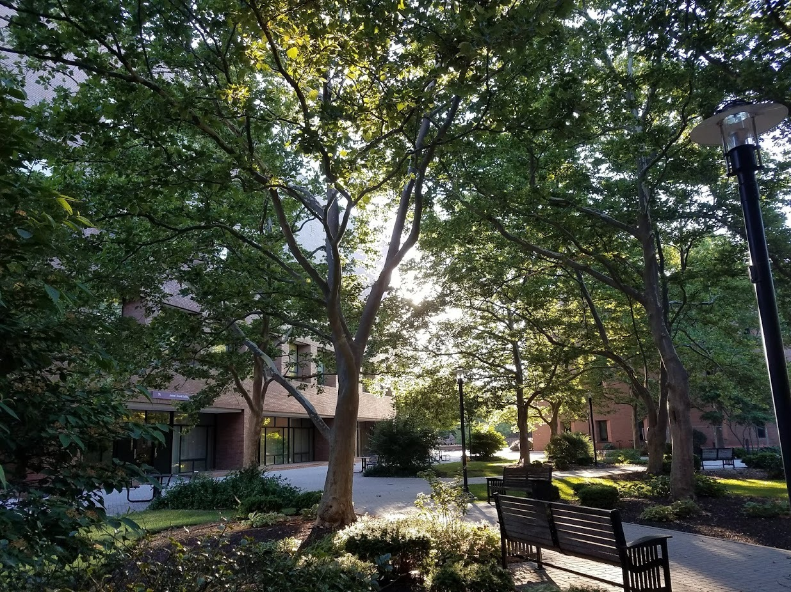

Inspired by [Justin Flory](https://justinwflory.com/) and [Dan
Schneiderman](http://www.schneidy.com), I decided to make a 2018
review post. I believe that it would be a good way to reflect upon
what I did in 2018 and make plans for 2019. This post will be a very
high level overview of the projects and activities that I did in 2018
-- nothing personal. Pictures say a thousand words, so, I will include
a lot. 

# January:

**Eagle Ceremony**

**Started Second Semester of College**

Classes: 

- Mechanics of Programming
- Statistics
- Discrete Math
- Communications
- Moral Issues

**Brick hack 4**

# February:

**RIT Career Fair**

**Build my Blog in Node.js**

# March:

**Upgrading Floppy Drive Project**

**Designed Website for Hoffends**

# April:

**Imagine RIT**

# May:

**End of Second Semester**

**Started SSA Research Job**

# June:

**Steam Graph Project**

<youtube src="DoDaHmyIPvQ" />

# July

**Summer!**

<youtube src="t7s2alt0sQ8" />

**Updated UI for the Blog**

# August:

**Presented at RIT's Undergraduate Research Symposium**

**Second Year of College**

First year on the Eboard of RITlug as Vice President. 

Classes: 

- Linear Algebra
- Analysis Of Algorithms
- CS Theory
- SWEN
- Public Policy

# September:

**End of Summer :(**

# October:

**Hacktoberfest**

# November:

**Foss [Election Night Hackathon](https://www.hackathon.com/event/8th-annual-election-night-hackathon---2018-midterms-51634099983)**

**Rochester Maker Fair**

# December:

**End of Fall Semester**

