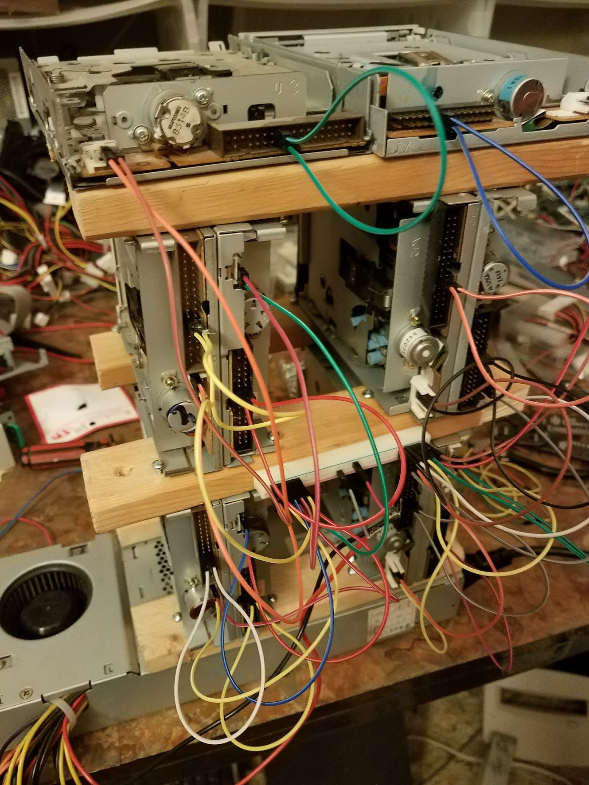

# January:

- Received Eagle Award
- Started Second Semester of College
- Started work on my new blogging platform
- Brick hack 4

# February:

- RIT career faire

- New version of website goes live

# March:

- Upgrading Floppy drive Project to tower structure

- Made a new website for Hoffends

# April:

- Imagine RIT

# May:

- End of second semester
- Started SSA research job.

# June:

- Steam graph project
<iframe width="100%" height="315" src="https://www.youtube.com/embed/DoDaHmyIPvQ" frameborder="0" allow="accelerometer; autoplay; encrypted-media; gyroscope; picture-in-picture" allowfullscreen></iframe>

# July

- Summer!
<iframe width="100%" height="315" src="https://www.youtube.com/embed/t7s2alt0sQ8" frameborder="0" allow="accelerometer; autoplay; encrypted-media; gyroscope; picture-in-picture" allowfullscreen></iframe>

# August:

- Presented at RIT's undergraduate research symposium.

- Second year of college starts!
    - First year on Eboard of RITlug

# September:

- End of Summer :(

# October:

- Hacktoberfest

# November:

- Foss [Election Night Hackathon](https://www.hackathon.com/event/8th-annual-election-night-hackathon---2018-midterms-51634099983))

# December:

- End of Fall semester
