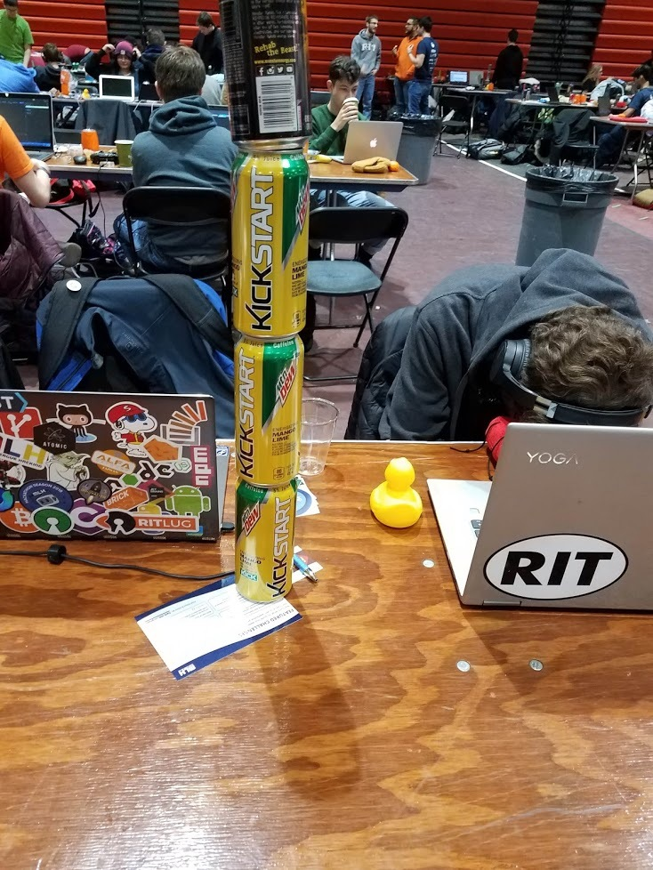
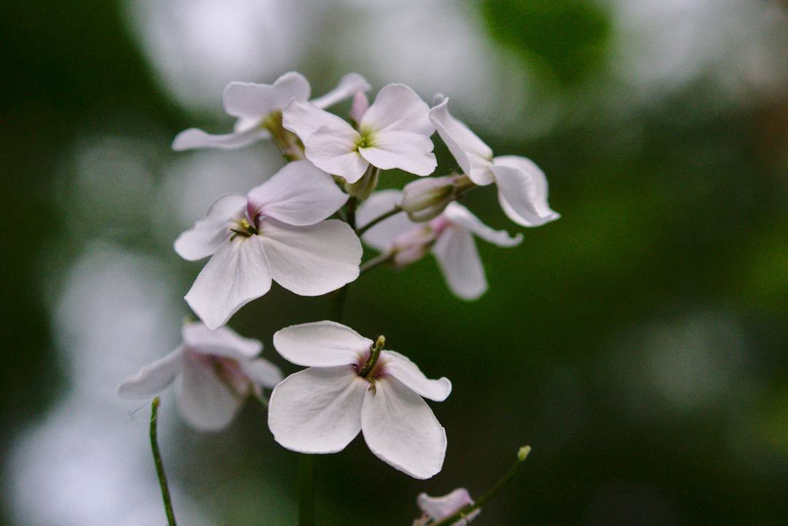

Following the tradition I started last
[year](https://jrtechs.net/other/2018-in-review), I'm making a quick
"year in review" blog post. At this point year in review posts are
cliché, however, I want to continue the tradition because reflection
helps me move forward with a focused vision on what is important.  I'm
going to chunk this into semesters because that is how my college
brain thinks right now.  

# Spring Semester

During the spring semester, I was on CO-OP at RIT doing research.  

## Talks Given

- Intro to R
- [Graph Databases](https://ritlug.com/talks/2019/03/01/graph-databases/)
- Adversarial Networks in Cyber Security
- How Hackers use Genetic Algorithms to Develop Malware

## Favorite Blog Posts Written

- [College Cooking](https://jrtechs.net/other/college-cookbook)
- [Making a Genetic Algorithm](https://jrtechs.net/data-science/lets-build-a-genetic-algorithm)
- [Closer Look at Fitbit Data](https://jrtechs.net/data-science/a-closer-look-at-fitbit-data)
- [Multi Threaded File IO](https://jrtechs.net/programming/multi-threaded-file-io)

## RIT Datafest

Data fest is a hackathon for undergraduate students to tackle a
problem using a complex dataset. I helped my team develope a neural
network that predicts fatigue and performance for women's rugby
players.  

## Brick Hack

At [brickhack](https://www.brickhack.io/) I created an interactive
[website](https://github-graphs.com/) that allows you to make friends
graphs using the GitHub API.  

## Imagine RIT

At imagine RIT I presented my musical floppy drive project with
RITlug.  

# Summer Semester

During the summer semester, I continued my research CO-OP out in Rome
NY.  

## Photography

During the summer I picked back up my long lost photography hobby.

### Pixely Falls

### Oriskany Battlefield

### Trip to NJ/NYC

### Boldt Castle

### 4th Of July Fireworks

### Little Falls

### RIT Observatory

## RIT Research Symposium

Near the end of the summer I presented a part of my research at the
RIT Undergraduate research symposium. 

# Fall Semester

During the fall semester I was a busy bee:  

- Took 5 classes
- SWEN 261 TA
- Part-time Research Assistant
- [RITlug](https://ritlug.com) President
- RIT AI Member
- [FOSS @ RIT MAGIC](https://fossrit.github.io/) member

## Talks Given

- [Welcome to RITlug](https://ritlug.com/talks/2019/08/30/welcome-to-ritlug/)
- [Into to R](http://rit-scg.com/workshop/2019/09/30/programming-in-R/)
- [Shells 101](https://ritlug.com/talks/2019/09/30/shells/)
- [Raspberry PI 101](https://ritlug.com/talks/2019/10/25/pi-fest/)
- Hacktoberfest
- [Everything SSH!](https://jrtechs.net/open-source/teaching-ssh-through-a-ctf)
- [Organized and ran a Student Panel on Open Source software during The Future is Open Conference](https://fossrit.github.io/events/2019/10/26/the-future-is-open/)

## Highlighted Blog Posts

- [Developing an AI to Play Asteroids](https://jrtechs.net/data-science/developing-an-ai-to-play-asteroids-part-1) 
- [Responsible Optimization](https://jrtechs.net/other/responsible-optimization)
- [Teaching SSH Through a CTF](https://jrtechs.net/open-source/teaching-ssh-through-a-ctf)

## Maker Faire

This year as RITlug's president, I organized our presence at the
Rochester Maker faire. 

## Favorite Day Trips

### Cobbs Hill Park

### Hamlin Beach

### Chimney Bluffs

# Favorites of 2019

## Movie

Rocketman  

<youtube src="S3vO8E2e6G0" />

## Picture Taken

## Song

Dance Monkey  

<youtube src="q0hyYWKXF0Q" />

## TV Show

Mr. Robot Season 4  

<youtube src="o4r1X1wG1FQ" />

## YouTube Video

<youtube src="8gdJiNqP35k" />

## Book

A Thousand Splendid Suns by Khaled Hosseini 

## Selfie

I'm not a huge fan of selfies, but, I liked this photo enough to put
it on Linkedin profile. 

