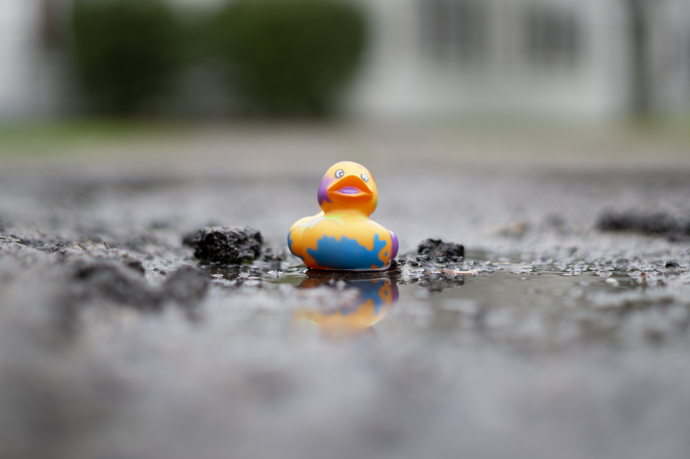

2020; this year will likely live in infamy due to covid. 
Reflecting on this year compared to 2019 is very solemn.
Not necessarily because I didn't accomplish anything; I completed more this year than in 2019. 
But, 2020 lacks so much travel and in-person events that frequently serve as the milestones for my year.

In my 2019 post, I reflect on all the trips that I took, the hackathons I attended, and the places I gave presentations. 
However, this year I feel like I can sum up everything I did in a single sentence. 
I graduated from RIT after taking two consecutive semesters of 18 credit hours, I presented my first published paper at a virtual conference, and I started a full-time job as a software engineer.

Although concise and to the point, this single sentence obviously can't sum up my entire year since it glosses over all the work I've done.
I must summarize 2020 by reflecting on what I've learned: both at school, at work, and in my free time.
This year, I have learned so much about artificial intelligence and data mining; it feels liberating.
Nevertheless, it is impracticable to share those feats since they are not singular events but innumerable hours of work.

However, in this post, I can share some of the personal projects, blog posts, and photos that I cherish the most this year.

# Blog Posts

This year I was amazed at how much I wrote for my blog-- writing a total of 34 blog posts! Going into 2021, I hope to write a blog post every other week. Below, I listed my top 7 favorite blog posts that I wrote in 2020.

- [Segmenting Images with Quadtrees](https://jrtechs.net/photography/segmenting-images-with-quadtrees)
- [Parallel Java Performance Overview](https://jrtechs.net/java/parallel-java-performance-overview)
- [Node2vec with Steam Data](https://jrtechs.net/data-science/node2vec-with-steam-data)
- [Flirting with Burnout at RIT](https://jrtechs.net/other/flirting-with-burnout-at-rit)
- [Word Embeddings](https://jrtechs.net/data-science/word-embeddings)
- [Graphing my Life with Matplotlib](https://jrtechs.net/data-science/graphing-my-life-with-matplotlib)
- [Towards a new Hacker Ethic](https://jrtechs.net/open-source/towards-a-new-hacker-ethic)

# Photography

Although I didn't travel a lot this year, I did manage to do a lot of photography. Below are my six favorite photos of 2020.

