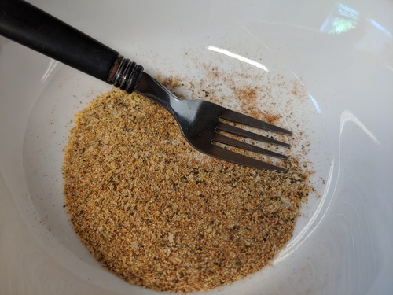
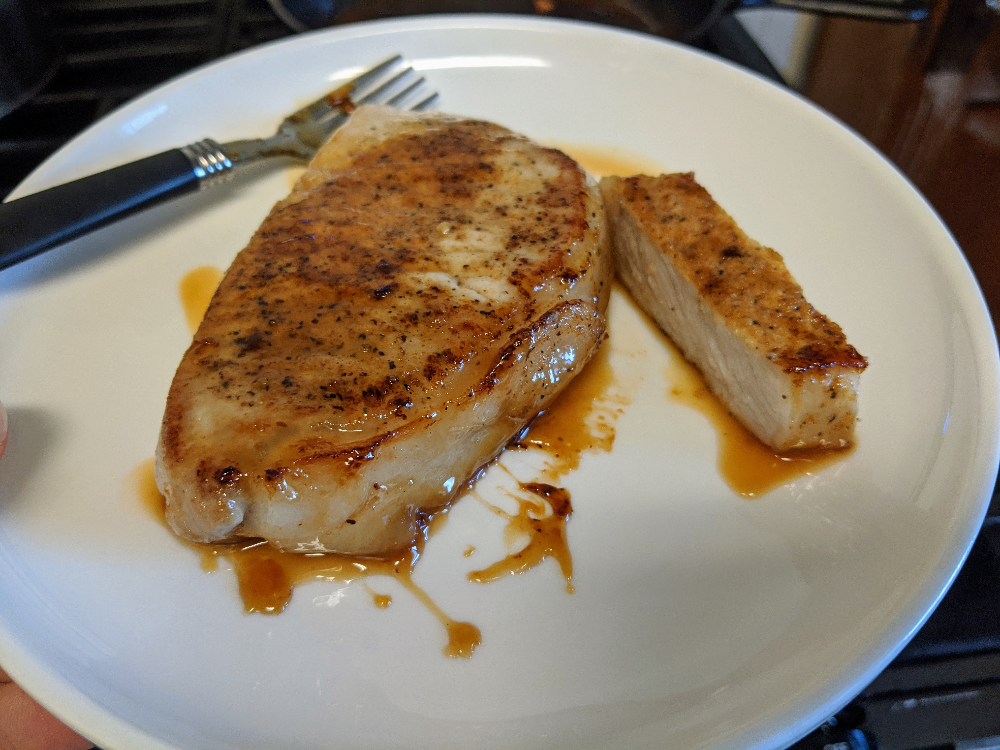
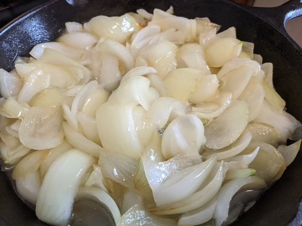
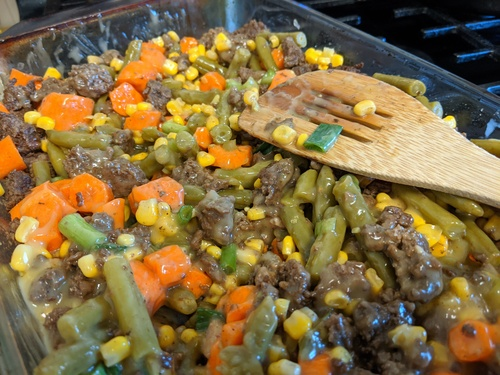
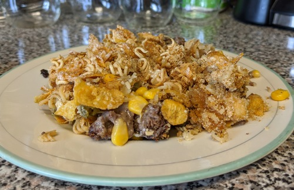
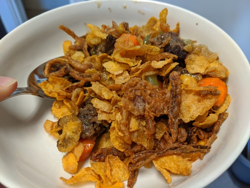

Woah, I'm making part three!!  They say good things come in threes--
unless it's a Disney franchise. This continues my last
[post](https://jrtechs.net/other/college-cookbook) and goes over some
easy-to-prepared and palatable foods that I have cooked.  

# Pork Chops

When done right, pork chops are probably the best meat you can cook --
I enjoy pork chops more than steak. I start by seasoning the chops in
a rub consisting of salt, pepper, garlic, onion powder, paprika,
cayenne powder. 

After I sear one side in butter on medium heat, I flipped it and added
my marinade sauce consisting of honey, brown sugar, dijon mustard, and
balsamic vinegar. 

Using a thermometer, I cook it to just 150 degrees to keep them juicy.
This is important because overcooking pork chops can quickly dry them
out. 

# French Onion Soup

Not everyone is a fan of french onion soup; however, if you are, this
is an easy soup to make. You start by sauteing onions in salt, and
pepper, sugar, and olive oil until they just begin to brown. Yep,
that's right: sugar. Not all recipes call for it, but adding sugar
will help the onions carmelize. 

Combine the onions and some chicken broth in a crockpot and cook on
low for about 4-6 hours. To flavor the soup, I usually add minced
garlic and a small amount of soy sauce. Don't cook too long because
the onions will get mushy. 

When serving this soup, just add some shredded cheese and pepper to
the top.  If you're like me and are out of shredded cheese, just hack
some chunks of cheese on top of it.  

# Casserole

This is a dish that I wish I started making earlier. It is
straightforward to make, cheap, and tastes delicious. I was first
inspired to make this after watching Charlie Berens video on
mid-western "hot-dishes." 

<youtube src="FdpoQww4oVc" />

This hot dish is straightforward: meat + vegetable + creamy soup +
crunchy thing on top = hot dish. I've experimented with this dish a
lot; for vegetables, I find that green beans, corn, and carrots work
pretty well together. For meat, you can use just about anything but, I
usually stick to either ground meat or chicken. You can do tater-tots,
french onions, frosted flakes, or crushed up roman noodles for
toppings. Personally, I really enjoy the frosted flakes and tater-tots
on the casserole. You can add some flavor to the vegetables by adding
minced garlic, pepper, salt, and onion powder 

When browning the meat in general, it is essential to keep the meat in
larger chunks until almost finished cooking. This will lock in the
juiciness and gives it a good texture. After browning is nearly done
cooking, break up the meat and de-glaze the pan with either soy sauce,
balsamic vinegar, or red wine. This step will add some flavor to the
meat and help brown it. 

Combine the meat and vegetables in the casserole pan and then top with
toppings a starch. Cover with aluminum foil and cook in the oven for
about 50 minutes at 375. Remove the aluminum and bake for an
additional 10 minutes until the top starts to get brown. 

And there you have it: the infamous hot dish. Depending on what you
put on it, it is pretty healthy and only costs about $5-6 to make. 

# Home Fries

I love homefries! I haven't made them a lot since I gravitate towards
making one-dish meals, but this creates a fantastic side dish. 

To make homefries, you wash and dice potatoes and then coat them in
seasoning and oil before frying in a pan Pretty self-explanatory. 

For my seasoning, I typically use salt, pepper, garlic, onion powder,
and paprika. But, you can experiment with this and add other spices
like mustard powder and chili powder.  

If you fry the homefries with some eggs and cheese, it makes a great
breakfast. 

# Other Posts

Be sure to check out my two previous "college cookbook posts": [part
1](https://jrtechs.net/other/college-cookbook), [part
2](https://jrtechs.net/other/college-cookbook-part-2). I hope that
this series helps other people to learn how to cook dishes without
using a recipe. Although using recipes can produce predictable
results, cooking is about trying new spices and finding a flavor
pallet that you enjoy. Cooking is also looking into your cabinets'
depths and the back of your freezer and figuring out what you can
throw together in 15 minutes.
