I occasionally cooked during High School, however, college was my first real experience cooking on 
a daily basis. Since I have lived to tell the tail, I want to share some of the recipes that
I created/modified which got me through my first two years of college.

# Level 1: Cooking in the Dorms

Being stuck in a dorm room you are limited to only being able to use the microwave.
Desperate times calls for depraved cooking solutions.

## Ramen Pizza

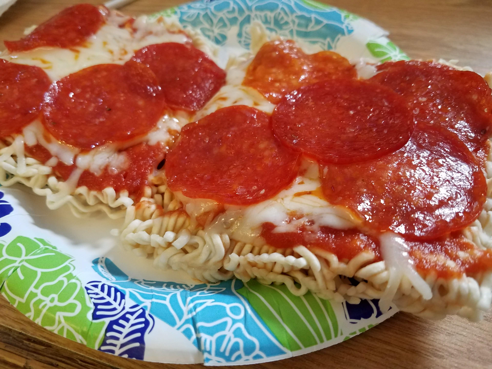

This recipe surprised me as to how it turned out.
You start making this by microwaving ramen noodles for about a third of the instructed time in a bowl of water.
When you place the noodles in the bowl, make sure to not break them apart. 
After cooking, take the romen noodles out of the bowl, dry, and place on a plate.
Next, you slather the ramen noodles with your desired pizza toppings and place in the microwave for around 2 minutes. 

### Ingredients

- Ramen Noodles
- Pasta or Pizza Sauce
- Shreaded Cheese
- Pizza Toppings

## Omelet In a Mug

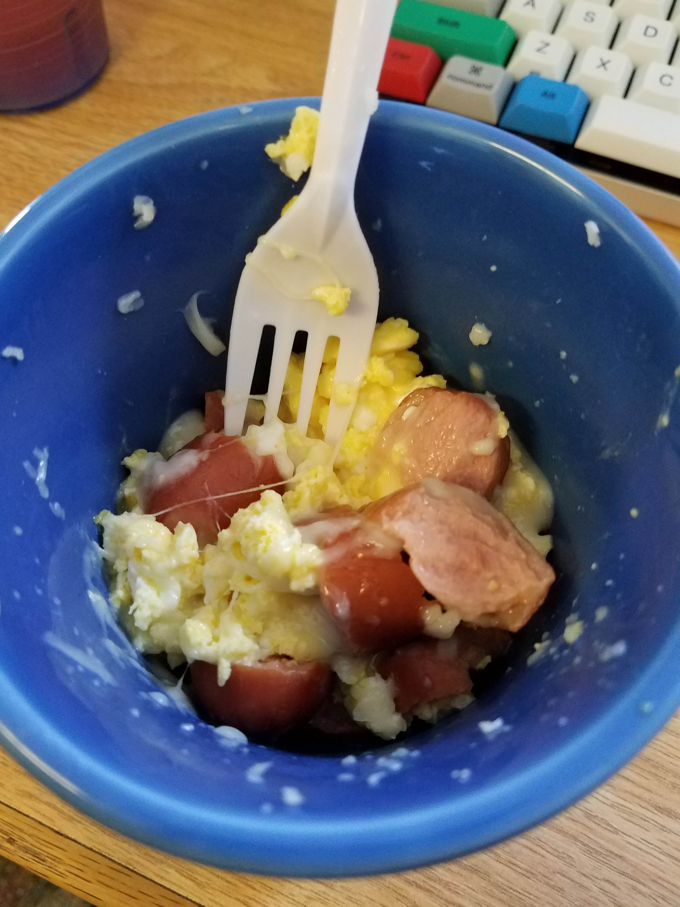

Life hack: you can cook scrambled eggs in a microwave using a coffee mug.
The resulting eggs are abnormally fluffy and taste a little strange, but, it makes for a quick meal.
It just so happens that you can also cook hot dogs in the microwave.

When I stumbled upon this recipe, I clung to it since it was fast, cheep, 
and most of the dinning places on campus were closed by the time I got out of work. 
To make this, you crack and mix two eggs in a coffee cup. 
You then microwave the coffee mug, mixing the eggs every 30 seconds.
Half way through cooking the eggs, you add a diced hotdog and some shredded cheese.
Once your eggs have all cooked, you can add a healthy dosage of salsa.
Voila, you have an omelet which can compete with whatever they are serving at the dinning hall.

## Ingredients
- 1-2 Eggs
- 1 Hotdog
- Cheese
- Salsa

# Level 2: Cooking With no Time

Time is *very* scarce as a college student, I found the following recipes to be fast and easy.
These recipes are very forgiving in the sense that you can change the directions and ingredients and still end up with something resembling food. 

## Chili

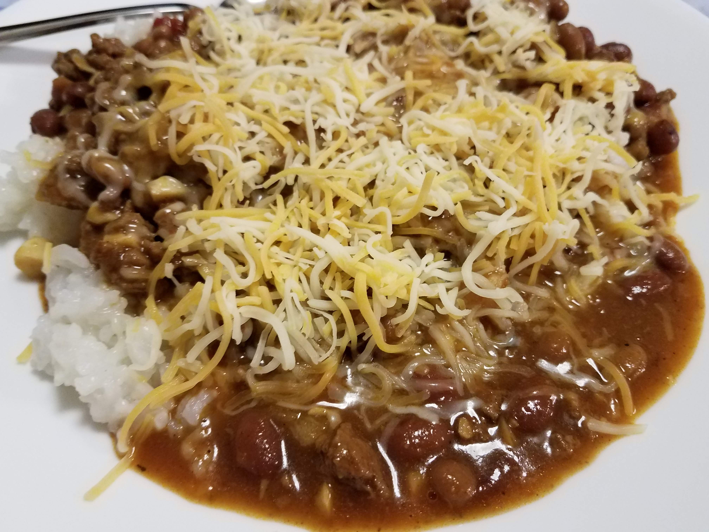

It is *very* hard to make a bad chili. 
All you essentially have to do is gather/prep all the ingredients and plop them in a crock pot and cook for 6-8 hours on low.
You don't have to cook this in a crock pop, however, it takes more time to prepare on the stove since you have to monitor it while it cooks for an hour on medium heat.
I usually saute the onions while I cook the ground beef so that it cooks in the grease of the beef. 
The average prep time for this recipe is around 20-30 minutes. 
However, if you made this vegetarian you can probably cut the prep time down to a mere 10 minutes. 

### Ingredients

**Recommended**

- 1 Sauteed Sweet Onion
- 1/4-1/2 lbs Browned Ground Beef
- 2-3 Cans of Beans (Chili and Baked Beans go Well Together)
- Can of Diced Tomatoes

**Optional**

- Can of Corn
- Diced Pepper
- Minced Garlic
- Mustard
- Ketchup
- Chili Powder
- Pepper Flakes
- Brown Sugar

## Poor Man's Chicken Parmesan

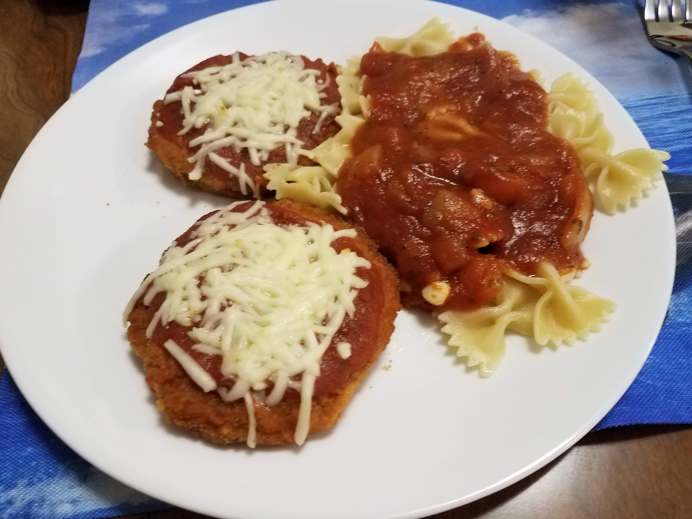

I call this poor man's chicken parmesan only because it uses chicken patties, this actually tastes really good.
To prepare this you slather chicken patties with pasta sauce and cheese and then cook normally in the oven.
While the chicken patties bake, you can cook your normal pasta noodles and sauce.
You serve the pasta noodles with the sauce topped with the cheesy chicken pattie.

### Ingredients
- Chicken Patties
- Pasta Sauce
- Pasta Noodles
- Cheddar Cheese

## Soup

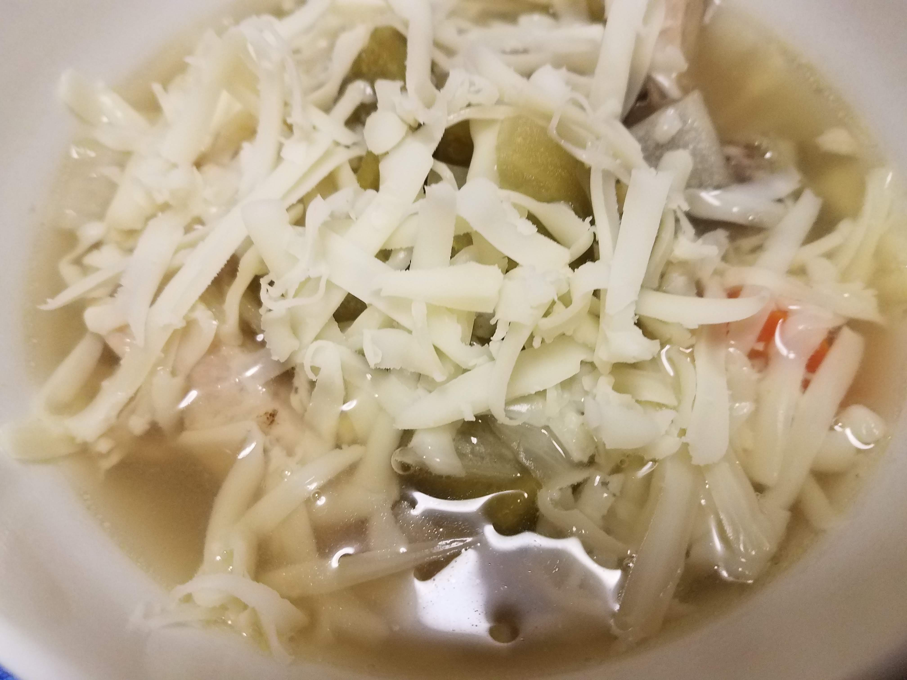

This is an easy recipe which has *so* many combinations.
I usually make some form of chicken soup, the rest of the ingredients are entirely dependent on what I have in the kitchen.
You will have to play around with my recommenced ingredient list to find the perfect combination for you, however, I have not found a combination which did not work with me-- yet. 
Similar to chili, you just put all the ingredients in a crock pot and let simmer on low for 6-8 hours.
I would recommend putting in spices like garlic and basil during the last hour of cooking to keep their flavors sharp.
You want to add the salt and pepper to the soup in the beginning.

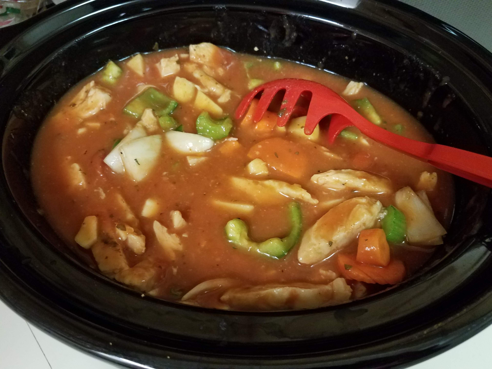

### Ingredients
- Bag of Frozen Chicken Strips
- 3-4 Diced Potatoes
- Chicken Stock

**Whatever of these you have**

- Diced Carrots
- Diced Onions
- Can of Diced Tomatoes
- Can of Tomato Soup
- Can of Corn
- Diced Peppers
- Stalks of Celery
- Mushrooms
- Minced Garlic
- Basil
- Salt
- Pepper
- Brown Sugar

## Potato Casserole 

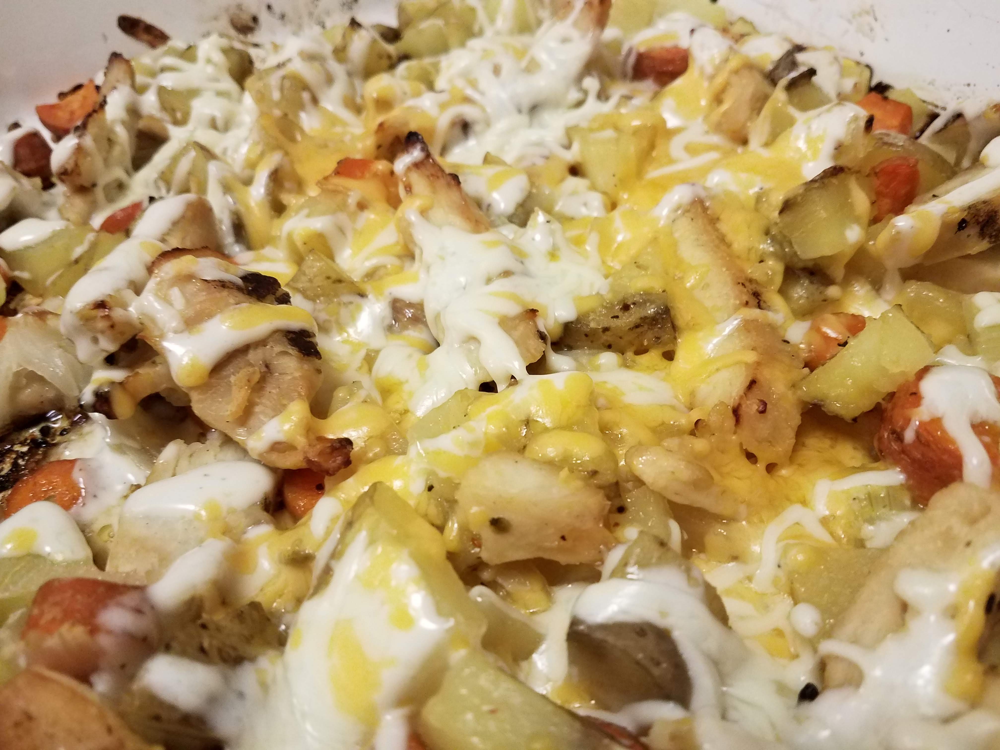

For this recipe you cut all the vegetables and place them in a large baking pan with the chicken strips.
If you want, you can also mix in some seasonings like salt, garlic, pepper, and basil. 
You then then mix everything together with some canola or vegetable oil.
Cook this casserole in a 350 degrease oven for around 30 minutes.
Briefly take this out of the oven and top with cheese and ranch dressing and place back in oven for another 10-15 minutes.
If you are really cheap, you can make this with hot dogs rather than pre-cooked chicken strips. 

### Ingredients
- 4-6 Peeled and Cubed Potatoes
- 1-2 Diced Onions
- Bag of Chicken Strips
- Minced Garlic
- Chopped Carrots
- Canola or Vegetable Oil
- Ranch Dressing
- Sour Cream
- Cheeses

# Level 3 Cooking

Once you master the art of sauteing onions and making soups, you are ready to advance to level three.
Nothing I will present is incredibly difficult, but, there is more room for mistakes and takes longer to prepare. 

## Fried Rice

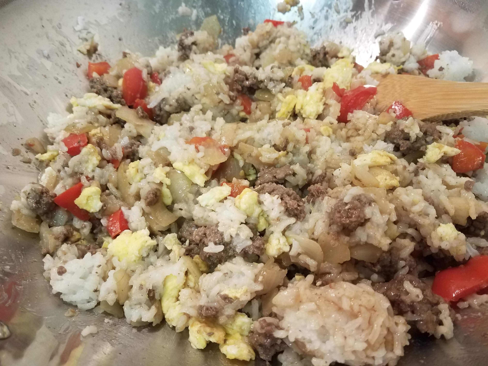

The challenging part of this recipe is getting the correct timing.
To finish this dish in 40 minutes, you want to cook 2 cups of rice, brown ground beef with onions and cook 3 scrambled eggs all simultaneously.
You then combine all these ingredients in a large fry pan with vegetables and soy sauce.
If you want to prevent the dish from turning out sticky, you should use left over rice. 
Or, cook the rice first and then let if cool in the fridge for a few hours.

### Ingredients
- 1-2 Cups of Rice
- 1/2 lbs of Ground Beef
- 1 Onion
- Broccoli or Peas
- Soy Sauce

## Chicken

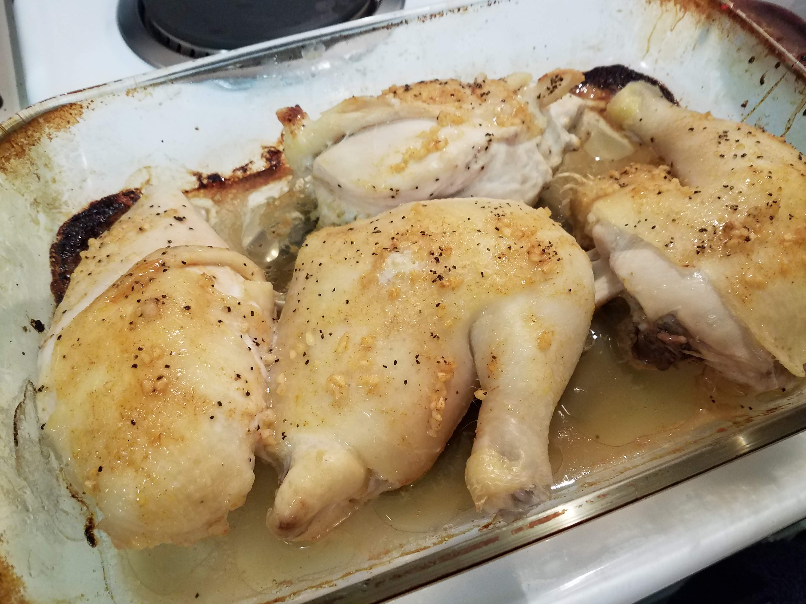

Cooking raw chicken is definitely not on the syllabus for most college students.
When cooking the chicken I would strongly recommend using a meat thermometer to make sure that the chicken reaches 165 degrease.
Either buy chicken breasts or cut a whole chicken-- use the left over chicken spine and wings for chicken stock.
On a baking pan lather the chicken in the marinara sauce that you just mixed (ingredients below) and sprinkle some salt and pepper on the chicken.
Let the chicken cook for around 30 minutes in a oven that is 400 degrease (until the chicken reaches 165).
After the chicken comes out of the oven, sear it on a ripping hot skillet with some more of the marinara sauce.
Cooking the chicken this way will keep the chicken juicy and the skin crispy. 

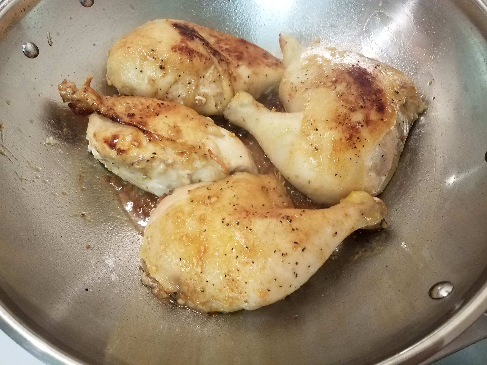

### Marinara Sauce Ingredients
- 4 TBSP Oil
- 3 TBSP Honey
- Minced Garlic
- 2 TBSP Lemon Juice
- 1/2 TSP Paprika

## Chicken Stock

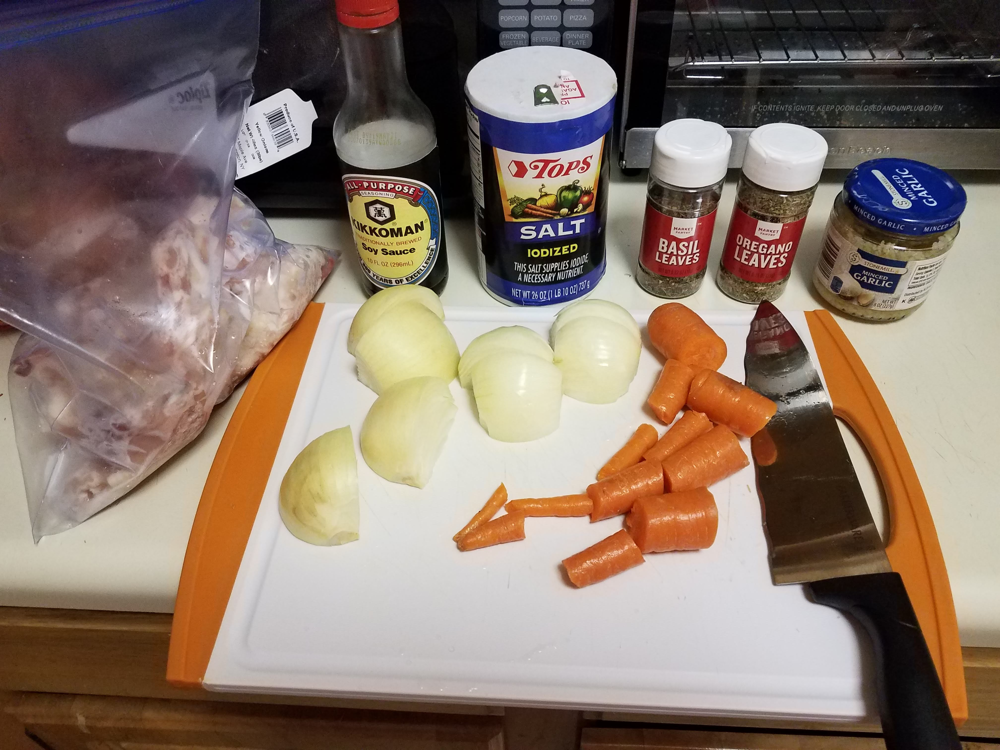

If you happen to cook with a whole chicken and end up with some chicken bones, you are in the perfect position to make chicken stock.
Essentially all you need to do is put your chicken bones, onions, carrots, and basil in a crock pot cook for 8-12 hours on low. 
Periodically you should skim off the fat that surfaces to the top. 
At the end of the 12 hours you use a fine mesh skimmer to filter out all the chicken and vegetables.
If you want a darker flavor to the stock, roast the chicken parts and vegetables in the oven before adding them to the crock pot. 

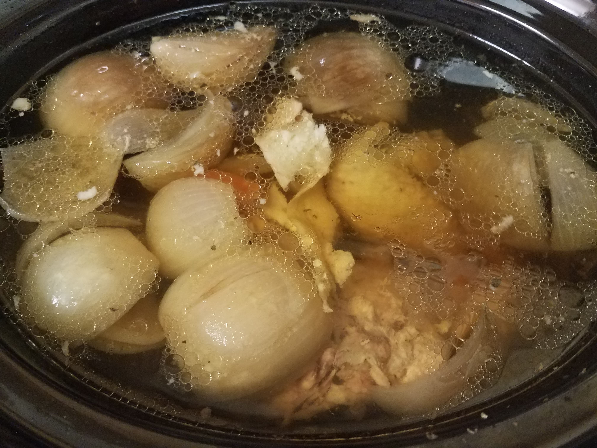

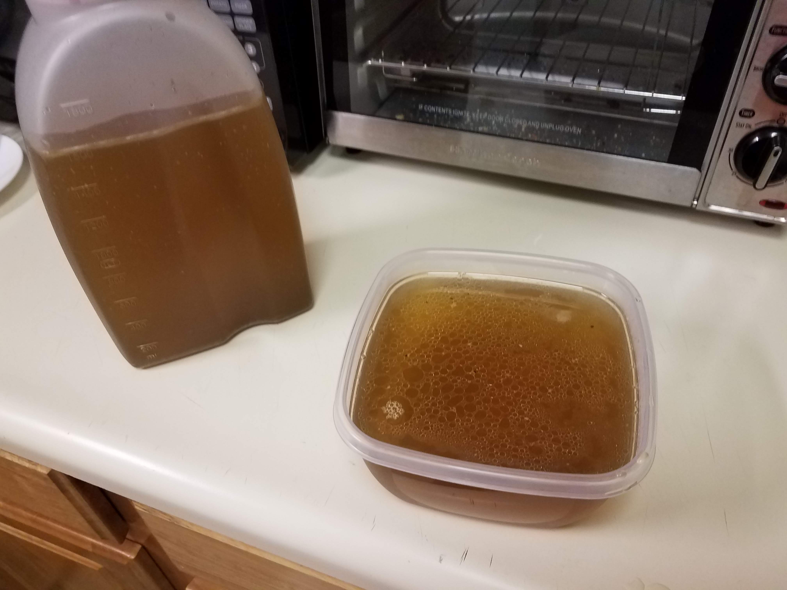

### Ingredients
- Chicken Bones
- 1-2 Quartered Onions
- 2-3 Carrots

**Optional**

- Celery
- 1 TBSP Soy Sauce
- Basil

## Chicken and Rice

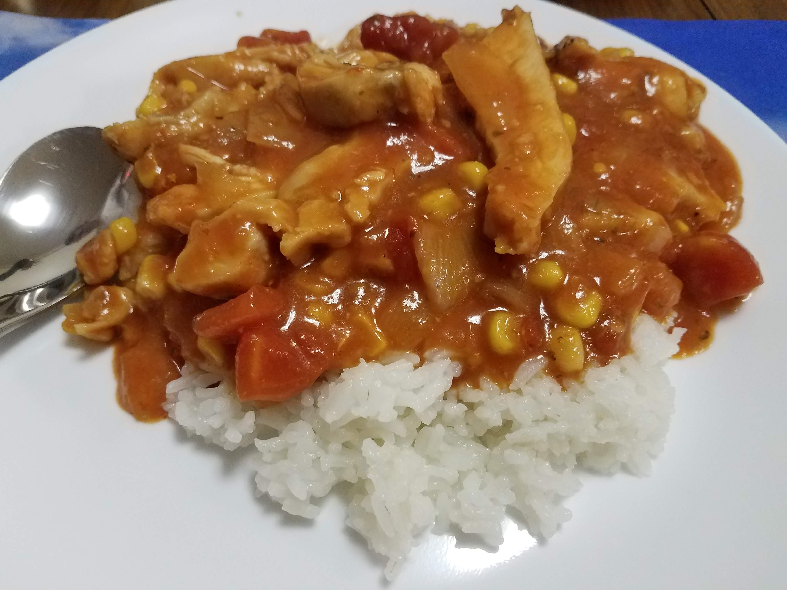

My version of chicken and rice may not be orthodox. 
This recipe came into existence because I needed something to make which shared ingredients with the other dishes that I frequently make.

Essentially, you make rice and put a thick red sauce with chicken, onions, peppers over it.
You prepare the rice like normal.
In a large sauce pan you saute onions and peppers.
Once the onions start to brown, you add diced tomatoes, corn, minced garlic, basil, brown sugar, frozen chicken strips and mustard.
Once the chicken has thawed, you are ready to serve this dish.

### Ingredients
- 2 Cups Rice
- Bag of Grilled Chicken Strips
- 1-2 Onions
- 1-2 Peppers
- 1 Can Diced Tomatoes
- 1 Jar Pasta Sauce
- 1 Can Corn
- Minced Garlic
- Brown Sugar
- Basil