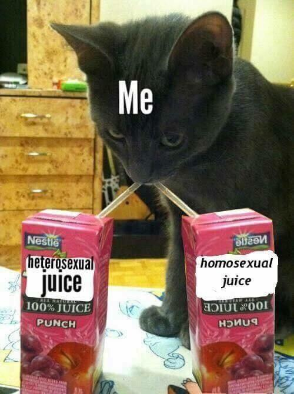

I don't know exactly who I'm writing this post for: maybe it's for me, maybe it's for that guy I'm trying to impress, maybe, it's for the LGBTQ+ community this pride month. I'm not a elegant storyteller, but I wanted to share my coming out experience.

I've seen other blog posts and videos on the subject, but they never fully encapsulate what I went through. Maybe that is the point, not everyone is the same. Labels are convenient but, they are not perfect. Sexuality isn't a  spectrum where totally gay and totally straight are on different sides. Sexuality: it's fluid, it's complicated, it's love... it's exciting.

I've known that I was wasn't totally straight for the longest time.
However, it took me a while to realize that I was bisexual; I went through many phases of thinking I was either gay or straight.
I first accepted that I was indeed bisexual after developing a massive crush on a guy in 8th grade. 

Coming out as bisexual was a terrifying thought. I didn't know anyone else who was gay or bisexual. I thought that my sexuality wasn't a big deal and that I would come out someday after I started to date a guy. Not to mention that middle schoolers are unadulterated monsters looking for anything to sink their teeth in.

My opinion on coming out eventually changed my senior year of high school when one of my friends was outed as being gay through an unfortunate sequence of events. Although the series of events was kind of awkward, I saw an incredible amount of support towards this friend. I found solace in not being the only queer person inside my friend circle. I proceeded to tell my two sisters and some close friends that I was bisexual-- it turned out that a few of them were also bisexual.

However, coming out to a few friends is entirely different from telling the world. Being in a quasi closeted state was stressful. I found support from my friends... but who do they talk to about this? How do I maintain this secret? Who should I tell? When should I tell my parents? There is never just a single moment that you come out, it is a continuous process that drags on for the rest of your life.

It wasn't until my first serious relationship with a guy that I came out to my entire friend group in college. During this relationship, I realized just how much my sexuality is a part of my identity. I was no longer a person who just happened to be bisexual; I was, in fact, a bisexual person. This leap was huge for me because fully embracing who I was made me more confident and happier in general.

Telling my mom was the final leap for me in my multi-year process of coming out to the world. Telling your parents is probably one of the harder things to do. Although I knew that my mom would love and support me. It is hard to have this conversation because it has the potentiality to change our relationship. Our relationship was pure, I didn't want anything to change that. In general, it's harder to tell people that you have known for a long time about your sexuality. I am glad that I finally came out to everyone on my list, I have received a tremendous amount of love and support.

For me, showing pride publicly by wearing pins and putting the pride emotes on my profile isn't about telling people I'm queer; it's about embracing who you are and supporting the community. Like my friend in high school, merely knowing that I'm not alone is helpful; if I can be that beacon of support for anyone else, that would be well worth it despite any flack that I may get for being queer. I'm happy to see mainstream shows and movies start to have more queer characters. It's exciting that I get to grow up in a time where my bisexuality is welcomed with loving arms. I am immensely grateful to my family and friends for being supportive of me.