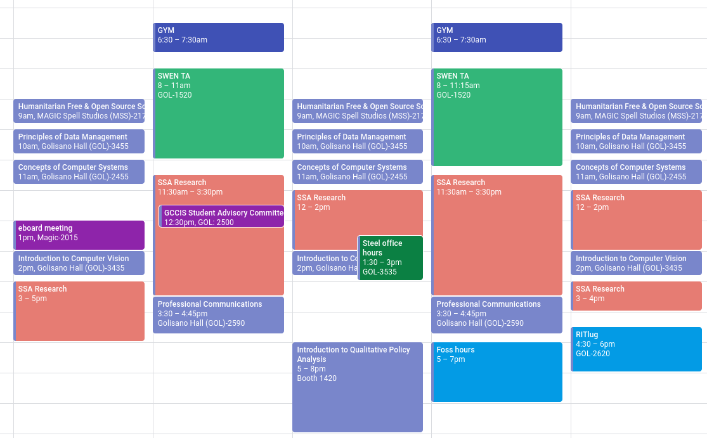
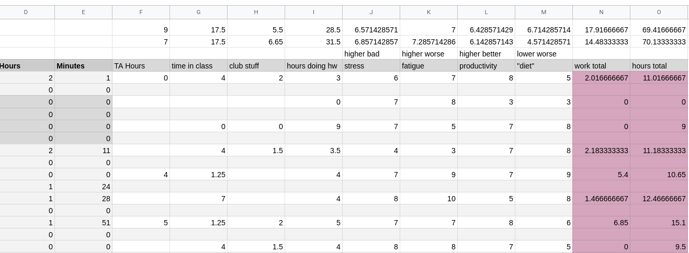
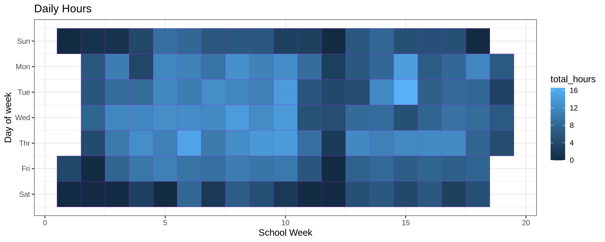
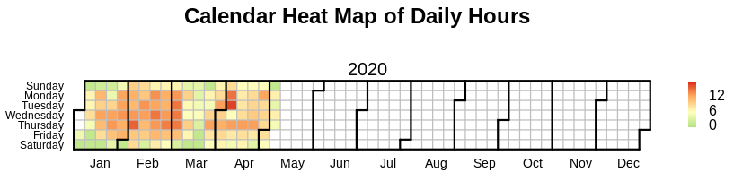
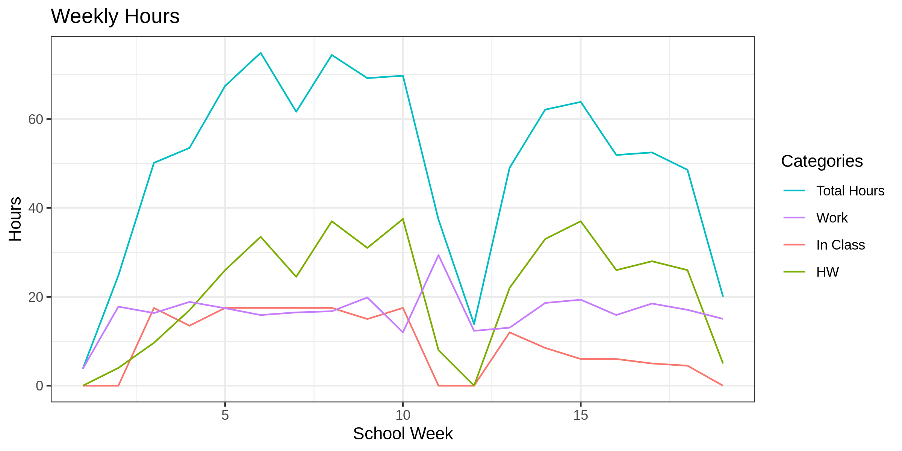
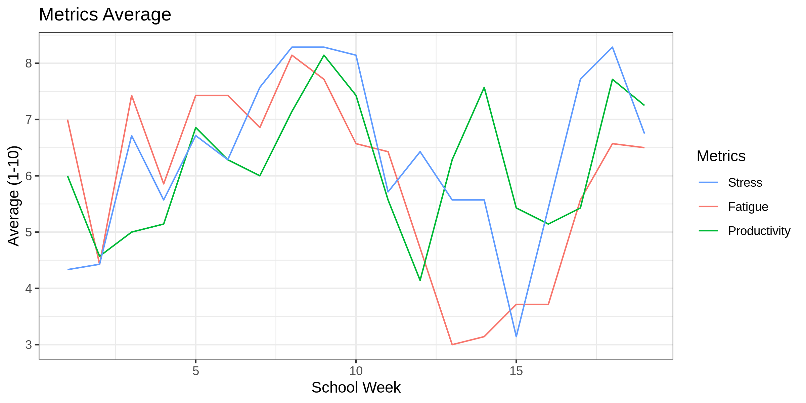
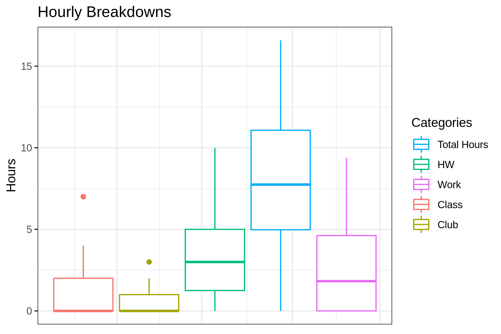
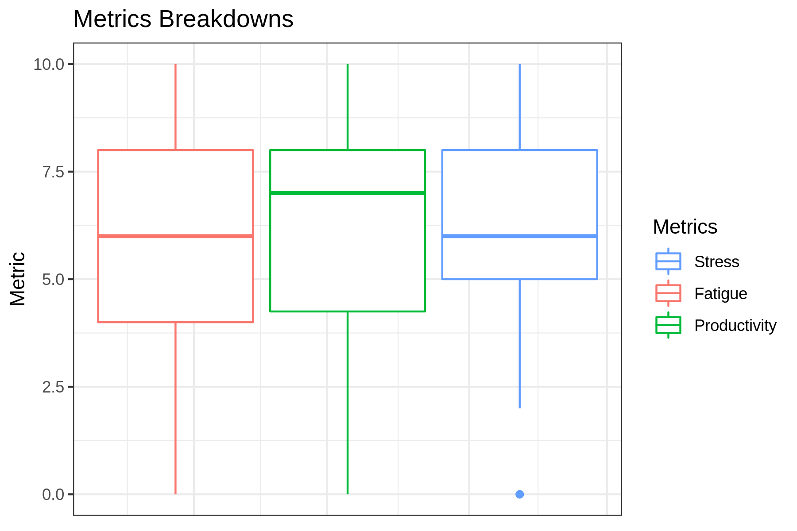

"Your absolutely crazy," my boyfriend exclaimed as he gazed at my schedule. Eighteen credit hours, two part-time jobs, and three clubs-- my spring semester was shaping up to be one hell of a ride. That semester I flew too high, burned my wings, and was then was saved by Covid-19.

Indulge me as I recount what happened during this crazy semester and
reconcile what I've learned while pushing my limits at RIT. 

Going into this semester, I knew that  I was signing up for more than
usual. I was trying to pack my schedule with six classes so that I can
stay on track to graduate a semester early. Usually, students hover
around 12 to 15 credit hours.  



Despite having little free time, I prioritized a healthy diet, sleep,
and exercise. Those things stretched the limits of what I could do
before getting burned-out. Like all plans, I deviated from my plan a
bit. Although it was naive to plan on going to the gym early in the
morning and eating overnight oats every day for breakfast,  I ended up
maintaining my schedule for most of the semester. Putting everything
on the calendar was quintessential for me that semester-- my tether to
reality. If I could manage to schedule a time for it, it was
manageable. 

# The Fallout

The folly of my plan was to block everything in one big chunk. My day
started at 5:45 AM when I woke up and went to the gym, and it ended
around 7 PM when I got back to my apartment. Laying out this
continuous segment of time to work on homework, jobs, and classes made
my day efficient, but it was exhausting. After an 11 hour day, I got
back to my apartment and wanted to collapse. Nevertheless, structuring
my time like this ended up giving me free time later at night and on
the weekends-- which is usually when people typically hung out.  

I recognized that I was getting burned after three consecutive weeks
of working 70 hours. I was becoming less productive, caffeine had less
impact, and it was hard to focus. When I went to Brickhack as a club
representative, everything felt like a haze; I tried to think and get
work done, but all my thoughts slipped me. That day I had four energy
drinks(a personal record), but they didn't even phase me: my mind was
still cloudy. Nothing is worse than trying to work for 6 hours, but
only getting 20 minutes of work done.  


# Saved by COVID

By the time spring break rolled around, I was exhausted: all energy
and motivation were depleted from my system. Recognizing that I was
burned out, I took time to rest and re-cooperate by spending time with
my boyfriend. Spring break was magical, all the stresses of school
melted off my shoulders. The little work that I did do was focused and
efficient. 

Then RIT decided to extend spring break a week and transition classes
online due to COVID-19. This event got coined by my friends as "spring
break v.2 electric boogaloo." This transition introduced a new element
of anxiety because I had to find an apartment and move ASAP; however,
at the same time, it gave me an additional week to re-cooperate. In
just a few days, I signed an apartment lease and moved across the
state. 

After transitioning to online courses, I felt like I had more energy.
Before COVID, I was spending 18 hours a week sitting in a classroom,
but after the change, I was only spending 5 hours a week in structured
"class," while the amount of time spent on homework remained
equivalent. This change was huge. 

# Tracking my work

Being the geek that I am, I tracked every single hour that I worked
this semester. In addition to hours, I also kept track of some basic
metrics like perceived productivity, fatigue, diet, and stress levels.
Tracking my work helped me stay focused during the allotted times that
I record for a specific task, and it let me know empirically when I've
worked too much and need a break. Using a quick and dirty solution, I
kept track of all my hours in a spreadsheet with aggregating functions
to calculate weekly totals for each column.  



At the end of the semester, I exported all my data as a single CSV
file and imported it into R for examination. 

```R
library(tidyverse)
library(plyr)
library(lubridate)

data <- read_csv("data.csv", col_names=TRUE)
```

In my spreadsheet, empty cells were exported to CSV as NA, and useful
numbers only appear on every other line. The task of data preparation
is straightforward to do in R. 

```R
# Remove rows that are empty
data <- data %>% drop_na(date)

# Convert class col to be numeric-- auto import miss impoted this
data$class <- as.numeric(data$class)

# replace any NA values with zero
data[is.na(data)] = 0

# parse date from string
data$date <- parse_date(data$date, "%m/%d/%y")

# calculates week of year and creates its own col
data$ymd = lubridate::isoweek(ymd(data$date))

# creates a new col with the week of day numerically
data$wday = wday(data$date)
```

Transforming the data makes it easier to graph. When visualizing time
series data, you typically add new columns to make grouping by that
type intuitive; this is based on what you wish to display. 

The most exciting graph to see would be a heatmap showing my daily
hours worked. 

```R
ggplot(data, aes(ymd, wday))+ 
    geom_tile(aes(fill= total_hours), color="purple") +
    ggtitle("Daily Hours") +
    labs(x="School Week", y="Day of Week") +
    scale_y_continuous(name="Day of week",trans = "reverse",
        breaks=c(1,2,3,4,5,6,7),
        labels=c("Sun", "Mon", "Tue", "Wed","Thr","Fri","Sat")) +
    theme_bw()
```



This heatmap is interesting because it shows that I typically worked
longer hours on weekdays and that the intensities change after spring
break. 

If you are not satisfied with a ggplot graph, you can use other
scripts on the internet to plot calendar data as a heatmap. However, I
like to solely use ggplot because it gives you very robust controls
over how the data is displayed. 

```R
library(tidyquant) 
source("https://raw.githubusercontent.com/iascchen/VisHealth/master/R/calendarHeat.R")

r2g <- c("#D61818", "#FFAE63", "#FFFFBD", "#B5E384") 
calendarHeat(data$date, data$total_hours, ncolors = 99, color = "g2r", varname="Daily Hours")
```



I wasn't a fan of this library because you couldn't scale the graph. 

The next thing that I wanted to plot was a line graph showing my
weekly totals over the semester. Note: when I exported the excel file
as a CSV, it did not contain the cells that I added to compute the
weekly totals, so we have to calculate the sums ourselves. A naive
approach would loop over the data and create a new table using for or
while loops. I am a massive shill for R and Tidyverse because the
Tibble data structure is insanely powerful. Using Dplyr on tibbles we
can create groupings on columns and then compute metrics on those
groupings all while utilizing a pipeline data flow. I would highly
recommend R and Tidyverse for anyone considering data science and
visualizations. 

```R
data %>% group_by(ymd) %>%
    dplyr::summarise(total = sum(total_hours),
                     work_t = sum(work_total), 
                     class_t = sum(class),
                     hw_t = sum(hw)) %>%
    gather(key,value, total, work_t, class_t, hw_t) %>%
        ggplot(mapping=aes(x = ymd)) + 
        ggtitle("Weekly Hours") +
        geom_line(mapping=aes(y = value, colour = key)) +
        labs(x="School Week", y="Hours") +
        scale_colour_discrete(name="Categories",
                         breaks=c("total", "work_t", "class_t", "hw_t"),
                         labels=c("Total Hours", "Work", "In Class", "HW")) + 
        theme_bw()
```



This is my favorite graph because it shows me the shift that my
schedule took after classes went online. After the break, time in
class dropped off, but the other metrics like time on homework
remained about the same. 

Using the same grouping method as we did for weekly hours, we can
graph all the self-reported metrics. 

```R
data %>% group_by(ymd) %>%
    dplyr::summarise(stress_a = mean(stress), 
                     fatigue_a = mean(fatigue), 
                     productivity_a = mean(productivity)) %>%
    gather(key,value, stress_a, fatigue_a, productivity_a) %>%
        ggplot(mapping=aes(x = ymd)) + 
        ggtitle("Metrics Average") +
        geom_line(mapping=aes(y = value, colour = key)) +
        labs(x="School Week", y="Average (1-10)") +
        scale_colour_discrete(name="Metrics",
                         breaks=c("stress_a", "fatigue_a", "productivity_a"),
                         labels=c("Stress", "Fatigue", "Productivity")) + 
        theme_bw()
```



The metrics' actual values are not that important since they are
relative to personal experience and are very inaccurate. How
self-reported metrics change over time is more insightful than the
actual values. We can observe that spring break and the switch to
online classes had a positive benefit on all my self reported metrics.

The next graph we can generate is the daily distribution of hours
spent on separate activities. If we wanted to get really crazy, we
could also group by day of the week; however, we already see some of
that information in the calendar heatmap. 

```R
data %>% 
    group_by(date) %>%
    gather(key,value, class, club, hw, work_total, total_hours)  %>%
    ggplot(mapping=aes(x = date)) + 
        ggtitle("Hourly Breakdowns") +
        geom_boxplot(mapping=aes(y = value, colour = key)) +
        labs(y="Hours") +
        scale_colour_discrete(name="Categories",
             breaks=c("total_hours", "hw", "work_total", "class", "club"),
             labels=c("Total Hours", "HW", "Work", "Class", "Club")) + 
        theme_bw() +
        theme(axis.title.x=element_blank(),
            axis.text.x=element_blank(),
            axis.ticks.x=element_blank())
```



Unsurprisingly, we see that work and homework consumed the majority of
my time. 

I created the same boxplot view for the metrics. 


```R
data %>% 
    group_by(date) %>%
    gather(key,value, stress, fatigue, productivity)  %>%
    ggplot(mapping=aes(x = date)) + 
        ggtitle("Metrics Breakdowns") +
        geom_boxplot(mapping=aes(y = value, colour = key)) +
        labs(y="Metric") +
        scale_colour_discrete(name="Metrics",
                         breaks=c("stress", "fatigue", "productivity"),
                         labels=c("Stress", "Fatigue", "Productivity")) + 
        theme_bw() +
        theme(axis.title.x=element_blank(),
            axis.text.x=element_blank(),
            axis.ticks.x=element_blank())
```



What surprised me was that each of these three metrics had a
relatively similar distribution. As mentioned before, self-recorded
metrics are not accurate, but they provide insight when observing how
they change over time.  

# Remarks

This was a laborious post to compose; I don't want to sound bashful or
boastful or anything along those lines-- this is a sensitive subject.
Sharing my experience and reflecting on this semester is my way of
reconciling what I've learned, and hopefully, it teaches someone else
about the nuances of burnout.  

Although this definitely has had an impact on my mental health, I 
pulled through the semester and got a 4.0 GPA. I don't think I could
have faced burnout so defiantly without my amazing friends and loving
boyfriend. If COVID didn't force classes online, I don't know how this
semester would have ended for me. I feel confident in my ability to
achieve academically, but it is hard to do so while burned out. This
experience has taught me that I can work 50-60 hours a week without
getting burned out, but 70 is the number that **will** break the
camels back.  

Since the very start of the semester, I knew that I would end up
writing this post since I was collecting the data for it; however, I
didn't know to what extent I would actually get affected by burnout. I
still don't have a great way of describing what this experience was
like. In extreme cases of burnout, people have passed out and gone to
the hospital. In this country, we have a romanticized view of working
long hours and pulling all-nighters. I've learned first hand that it
is best to prioritize your mental health above all else.  

College doesn't have to be this hard. RIT is known for having a
rigorous course load, and lots of students here get burned out.
Keeping to a regular course load and not maxing out on jobs and clubs
should be enough to prevent most people from getting burned out.
Looking back at my first three semesters of college, I had soo much
free time. A large part of avoiding burnout is about knowing your
limits and planning your calendar to accommodate that. In the future,
I won't flirt with a schedule that will inevitably cause me to get
burnout.
