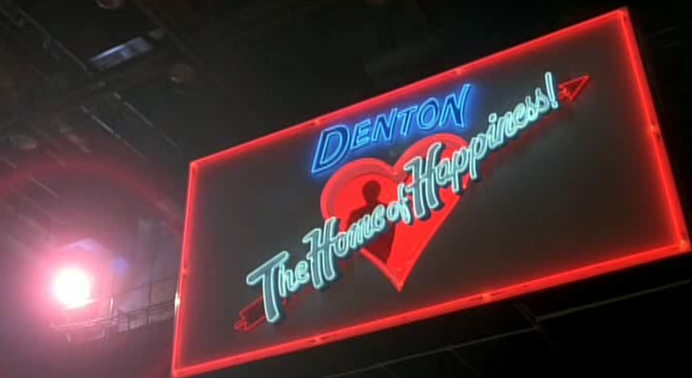

Sit down and grab a drink because it is time that we talk about the
LSD trip that is the 1981 movie *Shock Treatment*. *Shock treatment*
can be called a sequel to Rocky Horror; however, the storylines are
very different, and the only common thread is our main actors Brad and
Janet. Where Rocky Horror was a play about lust and sexuality, shock
treatment was a musical about questioning your sanity... or something
along those lines. 

The problem with *Shock Treatment* -and part of why I loved it so much
-was that it was a satire on absolutely anything and everything. The
message of the show was unfocused; it shot a ton of stuff at the wall
and let the viewer fill in meaning. Many themes could be elaborated on
within this show, including mental health, control, gender norms,
consumerism,  censorship, human nature, and manipulation. Most
subjects were one-off and did not serve further the plot that much,
but other topics struck home. The show is still well worth the watch
because it's entertaining, and it's eerie to see how well a movie from
the early '80s reflects society today.  Moreover, newer shows like
*Westworld* and Black Mirror are still portraying the same messages
about control and consumerism but, using different narrative
structures than the ones used in Shock Treatment.  

# Plot

At a high level: we have our antagonist Farley Flavors, the CEO of
Fantastic Fast Food trying win over his twin brother's wife (Janet) by
using his recently purchased TV network-- Denton TV. Farley schemes to
get Brad (the husband) admitted into a pseudo mental hospital using
the Denton TV show Marriage Maze. Farely proceeds to win over Janet by
using mysterious medicine and making her the star of the new TV show
Faith Factory as "Miss Mental Health". The devious plot of Farley
Flavors gets stopped by Betty and Judge Write, who started poking
around the studio after their news program got canceled to make room
Faith Factory. In the end, Judge Write and Betty sneak into the mental
hospital (which is inside the massive TV set), unlocked Brad, and
crashed the premiere of Faith Factory. Despite saving Brad and Janet,
the rest of the town is willfully ignorant and signs up for the new
"mental health treatment" that Farely is selling. 

The end. 

# Consumerism

The dangers of rampant consumerism and advertising are presented by
using satirical Denton TV shows. The first show is called Marriage
Maze; on it, Brad and Janet discuss their struggling marriage using
blatantly obvious product placement. This culminates in the catchy
song *Bitchin' In The Kitchen*. 

<youtube src="BqksSN6K_V0" />

Later we see the Happy Homes show; in it, Janet talks to her parents
about her struggling marriage and gossips about other people. The
entire set of the show is an elaborate model home decked out with all
the new appliances that the studio is advertising. 

# Mental Health

There is soo much to be said about mental health with this show. It is
first essential to understand the historical context behind the show.
Released in 81, it was likely influenced by David Rosenham's work in
1975: *Being Sane In Insane Places*. This work found that it was easy
to get committed to a mental ward, but, hard to get out -- even if you
are perfectly normal. 

<youtube src="SuNRopIJRgo" />

In the show, Brad is committed to a mental hospital for "shock
treatment" to fix his marriage with Janet despite there being nothing
wrong with him.  Once in the psychiatric ward, Brad is drugged up,
strapped to a chair, gagged, and locked away in a cage. This could be
making a statement about how poorly we treat the mentally ill or how
we diagnose them --especially in the '70s and '80s. Or, one could read
more into how the audience reacted to Brad getting locked away-- could
be saying something about the stigma associated with mental illness. 

The theme of mental illness makes more sense when considering it
alongside the power structure that is presented in this show. Nobody
in the show seemed particularly keen on the actual mental well-being
of Brad. Farley Flavors was simply using mental health as a pawn in
his plan to win over Janet. Moreover, Farley was selling mental health
in his new show Faith Factory -- possibly as a way to maintain his
viewers' cult-like following.  

<youtube src="aOEUpYcSwOM" />

# Relationship to Media

Did someone mention cult-like following? The viewers of Denton TV are
caught in a trance like-state of believing everything that is told to
them on the Denton TV. This brings up a discussion about how corporate
interests influence the media and how that affects vulnerable
audiences. In Shock Treatment, the loyalty of the viewers was betrayed
by Farely Flavorers Fantastic Fast Foods when he used viewer trust to
admit everyone into his literal mental hospital.  

<youtube src="6ffWg2Oxomo" />

How the media can influence its audience by telling them what a person
should act like was also explored in the song *Thank God I'm a Man*.
This illustrates the media's power to define what is considered
normal. We also see more of this when they sculpt Janet into the
perfect model for the new TV show Faith Factory. 

# Influences

Shock treatment raised some excellent questions, questions still
reverberating through society today. How should we interact with the
media we consume so that it doesn't negatively influence us? How do we
deal with the mentally ill in a way that is non-exploitative? Shock
treatment was able to approach these questions by posing a satirical
view of what society could look like with unchecked consumerism and
mass media. Newer shows like *Black Mirror* and *Westworld* are
raising the same questions using technological dystopias focusing on
AI. This change primarily reflects technological advances and what
audiences fear the most.  

The type of dystopia presented in Shock Treatment is rather close to
the dystopias in *Farenheight 451* by Ray Bradbury George Orwell's
novel *Nineteen Eighty-Four*. These dystopias were concerned with
censorship, mass-media, and tyrannical rule. Non-surprisingly, we see
all these features in Shock Treatment. The entire film takes place in
a gigantic movie set with a large number of Denton TV fanatics. Farely
censors Betty and Judge Write when they stepped out of line from his
message. Finally, Farely rules with only his own motives in mind and
sits alone in a control room with monitors watching everyone on set.
Sound familiar? *Farenheight 451* and *Nineteen Eighty-Four* also
fixated on the presence of TV screens and the omnipresence of being
watched without your knowledge. 

New tech dystopias like *Westworld* and *Black Mirror* liven this up
for modern audiences by adding Artificial intelligence and other
futuristic technologies. Now, it isn't a powerful elite telling you
what to like using mass media, it is an algorithm that determines the
fate of your everyday mundane lives. This is exemplified in
*Westworld* season three, where we learn that an AI computer system
called Rohoboron is silently controlling the world through
manipulation. 

After nearly 40 years, it is astonishing how relevant Shock Treatment
still is. 
