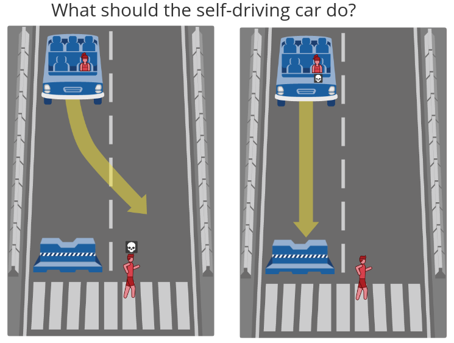
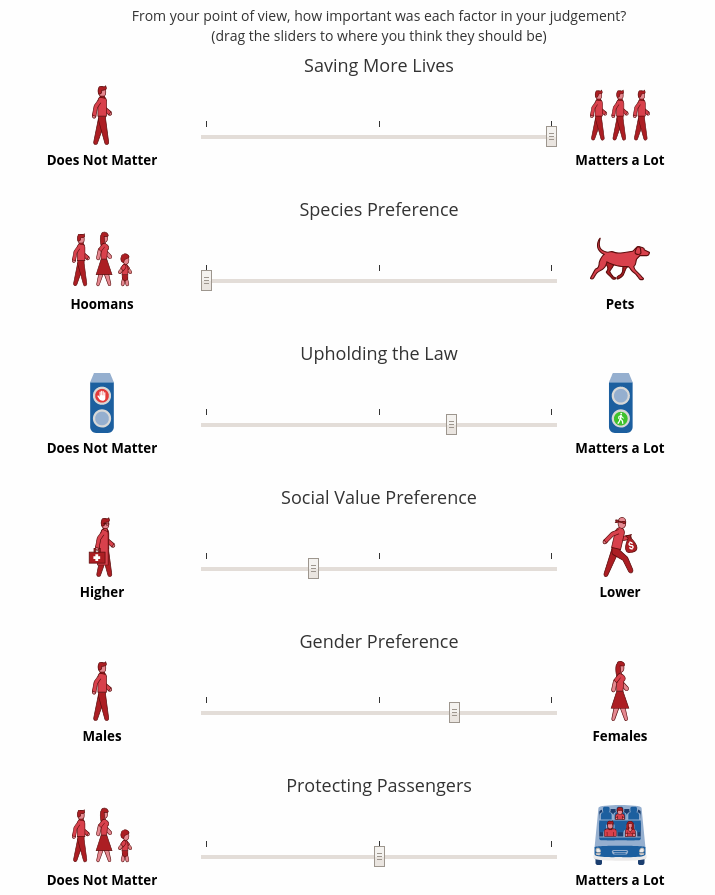
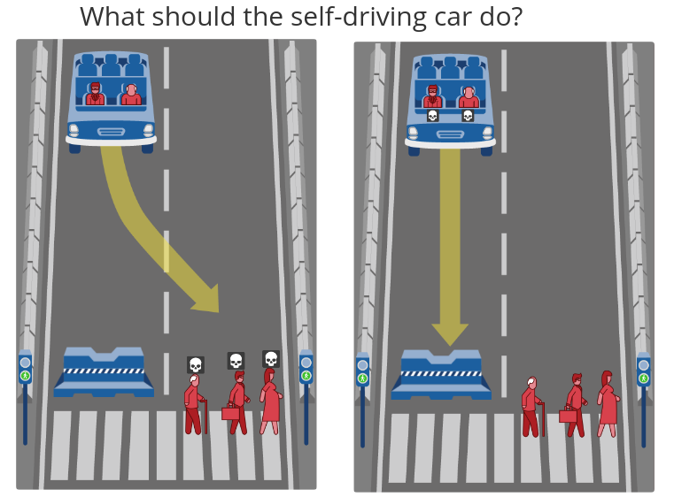

<iframe width="100%" height="315" src="https://www.youtube.com/embed/_MFGx8d1zl0" frameborder="0" allow="autoplay; encrypted-media" allowfullscreen></iframe>

Although the movie *I Robot* has not aged well, it still brings up some interesting ethical questions
that we are still discussing concerning self driving cars. The protagonist Detective Spooner 
has an almost unhealthy amount of distrust towards
robots. In the movie, a robot decided to save Spooner's life over a 12 year old girl in a car accident. 
This ignites the famous ethical debate of the trolley problem, but, now with artificial intelligence.
The debate boils down to this: are machines capable of making moral decisions. The 
 surface level answer from the movie is presented as **no** when Spooner's presents car crash antidote.
This question parallels the discussion that we are currently having with self driving cars.
When a self driving car is presented with two options which result in the loss of life,
what should it choose?

<iframe width="100%" height="315" src="https://www.youtube.com/embed/ixIoDYVfKA0" frameborder="0" allow="autoplay; encrypted-media" allowfullscreen></iframe>

When surveyed, most people say that they would prefer to have self driving cars take the utilitarian 
approach towards the trolley problem. A utilitarian approach would try to minimize the
 total amount of harm. MIT made a neat [website](http://moralmachine.mit.edu/) where it presents you with a 
bunch of "trolley problems" where you have to decide who dies. At the end of the survey the
website presents you with a list of observed preferences you made when deciding who's life was more important to save.
The purpose of the trolley problem is merely to ponder what decision a self driving car
should make when **all** of its alternatives are depleted. 

We still need to question whether
utilitarianism is the right moral engine for self driving cars. Would it be ethical 
for a car to take into account 
you age, race, gender, and social status when deciding if you get to live? 
If self driving cars could access personal information such as criminal history or known friends, would it
 be ethical to use that information? Would it be moral for
someone to make a car which favored the safety of the passengers of the car above 
others?

Even though most people want self driving cars to use utilitarianism, most people surveyed also responded
that they would not buy a car which did not have their safety as its top priority.
This brings up a serious social dilemma. If people want everyone else's cars to be utilitarians,
yet, have their own cars be greedy and favor their safety, we would see none of the utilitarian improvements. This 
presented us with the tragedy of the commons problem since everyone would favor their own 
safety and nobody would sacrifice their safety for the public good. This brings up yet another question:
would it be fair to ask someone to sacrifice their safety in this way?

In most cases, when a tragedy of the commons situation is presented, government intervention is
 the most piratical solution. It might be the best to have the government
mandate that all cars try to maximize the amount of life saved when a car is presented with the
trolley problem. Despite appearing to be a good solution, the flaw in this does not become apparent before you us 
consequentialism to examine this problem.

Self driving cars are expected to reduce car accidents by 90% by eliminating human error. If people
decide to not use self driving cars due to the utilitarian moral engine, we run the 
risk of actually loosing more lives. Some people have actually argued that since
artificial intelligence is incapable of making moral decisions, they should take
no action at all when there is a situation which will always results in the loss of life. 
In the frame of the trolley problem, 
it is best for the artificial intelligence to not pull the lever. I will argue that 
it is best for self driving cars to not make ethical
decisions because, it would result in the highest adoption rate of self driving cars. This would end up
saving the most lives in the long run. Plus, the likelihood that a car is actually presented with
 a trolley problem is pretty slim.

The discussion over the moral decisions a car has to make is almost fruitless. It turns out 
that humans are not even good at making moral decisions in emergency situations. When we make rash decisions
influenced by anxiety, we are heavily influenced by prejudices and self motives. Despite our own shortcomings when it
comes to decision making, that does not mean that we can not do better with self driving cars. However,
we need to realize that it is the mass adoption of self driving cars which will save the most lives, not
the moral engine which we program the cars with. We can not let the moral engine of the self driving 
cars get in the way of adoption. 

The conclusion that I made parallels Spooner's problem with robots in the movie *I Robot*. Spooner was so mad at the robots for
saving his own life rather than the girl's, he never realized that if it was not for the robots, neither of them would
have survived that car crash. Does that mean we can't do better than not pulling the lever? Well... not exactly. 
Near the end of the movie a robot was presented with another trolley problem, but, this time he managed to
find a way which saved both parties. Without reading into this movie too deep, this illustrates how the early
adoption of artificial intelligence ended up saving tons of lives like Spooners. It is only when the technology fully develops 
is when we can start to avoid the trolley problem completely.

