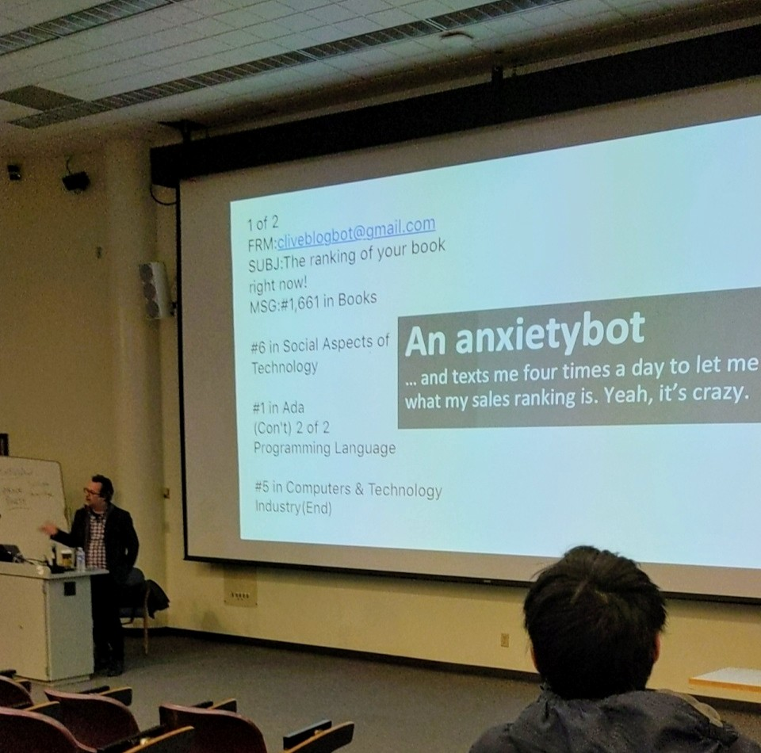

Clive Thompson a very prominent technical author came to Rochester on
November fifteenth to talk about the “Problems of Efficient Coding”.
Going into this talk, I expected it to go along the lines of how
making super “efficient” code often results in code that nobody
understands and is hard to maintain. To my pleasant surprise, Clive
Thompson provided a nuanced discussion around the cultural problems
created when we try to optimize every problem using technology. 

To understand Clive’s point, he used Facebook as a prime example of
this problem. Before the Facebook feed system, the web largely acted
like a blog where people had to actively reach out to everyone’s page
to get content. Right after Facebook implemented the feed system there
was a big debacle where nearly 20% of Facebook users entered a
Facebook group opposed the new feed system. For nearly a week there
were student protesters outside of the Facebook office. People
initially found the feed system creepy because it gave everyone
ambient awareness of everything happening in their network; this in
some regards decreased “anonymity”. You no longer had to go out to
every one’s page, Facebook created a tailored newspaper for you to
consume. As a result of the new feed system, people started producing
a lot more content to put on social media sites since people consumed
it immediately. To filter content and only provide people with
“important” posts, Facebook employed machine learning algorithms which
favored posts that get more clicks. It turns out that people are very
likely to click on things that are highly emotional or
controversial--machine learning algorithms were quick to learn this
and favor controversial content. People started to play the algorithm
and turn Facebook into a hot take tire fire as it get littered with
absurd conspiracy theories like #Pizzagate. Facebook’s motto used to
be “move fast and break things”, however, after Zuckerburg was
lambasted in front of congress, that motto is slowly changing.  

Facebook like many tech companies credits its major success to
optimizing a sometimes niche problem -- this is something that
programmers love to do and computers are perfect at. Facebook
optimized how people consume media, but they did it to the detriment
of quality content. Youtube tremendously optimized how we view videos
by suggesting us recommended videos to watch, but, it often suggests
repulsive content. Uber optimized how people found rides, but it
resulted in an influx of part time drivers that are slowly pushing out
full time drivers. This is not to say that optimization is a bad
thing. As a result of optimizing tasks we can save a tremendous amount
of time and be more productive members of society. Thompson suggests
that there are certain cases where we should slow down and add
friction to cases that we initially see the need to optimize.
Reflection and deliberation are important things that are often thrown
to the wind when we optimize things. 

This now begs the question: how do we do we solve these issues? This
is something that Thompson didn’t discuss in depth nor had a great
answer for. We could point our fingers at governments, companies, or
consumers and tell them to solve the problem. Surely having the
government enact some well-constructed public policy based on the
current policy environment would solve the issues… right? The problem
in the age of big data is that things are changing at a rapid pace and
by the time we realize the dangers of a particular issue, it may have
already caused grave damages or morphed into another form. Look at
gambling for example, we have had decades of laws and regulations
surrounding underage gambling, however, online gambling issues have
been consistently creeping their way into policy discussion over the
last five years. It is fascinating that most public policy generated in the
technology field is actually created in the court systems. This is
good in the sense that the court system is often faster than passing a
new law, but, it is also very problematic. Old laws when used to
interpret a nuanced technological problem often yield outcomes that
the original authors of the law would possibly disagree with. 

Although Thompson’s talk raises more questions and problems than
tangible easy-to-implement solutions, we must start having discussions
like this so we can enact a cultural change around how we approach
optimization tasks. Adding back careful reflection and deliberation
back to currently optimized tasks on the internet could give us more
freedom over how we consume content and interact with the world. 
