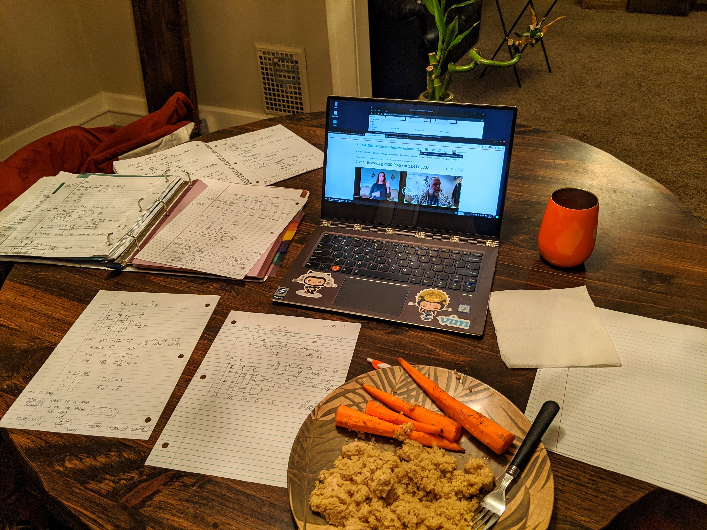
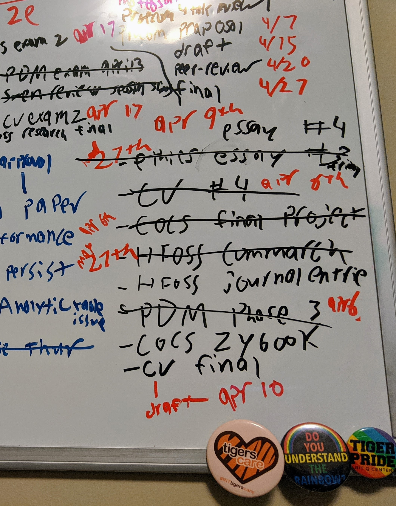
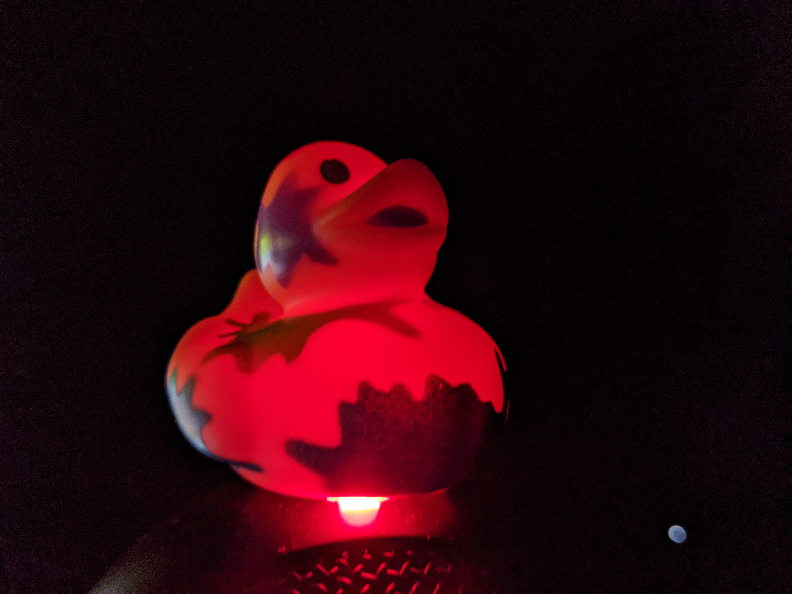

Last week I watched my professor drone on for seven hours about
computer circuitry.  As my eyes struggled to stay open as he babbled
about SR-latches, I wondered: what sequence of dreadful mistakes did I
make to land myself in this situation. I got through my entire college
career without pulling a single all-nighter, yet that night changed it
all.  

Although I could have followed along with the lecture material during
the regular class time, remote learning made a tantalizing temptation
to procrastinate and binge two and a half weeks of lecture material in
one night --two nights before the exam. Ironically, I ended up doing
remarkably well on that exam and felt prepared for every question;
nerveless, it still begs the question... Why? After asking around, I
found that all eight of my friends taking the class also binged the
lecture videos before the exam. 

After two weeks of remote work, I started feeling something that I
haven't felt in a very long time-- occasional boredom. This takes me
back to grade school summers when I had nothing to do. Well, there is
never "nothing to do." The problem really boils down to not being
motivated to do anything. 

Working remotely is actually great for things that I am already
motivated about because I can work on them uninterrupted for hours on
end. I am getting more work done at my job as a research assistant,
and I am putting more time into classes that I find interesting, like
computer vision. However, dedicating time towards mundane tasks like
learning about an esoteric computer architecture or writing essays for
my professional communication task takes more effort than they used
to.  

When we are isolated from others and don't have to physically go
places to get work done, we have fewer motivators for action. At
college, my most productive times were either in the library or at my
office. Physically not going into class every day, or not being able
to physically work around other people removes some of the motivators
that help us get stuff done. When I was at the library or my office, I
got a ton of work done because I felt like I was obligated to get
things done in this space. Or I was motivated by other people working
to also get work done -- no matter how trivial the task. 

To make up for these differences of working at home, I have made some
helpful adjustments to my schedule to make myself more productive as a
remote worker:  

Creating and updating physical lists Changing environments every few
hours Maintaining a regular sleep schedule Creating artificial rewards
like watching youtube after I finish an essay Reading before bed
Following an exercise routine 

Although this advice won't work for everyone, I suggest that you try
some of these things if you are struggling at remote work. A lot of
friends that I talk to are facing challenges when it comes to remote
work and learning. It is different and will take some time for us to
adjust to and get better at.  

I recently became very conscientious about my working space. In the
past, I have decorated my office with pictures or thingamajigs.
Recently I doubled down and did this a lot more for my current office.
Making your work environment more personalized helps morale-- at least
it has for me.  

Although it may be tempting, if you want to excel in remote work, now
is not the time to get funky. 

