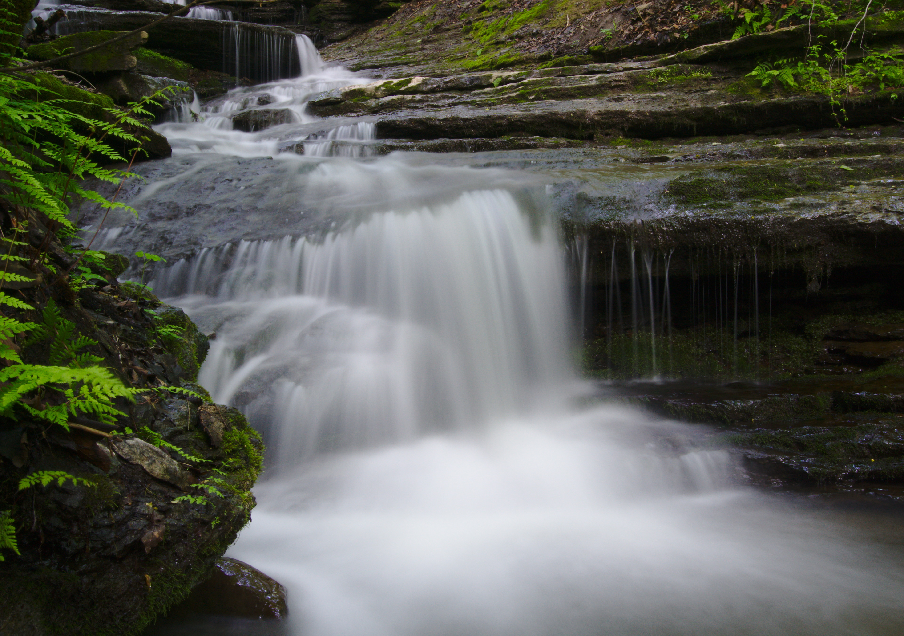

John Green's recent video on
[Vlogbrothers](https://www.youtube.com/vlogbrothers) got me thinking a
lot about why I take photos and the impact that social media has had
on my journey in photography.     

<youtube src="8gdJiNqP35k" />

I first got into photography when I was in forth grade. I was obsessed
with taking photos of anything from my toys to the breathtaking
scenery of state parks. Most of the photos that I took were distorted
gibberish: random fragments of trees and stuff lying around in my back
yard. Back then photo quality did not matter to me, the enthralling
thing was that I was preserving, capturing, and digitizing something
real and breathtaking. Photography was a tool, allowing me to archive
and remember the past: a way of stamping reality. John Green in his
videos said "I sometimes feel like something isn't really real unless
I've documented it, as if my memories and even my life will just slip
past like the clouds through last night's sky".       

I lost interest in photography shortly after I started middle school.
The only photography that I did do was for social media. Apps like
Snapchat and Instagram demand a constant stream of photos to bombard
your friends with. This is how I slowly learned that photography is a
"cropping of reality". I frequently found myself searching for that
right moment to take a photo and turn it into a Snapchat story. This
is not a huge issue; it is okay to share your experiences with people
you care about. However, we need to recognize that we present a
polished version of ourselves on social media.     

Despite acknowledging the vast distance between photography on social
media and reality, it is hard for our minds to quantify the stark
differences between these worlds. I take issue with people who do
anniversary posts where they share senior ball or vacation pictures
with a short caption. These anniversary posts aim to artificially
inflate someones appearance on social media when in reality their
lives are quite normal. In response to the negative aspects of social
media, there is a growing trend to ditch social media altogether.
Although "comparison is the thief of joy", quitting social media is
not the only solution. Only following close friends, limiting app
usage, and only using messaging centered apps are all great ways to
reap the benefits of social media while avoiding most of the negative
consequences.      

Enough of my social media tangent, lets get back to photography. I
recently got back into photography as an artistic hobby rather than a
means of archiving events or creating content for social media. As a
programmer, it is exhausting to write code for forty hours at work and
then program even more as a hobby -- this is a perfect recipe for
burnout. I find that photography is a great hobby since it is
intellectually simulating, yet not super rigorous and tiring.
Photography encourages you to explore new places and meet new people.
In photography you are always learning, growing, and improving. I
really enjoy watching movies; however, I don't believe that it's a
great hobby since there is no personal growth.   

I am obsessed with photography for the same reason I love programming:
there is a constant creative drive to make and share something new
with the world. In Mr. Robot Elliot said "In a world where everything
is a virtual copy of itself, where there's nothing but image, where
publicist have publicists and celebrity is bleakly industrial, it's
inevitable that 'image' starts to collapse on itself...". You have
probably heard that there is no more original content being created
anymore, everything is simply an image of an image of an image. With
the sheer quantity of content being created, it is close to impossible
to be the first person to do something. When I start working on a
programming project or go to a park to take some pictures, I am
frequently asked, "why are you doing that when others have already
done it". It is now impossible to be the first person to create a
social media app or photograph a waterfall; but, that does not make it
pointless to go out and create. Art is something that needs to be
constantly shaped, customized, tweaked and perfected. I am confident
that the best picture of a waterfall has not been taken yet. We are
still a long way away from creating the perfect social media app.
Despite everything being an image of an image, learning from other
will help us grow as creators and develop our own unique style. 

 
