Alright, this post is long overdue; today, we are using quadtrees to partition images. I wrote this code before writing the post on [generic quad trees](https://jrtechs.net/data-science/implementing-a-quadtree-in-python). However, I haven't had time to turn it into a blog post until now. Let's dive right into this post where I use a custom quadtree implementation and OpenCV to partition images.

But first, why might you want to use quadtrees on an image? In the last post on quadtrees, we discussed how quadtrees get used for efficient spatial search.
That blog post covered point quadtrees where every element in the quadtree got represented as a single fixed point.
With images, each node in the quadtree represents a region of the image.
We can generate our quadtree in a similar fashion where instead of dividing based on how many points are in the region, we can divide based on the contrast in the cell.
The end goal is to create partitions that minimize the contrast contained within each node/cell.
By doing so, we can compress our image while preserving essential details.

With that said, let's jump into the python code. Like most of my open CV projects, we start by importing the standard dependencies, loading a test image, and then defining some helper functions that easily display images in notebooks.
The full Jupyter notebook for this post is in my [Random Scripts repository](https://github.com/jrtechs/RandomScripts/tree/master/notebooks) on Github.


```python
# Open cv library
import cv2

# matplotlib for displaying the images 
from matplotlib import pyplot as plt
import matplotlib.patches as patches

import random
import math
import numpy as np

img = cv2.imread('night2.jpg')

def printI(img):
    fig= plt.figure(figsize=(20, 20))
    rgb = cv2.cvtColor(img, cv2.COLOR_BGR2RGB)
    plt.imshow(rgb)
    
    
def printI2(i1, i2):
    fig= plt.figure(figsize=(20, 10))
    ax1 = fig.add_subplot(1,2,1)
    ax1.imshow(cv2.cvtColor(i1, cv2.COLOR_BGR2RGB))
    ax2 = fig.add_subplot(1,2,2)
    ax2.imshow(cv2.cvtColor(i2, cv2.COLOR_BGR2RGB))
```

The test image is a long exposure shot of a street light with a full moon in the background. Notice that the moon and streetlight's overexposed nature blow them out, creating a star beam effect.
We would expect to retain details in the moon and telephone pole when compressing the image. 

```python
printI(img)
```

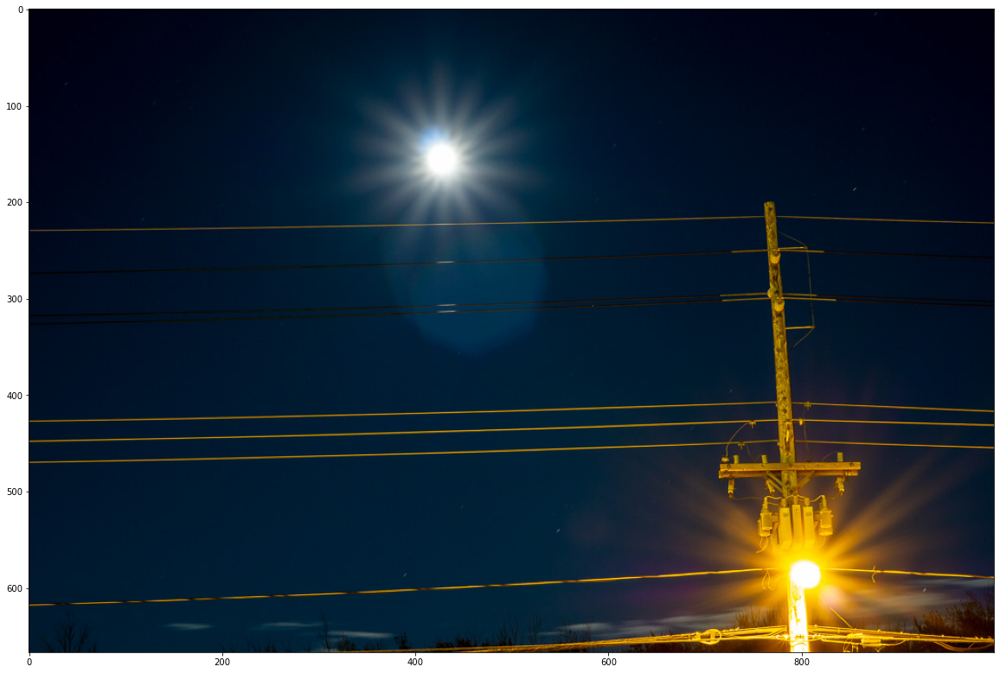

Like our last implementation of a quadtree, a node is simply a representation of a spatial region.
In our case, it is the top-left point of the image, followed by its width and height.
To divide our image, we need to get a sense of node "purity."
We are using the mean squared error of the pixels to determine that.
Additionally, we are doing a weighted average of the color layers, favoring the green layer the most.
Why we are favoring the green layer can be a point of future blog posts, but it has to do with the quantum efficiency of silicon to different types of light.
I added normalization to our error function by dividing it by a large number; this makes it easier to tune the resulting hyperparameter in the end.

```python
 class Node():
    def __init__(self, x0, y0, w, h):
        self.x0 = x0
        self.y0 = y0
        self.width = w
        self.height = h
        self.children = []

    def get_width(self):
        return self.width
    
    def get_height(self):
        return self.height
    
    def get_points(self):
        return self.points
    
    def get_points(self, img):
        return img[self.x0:self.x0 + self.get_width(), self.y0:self.y0+self.get_height()]
    
    def get_error(self, img):
        pixels = self.get_points(img)
        b_avg = np.mean(pixels[:,:,0])
        b_mse = np.square(np.subtract(pixels[:,:,0], b_avg)).mean()
    
        g_avg = np.mean(pixels[:,:,1])
        g_mse = np.square(np.subtract(pixels[:,:,1], g_avg)).mean()
        
        r_avg = np.mean(pixels[:,:,2])
        r_mse = np.square(np.subtract(pixels[:,:,2], r_avg)).mean()
        
        e = r_mse * 0.2989 + g_mse * 0.5870 + b_mse * 0.1140
        
        return (e * img.shape[0]* img.shape[1])/90000000
```

After we have our nodes, we can create our quadtree data structure.
As a design decision, the image gets stored in the quadtree where the nodes only contain partitioning information and not the image itself.
To recursively parse the tree or display it, we merely need to pass the image pointer around rather than have copies of the image at each node of the tree.
Additionally, we add two visualization methods to the quadtree class. One that displays a wireframe view of the nodes, the other that visualizes each leaf node by rendering that region's average color.


```python
class QTree():
    def __init__(self, stdThreshold, minPixelSize, img):
        self.threshold = stdThreshold
        self.min_size = minPixelSize
        self.minPixelSize = minPixelSize
        self.img = img
        self.root = Node(0, 0, img.shape[0], img.shape[1])

    def get_points(self):
        return img[self.root.x0:self.root.x0 + self.root.get_width(), self.root.y0:self.root.y0+self.root.get_height()]
    
    def subdivide(self):
        recursive_subdivide(self.root, self.threshold, self.minPixelSize, self.img)
    
    def graph_tree(self):
        fig = plt.figure(figsize=(10, 10))
        plt.title("Quadtree")
        c = find_children(self.root)
        print("Number of segments: %d" %len(c))
        for n in c:
            plt.gcf().gca().add_patch(patches.Rectangle((n.y0, n.x0), n.height, n.width, fill=False))
        plt.gcf().gca().set_xlim(0,img.shape[1])
        plt.gcf().gca().set_ylim(img.shape[0], 0)
        plt.axis('equal')
        plt.show()
        return

    def render_img(self, thickness = 1, color = (0,0,255)):
        imgc = self.img.copy()
        c = find_children(self.root)
        for n in c:
            pixels = n.get_points(self.img)
            # grb
            gAvg = math.floor(np.mean(pixels[:,:,0]))
            rAvg = math.floor(np.mean(pixels[:,:,1]))
            bAvg = math.floor(np.mean(pixels[:,:,2]))

            imgc[n.x0:n.x0 + n.get_width(), n.y0:n.y0+n.get_height(), 0] = gAvg
            imgc[n.x0:n.x0 + n.get_width(), n.y0:n.y0+n.get_height(), 1] = rAvg
            imgc[n.x0:n.x0 + n.get_width(), n.y0:n.y0+n.get_height(), 2] = bAvg

        if thickness > 0:
            for n in c:
                # Draw a rectangle
                imgc = cv2.rectangle(imgc, (n.y0, n.x0), (n.y0+n.get_height(), n.x0+n.get_width()), color, thickness)
        return imgc
```

The recursive subdivision of a quadtree is very similar to that of a standard decision tree.
We define two stopping criteria: node size and contrast.
Like a decision tree, creating nodes that are too small is pedantic because it doesn't abstract the image and overfits.
With an image, if we let our nodes become one pixel in size, it effectively just becomes the original image.
Regarding contrast, if there is a lot of contrast, we want to continue dividing, where if there is little contrast, we want to stop dividing-- preserving global features of the image while throwing away local details.

```python
def recursive_subdivide(node, k, minPixelSize, img):

    if node.get_error(img)<=k:
        return
    w_1 = int(math.floor(node.width/2))
    w_2 = int(math.ceil(node.width/2))
    h_1 = int(math.floor(node.height/2))
    h_2 = int(math.ceil(node.height/2))


    if w_1 <= minPixelSize or h_1 <= minPixelSize:
        return
    x1 = Node(node.x0, node.y0, w_1, h_1) # top left
    recursive_subdivide(x1, k, minPixelSize, img)

    x2 = Node(node.x0, node.y0+h_1, w_1, h_2) # btm left
    recursive_subdivide(x2, k, minPixelSize, img)

    x3 = Node(node.x0 + w_1, node.y0, w_2, h_1)# top right
    recursive_subdivide(x3, k, minPixelSize, img)

    x4 = Node(node.x0+w_1, node.y0+h_1, w_2, h_2) # btm right
    recursive_subdivide(x4, k, minPixelSize, img)

    node.children = [x1, x2, x3, x4]
   

def find_children(node):
   if not node.children:
       return [node]
   else:
       children = []
       for child in node.children:
           children += (find_children(child))
   return children
```

If we partition the same image using two different sets of hyperparameters, we can see how we can manipulate how much the quadtree algorithm partitions the image.
If we set the sum of square error threshold low, the quadtree will produce many cells, where if we assign the threshold high, it will create fewer cells.

```python
qtTemp = QTree(4, 3, img)  #contrast threshold, min cell size, img
qtTemp.subdivide() # recursively generates quad tree
qtTemp.graph_tree()

qtTemp2 = QTree(9, 5, img) 
qtTemp2.subdivide()
qtTemp2.graph_tree()
```

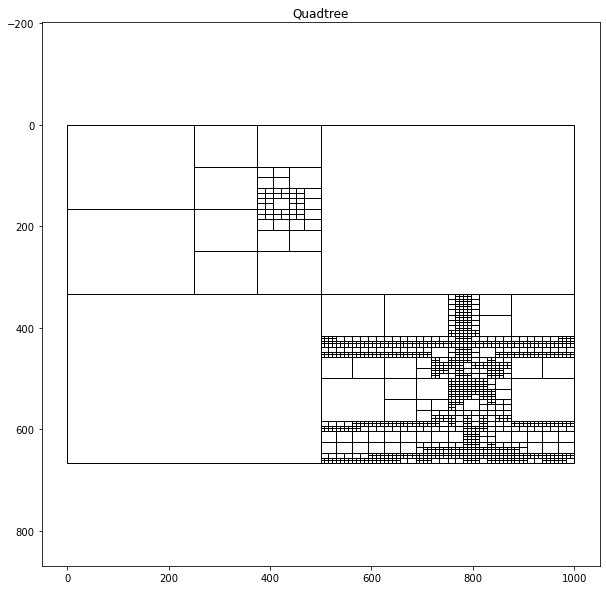

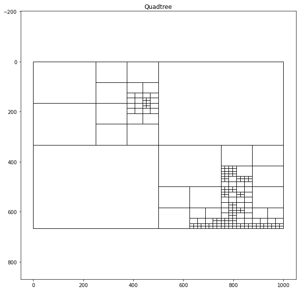

As a final esthetic, I want to display the rendered version alongside the original photograph.
For the sake of simplicity, I am adding a white border surrounding the two images and contacting them together to form a diptych.

```python
def concat_images(img1, img2, boarder=5, color=(255,255,255)):
    img1_boarder = cv2.copyMakeBorder(
                 img1, 
                 boarder, #top
                 boarder, #btn
                 boarder, #left
                 boarder, #right
                 cv2.BORDER_CONSTANT, 
                 value=color
              )
    img2_boarder = cv2.copyMakeBorder(
                 img2, 
                 boarder, #top
                 boarder, #btn
                 0, #left
                 boarder, #right
                 cv2.BORDER_CONSTANT, 
                 value=color
              )
    return np.concatenate((img1_boarder, img2_boarder), axis=1)
```

Next, we wrap our quadtree algorithm with our output visualization to make creating the diptychs easier.
The left is the original image, where the right is the rendered quadtree version.
Each leaf node in the quadtree gets visualized by taking the average pixel values from the cell.
Moreover, I added an outline to each cell to emphasize the cells produced.
I found that either a red or black outline worked the best.

```python
def displayQuadTree(img_name, threshold=7, minCell=3, img_boarder=20, line_boarder=1, line_color=(0,0,255)):
    imgT= cv2.imread(img_name)
    qt = QTree(threshold, minCell, imgT) 
    qt.subdivide()
    qtImg= qt.render_img(thickness=line_boarder, color=line_color)
    file_name = "output/" + img_name.split("/")[-1]
    cv2.imwrite(file_name,qtImg)
    file_name_2 = "output/diptych-" + img_name[-6] + img_name[-5] + ".jpg"
    hConcat = concat_images(imgT, qtImg, boarder=img_boarder, color=(255,255,255))
    cv2.imwrite(file_name_2,hConcat)
    printI(hConcat)

displayQuadTree("night2.jpg", threshold=3, img_boarder=20, line_color=(0,0,0), line_boarder = 1)
```

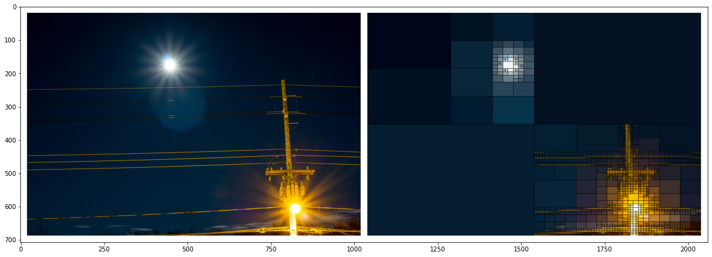

Every time I see these images, I  think about how humans, cameras, and algorithms view and interpret reality.

```python
displayQuadTree("night4.jpg", threshold=5)
```

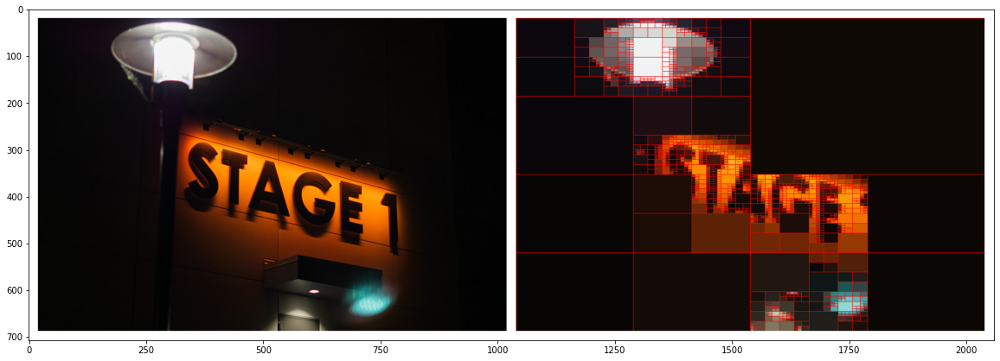

In particular, night photography pairs remarkably well with this algorithm since many esthetics that night photographers have picked up distorts reality.
Humans can rarely see vivid stars in the night nor light trails, yet if you set a camera with a long enough exposure, you will capture just that: and it is beautiful.
With the increased prevalence of post-processing and filters on cameras, the photos we see now are never perfect representations of reality.

```python
displayQuadTree("../final/russell-final-1.jpg", threshold=12, line_color=(0,0,0))
```

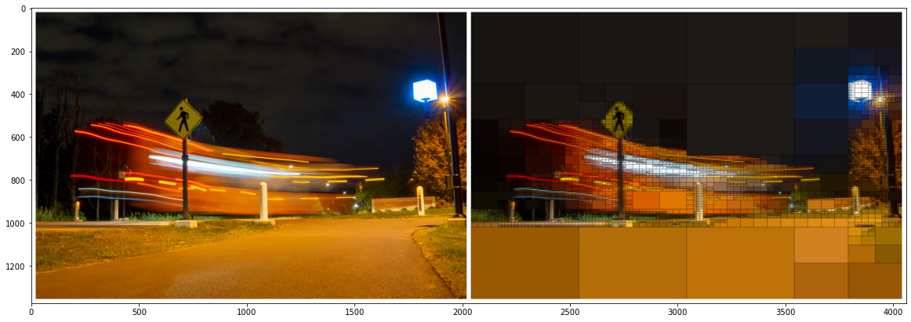

I'm still vexed as to whether these distortions of reality are a good thing or a bad thing, or if this distinction is even pertinent.


```python
displayQuadTree("../final/russell-final-4.jpg", threshold=12, line_color=(0,0,0))
```

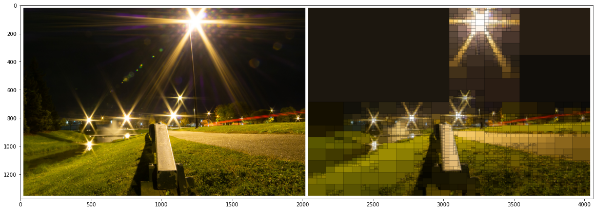


I am intrigued as to how detail are both illuminated and hidden away using the quadtrees.
The main composition of the image remains unchanged, yet the more subtle details are cast away.


```python
displayQuadTree("../final/russell-final-7.jpg", threshold=12, line_color=(0,0,0))
```

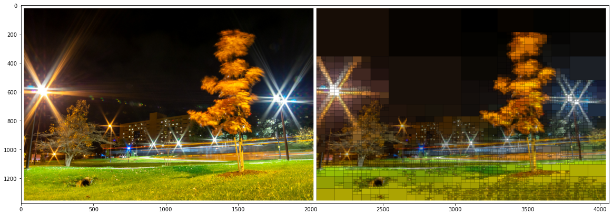


```python
displayQuadTree("../final/russell-final-10.jpg", threshold=12, line_color=(0,0,255))
```

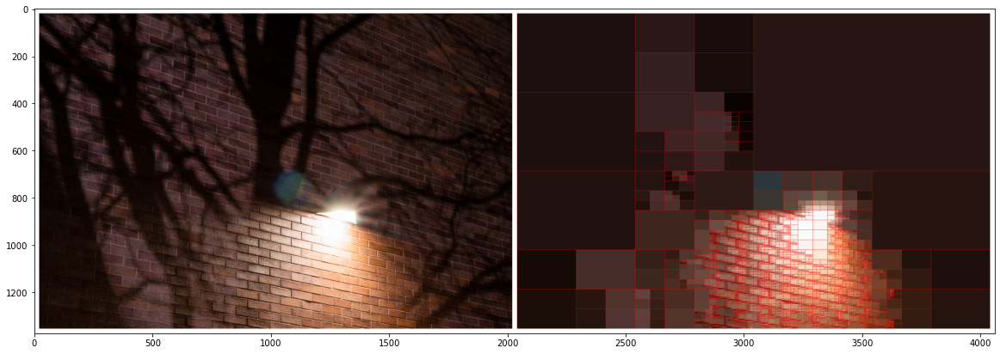


```python
displayQuadTree("../final/russell-final-14.jpg", threshold=12, line_color=(0,0,0))
```

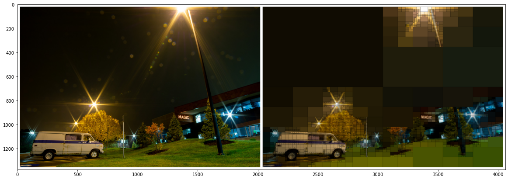

Despite being intuitively aware of the differences between reality and the images we see, it is hard for our minds to quantify this stark difference.
On the one hand, these images are the only thing that I have from my nights out at RIT doing photography, thus making these images evidence of my experience-- the only tangible thing I can cling onto. 
Yet, on the other hand, it fails to capture the essence of RIT at night altogether. 
I framed these images with a tripod, and their long exposure shots distort light in a way that the human eye can't perceive.
The edits with both Lightroom and my python script further distorts the original scene.

The problem with seeing the world through a camera is that you miss everything the camera doesn't see.
I can't show you precisely what last night's sky looked like, not really, but you can see tonight's, and it will be beautiful.

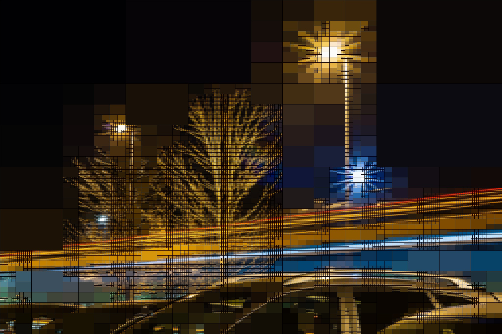