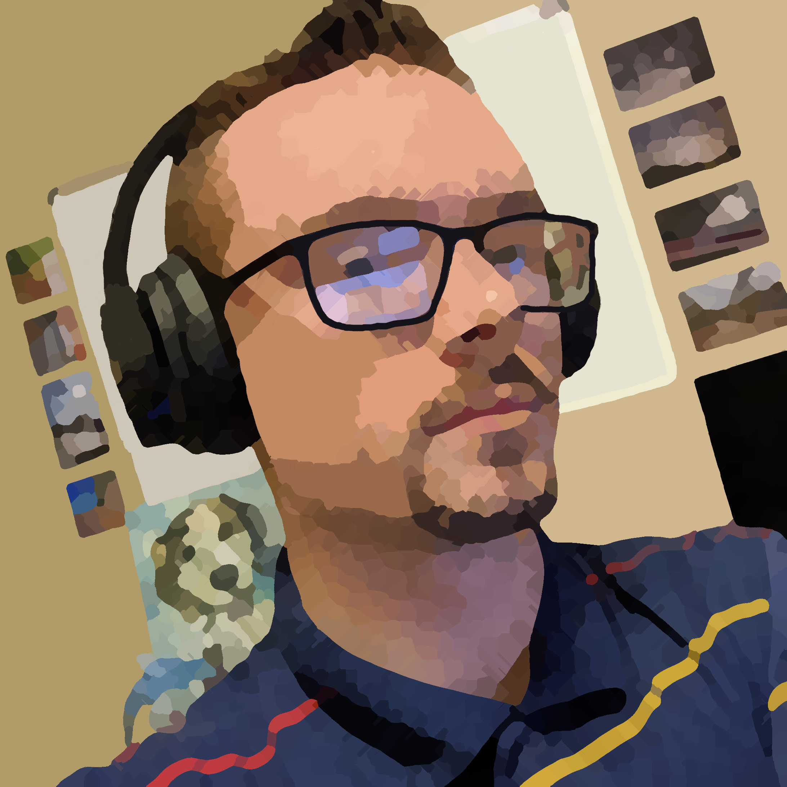
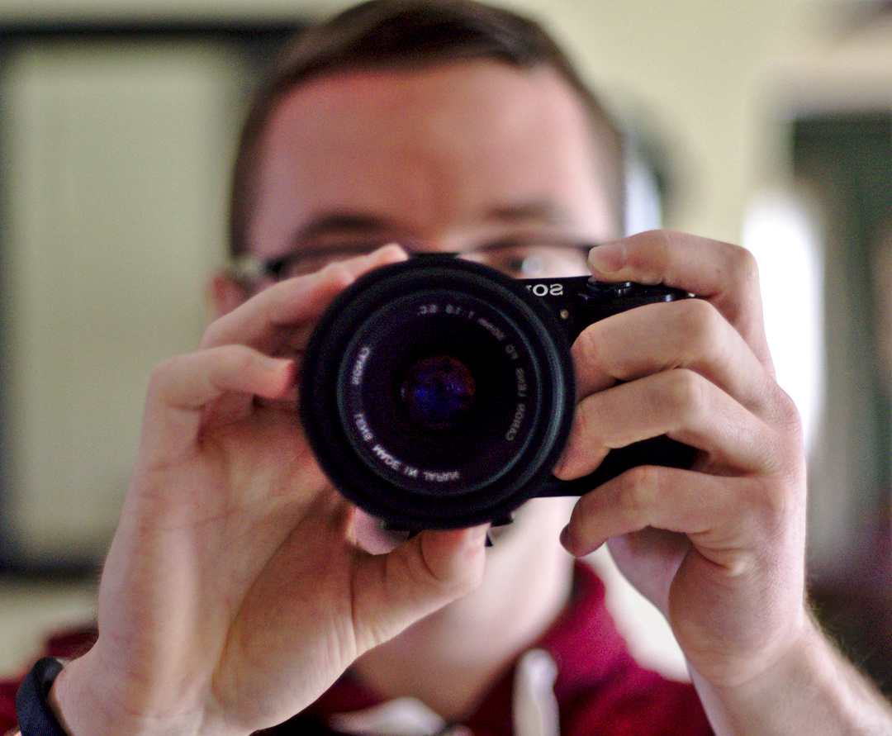

Given enough time in a shower, you develop shower thoughts --  but
mostly you get pruney fingers. Given the current social distancing
measures, everyone has taken to the internet to get their work done. I
am now working, taking classes, and hanging out with friends on the
internet on a daily bases. The omnipresent prevalence of online
platforms has gotten me thinking a lot about how we express our
identity on the internet. Specifically, profile pictures have seized
my attention lately.  

On the internet, you can express yourself in ways that are infeasible
in real life. The very notion of a profile with a bio and a brave
little emblem representing you at your best is a new paradigm. This
gives immense control over your first impressions on the internet--
something that we desperately wish for in the real world. 

Like many self-reflective individuals in my generation, I probably
spend way too much time thinking about my profile. I don't believe
that this is necessarily a bad thing, putting some creative effort
into your profile picture can raise your self-esteem -- or something
like that. People should take pride in their profile images because it
is a stamp of your identity: an image or ideal of you at your best.
Your profile is a place to carve out your home on the internet.  

Not everybody puts effort or thought into profiles, that is perfectly
fine. However, as people start to do more things online, we will see
more in-depth and creative profiles. As one of my friends put
it a long time ago: "Upload a dam photo! You don't want to be another
faceless Jeff on the internet". 

