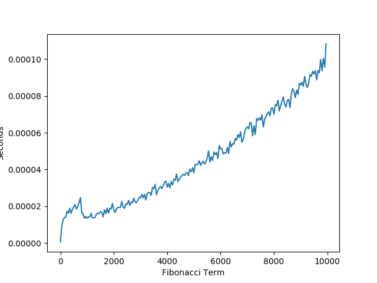

```Python
def fib(n):
    if n == 0 or n == 1:
        return n
    return fib(n-1) + fib(n-2)
```


```Python
def fibHelper(n, a, b):
    if n == 0:
        return a
    elif n == 1:
        return b
    return fibHelper(n-1, b, a+b)


def fibIterative(n):
    return fibHelper(n, 0, 1)
```


```Python
def multiply(a,b):
    product = [0,0,0]
    product[0] = a[0]*b[0] + a[1]*b[1]
    product[1] = a[0]*b[1] + a[1]*b[2]
    product[2] = a[1]*b[1] + a[2]*b[2]
    return product


def power(l, k):
    if k == 1:
        return l
    temp = power(l, k//2)
    if k%2 == 0:
        return multiply(temp, temp)
    else:
        return multiply(l, multiply(temp, temp))


def fibPower(n):
    l = [1,1,0]
    return power(l, n)[1]
```


