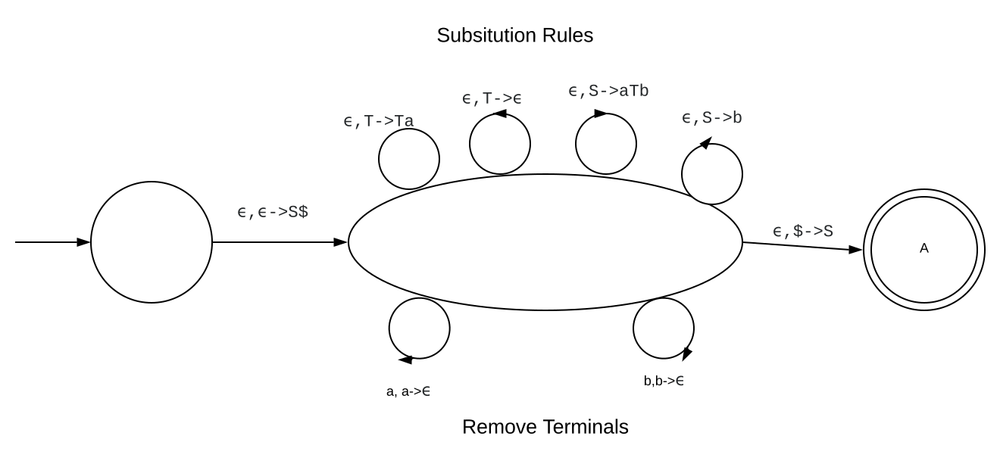

This a very high level review post that I am making for myself and
other people reviewing CS Theory. If you want to lean more about
content in this blog post I recommend cracking open a text book-- I
know, gross. This hastily thrown together post will cover how to solve
typical problems relating to topics covered by my second CS Theory
exam. 

# Myhill-Nerode Theorem

## Definition

L is regular if and only if it has a finite index. The index is the
maximum number of elements that are pairwise distinguishable. Two
strings are said to be pairwise distinguishable if you can append
something to both of the strings and it makes one string accepted by
the language and the other string rejected.  The size of an index set
X equals the number of equivalence classes it has and the minimum
number of states required to represent it using a DFA. Each element in
the language is accepted by only one equivalence class. 

## Problem Approach

Prove that language L is regular. 

1) Define a set X which is infinite in size - this doesn't have to be in the language.

2) Make a general argument that show that each element in X is pairwise distinguishable.
Pick any two elements x, y in X and show that if you append z to them one is accepted by the language and 
the other is not in the language.

## Example

Prove the following language is non-regular: 

$$
L={ww^r | w \in {0,1}^*}
$$

answer: 

1)

$$
X = {(01)^i | i \geq 0}
$$

Pick any 2 elements of X and show pairwise distinguishable 

$$
x = (01)^i, y = (01)^j  | i \neq j
$$

suppose we pick 

$$
z = (10)^i\\
xz \in L\\
yz \notin L
$$

# DFA minimization algorithm

Types of Problems: 

- Prove DFA is minimal
- Minimize the DFA

The argument for DFA minimization comes from the Myhill-Nerode
theorem. Given a DFA, if you can form a set of strings which represent
each state and they are all  pairwise distinguishable, then the DFA is
minimal with that many states. 

## Prove DFA is minimal

For these types of problems you construct a table and show that each
state is pairwise distinguishable. To show pairwise distinguishably
you have to show that there exists a string where if appended to one
element  makes it accepted by the language but pushes the other string
out of the language. 

### Example

Prove the following DFA is minimal. 

Find a set of strings which represent the minimal path to each state
in the DFA. 

$$
X = \{\epsilon, b, bb, ba\}
$$

Show that each state is pairwise distinguishable. 

## Minimize the DFA

To use the concept of being indistinguishable to minimize a DFA, you
can use a table to keep track which states are distinguishable from
each other. The states which are not indistinguishable can  be
combined. To solve one of these problems you start by creating a table
which compares each of the  states in the DFA. You then go through and
mark the states which are indistinguishable -- start with  the ones
with different accepting statuses. Then you continue marking off
states where if you transition with a symbol on the DFA you are
distinguishable and the other state is non-distinguishable according
to the table. 

### Example

Minify the Following DFA: 

After marking the states with different accepting criteria as being
distinguishable you get this table: 

After looping through all pairs and marking them on the table if there
exists symbol which results in one state  to be distinguishable and
one to be indistinguishable you get this table: 

According to the table you are able to combine {D, A, B}, {C, F}, and
{E, G}. 

Minimal DFA: 

# Pumping lemma for regular languages

The pumping lemma cannot prove that a language is regular, however,
you can use it to show that some languages are non-regular. This
theory gets at the idea that if a regular language is long
enough/infinite, it will have a state somewhere which is repeated on
the path that accepts the string. 

The accepted strings can be divided into three parts: 

- Symbols leading up to the loop
- Symbols which complete a loop and come back to start of loop
- Symbols at the end of the string

To Show that a language L is not regular using pumping lemma: 

- Use a proof by contradiction
- Assume L is regular
- Choose a representative string S which is just barely in the language and is represented in terms of p. 
- Express S = xyz such that |xy| < p and y > 0
- Show that you can pump y some amount of times such that it is not in the language.
- This contradicts the pumping lemma.
- The assumption that L is regular is wrong.
- L must not be regular.

## Example

Show that the following language is non-regular. 

$$
{0^n1^n | n \geq 0}
$$

Proof by contradiction 

Assume that L is regular. 

Let p be the pumping length associated with L 

$$
S = o^p1^p
$$

S is valid since 

$$
|s| \geq p, S \in L
$$

For any valid decomposition 

S = xyz 

such that |xy| <= p and |y| > 0 

Consider: 

$$
xy^2z
$$

By the pumping lemma this should be in the language but it is not.
Therefore our assumption that the language is regular is false.  

# Context-free grammars, closure properties for CFLs

The context-free grammars are a super-set of the regular languages.
This means that CFG's can represent  some non-regular languages and
every regular language. Contest-free Languages are defined by
Context-Free Grammars and accepted using Push-down Automata machines. 

Context Free Grammars are Represented using: 

- **Terminals** = Set of symbols in that language
- **Variables** = Set of symbols representing categories
- **Start Symbol** = Variable which you start with- written on top
- **Substitution Rules** = Set of rules that recursively define the language.

## Example 1

Grammar G: 

$$
A \rightarrow 0A1 \\
A \rightarrow B \\
B \rightarrow \# \\
$$

This grammar describes the following language: 

$$
L = \{0^k\#1^k | k \geq 0\}
$$

## Example 2

Give CFG for non-Palindromes 

$$
S \rightarrow aXb | bXa | aSa | bSb | ab | ba \\
X \rightarrow aX | bX | a | b \\
$$

In this example, the S rule recursively applies itself until something
that is not a palindrome is added. Once you exit the S state, you can
finish by appending anything to the middle of the string.  

## Example 3

Give CFG for the following language: 

$$
\{a^ib^jc^kd^l | i+k = j + l\}
$$

$$
S \rightarrow aSd | XYZ \\
X \rightarrow aXb | \epsilon\\
Y \rightarrow bYc | \epsilon\\
Z \rightarrow cZd | \epsilon
$$

## Closure

CFLs are closed under union, concatenation, and Kleene star. 

- Union: Create a new starting variable which goes to either branch.
-Kleene Star: We can repeatedly concat the derivations of the string. However, we also need to make sure that epsilon occurs in the string. 
- Concatenation: From start variable we force the concatenation of two variables representing each state sub CFG

# Parse trees, ambiguity

Parse Trees are simply graphical means to illustrate a deviation of a
string from a grammar. The root of the tree will be the start
variable, interior nodes are other variables. Leaf nodes are  terminal
symbols.  

A CFG is said to be ambiguous if there is at least one string with two
or more distinct derivations. Leftmost and rightmost derivations are
not ambiguous.  

To remove ambiguity try to force order or break CFG into cases. 

# Chomsky Normal Form

Useful form for CFGs since they allow you to easily identify if a
string is in a language. 

Form: 

$$
A \rightarrow BC\\
A \rightarrow a\\
S \rightarrow \epsilon
$$

Convert CFG to CNF (Chomsky Normal Form).    

- Add new start variable   

- Remove Epsilon rules (multi-step process)   

- Remove unit rules    

- Convert to A -> BC, A -> a 

## Example

Convert the following CFG to a CNF 

$$
S \rightarrow ASA | aB\\
A \rightarrow B | S\\
B \rightarrow b | \epsilon
$$

Step 1: Add new start variable. 

$$
S_0 \rightarrow S\\
S \rightarrow ASA | aB\\
A \rightarrow B | S\\
B \rightarrow b | \epsilon
$$

Step 2: Remove epsilon rules. 

$$
S_0 \rightarrow S\\
S \rightarrow ASA | aB | a\\
A \rightarrow B | S | \epsilon\\
B \rightarrow b
$$

$$
S_0 \rightarrow S\\
S \rightarrow ASA | aB | SA | AS | S | a\\
A \rightarrow B | S\\
B \rightarrow b
$$

Step 3: Remove unit rules 

(Remove A -> B)

$$
S_0 \rightarrow S\\
S \rightarrow ASA | aB | SA | AS | a\\
A \rightarrow b | S\\
B \rightarrow b
$$

(Remove A -> S)

$$
S_0 \rightarrow S\\
S \rightarrow ASA | aB | SA | AS | a\\
A \rightarrow b | ASA | aB | SA | AS | a\\
B \rightarrow b
$$

(Remove S0-> S)

$$
S_0 \rightarrow ASA | aB | SA | AS | a\\
S \rightarrow ASA | aB | SA | AS | a\\
A \rightarrow b | ASA | aB | SA | AS | a\\
B \rightarrow b
$$

# Push-Down automata

These are NFAs but they also have a stack. This allows us to solve any
problem which can be represented with a CFG. 

The stack has it's own alphabet. The dollar symbol typically
represents the empty stack. 

With each transition you can examine the stack, push to the stack and
move to a new state. 

## Example

$$
L = \{a^n\#b^n\}
$$

# Construction to convert CFG to a PDA

Basic idea: use stack to hold progressive derivations of a string
using rules of grammar. 

## Example

Convert the following CFG to a PDA: 

$$
S \rightarrow aTb | b \\
T \rightarrow Ta | \epsilon
$$

