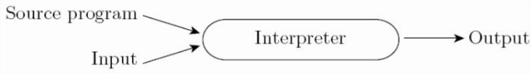
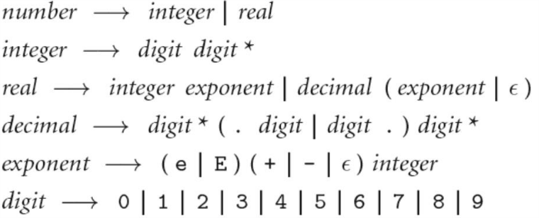
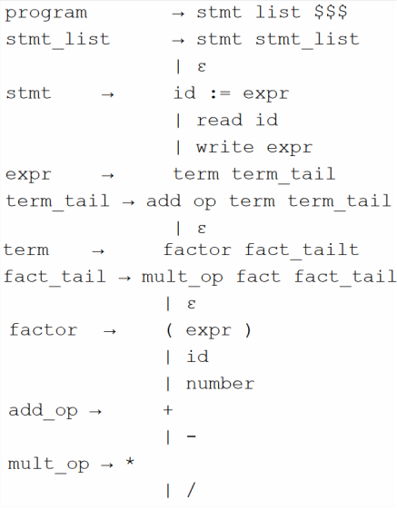
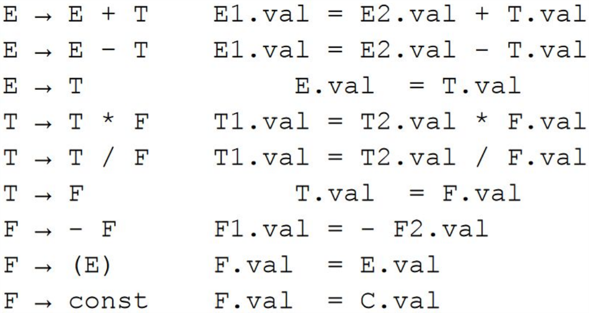
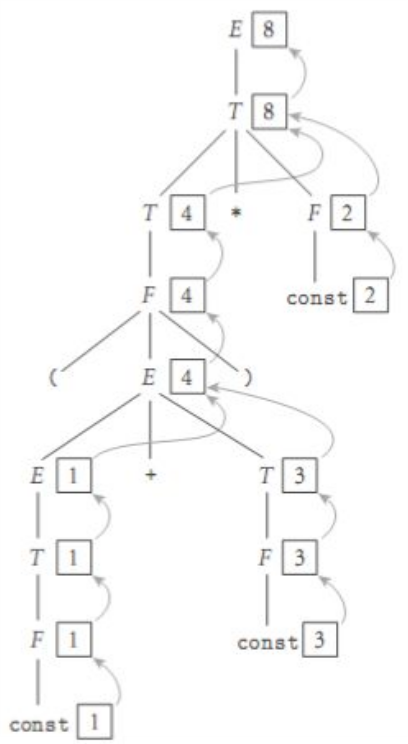
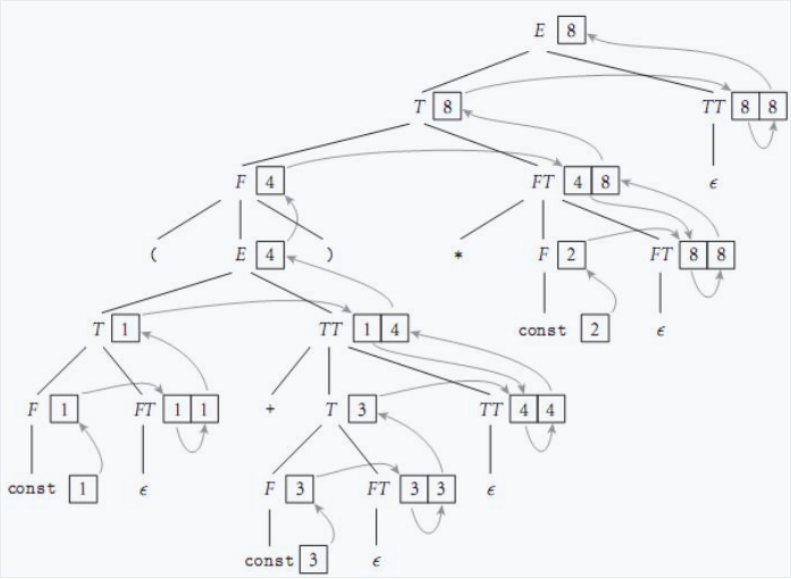
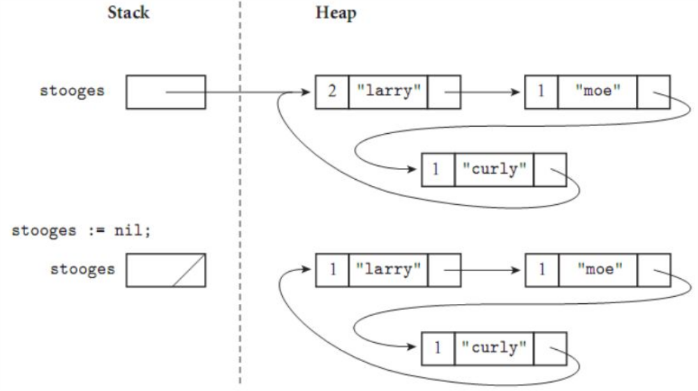
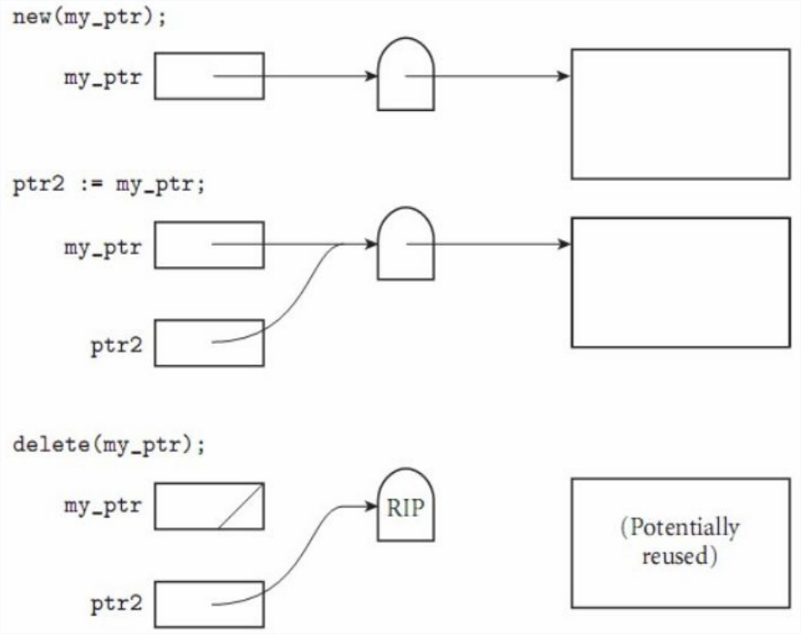
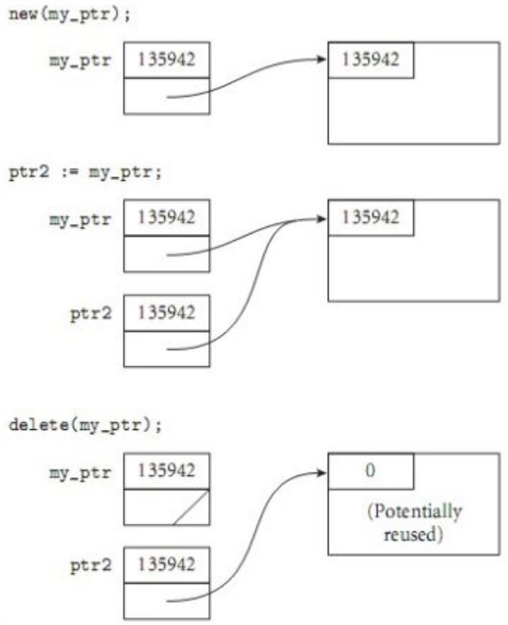
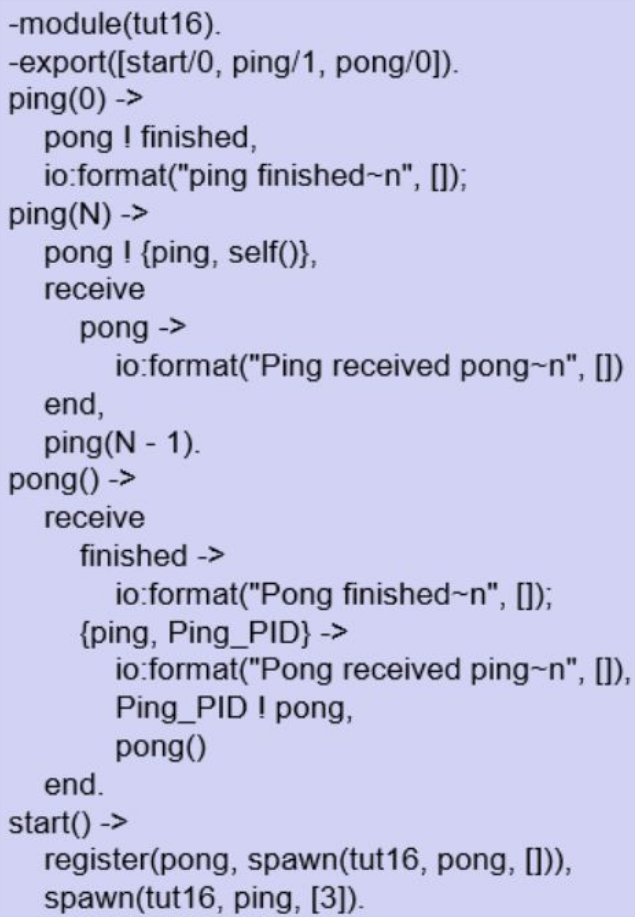

A quick review for CSCI-344 (Programming Language Concepts)


# Ch #1 What are Programming Languages

## Types

### Imperative

Most common type of language

- Von Neumann (Fortran, Basic, C)
- Object-oriented (SmallTalk, java)
- Scripting (perl, python, basic)

### Declarative

- Functional (Scheme, ML)
- Logical (Prolog)

## Compilation vs Interpretation

Interpretation is more flexible and gives better diagnostics for debugging.
Compilation provides better performance.
Often there is no clear cut difference between compilation and interpretation because many languages like java and python do a mix of the both.

### Compilation


### Interpretation




### Mixed


### Compilation Overview


# Ch #2 Parsing

## Context-Free Grammars

We use CFGs to produce a parse tree from tokens.



## LL Grammar

LL(1) grammar means that it is left right left most derivation parsing with one token look ahead.
In practice we would use a stack to keep track what we expect to see.
In this approach we would build the tree top down.
The LL parsing algorithm uses FIRST/FOLLOW/PREDICT tables.

Ex grammar:



## LR Grammar

LR (Left to right right most derivation) builds the tree bottom up and is almost always table driven.


## Scanning

A scanner is responsible for tokenizing the source, removing comments, saving text of identifiers, and saving line locations for error messages.
A scanner is most naturally represented as a DFA (Deterministic Finite Automaton).


# Ch #10 Object Oriented

Three major OO Components:

- Encapsulation
- Inheritance
- Dynamic method binding

Strict terms for OO lang: everything is an object, inheritance, dynamic method binding.
Since java has primitives, it is not a true OO language. 


## Small Talk

Started as a thesis project in the 1960's, has been noted as being one of the best OO language historically. 

Basic coding examples on class-inheritance and constructors may be on exam.

### Syntax

Excessively uses parenthesis.
Method calls are in the form: (function:: object parameter1 parameter 2).
NOTICE: the colons in the function name represents how many parameters it has.
Also, there are no commas between parameters.


Basic example class. 

```scheme
(class Shape Object
    (perimeter area) ; class-level parameters
    
    ;constructor
    (class-method initalize::shape (per ar)
        (init::shape (new self) per ar)
    )

    (method init::shape (per ar)
        (setPerimeter: self per)
        (setArea: self ar)
        self
    )

    (method getPerimeter () 
        perimeter
    )
    
    (method getArea () 
        area
    )

    (method setArea: (a)
        (set area a)
    )

    (method setPerimeter: (p)
        (set perimeter p)
    )
)

(val shape1 (initalize::shape Shape 12 5))

; area
(getArea shape1)
(setArea: shape1 88)
(getArea shape1)
```


Example with inheritance:

```scheme
(class Circle Shape
    (radius)

    (class-method initalize:circle (rad)
        (init:circle (new self) rad)
    )

    (method init:circle (rad)
        (setRadius: self rad)
        self
    )

    (method setRadius: (rad)
        (set radius rad)
        (setArea: self (computeArea self))
        (setPerimeter: self (computePerimeter self))
    )

    (method getRadius ()
        radius
    )

    (method computeArea ()
        (* 
            (asFloat (/ 22 7)) 
            (asFloat (squared radius))
        )
    )

    (method computePerimeter ()
        (* 
            (asFloat 2) 
            (* 
                (asFloat (/ 22 7)) 
                (asFloat radius)
            )
        )
    )
)


(val circle1 (initalize:circle Circle 5))
(getRadius circle1)
(getArea circle1)
(getPerimeter circle1)

(setRadius: circle1 6)
(getRadius circle1)
(getArea circle1)
(getPerimeter circle1)
```

# Ch #3: Name, Scope, and Binding

A name is a identifier. A binding links a name to an item.
Scope is simply when a binding is active.


# Binding

Binding typically happens at two times:
- Static: before run time
- Dynamic: at run time.

The earlier the binding the greater efficiency you have. The later the binding the greater flexibility you have.

Static scope rules use the structure of the program.
Dynamic scope rules depends on the current state of the program so, the function call sequences can change which bindings are active.

# Lifetime

Key events:

- creation of object
- creation of binding
- references to variables (uses binding)
- deactivation of binding (leave function stack)
- reactivation of bindings
- destruction of bindings
- destruction of object

If object out lives its binding it's garbage.
If binding out lives its object it's a dangling reference.

# Ch #4 Semantic Analysis

The role of semantic analysis is to enforce semantic rules and generate a syntax tree(decorate the parse tree).
To do this we use a attribute grammar.

ex attribute grammar:



## S-Grammar:

Only uses synthesized attributes: the grammar above.



## L-Grammar:

A l attribute depends on things above them or besides them in the parse tree.



## Action Routines

Functions used to interleave the parser.


# Ch #11: Functional Programming

Examples:
- Lisp
- Scheme
- FP
- ML
- Haskell

Key Ideas:
- everything is done by composing functions
- no mutable state
- no side effects
- just produces a answer/result

Necessary Features:
- first class and high-order functions (takes in/returns functions)
- polymorphism
- powerful list functionality
- structured function returns
- fully general aggregates
- garbage collection

Since there is no state, it heavily relies on recursion to replace iteration.

## Scheme

Not purely functional because it has some imperative stuff like assignment, I/O, sequencing and IO

Scheme scopes:
- let: calculates all RHS and then assign, can't use prior ones
- let*: evaluates and then assigns
- letrec: evaluates and then assign, this will loop back to fill in missing pieces as they are declared


### Scheme Examples:

Note: cdr is tail of list and car is the first element in the list.

```scheme
; Computes length of list
(define (length lst)
  (if (null? lst)
     0
     (+
       1
       (length (cdr lst))
     )
  )
)


; determines if something is in the list
; returns:
;   1 if true(in list)
;   0 if not in list
(define (inList lst n)
 (if (null? lst)
     0
     (if (= n (car lst))
         1
         (inList (cdr lst) n)
     )
 ) 
)

; finds the sum of the list
(define (sumList lst)
  (if (null? lst)
      0 ; empty list
      (+
         (car lst)
         (sumList (cdr lst))
      )
  )
)
```

# Ch #6: Control Flow

Types of iteration:
- Sequencing: specifies a linear ordering on statements
- Selection: selects a section of code ie: if statements
- Iteration: for loops, iterates over a well-defined set
- Concurrency
- Exception Handling
- Non-determinacy


Orthogonality: feature can be used in any combination and the meaning is consistent.


# Ch #7: Data Types


Data types are a collection of values from a "domain".
Data types specify the structure of the data and a collection of well-defined operations you can perform on that type.
Data types are useful for implicit context and so that we can avoid meaningless operations.

Strong typing is when language prevents on data that is not appropriate.

Static typing is strong typing that the compiler can do.

Orthogonality: no restriction on how a collection of features can be combined: like python lists.

## Type Systems

A type system has rules for the following:
- type equivalence
- type compatibility: can type A be used in context of type B
- type inference: type of expression given its operands types

## Type Checking

Two major types:
- Structural Equivalence: based on memory layout to determine if same -- can result in unintended equivalencies
- Name equivalence: based on declaration type -- most common

## Coercion

When an expression of one type is used in the context of another. Implicit coercion is when the language does it. 
Explicit is when the programmer does it (Casting).

# Ch #12: Logical Programming

Logical programming is based on predicate calculus.

Important concepts:
- Axioms: facts assumed true in knowledge base
- Theorems: things that are provably true
- Hypotheses: things or queries we would like to prove
- ATOM is a constant like a number

Within logical languages, statements can be written many ways.
Logical languages are good for people but bad for people.
Prolog uses backwards chaining to prove things true mathematically.


A horn clause contains a HEAD and a BODY, sll statements must be in this term. The head is a single term, but, the body can be a list of terms.

## Prolog Ex

```Prolog
path(b, f, 6).
path(g, f, 3).
path(e, g, 2).
path(h, g, 4).


% makes paths bi-directional
biPath(A, B, Y) :- path(A, B, Y).
biPath(A, B, Y) :- path(B, A, Y).

% X is starting point
% Y is ending point
% P is a list of the points on the final path if one exists
% N is the distance between X and Y if one exists

% rule for terminal
solveV(X, X, [X], 0, V).

% recursively build out path
solveV(A, B, [A|P], N, V) :- biPath(A, C, CC),
                             \+member(C, V),
                             solveV(C, B, P, CCC, [C|V]),
                             N is CC + CCC.

% expand given definition to helper function
solve(A, B, P, N) :- solveV(A, B, P, N, [A]).

% ex test runs in interpreter
solve(h, c, P, N).
solve(a, e, P, N).
solve(g, c, P, N).
solve(a, a, P, N).
solve(g, h, P, N).
```

# Ch #8: Composite Types

Types:
- Records (Structures)
- Arrays
- Strings
- Pointers
- Lists
- File I/O

## Garbage Collection

Problem with reference counter for garbage collection:



Mark and Sweep solution:

- Garbage collector walks heap basically marks everything as useless
- starts at outside pointers marking everything it can get to as useful
-walks the heap again placing useless items in the free queue.


## Pointers

### Tombstones

Costly way of dealing with pointers references.
This will create an additional object to maintain the pointer.




### Lock and Keys

Makes sure that pointers and pointe contains the same lock value before you dereference the object.
Note: this does not prevent attempting to use memory outside of your block resulting in a seg fault.




# Ch #13: Erlang

Approaches to parallel programming:
- Synchronized access to shared memory
- Message passing between processes (slower)

Race conditions are whe the result depends on the order of the thread actions.
Usually due to bad synchronization but, not always bad.

Synchronization ensures that events in different processes happen in a desired order.
Mutual exclusion: only one can access at a time.
Condition synchronization: wait until some condition is true.

Spin lock - busy-wait mutual exclusion, they waste processing cycles. Semaphores: widely used and uses a scheduler-based methods.
Monitors are used to note who is in a critical region.

## Erlang

Syntax of erlang is very similar to prolog with its pattern matching.
Erlang relies on message passing for concurrency.
Each process contains a "mailbox" where it can receive messages from.
You process by listening for a message of a specific format: ie you can choose to ignore certain messages for a period of time.

### Examples



```Erlang
%%%-------------------------------------------------------------------
%%% @author Jeffery Russell
%%% @doc
%%% PLC assignment 4
%%% @end
%%% Created : 16. Nov 2019
%%%-------------------------------------------------------------------
-module(prog4).
-author("jeff").

%% API
-export([start/0, bank/0, client/0]).

% helper function to spawn a specific amount
% of clients
spawn_client(N) when N >= 1 ->
  io:fwrite("Spawning a client\n"),
  spawn(prog4, client, []),
  spawn_client(N -1);

spawn_client(_) ->
  io:fwrite("Spawned all clients\n").

% start with random account balance between 2k-3k
% receives message {clientid, number}
% negatives removes from bank, positives add
% returns {<client_id>, balance}
bank() ->
  Balance = rand:uniform(1000) + 1999,
  io:format("Bank balance starting at: ~w~n", [Balance]),
  Client_count = rand:uniform(7) + 2,
  Client_left = 1,
  spawn_client(Client_count),
  loop(Balance, Client_count, Client_left).

% main bank loop which listens for messages and
% processes them
loop(Balance, Client_count, Client_left) ->
  receive
    %io:format("Bank now has ~w", [balance])
    {CLIENT_ID, balance} ->
      io:fwrite("~w Requested Balance from the bank\n", [CLIENT_ID]),
      CLIENT_ID ! {Balance},
      loop(Balance, Client_count, Client_left);
    {CLIENT_ID, NUMBER} ->
      if
        Balance + NUMBER >= 0 ->
          CLIENT_ID ! {NUMBER, Balance + NUMBER, successful},
          loop(Balance + NUMBER, Client_count, Client_left);
        true ->
          CLIENT_ID ! {NUMBER, Balance, failed},
          loop(Balance, Client_count, Client_left)
      end;
    goodbye ->
      if
        Client_left == Client_count ->
          io:format("Bank is closing with balance ~w`\n", [Balance]);
        true ->
          loop(Balance, Client_count, Client_left + 1)
      end
  end.


% helper function to fetch and print balance of the bank
client_fetch_balance() ->
  bank_pid ! {self(), balance},
  receive
    {Balance} ->
      io:format("~w recieved the balance of ~w from the bank~n", [self(), Balance])
  end.


% client process loop
% if loop is increment of 5, it requests balance of bank
% withdraws a random amount of money from mank
% and prints the bank's response
% after each withdrawl, it will sleep
client_loop(LoopUntil, CurrentIndex) ->
  if
    CurrentIndex rem 5 == 0 ->
      client_fetch_balance();
    true -> pass
  end,

  if
    LoopUntil == CurrentIndex ->
      bank_pid ! goodbye,
      io:format("~w Client Finished\n", [self()]);
    true ->
      bank_pid ! {self(), 100-rand:uniform(199) },

      receive
        {Amount, Balance, Suc} ->
          io:format("~w recieved the balance of ~w from the bank after a ~w transation request of ~w~n", [self(), Balance, Suc, Amount])
      end,
      timer:sleep(rand:uniform(1000) + 499),
      client_loop(LoopUntil, CurrentIndex + 1)
  end.


% creates random amount of clients
client() ->
  Nums = rand:uniform(10) + 9,
  client_loop(Nums, 0).


% spawns the bank
start() ->
  register(bank_pid, spawn(prog4, bank, [])).
```

# Ch #14: Scripting Languages


Common Characteristics:
- both batch and interactive use
- easy to write high level expressions
- simple scoping rules
- flexible dynamic typing
- easy access to other programs
- sophisticated pattern matching and string manipulation
- high level data types

Often used to glue together other programs.

Need to know bash on the exam.

## Bash

### Shall Parameters

- "$#" is the number of parameters passed
- "$0" is name of the script and its location in filesystem
- "$1" is the first command line parameter. Goes up till 9
- "$*" single word of all the parameters
- "$@" array of all the parameters

ex:

```bash
if [ $# -eq 3 ];
then
    if [ -f $1 ]
    then
        if [ -f $2 ]
        then
            encode_message $1 $2 $3
        else
            echo "File $2 does not exist"
        fi
    else
        echo "File $1 does not exist"
    fi
else
    echo "Usage:"
    echo "     encoder.sh <plane_text_file> <secret_key_file> <encoded_file>"
fi
```

### Files

```bash
    while read line || [ -n "$line" ];
    do
        for word in $line
        do
            echo "$word"
        done
    done < "$1"
```

### Comparisons

Numbers:

- "-eq" equal
- "-ge" greater than or equal
- "-le" less than or equal
- "-ne" not equal
- "-gt" greater
- "-lt" less

ex:

```bash
[n1 -eq n2]
```


Strings:

- "=" equal
- "!=" not equal
- "-n" length is greater than zero
- "-z" length is equal to zero

ex:

```
[ s1 - s2 ]
[ -n s1 ]
```

Files:

- "-d" path is a directory
- "-f" is a file
- "-e" file name exists
- "-r" check of read permission
- "-s" file has length greater than 0
- "-w" write permission
- "-x" execution permission

ex:
```bash
[ -d fname ]
```

### Control Flow

#### If Statements

```bash
if [ expression ];
then
    statements
elif [ expression ];
then
    statements
else
    statements
fi
```


#### Switch Statements

```bash
case $var in
	val1)
		statements
        ;;
	val2)
		statements
        ;;
	*)
		statements
        ;;
	esac
```

### Math

To do math you math like this:

```bash
echo "$((124+23))"

# or like this:

VALOR=$[124+23]

# or with let

let X=124+23
```


### Functions

Functions exist in bash.

```bash
#!/bin/bash
hello()
{
    echo "Woeie"
}
hello  # no parenthesis needed when calling

# you can also declare functions with the keyword

function check()
{
    return 42
}
```


