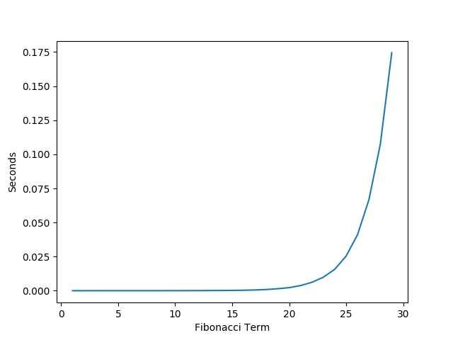
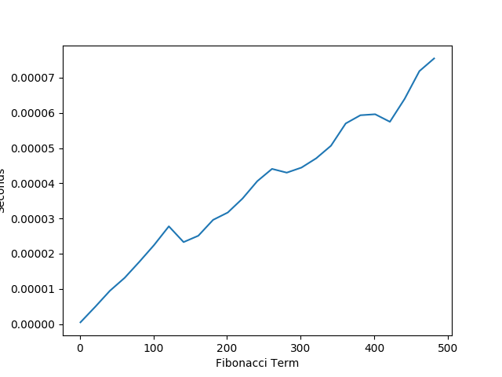
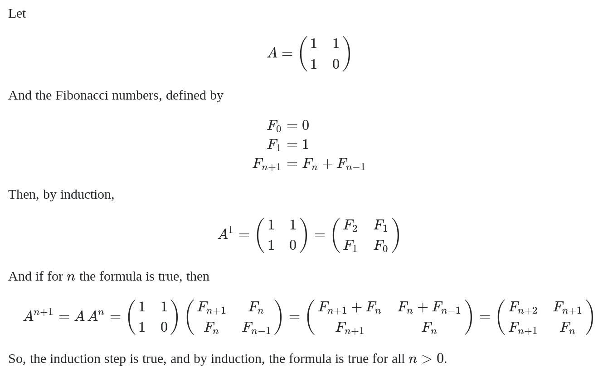
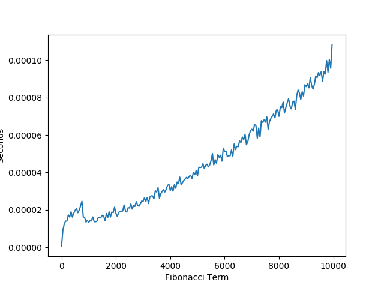

If you have ever taken a computer science class you probably
know what the fibonacci sequence is and how to calculate it.
For those who don't know: [Fibonacci](https://en.wikipedia.org/wiki/Fibonacci)
is a sequence of numbers starting with 0,1 whose next number is the sum
of the two previous numbers. After having multiple of my CS classes
give lectures and multiple homeworks on the Fibonacci sequence; I decided
that it would be a good idea to write a blog post going over
the 4 main ways of calculating the nth term of the Fibonacci sequence
and proving their time complexities both mathematically and empirically.

# Slow Recursive Definition

By the definition of the Fibonacci sequence, it is natural to write it as
a recursive definition.

```Python
def fib(n):
    if n == 0 or n == 1:
        return n
    return fib(n-1) + fib(n-2)
```

#### Time Complexity

Observing that each call has two recursive calls we can place an upper bound on this 
function as O(2^n). However, if we solve this recurrence we can compute the exact value
and place a tight bound for time complexity.

We can write a recurrence for the number of times fib is called:
```angular2html
T(1) = 1
T(n) = T(n-1) + T(n-2)
a^n = a^{n-1} + a^{n-2}
a^2 = a + 1
a = \frac{1 + sqrt(5)}{2}

T(n) = \frac{1 + sqrt(5)}{2}^n +  \frac{1 1 sqrt(5}{2}^n

O(1.618^n)
```


#### Measured Performance

Here is a graph of the actual performance that I observed for this algorithm.



# Accumulation Solution

The problem with the previous recursive solution is that you had to recalculate certain 
terms of fibonacci a ton of times. A summation variable would help us avoid this problem.
You could write this using a simple loop, however, it is still possible to do this with
recursion.


```Python
def fibHelper(n, a, b):
    if n == 0:
        return a
    elif n == 1:
        return b
    return fibHelper(n-1, b, a+b)


def fibIterative(n):
    return fibHelper(n, 0, 1)
```

In this code example fibHelper is a method which accumulates the previous two terms. 
The fibIterative is a wrapper method which sets the two initial terms equal to 0 and 1 
representing the fibonacci sequence.

Proof in latex that fibHelper 

proof in latex that fib iterative = fib


#### Time Complexity

proof in latex for time complexity

#### Measured Performance

Notice how much faster this solution is compared to the original recursive solution for
Fibonacci. Also, I only measured going out to 500 because beyond that I hit the maximum
number of recursive calls for my installation of Python.




# Matrix Solution

We can actually get better than linear time for performance while calculating 
the Fibonacci sequence recursively. 



Without any other tricks, raising a matrix to a power n times would not get
us better than linear performance. However, if we use the [Exponentiation by Squaring](https://en.wikipedia.org/wiki/Exponentiation_by_squaring)
method, we can expect to see logarithmic time.


```Python
def multiply(a,b):
    product = [0,0,0]
    product[0] = a[0]*b[0] + a[1]*b[1]
    product[1] = a[0]*b[1] + a[1]*b[2]
    product[2] = a[1]*b[1] + a[2]*b[2]
    return product


def power(l, k):
    if k == 1:
        return l
    temp = power(l, k//2)
    if k%2 == 0:
        return multiply(temp, temp)
    else:
        return multiply(l, multiply(temp, temp))


def fibPower(n):
    l = [1,1,0]
    return power(l, n)[1]
```

#### Time Complexity

latex proof for 9lg(n) performance


#### Measured Performance

As expected by our mathmatical calcuations, the algorthem appears to be running in
logarithmic time. 

#### Measured Performance With Large Numbers


When calculating the fibonacci term for extremely large numbers dispite having a polynomial
time complexity, the space required to compute Fibonacci grows exponentially. Since our
performance is only pseudo-polynomial we see a degrade in our performance when calculating 
large terms of the fibonacci sequence.

The one amazing thing to point out here is that despite calculating the 10,000 term of Fibonacci,
this algorithm is nearly 400 times faster than the recursive algorithm when it was calculating 
the 30th term of Fibonacci.


# Closed Form Definition

It is actually possible to calculate Fibonacci in constant time using a closed form definition. 

latex proof of closed form definition