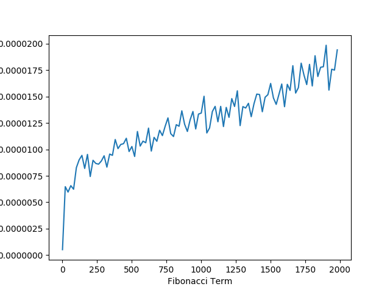

If you have ever taken a computer science class you probably
know what the fibonacci sequence is and how to calculate it.
For those who don't know: [Fibonacci](https://en.wikipedia.org/wiki/Fibonacci)
is a sequence of numbers starting with 0,1 whose next number is the sum
of the two previous numbers. After having multiple of my CS classes
gave lectures and multiple homework on the Fibonacci sequence; I decided
that it would be a great idea to write a blog post going over
the 4 main ways of calculating the nth term of the Fibonacci sequence.
In addition to providing python code for calculating the nth perm of the sequence, a proof for their validity
and analysis of their time complexities both mathematically and empirically will
be examined.

# Slow Recursive Definition

By the definition of the Fibonacci sequence, it is the most natural to write it as
a recursive definition.

```Python
def fib(n):
    if n == 0 or n == 1:
        return n
    return fib(n-1) + fib(n-2)
```

##Time Complexity

Observing that each call has two recursive calls we can place an upper bound on this 
function as $O(2^n)$. However, if we solve this recurrence we can compute the exact value
and place a tight bound for time complexity.

We can write a recurrence for the number of times fib is called:

$$
    F(0) = 0\\
    F(1) = 1\\
    F(n) = F(n-1) + F(n-2)\\
$$

Next we replace each instance of F(n) with $a^n$ since we want to solve for the roots since that
will allow us to put a tight asymptotic limit on the growth.

$$
    a^n = a^{n-1} + a^{n-2}\\
    \frac{a^n}{a^{n-2}} = \frac{a^{n-1} + a^{n-2}}{a^{n-2}}\\
    a^2 = a + 1\\
    a = \frac{1 + sqrt(5)}{2}\\
$$

From this calculation we can conclude that F(n) $\in \Theta 1.681^n$


## Measured Performance

Here is a graph of the actual performance that I observed from this recursive definition of Fibonacci.


# Accumulation Solution

The problem with the previous recursive solution is that you had to recalculate certain 
terms of fibonacci a ton of times. A summation variable would help us avoid this problem.
You could write this using a simple loop, however, it is still possible to do this with
recursion.


```Python
def fibHelper(n, a, b):
    if n == 0:
        return a
    elif n == 1:
        return b
    return fibHelper(n-1, b, a+b)


def fibIterative(n):
    return fibHelper(n, 0, 1)
```

In this code example fibHelper is a method which accumulates the previous two terms. 
The fibIterative is a wrapper method which sets the two initial terms equal to 0 and 1 
representing the fibonacci sequence.

## Proof for Fib Helper
**Lemma:** For any n $\epsilon$ N if n $>$ 1 then 
           $fibHelper(n, a, b) = fibHelper(n - 1, a, b) + fibHelper(n - 2, a, b)$.
           
**Proof via Induction**

Base Case: n = 2:
$$
    LHS = fibHelper(2, a, b)\\
    = fibHelper(1, b, a + b) = a + b\\ 
    RHS =  fibHelper(2 -1, a, b) + fibHelper(2-2, a, b)\\
    = a + b\\
$$

Inductive Step:

Assume proposition is true for all n and show n+1 follows.

$$
    RHS=fibHelper(n+1;a,b)\\
    = fibHelper(n;b,a+b)\\
    =fibHelper(n-1;b,a+b) + fibHelper(n-2;b,a+b)\\
    =fibHelper(n;a,b) + fibHelper(n-1;a,b)\\
    =LHS\\
$$

$\Box$

## Proof That fibIterative = Fib

**Lemma:** For any n $\in$ N, $fib(n)$ = $fibIterative(n, 0, 1)$
           
**Proof via Strong Induction**

Base Case: n = 0:
$$
    fibIterative(0, 0, 0) = 0\\
    = fib(0)
$$

Base Case: n = 1:
$$
    fibIterative(1, 0, 0) = 1\\
    = fib(1)
$$

Inductive Step:

Assume proposition is true for all n and show n+1 follows.

$$
    fib(n+1) = fib(n) + fib(n-1)\\
    = fibHelper(n, 0, 1) + fibHelper(n+1, 0 ,1) \quad\text{I.H}\\
    = fibHelper(n+1, 0, 1) \quad\text{from result in previous proof}\\
$$

$\Box$


## Time Complexity

Suppose that we wish to solve for time complexity in terms of the number of additions needed to be
computed. By observing the algorithm for fibHelper we can see that we perform one addition every time
which we have a recursive call. We can now form a recurrence for time complexity and solve for it. 

$$
    T(0) = 0\\
    T(1) = 0\\
    T(n) = 1 + T(n-1)\\
    T(n) = n-1\\
$$

From this recurrence we can say that fibHelper $\in \Theta(n)$.

## Measured Performance

Notice how much faster this solution is compared to the original recursive solution for
Fibonacci.


# Matrix Solution

We can actually get better than linear time for performance while calculating 
the Fibonacci sequence recursively using this fact:

$$  
\begin{bmatrix}
1 & 1\\
1 & 0
\end{bmatrix}^n = 
\begin{bmatrix}
F_{n+1} & F_n\\
F_n & F{n-1}
\end{bmatrix}^n
$$

Without any other tricks, raising a matrix to a power n times would not get
us better than linear performance. However, if we use the [Exponentiation by Squaring](https://en.wikipedia.org/wiki/Exponentiation_by_squaring)
method, we can expect to see logarithmic time. Since two spots in the matrix are always equal,
I represented the matrix as an array with only three elements. 


```Python
def multiply(a,b):
    product = [0,0,0]
    product[0] = a[0]*b[0] + a[1]*b[1]
    product[1] = a[0]*b[1] + a[1]*b[2]
    product[2] = a[1]*b[1] + a[2]*b[2]
    return product


def power(l, k):
    if k == 1:
        return l
    temp = power(l, k//2)
    if k%2 == 0:
        return multiply(temp, temp)
    else:
        return multiply(l, multiply(temp, temp))


def fibPower(n):
    l = [1,1,0]
    return power(l, n)[1]
```


## Time Complexity

For this algorythem lets solve for the time complexity as the number of additions and multiplications.

Since we are always multiplying two 2x2 matrices, that is constant time.

$$
    T_{multiply} = 9
$$

Solving for the time complexity of fib power is slightly more complicated.
$$
    T_{power}(1) = 0\\
    T_{power}(n) = T(\left\lfloor\dfrac{n}{2}\right\rfloor) + T_{multiply}\\
      = T(\left\lfloor\dfrac{n}{2}\right\rfloor) + 9\\
      = T(\left\lfloor\dfrac{n}{2*2}\right\rfloor) + 9 + 9\\
      = T(\left\lfloor\dfrac{n}{2*2*2}\right\rfloor) + 9+ 9 + 9\\
    T_{power}(n) =  T(\left\lfloor\dfrac{n}{2^k}\right\rfloor) + 9k\\
$$

let $k=k_0$ such that $\left\lfloor\dfrac{n}{2^{k_0}}\right\rfloor = 1$

$$    
    \left\lfloor\dfrac{n}{2^{k_0}}\right\rfloor = 1 \rightarrow 1 \leq \frac{n}{2^{k_0}} < 2\\
    \rightarrow 2^{k_0} \leq n < 2^{k_0 +1}\\
    \rightarrow k_0 \leq lg(n) < k_0+1\\
    \rightarrow k_0 = \left\lfloor lg(n)\right\rfloor\\
    T_{power}(n) =  T(1) + 9*\left\lfloor lg(n)\right\rfloor\\
    T_{power}(n) =  9*\left\lfloor\ lg(n)\right\rfloor\\
    T_{fibPower}(n) = T_{power}(n)\\
$$


## Inductive Proof for Matrix Method

**Lemma:** For any n $\epsilon$ N if n $>$ 0 then 
           $$  
           \begin{bmatrix}
           1 & 1\\
           1 & 0
           \end{bmatrix}^n = 
           \begin{bmatrix}
           F_{n+1} & F_n\\
           F_n & F{n-1}
           \end{bmatrix}^n
           $$

Let

$$
A=
\begin{bmatrix}
1 & 1\\
1 & 0
\end{bmatrix}^n
$$

**Base Case:** n = 1
$$
A^1=
\begin{bmatrix}
1 & 1\\
1 & 0
\end{bmatrix}^n = 
\begin{bmatrix}
F_{2} & F_2\\
F_2 & F_{0}
\end{bmatrix}^n
$$

**Inductive Step:** Assume proposition is true for n, show n+1 follows
$$
A^{n+1}=
\begin{bmatrix}
1 & 1\\
1 & 0
\end{bmatrix} 
\begin{bmatrix}
F_{n+1} & F_n\\
F_n & F{n-1}
\end{bmatrix}^n\\
= \begin{bmatrix}
F_{n+1} + F_n & F_n + F_{n-1}\\
F_{n+1} & F_{n}
\end{bmatrix}\\
= \begin{bmatrix}
F_{n+2} & F_{n+1}\\
F_{n+1} & F_{n}
\end{bmatrix}\\
$$

$\Box$


## Measured Performance



As expected by our mathmatical calcuations, the algorthem appears to be running in
logarithmic time. 

## Measured Performance With Large Numbers


When calculating the fibonacci term for extremely large numbers dispite having a polynomial
time complexity, the space required to compute Fibonacci grows exponentially. Since our
performance is only pseudo-polynomial we see a degrade in our performance when calculating 
large terms of the fibonacci sequence.

The one amazing thing to point out here is that despite calculating the 10,000 term of Fibonacci,
this algorithm is nearly 400 times faster than the recursive algorithm when it was calculating 
the 30th term of Fibonacci.


# Closed Form Definition

It is actually possible to calculate Fibonacci in constant time using Binet's Formula.

$$
    F_n = \frac{(\frac{1+\sqrt{5}}{2})^n-(\frac{1-\sqrt{5}}{2})^n}{\sqrt{5}}
$$ 

```Python
def fibClosedFormula(n):
    p = ((1+ math.sqrt(5))/2)**n
    v = ((1-math.sqrt(5))/2)**n
    return (p-v)/math.sqrt(5)
```

## Derivation of Formula

Similar to when we were calculating for the time complexity, we want to start by finding the
two roots of the equation.

$$
    a^n = a^{n-1} + a^{n-2}\\
    \frac{a^n}{a^{n-2}} = \frac{a^{n-1} + a^{n-2}}{a^{n-2}}\\
    a^2 = a + 1\\
    0 = a^2 - a - 1\\
    a = \frac{1 \pm sqrt(5)}{2}\\
$$

Since there are two roots to the equation, the solution of $F_n$ is going to be 
a linear combination of the two roots.


$$
    F_n = c_1(\frac{1 + \sqrt{5}}{2})^n + c_2(\frac{1 - \sqrt{5}}{2})^n
$$

Fact: $F_1$ = 1

$$
    F_1 = 1\\
    = c_1(\frac{1 + \sqrt{5}}{2}) + c_2(\frac{1 - \sqrt{5}}{2})\\
    = \frac{c_1}{2} + \frac{c_2}{2} + \frac{c_1\sqrt{5}}{2} - \frac{c_2\sqrt{5}}{2}\\
$$

Let $c_1 = \frac{1}{\sqrt{5}}$,
Let $c_2 = \frac{-1}{\sqrt{5}}$

$$
    F_n = \frac{1}{\sqrt(5)}((\frac{1+\sqrt{5}}{2})^n-(\frac{1-\sqrt{5}}{2})^n)\\
    = \frac{(\frac{1+\sqrt{5}}{2})^n-(\frac{1-\sqrt{5}}{2})^n}{\sqrt{5}}
$$

## Time Complexity


Since we managed to find the closed form of the fibonacci sequence we can expect to see constant performance.

## Measured Performance

