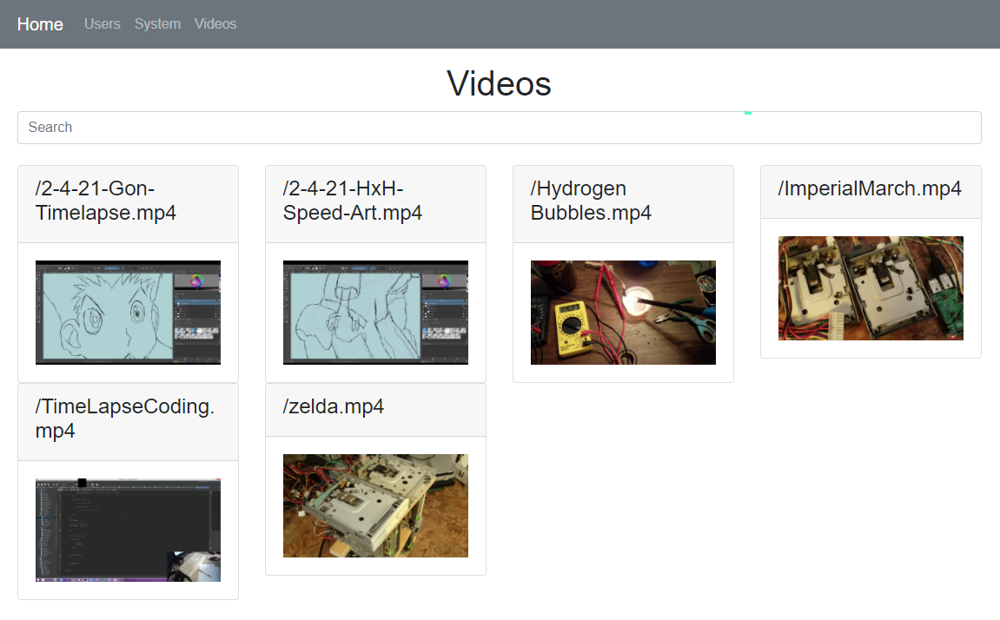
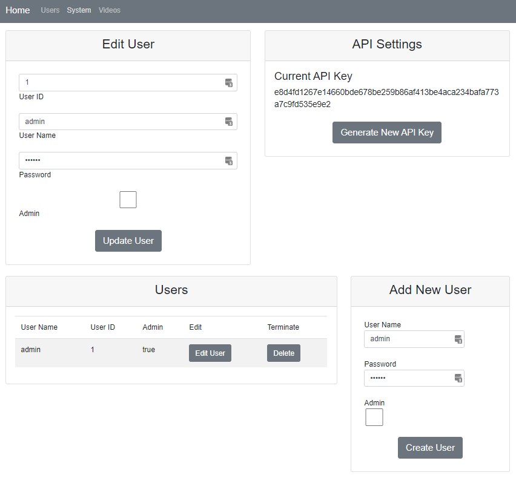
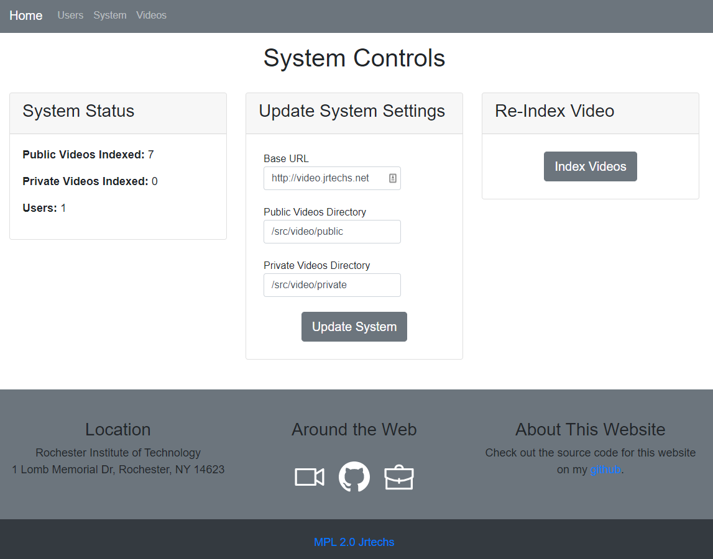

Two years ago, I created a video streaming server from scratch in Node; looking back, I realized that I must have had way too much free time.
I wanted something that I could use to embed videos in websites and aggregate all of my public videos.
In the end, I created a lightweight node application with an administration interface, API tokens, and the ability to stream videos.
Now, I can embed videos in my blog like this:

<customHTML />

Although I could have accomplished the same thing with zero effort by using Youtube-- that's now how I roll.
I wanted to get better at programming with Node, and I wanted a self-hostable lightweight open-source project.

Let's take a quick look at the website I ended up building:



The videos project's main page is a gallery that displays all of the videos on the same page with a search bar at the top for filtering.
What is notable about this page is that all of the icons displayed are gifs generated by the backend using [ffmpeg](https://ffmpeg.org/).
After you click on a video, it takes you to a separate page to watch the video or download it.
Additionally, the video page lets you copy a streamable link to the video so you can embed it in a website or open it in VLC.

The next notable feature of the website is the user management and privilege aspect of the system.
Regular users can log into the website and watch non-listed videos.
Additionally, administrators can manage other users and generate API tokens.
API tokens get used to generate video share links to watch a non-listed video without log-into the website.



There is also a page listed "System Controls."
The system page enables admin users to update some environment variables like where the videos are located and the server's URL.
The server URL gets used when generating share links for end-users to copy and share.
The re-index button tells the system to scan for new videos and generate icons.



Being able to download a full video is straightforward since you just serve the entire file.
However, to stream a video, you have to send it to the client chunk by chunk, and which chunk gets downloaded gets determined by the end client-- enabling things like buffering and skipping forward.
The following code snippet is the core node code that I ended up using to provide this functionality.
The client sends a byte array indicating the range in which they want to download.
The server then responds by reading that portion of the video file and sending it to the client.

```javascript
const parts = request.headers.range.replace(/bytes=/, "").split("-");
const start = parseInt(parts[0], 10);
const end = parts[1]
    ? parseInt(parts[1], 10)
    : fileSize-1;

const chunksize = (end-start)+1;
const file = fs.createReadStream(path, {start, end});
const head =
    {
        'Content-Range': `bytes ${start}-${end}/${fileSize}`,
        'Accept-Ranges': 'bytes',
        'Content-Length': chunksize,
        'Content-Type': 'video/mp4',
    };
result.writeHead(206, head);
file.pipe(result);
```

Another fun tidbit from this project is that I just created a Docker script to run the project.
The Docker container gets derived from a generic node container, and then I installed the ffmpeg and gifski packages-- enabling me to generate the video icons.

```bash
FROM node:buster-slim

COPY package.json package.json

RUN apt-get update && \
    apt-get install ffmpeg -y && \
    apt-get install wget -y && \
    cd /root && \
    wget https://github.com/jrtechs/static-storage/raw/master/gifski.deb && \
    dpkg -i /root/gifski.deb && \
    rm /root/gifski.deb

RUN npm install

EXPOSE 4000
WORKDIR /src/
CMD npm start
```

Although I don't use this project a lot, I maintain it since it is effortless to host and allows me to share videos without using a centralized service like YouTube. If you are interested in the project, check it out on [Github](https://github.com/jrtechs/HomeBrewPlex) and contribute by submitting issues and creating pull requests.