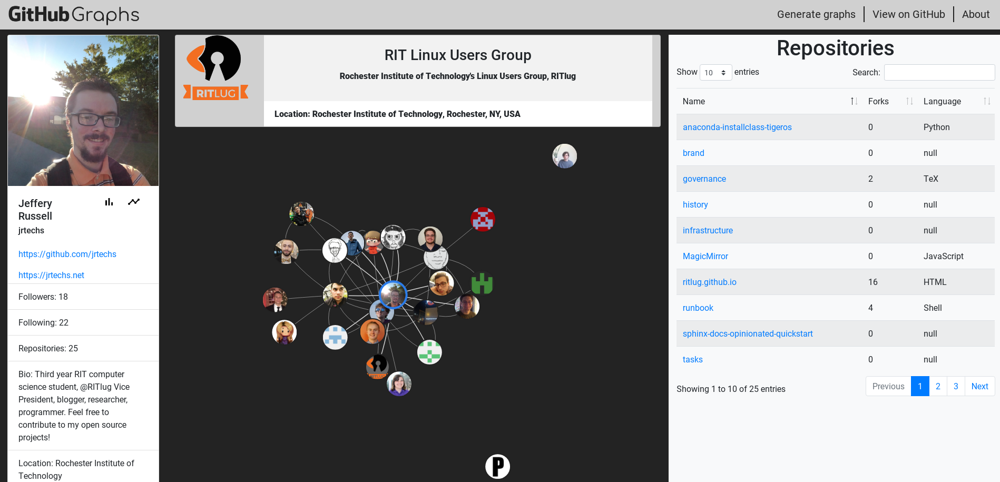
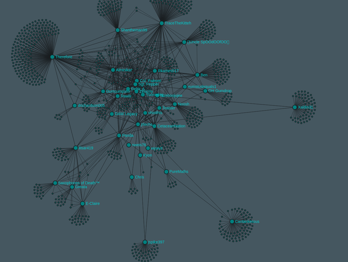

Shortly after working on my [Steam Friends Graph](https://jrtechs.net/projects/steam-friends-graph)
,I had the idea of extending the project to include the GitHub network.
I used [BrickHack V](https://brickhack.io/) as the opportunity to work on this project with my friends.
Rather than simply use the code that was used in the Steam friends graph, the architecture was completely
revamped to reflect both the differences between the Steam and GitHub networks and my improved web development skills.

# Project Overview

We created an interactive website which allows you to make graphs based on the Github network. 
Currently the site generates three types of graphs-- the most popular and entertaining of which is the friends graph. 
The friends graph helps you visualize clusters of friends/collaborators on GitHub.
Similar to the Steam Friends Project, I hope that this project will make people more interested in learning about big data.
The visual aspect of this website makes learning about topics such as clustering and graph databases more intuitive.

## Friends View

The friends view displays all of the people which you following and your followers.
This also connects connects everyone in the graph which are following each other.

## Repository View

## Organization View

## Technologies Used

- [BootStrap](https://getbootstrap.com/)
- [jQuery](https://jquery.com/)
- [Vis JS](http://visjs.org/)
- [Github v3 API](https://developer.github.com/v3/) 
- [Node.js](https://nodejs.org/en/) 

# Changes From the Steam Graph Project

The one stark difference between the Steam network and GitHub is the amount of friends that people have.
Most developers on GitHub typically only follows around 20 people where it is not uncommon for people on Steam to have well over 100 friends.
Due to the smaller graphs, I was able to use VisJS which has nicer animations and supports custom HTML for each node.

Another big change to the architecture was the way in which graphs are sent to the client.
The server generated the graph and then sent the nodes and edges to the client over a web socket for the steam graph.
In this project, the client builds the graph and queries the server using ajax for the necessary information.
This gives the client a more dynamic loading progress and makes hosting the application much easier. 

# Future Work

Since this project was initially created during a hackathon, there is a **lot** of work to be done.
I will outline a few ideas which I have.

- Improved Caching and Performance
- Friends of Friends -- similar to Steam's graph
- Graphs Linking Users and Repositories Based on Activity
- Code Metrics

# Contributing

If you want to contribute to this project and don't know where to start, look at the open issues on [GitHub](https://github.com/jrtechs/github-graphs).
Once you know what you want to work on, just discuss it in the issues and file a pull request.
I are very open to new contributes.

<youtube src="rz7KD_d-uQg" />
