It is fun to find an interesting use for old technology. Being someone who has
tons of old floppy drives and loves music, I decided to turn my old floppy
drives into an orchestra. I’m not sure where I first learned about musical
floppy drives, however, there are thousands of videos on YouTube.

This project first started over a year ago when I connected two floppy drives to
a Raspberry Pi to play the Star Wars theme.

<youtube src="wcnUvPMpqjA" />

Although this was fun, there was hardly any software for playing different music
on the Raspberry Pi. I managed to hack the software to also play Jingle Bells,
however, that took hours to input just a single song.

A half a year ago I got an Arduino board and built a new and improved floppy
drive orchestra.

<youtube src="qwbcrR-6dTU" />

What is nice about using an Arduino, is that the software used is more
developed. Unlike the program I used with the Raspberry Pi, the software used
with the Arduino allows the songs to be loaded via a MIDI file.

That brings us up to the present. My previous 8 floppy drive orchestra was not
transportable and took up a ton of space. When I decided to present this project
at Imagine RIT with RITLUG, I knew I had to rebuild my orchestra to be portable
and compact.

There are plenty of tutorials online demonstrating how to build floppy
orchestras, but, many of them are incomplete. Since this was my third time
building a floppy orchestra, I decided to log my process and make a complete
tutorial for my blog.

Hardware
========

-   10 Floppy Drives

-   Arduino Uno

-   LOTS of Ribbon Cables

-   1 Old Power Supply

-   Hot Glue

-   Solder

In in addition to these materials, you will also want something to mount your
floppy drives to. I decided to use 2x2’s and half inch screws because they are
cheep and I had some laying around my house.

Assembly
========

The first thing you should do is secure your floppy drives.

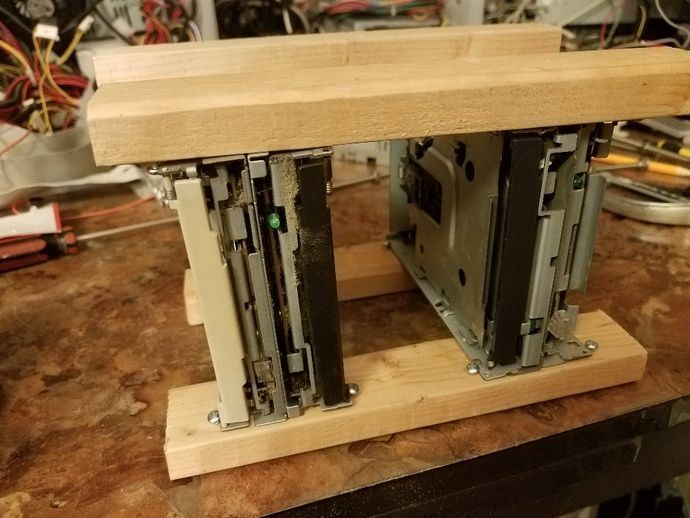

Now, it is time to power the floppy drives and turn them on. To make the floppy
drives turn on, you need to connect pins 11 and 12 on your floppy drives
together. You can easily do this with a single ribbon cable.

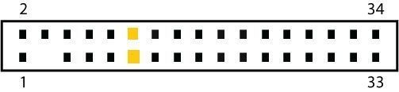

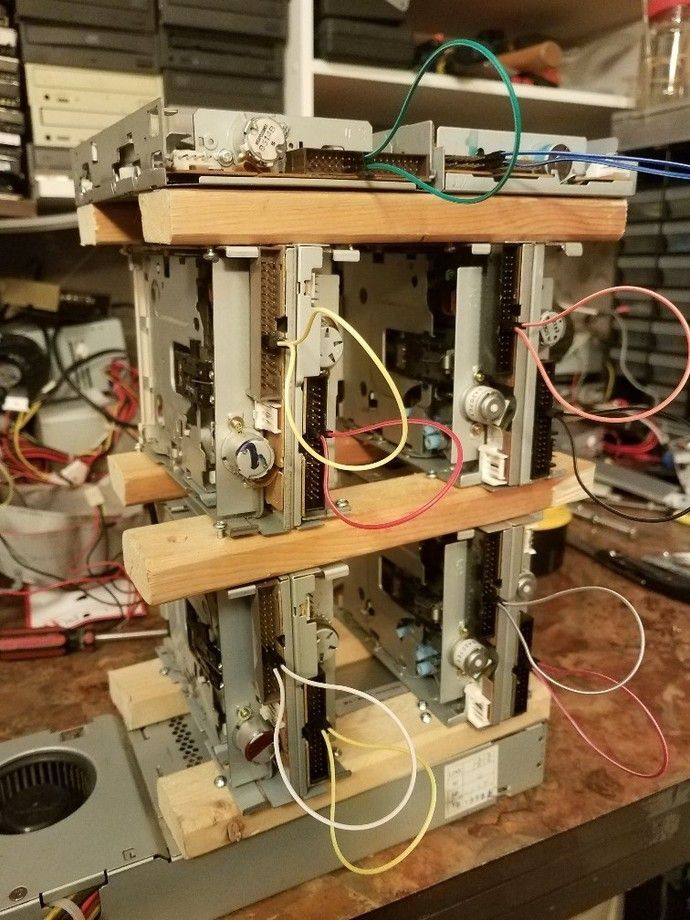

You can use an old power supply for this project. Since we are only using the
stepper motor in the floppy drives, you only need to supply 5v. Each floppy
drive has four power connectors, the middle two pins are ground, and the right
pin is 5v and the left pin 12v. Since I had ten floppy drives to power, I used a
bread board to avoid excessive soldering.

To turn on a power supply you simply connect the green wire to any ground wire.
If you want to get fancy, you can solder on a switch, however, must people just
jam a paper clip into the motherboard connector.

FWI: The red wires in your power supply are 5v and the black wires are ground.

**Warning**: Do not draw all your power from the power supply via a single
ribbon cable, it will melt. Ribbon cables have low gauge and are not meant for
high wattages. It is good idea to use multiple 5v lines from your power supply
and make sure that nowhere in your wiring is all the voltage going through a
single ribbon cable.

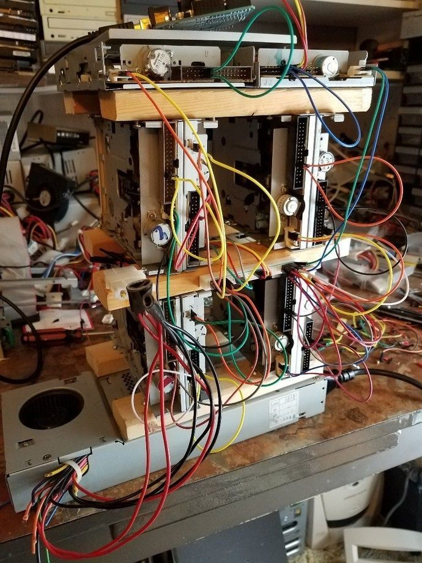

If you have done everything correct up to this point, you will see the green
lights on the floppy drives turn on when the power supply is running.

Now we need to connect the pins of the floppy drive to the Arduino.

Personally, I started by connecting pin 19 on the floppy drive to the ground pin
on the Arduino. Again, I used a bread board to make the connections easier.

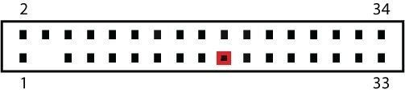

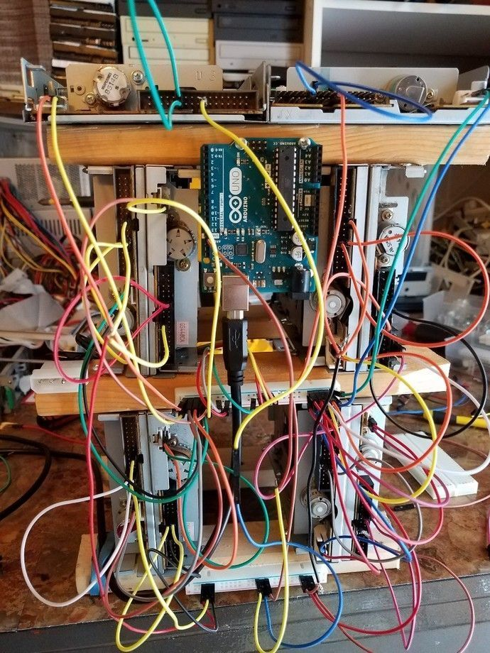

Next, we need to wire the step and direction pins of the floppy drives to the
Arduino.

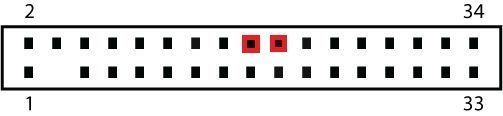

Connect direction pin 18 on the floppy drive to pin 3 of the Arduino and step
pin 20 to pin 2 of the Arduino. For additional floppy drives you follow the same
pattern. For example, the next drive would be floppy pin 18 to Arduino pin 5 and
floppy pin 20 to Arduino pin 4. If you are using something other than an Arduino
Uno board this will potentially be different. We are using these specific pins
on the Arduino because they correspond to this specific program.

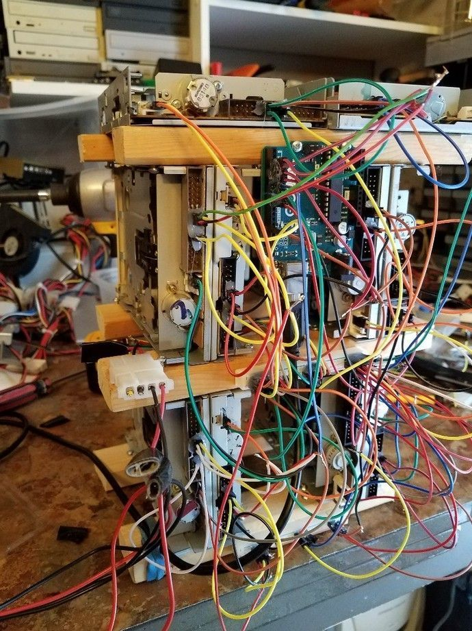

While making this, I had 4 sets of pins (8 total) connected to the Arduino,
however, I have 10 floppy drives in total. I wired two sets of three drives and
two sets of two drives together on the same Arduino “channel”. This makes the
wiring easier and makes the sound better. Not all floppy drives sound the same,
by pairing drives together you get a richer sound. Since I want to present this
live, it also makes it louder for the audience.

This is a ton of wiring! After you verify that the drives are working properly,
I would strongly recommend using hot glue to secure ribbon cables to the drives.

That’s it. Now your floppy drives should be good to go.

Software
========

This is the section where most other tutorials fall short. Please follow along
carefully. First, have the following installed on your computer.

-   Arduino Software

-   NetBeans

-   JDK 1.8 – or higher

Next download
[timer1](https://code.google.com/archive/p/arduino-timerone/downloads) and
[Moppy](https://github.com/SammyIAm/Moppy). Install timer one by extracting the
files and copying the folder timer1 into the libraries folder under your root
Arduino directory.

Open up your Arduino software and paste the following code in the editor:

```

#include <TimerOne.h>
#define RESOLUTION1 40

boolean firstRun = true; // Used for one-run-only stuffs;

//First pin being used for floppies, and the last pin. Used for looping over all pins.
const byte FIRST_PIN = 2;
const byte PIN_MAX = 17;

/*NOTE: Many of the arrays below contain unused indexes. This is
to prevent the Arduino from having to convert a pin input to an alternate
array index and save as many cycles as possible. In other words information
for pin 2 will be stored in index 2, and information for pin 4 will be
stored in index 4.*/


/*An array of maximum track positions for each step-control pin. Even pins
are used for control, so only even numbers need a value here. 3.5" Floppies have
80 tracks, 5.25" have 50. These should be doubled, because each tick is now
half a position (use 158 and 98).
*/
byte MAX_POSITION[] = {
  0,0,158,0,158,0,158,0,158,0,158,0,158,0,158,0,158,0};
  
//Array to track the current position of each floppy head. (Only even indexes (i.e. 2,4,6...) are used)
byte currentPosition[] = {
  0,0,0,0,0,0,0,0,0,0,0,0,0,0,0,0,0,0,0};

/*Array to keep track of state of each pin. Even indexes track the control-pins for toggle purposes. Odd indexes
track direction-pins. LOW = forward, HIGH=reverse
*/
int currentState[] = {
  0,0,LOW,LOW,LOW,LOW,LOW,LOW,LOW,LOW,LOW,LOW,LOW,LOW,LOW,LOW,LOW,LOW
};
  
//Current period assigned to each pin. 0 = off. Each period is of the length specified by the RESOLUTION1
//variable above. i.e. A period of 10 is (RESOLUTION1 x 10) microseconds long.
unsigned int currentPeriod[] = {
  0,0,0,0,0,0,0,0,0,0,0,0,0,0,0,0,0,0
};

//Current tick
unsigned int currentTick[] = {
  0,0,0,0,0,0,0,0,0,0,0,0,0,0,0,0,0,0
};


//Setup pins (Even-odd pairs for step control and direction
void setup(){
  pinMode(13, OUTPUT);// Pin 13 has an LED connected on most Arduino boards
  pinMode(2, OUTPUT); // Step control 1
  pinMode(3, OUTPUT); // Direction 1
  pinMode(4, OUTPUT); // Step control 2
  pinMode(5, OUTPUT); // Direction 2
  pinMode(6, OUTPUT); // Step control 3
  pinMode(7, OUTPUT); // Direction 3
  pinMode(8, OUTPUT); // Step control 4
  pinMode(9, OUTPUT); // Direction 4
  pinMode(10, OUTPUT); // Step control 5
  pinMode(11, OUTPUT); // Direction 5
  pinMode(12, OUTPUT); // Step control 6
  pinMode(13, OUTPUT); // Direction 6
  pinMode(14, OUTPUT); // Step control 7
  pinMode(15, OUTPUT); // Direction 7
  pinMode(16, OUTPUT); // Step control 8
  pinMode(17, OUTPUT); // Direction 8

  Timer1.initialize(RESOLUTION1); // Set up a timer at the defined resolution
  Timer1.attachInterrupt(tick); // Attach the tick function

  Serial.begin(9600);
}


void loop(){
  
  //The first loop, reset all the drives, and wait 2 seconds...
  if (firstRun)
  {
    firstRun = false;
    resetAll();
    delay(2000);
  }

  //Only read if we have
  if (Serial.available() > 2){
    //Watch for special 100-message to reset the drives
    if (Serial.peek() == 100) {
      resetAll();
      //Flush any remaining messages.
      while(Serial.available() > 0){
        Serial.read();
      }
    }
    else{
      currentPeriod[Serial.read()] = (Serial.read() << 8) | Serial.read();
    }
  }
}


/*
Called by the timer inturrupt at the specified resolution.
*/
void tick()
{
  /*
If there is a period set for control pin 2, count the number of
ticks that pass, and toggle the pin if the current period is reached.
*/
  if (currentPeriod[2]>0){
    currentTick[2]++;
    if (currentTick[2] >= currentPeriod[2]){
      togglePin(2,3);
      currentTick[2]=0;
    }
  }
  if (currentPeriod[4]>0){
    currentTick[4]++;
    if (currentTick[4] >= currentPeriod[4]){
      togglePin(4,5);
      currentTick[4]=0;
    }
  }
  if (currentPeriod[6]>0){
    currentTick[6]++;
    if (currentTick[6] >= currentPeriod[6]){
      togglePin(6,7);
      currentTick[6]=0;
    }
  }
  if (currentPeriod[8]>0){
    currentTick[8]++;
    if (currentTick[8] >= currentPeriod[8]){
      togglePin(8,9);
      currentTick[8]=0;
    }
  }
  if (currentPeriod[10]>0){
    currentTick[10]++;
    if (currentTick[10] >= currentPeriod[10]){
      togglePin(10,11);
      currentTick[10]=0;
    }
  }
  if (currentPeriod[12]>0){
    currentTick[12]++;
    if (currentTick[12] >= currentPeriod[12]){
      togglePin(12,13);
      currentTick[12]=0;
    }
  }
  if (currentPeriod[14]>0){
    currentTick[14]++;
    if (currentTick[14] >= currentPeriod[14]){
      togglePin(14,15);
      currentTick[14]=0;
    }
  }
  if (currentPeriod[16]>0){
    currentTick[16]++;
    if (currentTick[16] >= currentPeriod[16]){
      togglePin(16,17);
      currentTick[16]=0;
    }
  }
  
}

void togglePin(byte pin, byte direction_pin) {
  
  //Switch directions if end has been reached
  if (currentPosition[pin] >= MAX_POSITION[pin]) {
    currentState[direction_pin] = HIGH;
    digitalWrite(direction_pin,HIGH);
  }
  else if (currentPosition[pin] <= 0) {
    currentState[direction_pin] = LOW;
    digitalWrite(direction_pin,LOW);
  }
  
    //Update currentPosition
  if (currentState[direction_pin] == HIGH){
    currentPosition[pin]--;
  }
  else {
    currentPosition[pin]++;
  }
  
  //Pulse the control pin
  digitalWrite(pin,currentState[pin]);
  currentState[pin] = ~currentState[pin];
}


//
//// UTILITY FUNCTIONS
//

//Not used now, but good for debugging...
void blinkLED(){
  digitalWrite(13, HIGH); // set the LED on
  delay(250); // wait for a second
  digitalWrite(13, LOW);
}

//For a given controller pin, runs the read-head all the way back to 0
void reset(byte pin)
{
  digitalWrite(pin+1,HIGH); // Go in reverse
  for (byte s=0;s<MAX_POSITION[pin];s+=2){ //Half max because we're stepping directly (no toggle)
    digitalWrite(pin,HIGH);
    digitalWrite(pin,LOW);
    delay(5);
  }
  currentPosition[pin] = 0; // We're reset.
  digitalWrite(pin+1,LOW);
  currentPosition[pin+1] = 0; // Ready to go forward.
}

//Resets all the pins
void resetAll(){
  
  // Old one-at-a-time reset
  //for (byte p=FIRST_PIN;p<=PIN_MAX;p+=2){
  // reset(p);
  //}
  
  // New all-at-once reset
  for (byte s=0;s<80;s++){ // For max drive's position
    for (byte p=FIRST_PIN;p<=PIN_MAX;p+=2){
      digitalWrite(p+1,HIGH); // Go in reverse
      digitalWrite(p,HIGH);
      digitalWrite(p,LOW);
    }
    delay(5);
  }
  
  for (byte p=FIRST_PIN;p<=PIN_MAX;p+=2){
    currentPosition[p] = 0; // We're reset.
    digitalWrite(p+1,LOW);
    currentState[p+1] = 0; // Ready to go forward.
  }
  
}

```

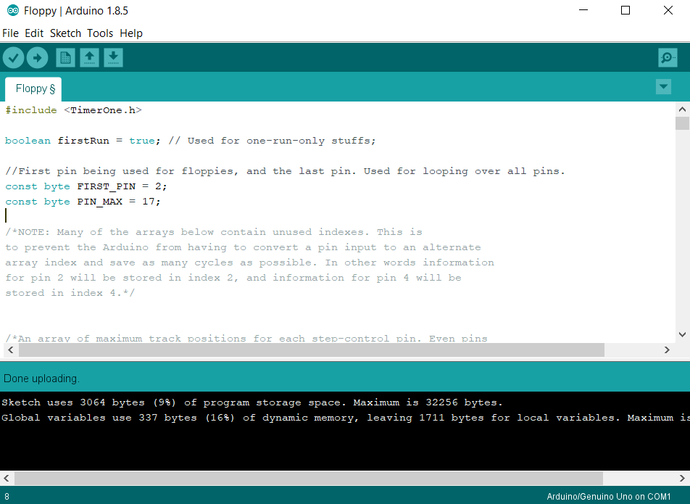

Now you can upload this script to your Arduino.

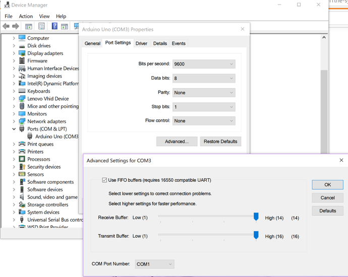

If you get any errors about your COM port, make sure that your Arduino is set to
listen on COM1 under the Device manager –Windows only.

If that works, you can now open Moppy through Netbeans and start playing with
your musical floppy drives.

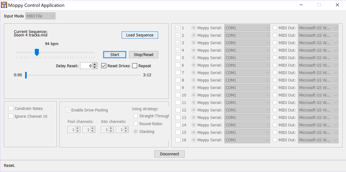

For a great package of MIDI music to use check out
[MrSolidSnake](https://github.com/coon42/Floppy-Music--midis-). Not all MIDI
songs work well with floppy drives. Songs with too many tracks obviously won’t
work well. Songs with high notes will sound terrible on floppy drives since they
will grind their motors. Also, long notes don’t sound good because the floppy
drives just spin back and forth. MrSolidSnake did a wonderful job at compiling a
bunch of MIDI files that work’s well with floppy drives.

I hope that this tutorial was helpful.

<youtube src="X0FeJPFKpQw" />